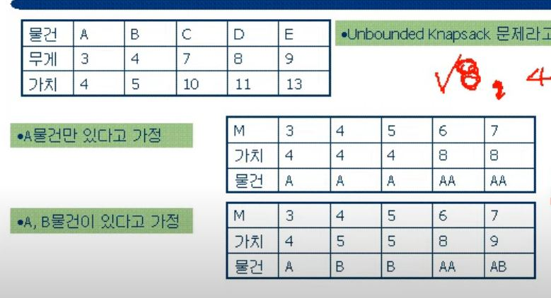

# 올림피아 문제

### DP, Double형 반올림

- [문제](https://www.acmicpc.net/problem/2670)

- 연속으로 존재하는 숫자들 중 한 개이상의 연속된 수들의 곱이 최대가 부분을 찾아 해당 값중 가장 큰 값을 리턴하는 문제이다.

- 모든 경우의 수를 찾을 수 있겠지만 시간초과가 걸린다

- 이 문제는 DP를 이용해야하는데 최근 저장해야할 값을 지정해야한다.

- 초기값에 인덱스0을 입력하고 인덱스1 부터 시작한다.

  - 현재값(인덱스 0)과 다음값(인덱스 1)의 곱이 다음값(인덱스 1)보다 작을 경우 값이 커지는 경우가 없기에 초기값을 다음 값으로 변경한다.
  - 현재값(인덱스 0)과 다음값((인덱스 1)의 곱이 다음값(인덱스 1보다 큰 경우 값을 누적한다
  - 그리고 누적되거나 변경된 값을 Max값과 비교한다

- 결과로 최대값을 리턴하는데 소수점4 째자리에서 반올림하여 3째자리까지 표현해야한다

- 반올림을 하는데 문제마다 정답이 콘솔, 리턴값이 다르기에 다음과 같이 표현한다.

  ```java
  max = (double)Math.round(max*1000)/1000;
  System.out.printf("%.3f", max);
  ////////////////////////////////////////
  max = (double)Math.round(max*1000)/1000;
  answer = String.format("%.3f", max);
  ```

  > SW test사이트 마다 다른데 Math.round()만 사용해도 되는 경우가 있는 반면 포맷을 정해줘야 정답인 경우가 있다.

#### 추가

- 같은 알고리즘 문제여도 사이트마다 테스트 케이스가 달라 변수타입이 바뀔 수 있다
- 이때 int를 double로 사용후 int타입으로 출력할때 (int)를 사용할 경우 데이터가 손실되므로 다음과 같이 사용한다.

```java
//출력하게 될 경우
String.valueOf(Math.round(double));
//int로 변환할 경우
Integer.parseInt(String.valueOf(Math.round(double)));
```

### 플로이드 와샬 알고리즘

- [문제](https://www.acmicpc.net/problem/2660)

- 어느 회원이 다른 모든 회원과 친구이면(거리가 1이면) 이 회원의 점수는1점, 어느회원이 다른 모든 회원이 친구이거나 친구의 친구인 경우는 2점, 이러한 방식으로 각 회원에거 점수를 부여한다.

- 즉 회원으로부터 멀리 떨어진 회원의 최소 거리를 찾는 문제이다.

- 플로이드 와샬 알고리즘을 통해 최소거리를 구한다

- 플로이드 와샬

  1. N명의 인원 수 만큼 크기 N*N인 배열을 만든다

  2. 배열을 초기화하는데 인덱스가 같은 곳을 제외하고 INF값을 준다.

  3. ```java
     //플로이드 와샬 알고리즘
     //기준이 되는 거쳐가는 노드 K
     for(int k = 1; k <= n; k++) {
         //출발하는 노드 i
     	for(int i = 1; i <= n; i++) {
     		//도착하는 노트
     		for(int j = 1; j <= n; j++) {
                 //i에서 k를 거쳤다가 k에서 j 까지 가는 거리와 i에서 j 까지 가는 거리를 비교해서 작은 값이 최소거리이다.
     			array[i][j] = Math.min(array[i][k] + array[k][j], array[i][j]);
     		}
     	}
     }
     ```

- 그 후 각 회원마다 가지는 점수 중 가장 작은 값을 찾아 회장후보의 점수와 후보 수를 구하도록 한다.

  ```java
  int[] score = new int[n + 1];
  int max = 0;
  int min = INF;
  for(int i = 1; i <= n; i++) {
  	max = 0;
  	for(int j = 1; j <= n; j++) {
  		if(array[i][j] == INF) continue;
  		max = Math.max(array[i][j], max);
  	}
  	score[i] = max;	//score 배열을 돌아 min값인 회원 후보를 찾으며, 후보의 수를 찾는다.
  	min = Math.min(score[i], min);
  }
  ```


### 백 트래킹

- [문제](https://www.acmicpc.net/problem/2661)
- 숫자 1, 2, 3으로만 이루어진 수열이 존재하는데 문제에 규칙에 해당하지 않는 나쁜순열을 제외한 가장 작은 순열을 리턴하는 문제이다.
- 나쁜순열을 비교하기 위해서는 입력되는 문제를 앞부분을 하나씩 자른 값을 크기1부터 다음 문자와 비교하는 다음과 같은 반복작업을 통해 찾을 수 있다.

```java
static boolean check(String string) {
	for(int j = 0; j <= string.length(); j++) {
        //입력 문자가 앞에서 부타 하나씩 작아진다.
		String str = string.substring(j, string.length());
		for(int i = 1; i <= str.length()/2; i++) {
            //뒤에서 부터 크기 i부터 자른 값과 같은 크기의 문자를 다음 인덱스에서 찾는다
			String temp1 = str.substring(str.length() -i -i, str.length() - i);
			String temp2 = str.substring(str.length() - i, str.length());
            //앞에서 부터 크기 i부터 자른 값과 같은 크기의 문자를 다음 인덱스에서 찾는다
			String temp3 = str.substring(0, i);
			String temp4 = str.substring(i, i+i);
			//둘 중 하나라도 같은 경우 나쁜수열이 된다.
			if(temp1.equals(temp2) || temp3.equals(temp4)) return false;
		}
	}
	return true;
}
```

- 순열은 백트래킹 방식으로 만든다

```java
for(int i = 1; i <= 3; i++) {
	//재귀함수	
    solution(str + i);
}
```

### 최장 증가 수열

- [문제](https://www.acmicpc.net/problem/2631)

  - 최장 증가수열과 DP를 활용한 문제이다

  - 학생들이 1 ~ N까지 있고 각 학생은 번호를 할당받고 있는데 뒤죽박죽 섞인 학생들을 최소한의 움직임으로 오름차순으로 정렬하는 문제이다.

  - 최장 증가수열을 이용하여 가장 큰 값 max를 구하여 N - max의 수만큼 학생들이 움직이면 최소한의 움직임이 된다.

  - 최장 증가 수열을 구하기 위해 학생배열과 dp배열을 구한다.

  - 다음 두가지 조건을 만족할때 dp값을 정의할 수 있다

    - 0 부터 학생배열 i - 1까지 i인덱스 값보다 작은 값가져야 한다.

    - 0 부터 dp배열 i - 1까지 가장 큰값에 +1를 한값이 i인덱스의 값이 된다.

      ```java
      //dp[0]은 자기자신과 비교하기에 반드시 값이 1이된다.
      dp[0] = 1;
      for(int i = 1; i < N; i++) {
      	// i인덱스 앞에 값이 전부 클 경우가 있으므로 1을 대입
          dp[i] = 1;
      	for(int j = 0; j < i; j++) {
              //i 값보다 작은 값을 비교해야한다
      		if(array[i] > array[j]) {
                  // array[i] 값보다 작은 경우 dp[j] 값보다 1개 이상 큰거기에 dp[j] + 1값을 대입
                  
      			dp[i] = Math.max(dp[i], dp[j] + 1);				
      		}
      	}
      }
      // 값이 있을 경우 10, 9, 2, 5, 3, 7, 101, 18
      // 2, 5, 7, 101 4개
      // 2, 5, 7, 18 4개
      // 2가지 경우가 존재한다.
      // 만일 18에서 앞에 값을 비교할때 7에 dp 3값을 가지고 있기에 중간에 101값을 처리안하고(조건에 맞지 않기에) dp + 1값으로 4을 대입할 수 있다
      ```

      

### 위상정렬

- [문제](https://www.acmicpc.net/problem/2623)

- [참고](https://blog.naver.com/PostView.nhn?blogId=ssarang8649&logNo=220988436553)

  - 위상정렬을 이용한 문제이다.

  - M명의 PD가 1부터 N명의 가수의 순서를 각기 다르게 조사해온다.

  - 조사결과를 바탕으로 가수의 출연 순서를 결정하는 문제이다.

  - 위상정렬문제에서 중요한 점이 있는데, 순환되는 구조를 가지면 문제의 해답을 구할 수 없게 된다.

  - 위상정렬을 구하는데 크게 3가지가 필요하다

    1. targetNordCnt

    - 인덱스 번호로 자신을 나타내고 값은 자신을 가리키는 정점이 몇개인를 담는 배열
      - 1 -> 2, 3->2, 4->2 일 경우 배열 인덱스3(0은 null)의 리스트가 값은 3이 된다.

    2. nodeArray

    - ArrayList type Integer 배열
      - 배열 인덱스는 자신을 가키고 배열안 ArrayList는 자신이 바라보는 노드를 갖는 요소를 담는다

    3. Queue

    - 자신이 정점인 값을 담고 있는 q

  - 우선 nodeArray에 값을 할당시켜줘야 한다.

  ```java
  for(int i = 0; i < pd; i++) {
  	st = new StringTokenizer(br.readLine());
  	int size = Integer.parseInt(st.nextToken());
  	int a = Integer.parseInt(st.nextToken());
  	for(int j = 0; j < size - 1; j++) {
  		int b = Integer.parseInt(st.nextToken());
          //a -> b를 의미하는 것처럼 인덱스 a의 ArrayList에 a가 바라보는 노드 b를 대입해준다.
  		list[a].add(b);
          //그리고 b노드의 정점은 a가 존재하기에 b인덱스에 자신을 바라보는 정점의 개수를 증가시켜준다.
  		targetNordCnt[b]++;
  		a = b;
  	}			
  }
  ```

  - 그리고 정점인 노드를 q에 넣어준다

  ```java
  for(int i = 1; i <= person; i++) {
      // i 인덱스 값이 0이라는 의미는 자신의 노드를 가리키는 노드가 없다.
      // 정점을 의미한다.
  	if(targetNordCnt[i] == 0) {
  		q.add(i);
  	}
  }
  ```

  - 그리고 q에 정점이 없을때까지 다음 과정을 반복한다.
    - 자신을 가리키고 있는 않는 정점을 찾아(targetNordCnt) 큐에 넣어준다
    - 자신을 가리키고 있는 않는 정점노드를  nodeArray[정점노드].get를 통해 다음 노드를 찾는다.
    - 정점노드를 지우기 다음 노드가 정점노드가 되기위해 targetNordCnt[다음노드]의 값을 하나씩 제거한다

  ```java
  while(!q.isEmpty()) {
      // q에 담긴 정점 값을 하나 가져온다.
  	int currentNode = q.poll();
      // 해당 값은 정점이기에 정답에 넣는다.
  	answer.add(currentNode);
  	// 해당 정점이 가리키는 다음 전부 노드를 찾는다
  	for(int i = 0; i < list[currentNode].size(); i++) {
          // 다음 노드를 getNode변수로 받는다.
  		int getNode = list[currentNode].get(i);
          // targetNordCnt는 자신의 정점 개수를 담고 있다
          // 자신의 정점이 줄어들었기에 감소시켜준다.
  		targetNordCnt[getNode]--;
          // targetNordCnt값이 0인 것은 정점을 의미하기에 다시 q에 넣어준다.
  		if (targetNordCnt [getNode] == 0) {
  			q.add(getNode);
  		}
  	}
  }
  ```

  - 과정을 반복여 answer에 저장된 값을 반환시켜준다.
  - 하지만 과정 후 순환되는 사이클을 가지게 된다면 targetNordCnt에 값은 0이 될수 없게 된다.
  - 사이클을 가지는 경우를 고려해 정답 출력 전 targetNordCnt값이 모두 0이 되었는지를 확인하여 예외처리를 해준다.

### 백 트래킹

- [문제](https://www.acmicpc.net/problem/6987)

- [참고](https://jaejin89.tistory.com/41)

  - 주어진 각 나라의 승, 무승부, 패의 수가 가능한지 판별하는 문제이다.
  - 입력으로 주어진 각 조가 6개가 존재하므로 다음과 같은 대진표를 만들 수 있다
    - A : B, C, D, E, F
    - B : C, D, E, F
    - C : D, E, F
    - D : E, F
    - E : F
  - 위와 같이 각 팀이 경기를 치르게 된다.
  - 위의 해당 경우를 모두 경기를 하여 15경기가 나오면 입력으로 들어온 대진결과의 가능여부를 판별할 수 있다
  - 먼저 위에 주어진 각 팀의 대진표를 두개의 배열로 만든다.

  ```JAVA
  //A -> 0, ...., F -> 5
  int[] game1 = {0,0,0,0,0,1,1,1,1,2,2,2,3,3,4};
  int[] game2 = {1,2,3,4,5,2,3,4,5,3,4,5,4,5,5};
  ```

  - 그 후 입력으로 들어오는 대진예상 결과를 각 팀에 맞게 할당시켜준다.
  - 그리고 첫번째 게임을 시작으로 백 트래킹을 시도한다.
    - A팀과 B팀 경기중 A팀이 이기는 경우, B팀이 이기는 경우, 무승부가 나는 경우

  ```SQL
  // 대진표마다 g는 0으로 시작한다
  private static void solution(int g) {
  	// 해당 대진표의 결과가 가능하므로 나머지는 return한다
  	if(flag == true) return;
  	// 15번째 경기가 진행됬다는 것은 실제 해당 예상 대진결과가 가능하다는 것을 말한다
  	if(g == 15) {
  		flag = true;
  		return;
  	}
  	// 사전에 정의한 대진순서를 g번째 경기 순으로 시작해나간다.
  	int a = game1[g];
  	int b = game2[g];
  	
  	//3가지 경우에서 각 팀의 승, 패, 무승부의 결과가 존재해야되는 조건이다
  	// A팀이 이기는 경우
  	if(win[a] > 0 && defeat[b] > 0) {
  		win[a]--;
  		defeat[b]--;
  		solution(g + 1);
  		win[a]++;
  		defeat[b]++;
  	}
  	// B팀이 이기는 경우
  	if(win[b] > 0 && defeat[a] > 0) {
  		win[b]--;
  		defeat[a]--;
  		solution(g + 1);
  		win[b]++;
  		defeat[a]++;
  	}
  	// 무승부
  	if(draw[a] > 0 && draw[b] > 0) {
  		draw[a]--;
  		draw[b]--;
  		solution(g + 1);
  		draw[a]++;
  		draw[b]++;
  	}
  }
  ```

### 배열 활용

- [문제](https://www.acmicpc.net/problem/10836)

- [코드](https://github.com/vvvvvoin/SWcoding/blob/master/src/baekJoonSW/koi/Exam53_2015.java)

  - 크기 M*M으로 주어진 배열에 입력 값을 제일 왼쪽 열 아래 행부터 제일 왼쪽 열의 첫번째 행 그리고 첫번째 행의 가장 우측열로 이동하여 값을 할당시키는 문제이다.
  - 입력값은 0, 1, 2증가율이 순서대로 개수가 주어진다.
  - 만약 입력값이 들어올때마다 해당 값을 갱신시켜주면 상당한 시간을 소비하게 된다.
  - 이때 이동하는 순서에 맞는 배열을 하나 선언해준다.
  - 그리고 증가율 갯수의 인덱스를 기준으로 배열 값에 다음과 값이 1을 할당시켜준다

  ```java
  for (int o = 0; o < n; o++) {
  	st = new StringTokenizer(br.readLine());
  	int value0 = Integer.parseInt(st.nextToken());
  	int value1 = Integer.parseInt(st.nextToken());
  	int value2 = Integer.parseInt(st.nextToken()); //사용되지 않음
  	//0, 1 경계에 +1함으로써 값을 누적시켜가면
  	//아래 for문에서 왼쪽아래부터 위로 오른족 경계로 이동하면서 누적된 값을 이용할 수 있다 
  	grw[value0] ++;
  	grw[value0 + value1]++;
  }
  ```

  - 그리고 포인터를 통해 이동경로에 값을 할당시켜준다.
  - 성장률은 0부터 시작하므로 배열을 초기화 없이 값을 넣어준다
  - 그리고 위에 각 경계에 값을 하나 증가시킴으로서 해당 구간부터의 성장률이 증가하게 된다.
  - 성장률2인 경우에도 이전에 증가했던 값을 누적시켜서 포인터를 이동시켰기에 0, 1, 2 순서에 맞게 성장률을 맞춰줄 수 있다.

  ```java
  int start = 0;
  int sum = 0;
  //왼쪽아래 부터 첫번째 행까지
  for (int i = arr.length - 1; i >= 0; i--) {
  	sum += grw[start++];
  	arr[i][0] = sum;
  }
  //첫번째 인덱스1번 열부터 마지막 열까지
  for (int i = 1; i < arr.length; i++) {
  	sum += grw[start++];
  	arr[0][i] = sum;
  }
  ```

  - 그리고 나머지 배열의 값들은 해당 배열 인덱스의 왼쪽, 왼쪽위, 위쪽 중 가장 큰값을 따라가게 되어있다.
  - 하지만 성장률은 왼쪽아래부터 위로 그리고 오른쪽으로 증가하게 되는데 성장률이 가장 높은 구간은 무조건 위쪽이 되기 때문에 위에 값을 대입하면 된다.

> 정답배열에 넣어야 하는 값이 0부터 시작해서 특정 인덱스마다 +1을 함으로써 포인터로 값을 이동시킬 때 값을 누적시켜 대입되는 값에 증가되는 성장률을 넣을 수 있게된다. 


### Dynamic Programming

- Knalsack Problem 배낭문제, 보석문제 등으로 알려짐
- 문제의 종류는 물건을 쪼갤 수 있고 없고 종류가 나뉜다
- 이 DP는 물건을 쪼갤 수 없는 경우이다.
- 일정한 가치와 무게가 정해진 보석들이 존재한다.
- 이 보석들을 한정된 무게를 담을 수 있는 가방에 최대한 가치를 높게 보석을 담을려고 한다.
- 보석의 갯수 + 1의 행, 배낭 무게한도 + 1의 열의 2차원 배열을 생성한다.

```java
//w : 물건의 종류의 수, K 는 무게 한도
//추가적으로 인덱스 i 에 맞게 물건의 종류와 가치를 담고 있는 배열을 따로 선언해준다.
int[][] dp = new int[w.length + 1][k + 1];
for(int i = 1; i < dp.length; i++) {
	for(int j = 1; j < dp[0].length; j++) {
        //뺄 수 있을 경우
		if(j - arr[i].weight >= 0) {
            //			    이전에 구한 가치  ,   이전의 가치의 무게j에서 현재물건i무게를 빼주고 현재물건i의 가치를 더한다
			dp[i][j] = Math.max(dp[i - 1][j], dp[i - 1][j - arr[i].weight] + arr[i].value);	
            // 두 값중 큰 가치를 넣는다
        //뺄 수 없는 경우 이전 가치를 넣는다.
		}else {
			dp[i][j] = dp[i- 1][j];
		}
	}
}
```

- 가방 무게한도의 최대치 까지 인덱스 j = 1부터 시작하여 이전에 존재하는 물건과 비교한다.
  - i = 1부터 시작하므로 이전물건은 모두 0이되므로 물건1개를 갖고 가치를 구한다.
  - 즉 j의 무게가 있을경우 현재물건 i의 무게를 빼주고(뺄수 있을 경우) i의 가치를 더했을 경우 이전물건과 현재계산한 가치의 큰값을 반환시킨다



> https://www.youtube.com/watch?v=3BqP4Au-kps

- A물건만을 넣어 인덱스 i = 1일 경우 값을 넣어준다.
- 그 후 i = 2일 경우 이전에 물건과 비교를 하게 된다.
- A, B물건이 있다고 가정한 부분에서 무게 M = j 가 4일때 이전의 가치 DP(1, 4)와 DP(1, 4 - B무게) + B가치를 더했을 경우 서로 큰 가치를 넣으면 된다.

### BFS

- [문제](https://www.acmicpc.net/problem/2178), [문제](https://www.acmicpc.net/problem/7576), [문제](https://www.acmicpc.net/problem/1697)

- BFS를 통해서 풀수 있는 문제들이다.

- 해당 문제들의 공통점은 BFS를 통해 문제를 처리하는 과정에서 q에 값을 받고 다음에 값을 넣을 때 현재 뽑은 값을 누적시켜 다음 q로 만드는 공통점이 있다

- 미로 탐색

  - 0,0에서 시작해서 배열의 마지막에 도달하는 경로 중 최소 칸을 찾는 문제이다.

  ```java
  q.add(new Pos(row, col));
  while(!q.isEmpty()) {
  	Pos pos = q.poll();
  	visited[pos.i][pos.j] = true;
  	for(int i = 0; i < 4; i++) {
  		int nextR = pos.i + dirR[i]; 
  		int nextC = pos.j + dirC[i]; 
  		if(nextR < R && nextC < C && nextR >= 0 && nextC >= 0 && 
  				visited[nextR][nextC] == false && arr[nextR][nextC] == 1) {
  			visited[nextR][nextC] = true;
  			q.add(new Pos(nextR, nextC));
              //이전의 칸 값에 +1을 하여 다음 값을 갱신한다
  			arr[nextR][nextC] = arr[pos.i][pos.j] + 1;
  		}				
  	}
  }
  ```

- 토마토
  - 초기 존재하는 토마토를 미리 q에 넣어주고 나아갈 수 있는 방향이 있다면 반복적으로 q에 넣어서 BFS를 수행한다.
  - 마찬가지로 최소 날짜를 구해야하는데 이전의 값을 누적시켜 다음 배열에 대입하는데 배열을 다 채울 경우 나오는 값이 전체를 채우는 최솟값이 되므로 BFS 후에 전체를 돌아 가장 큰값이 정답이 된다.

- 숨바꼭질

  - 3가지 방법으로 1차원 배열에서 값이 이동하는데 BFS를 사용한다.
  - 단 정답에 도달하는 경우는 여러 가지가 존재하므로 처음 나온 값이 최소가 되는 값이므로 주의할 수 있도록 한다.
  - 또한 최소몇번으로 목적지에 도달하는지를 위해 시작위치로 부터 +1씩 누적시켜간다.
  - 그리고 문제의 특성상 앞, 뒤로 움직이는 이동방식으로 방문한 곳을 다시 방문하면 무한적으로 반복될 수 있으므로 방문한 곳은 방문하지 않는다.

  ```java
  while(!q.isEmpty()) {
  	int index = q.poll();
  	for(int i = 0; i < 3; i++) {
  		int next = 0;
  		if(i == 0) {
  			next = index + 1;
  		}else if(i == 1) {
  			next = index - 1;
  		}else {
  			next = index * 2;
  		}
  		if(next == end) {
  			System.out.println(arr[index]);
  			return;
  		}
          // 배열 범위에 존재하고 방문한 곳은 방문하지 않는다.
  		if(next >= 0 && next < arr.length && arr[next] == 0) {
              // 이전에 움직임에 +1 하여 나음 이동위치를 q에 넣는다.
  			arr[next] = arr[index] + 1;
  			q.add(next);
  		}
  	}
  }
  ```

