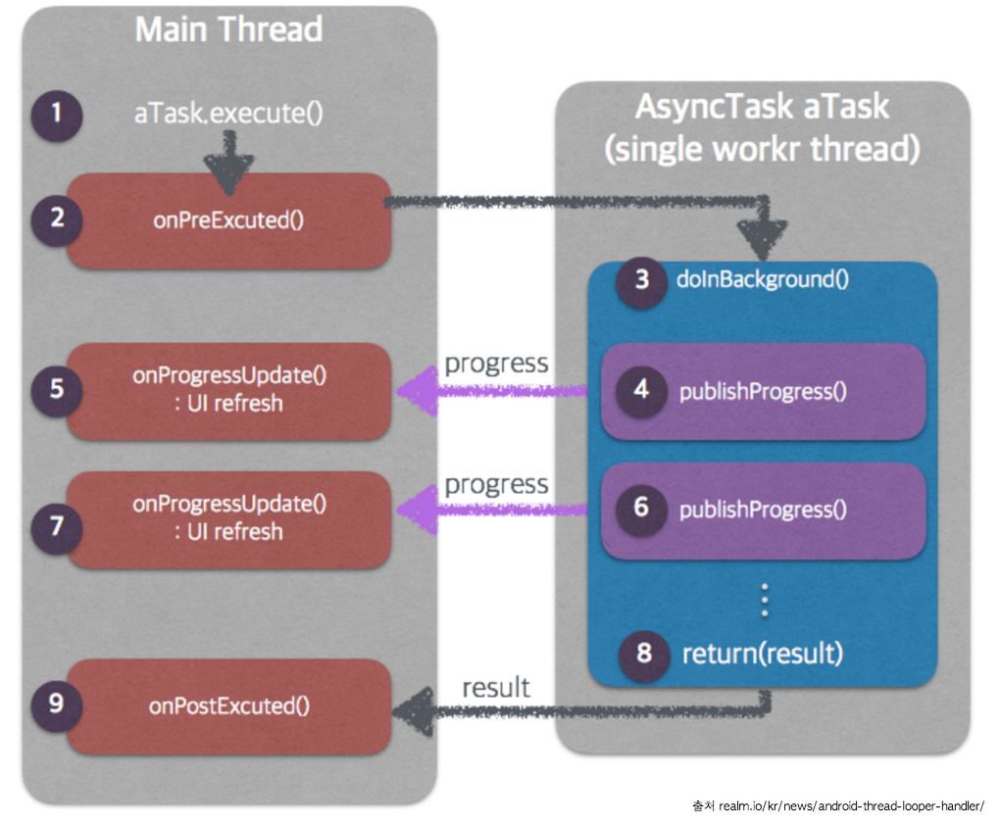

> **This class was deprecated in API level 30.**
> Use the standard `java.util.concurrent` or [Kotlin concurrency utilities](https://developer.android.com/topic/libraries/architecture/coroutines) instead.

## AsyncTask

### 동기(sync) 비동기(async)
- 동기적으로 태스트를 실행 후 다른 태스크를 실행하려면 이전 태스크가 종료되길 기다려야한다.
- 비동기적으로 태스크를 실행하면 먼저 실행된 태스크가 종료되기전에 다른 태스크를 실행할 수 있다.

### 개념
- 앱이 실행되면 메인 스레드가 생성된다.
- 이 스레드는 안드로이드 UI 툴키트에 접근하고 사용자 입력을 기다리거나 디바이스 화면을 그리는 작업등을 수행한다.
- 그리고 앱의 모든 컴포넌트들은 같은 스레드내에서 샐행됩니다.
- 필요에 따라 추가 스레드를 생성할 수 있다.
- 하지만 추가 스레드는 다음을 지켜야 한다
	- 메인스레드가 블록되지 않도록해야한다
	- 메인스레드 외에 다른 스레드에서 메인 컴포넌트 접근을 하면 안된다

- 그 이유는 오랜 시간 걸리는 작업(인터넷 접속 등)을 UI스레드에서 수행한다면 작업이 완료 될때까지 메인 스레드는 대기상태가 되고 UI를 제어할 수 없게 됩다.
- ANR(Android Not Responding)이 발생된다
- 이런 문제를 해결하기 위해 안드로이드는 Handler, Runnable, AsynceTask 등을 제공한다
- AsynceTask는 메인스레드에서 생성 후 실행되며, 메인스레드에서 처리시간이 오래 걸리는 작업을 백그라운드 스레드로 넘기고 계속 메인 스레드가 작업을 진행할 수 있도록 한다.
- AsynceTask는 비동기 테스크로서 백그라운드 스레드라는 별도의 스레드에서 작업을 수행하기 때문에 AsynceTask를 싱행시켜 놓고 메인스레드 작업을 수행할 수 있다.
- AsynceTask를 사용하면 백그라운드 스레드와 메인 스레드간에 커뮤니케이션이 가능하다
	- 백그라운드 작업 종료 후 결과를 메인 스레드에 onPostExecute 메소드로 알려줄 수 있다
	- 백그라운드 작업 중 메인스레드에 UI처리 요청을 onProgressUpdate로 처리할 수 있다

### AsynceTask 처리과정

1. execute() 를 통해 AsynceTask을 실행한다.
2. AsynceTask로 백그라운드 처리전에 onPreExcute()가 실행된다
	- 이 부분에서 이미지 로딩 작업이라면 로딩 중 이미지를 띄워 놓기 등 사전작업 처리를 한다

3. 새로만든 스레드에서 백드라운드 작업이 수행된다
	execute() 메소드를 호출할 때 사용된 파라미터를 전달 받는다
4. doInBackground()에서 실질적인 로직처리가 이루워진다
	중간마다 UI업데이트를 위해 publishProgress()메소드를 호출하여 onProgressUpdate메소드가 실행되어 UI업데이트 로직을 처리한다.
5. doInBackground() 메소드 작업이 끝나면 리턴 값을 onPostExcuted()에 전달하고 마지막 처리를 진행한다.

### AsynceTask generic 타입
- AsynceTask<Params, Progress, Result>
	- Params : doInBackground 파라미터 타입이며, AsynceTask를 실행하는 execute의 메소드 인자값
	- Progress : doInBackground 중 UI를 업데이트 하기위해 publishProgress()메소드에 들어가는 인자값
		- 예를 들어 로직처리 중 몇 퍼센트를 진행했는지 UI 업데이트를 위해 publishProgress(퍼센트) 메소드를 수행하여 onProgressUpdate가 받는 파라미터 타입

	- Result : doInBackground 리턴값으로 onPostExecute의 파라미터 타입

> **This class was deprecated in API level 30.**
> Use the standard `java.util.concurrent` or [Kotlin concurrency utilities](https://developer.android.com/topic/libraries/architecture/coroutines) instead.

