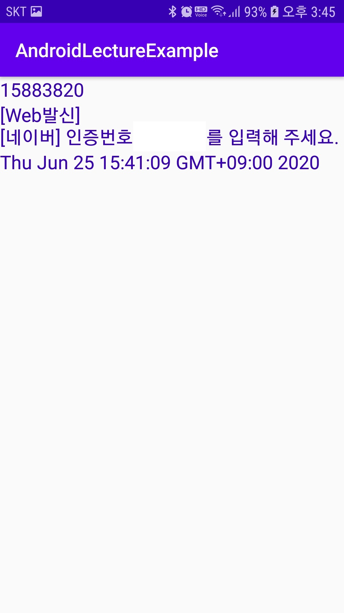
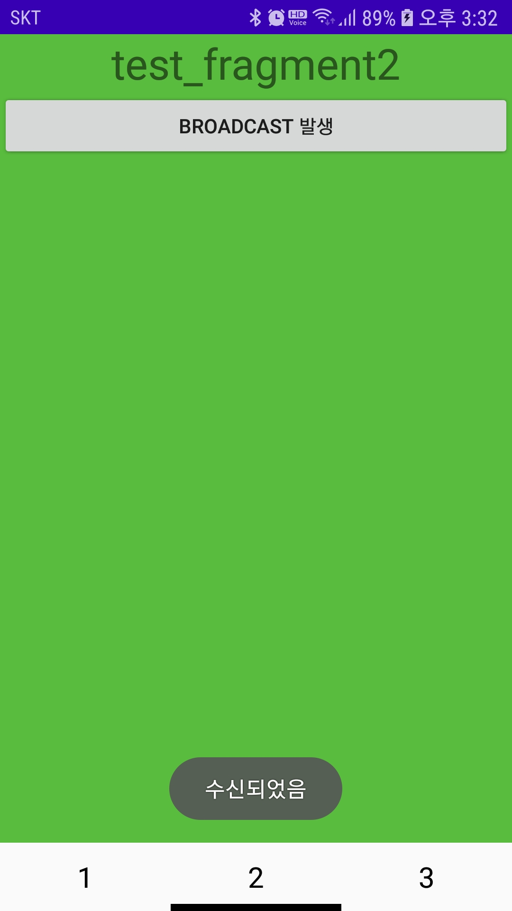

### Broadcast Receiver
- 안드로이드 4대 컴포넌트 중 1개
- 수신기라고 생각하면 쉽다
- 누군가에 의해 sendBroadcast(intent)을 이용하여  intent신호를  방송한다
- 날라온 intent신호는 filter를 갖는 Receiver가 받는다
- 날라온 신호에는 각각에 고유 action이 부여되고 filter는 이를 구분하여 수용할지를 판단
- 신호를 받게되면 그에 맞는 액션을 한다
- sendBroadcast -> filter -> receiver -> action 순으로 이루워진다

- 정적, 동적 시리버 2가지 종류가 존재한다
#### 정적리시버
- 동시에 실행되지 않고 한개씩 처리됨
- Manifest파일에 broadcast filter를 등록한다

manifest.xml
```xml
	<receiver
            android:name=".Example19sub_SMSBroadcastReceiver"
            android:enabled="true"
            android:exported="true">
            <intent-filter>
                <action android:name="android.provider.Telephony.SMS_RECEIVED" />
            </intent-filter>
     </receiver>
```
- SMS 메세지를 받게되면 브로드캐스트 발생
- 정적은 동적과 다르게 BroadcastReceiver를 상속받는 class를 만들어 준다
```java
public class Example19sub_SMSBroadcastReceiver extends BroadcastReceiver {

    @Override
    public void onReceive(Context context, Intent intent) {
	//필터를 통해 받게된 intent 처리
        ....
    
     Intent i = new Intent(context, Example19sub_SMSBroadcastReceiver.class);
     i.addFlags(Intent.FLAG_ACTIVITY_CLEAR_TOP);
     i.addFlags(Intent.FLAG_ACTIVITY_SINGLE_TOP);
     i.addFlags(Intent.FLAG_ACTIVITY_NEW_TASK);
     context.startActivity(i);
    
```
참고 : [https://github.com/vvvvvoin/MC_Android/blob/master/app/src/main/java/com/example/androidlectureexample/Example19sub_SMSBroadcastReceiver.java](https://github.com/vvvvvoin/MC_Android/blob/master/app/src/main/java/com/example/androidlectureexample/Example19sub_SMSBroadcastReceiver.java)




#### 동적리시버
- 동시에 실행됨
- onDestroy에서 반납을 해줘야 메모리 누수가 없다
- Manifest파일에 등록하지 않고 IntentFilter 객체에 필터를 작성한다
```java
//브로드케스트를 발생시킬 클릭이벤트 버튼을 만든다
Button buttonBroadCast = view.findViewById(R.id.button_broadcast);
        buttonBroadCast.setOnClickListener(clickLisnter);

View.OnClickListener clickLisnter = new View.OnClickListener() {
        @Override
        public void onClick(View view) {
            switch (view.getId()){
                case R.id.button_broadcast:
                    Intent i = new Intent("br_test");
                    context.sendBroadcast(i);
                    break;
            }
        }
    };
//브로드 캐스트 객체를 만들고 intent에 action값에 따른 처리
BroadcastReceiver broadcastReceiver = new BroadcastReceiver() {
            @Override
            public void onReceive(Context context, Intent intent) {
                if(intent.getAction().equals("br_test")){
                    Toast.makeText(context, "수신되었음", Toast.LENGTH_SHORT).show();
                }else if(intent.getAction().equals(Intent.ACTION_BATTERY_CHANGED)){
                    Toast.makeText(context, "수신되었음", Toast.LENGTH_SHORT).show();
                }
            }
        };

//intentfilter를 만들고 브로드캐스터리시버를 등록한다.
IntentFilter intentFilter = new IntentFilter();
        intentFilter.addAction("br_test");
        intentFilter.addAction(Intent.ACTION_BATTERY_CHANGED);
        context.registerReceiver(broadcastReceiver, intentFilter);

//자원 반납을 해주도록 한다.
public void onDestroy() {
	super.onDestroy();
	context.unregisterReceiver(broadcastReceiver);
}
        
```

> Fragment에 만들어봤는데 불특정하게 자주 ACTION_BATTERY_CHANGED에 대한 브로드캐스트가 발생하는 것을 확인

