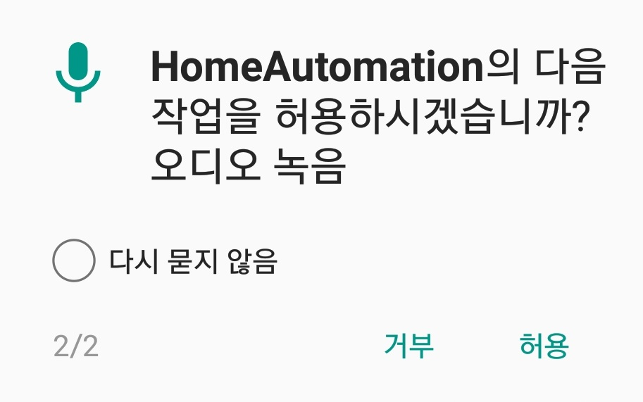

### 권한설정

- 안드로이드는 마쉬멜로우 버전 이상부터 애플리케이션이 권한을 허용해줘야한다.
- Manifest 파일에도 권한을 부여해야한다.

- 초기 안드로이드 버전을 확인한다
- 권한설정이 필요한 값들을 받아온다
```JAVA
if(Build.VERSION.SDK_INT >= Build.VERSION_CODES.M){
    //안드로이드 버전이 M이상인지 확인한다
	 int permissionResult = ActivityCompat.checkSelfPermission(
                    getApplicationContext(), Manifest.permission.RECORD_AUDIO);
    //오디오 관련 권한을 int 값으로 설정한다
    ...
}else{
    //Version M 미만인 경우
    //바로 다음 명령을 수행하면된다
}

```

- 처리를 원하는 권한이 과거의 설정으로 거부된 여부를 묻는다
- 각각에 경우에 처리를 해준다
```java
 if(permissionResult == PackageManager.PERMISSION_DENIED){
    //권한이 없는 경우
 	//1. 앱을 처음 실행하여 권한이 없는 경우
 	//2. 앱을 실행 후 과거에 권한을 거부했을 경우
 	//두가지로 나뉘게 된다.
 	...
 }else{
 	//권한이 있는 경우
 }
```
- 권한이 없는 경우
```java
 if(shouldShowRequestPermissionRationale(android.Manifest.permission.RECORD_AUDIO)){
 	//2. 앱을 실행 후 과거에 권한을 거부했을 경우
     AlertDialog.Builder dialog = new AlertDialog.Builder(SplashActivity.this);
                    dialog.setTitle("권한 요청");
                    dialog.setMessage("권한이 필요합니다, 수락하시겠습니까?");
                    dialog.setPositiveButton("YES", new DialogInterface.OnClickListener() {
                        @Override
                        public void onClick(DialogInterface dialog, int which) {
                            requestPermissions(REQUESTPERMISSION,100);
                        }
                    });
                    dialog.setNegativeButton("NO", new DialogInterface.OnClickListener() {
                        @Override
                        public void onClick(DialogInterface dialog, int which) {
                        }
                    });
                    dialog.create().show();
 }else{
 	//1. 앱을 처음 실행하여 권한이 없는 경우
 }
```


- 요청 권한
```java
requestPermissions(String[] permission, int requestCode);
requestPermissions(new String[]{Manifest.permission.RECORD_AUDIO},100);
```
> 요청권한들이 String[]로 받는 이유는 여러가지 권한을 한번에 하기 위해서다.
requestPermissions()을 통해 사용자에게 아래와 같이 나타난다.




> 예제에서는 권한이 1개여서 new String[]{Manifest.permission.RECORD_AUDIO) 이용했지만 권한만을 담은 Stirng[]을 사전에 선언하는 것이 더욱 권장된다.


- Request onRequestPermissionsResult
> requestCode를 이용하여 해당권한이 허용이 되었을 경우 requestCode를 받는 override된 onRequestPermissionsResult가 정의된다
```java
    @Override
    public void onRequestPermissionsResult(int requestCode, @NonNull String[] permissions, @NonNull int[] grantResults) {
        super.onRequestPermissionsResult(requestCode, permissions, grantResults);
        //사용자가 권한을 설정하게 되면 이 Method가 마지막으로 호출 됨.
        if(requestCode == 100 && grantResults.length == 1){
            //요청하는 권한이 permission.RECORD_AUDIO 하나 이기에 grantResults.length == 1로 설정했음
            //만약 String[] 변수에 권한을 넣을 경우 String.length로 사용한다
            boolean check = true;
            
            //모든 권한이 허용되었는지를 확인
            for(int result : grantResults){
                if(result != PackageManager.PERMISSION_GRANTED){
                    check = false;
                    break;
                }
            }
            if(check){
                //설정이 완료되었고 권한 요청 후 다음 명령 수행
            }else{
                //앱에서 요청한 권한이 하나라도 거부되었다면 앱을 종료하고 2가지 경우가 존재
                if(shouldShowRequestPermissionRationale(android.Manifest.permission.RECORD_AUDIO)){
                    //퍼미션을 거부하였고, 앱을 다시 실행해서 권한을 설정해주도록 사용자에게 요청
                }else{
                    //“다시 묻지 않음”을 사용자가 체크하고 거부를 선택한 경우에는 설정(앱 정보)에서 퍼미션을 허용해야 앱을 사용할 수 있습니다.
                }
            }
        }
    }
```

