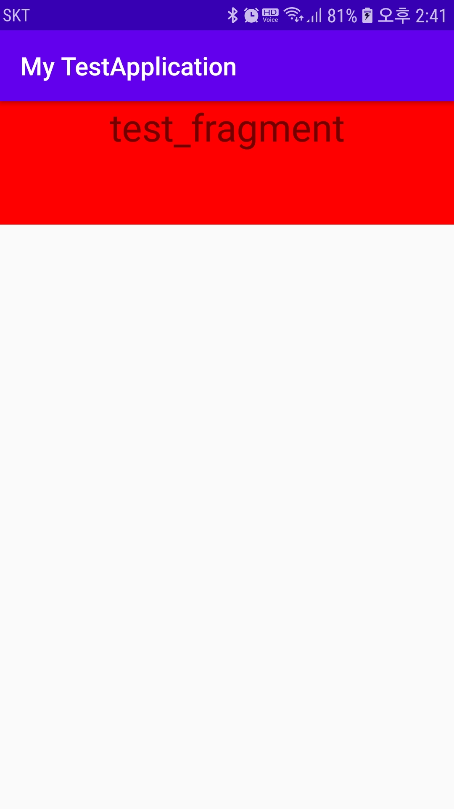

### Fragment

- 하나의 Activity에서 여러 개의 화면을 가지도록 고안된 개념
- 다양한 크기에 화면을 가진 모바일 기기가 늘어나 다양한 화면을 보여주기 위함
- 여러 Activity에서 재사용 유리

#### Fragment 생명주기

- void onActivity(Activity activity)
	- 프래그먼트가 처음으로 Activity에 부착될때 호출
	- 필수적으로 하나의 Activity에 종속되어야 함

- void onCreate(Bundle savedInstanceState)
	- 이 생명주기에 Activity또한 생성 중에 있는 시기에 Activity에 있는 컨트롤러들을 참조할 경우 불안정하게 될 수 있음

- View onCreadView(LayoutInflater inflater, ViewGroup container, Bundle savedInstanceState)
	- view들을 초기화하고 정의
	- Layout을 inflate하는 곳

- 종료과정
	- onPause() : 화면이 중지되면 호출
	- onStop() : Fragment 화면 삭제
	- onDestroyView() : View 리소스 해제
	- onDestroy : Fragment 완전히 종료할 때 호출
	- onDetach() : Fragment와 Activity의 연결고리 해제

- 다른 Fragment를 Add하고 기존 Fragmennt가 종료되는 과정
	- onPause()
	- onStop()
	- onDestroy()

#### Fragment Transaction
1. Fragment Transaction 
```java
// 프래그먼트 매니저 선언
FragmentManager fragmentManager = getSupportFragmentManager();
// 프래그먼트 트랜잭션 시작
FragmentTransaction fragmentTransaction = fragmentManager.beginTransaction();

....     // 여기에서 추가, 삭제, 교체, 애니메이션 작업 등을 설정합니다.

// 프래그먼트 트랜잭션 마무리
fragmentTransaction.commit();
```
- FragmentManager을 선언 해준뒤  beginTransaction() 을 호춤함으로써 Transaction작업을 시작할 수 있음
- 이후 Fragment에 대한 추가, 삭제, 교체, 애니메이션 작업을 추가후 commit()을 호출 후 Transaction을 마무리한다
- 반드시 commit()을 호출해야 transaction 작업이 정상적으로 작동됨


#### 전체적인 사용법
1. Activity.xml에 프래그먼트가 표시될 구역을 설정해준다
```xml
<?xml version="1.0" encoding="utf-8"?>
<LinearLayout xmlns:android="http://schemas.android.com/apk/res/android"
    android:layout_width="match_parent"
    android:layout_height="match_parent"
    android:orientation="vertical">
    <FrameLayout
        android:id="@+id/fragment_frame"
        android:layout_width="match_parent"
        android:layout_height="50pt"></FrameLayout>
</LinearLayout>
```

2. Fragment.xml를 생성한다
```xml
<?xml version="1.0" encoding="utf-8"?>
<LinearLayout xmlns:android="http://schemas.android.com/apk/res/android"
    android:orientation="vertical" android:layout_width="match_parent"
    android:layout_height="match_parent"
    android:clickable="true"
    android:background="#FF0000">
    <TextView
        android:layout_width="match_parent"
        android:layout_height="wrap_content"
        android:textSize="30sp"
        android:text="test_fragment"
        android:gravity="center" />
</LinearLayout>
```
> Fragment.xml에 android:clickable="true"를 정의함으써 뒤에 쌓인 화면이 클릭되지 않게 한다.


3. Fragment Class를 정의한다
```java
public class TestFragment extends Fragment {
    public TestFragment() {
        //생성자
    }
    @Override
    public View onCreateView(LayoutInflater inflater, ViewGroup container, Bundle savedInstanceState) {
        return inflater.inflate(R.layout.test_fragment, container, false);
    }
}
```


4. /Activity에서 호출한다
```java
public class MainActivity extends AppCompatActivity {

    @Override
    protected void onCreate(Bundle savedInstanceState) {
        super.onCreate(savedInstanceState);
        setContentView(R.layout.activity_main);

        TestFragment testFragment = new TestFragment();

        FragmentManager fragmentManager = getSupportFragmentManager();
        FragmentTransaction fragmentTransaction = fragmentManager.beginTransaction();
        fragmentTransaction.add(R.id.fragment_frame, testFragment).commitAllowingStateLoss();

    }
}
```


#### 결과화면




