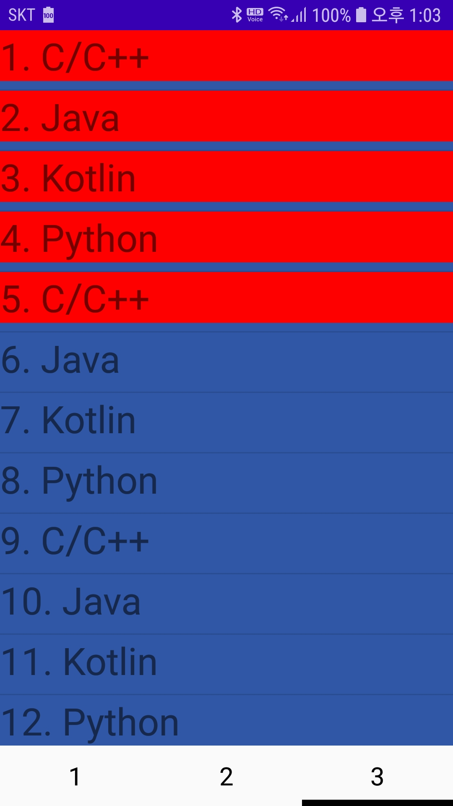
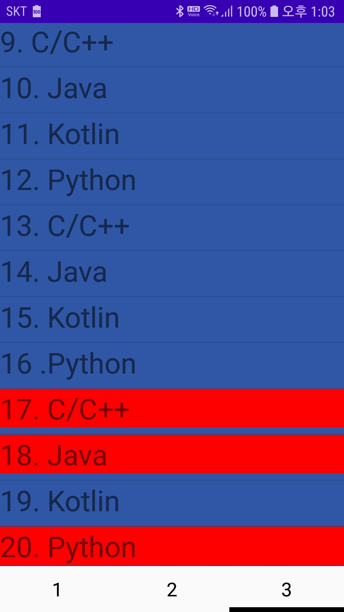

### RecyclerView Item Click Event

- recyclerView item list를 클릭했을때 이벤트 처리
- onClickListener을 이용한다
- onClickListener를 설치할 장소
	- onBindViewHolder
	- onCreateViewHolder
	- ViewHolder
- onCreateViewHolder에 설치해본 경우
	- 리스트가 갱신될때마다 새롭게 정의함
	- 성능상 문제가 되는 느낌은 못받음
	- switch case문을 이용하여 position에 따라 구분가능
	- 하지만 리스트가 많아 질 수록 제어하기 어려움
	- 다양한 형태에 리스트이면서 적은 양의 리스트 일 경우 사용하기 편리할듯
- ViewHolder에 설치해본 경우
	- 어떤 ViewHolder인지 알기 쉬움
	- SparseBooleanArray을 이용하여 position을 매핑하여 쓰기 편리함
	- 다양한 종류의 viewHolder가 있을 경우 하나하나 onClickListener를 정의해야함
- onBindViewHolder 사용해보지 못함

#### ViewHolder를 이용한 이벤트 처리

- itemView를 이용하여 이벤트 처리
- 각각의 Componet마다 이벤트를 처리할 수도 있음

```java
    public class ListItem extends RecyclerView.ViewHolder {
        public TextView textView;

        public ListItem(@NonNull View itemView) {
            super(itemView);
            this.textView = itemView.findViewById(R.id.textView);
            
            itemView.setOnClickListener(new View.OnClickListener() {
                @Override
                public void onClick(View view) {
                    Log.v(TAG, textView.getText().toString());
                    itemView.setBackgroundColor(Color.RED);
                }
            });
        }
    }
```

#### 선택 해제
- itemView를 클릭하고 해제 이벤트 처리
- SparseBooleanArray 를 이용하여 처리한다.

```java
public class RecyclerViewAdapter extends RecyclerView.Adapter<RecyclerView.ViewHolder> {
     private SparseBooleanArray textViewSelectedItems = new SparseBooleanArray(0);

    .....

 public class ListItem extends RecyclerView.ViewHolder {
        public TextView textView;

        public ListItem(@NonNull final View itemView) {
            super(itemView);
            this.textView = itemView.findViewById(R.id.textView);
            itemView.setOnClickListener(new View.OnClickListener() {
                @Override
                public void onClick(View view) {
                    int position = getAdapterPosition();
                    //활성화 된 경우, 참이였던 경우
                    if(textViewSelectedItems.get(position)){
                        textViewSelectedItems.put(position, false);
                        textView.setBackgroundColor(Color.parseColor("#3057A5"));
                    }else{
                        //비활성화 된 경우, 거짓이였던 경우
                        textViewSelectedItems.put(position, true);
                        textView.setBackgroundColor(Color.RED);
                    }

                }
            });
        }
    }                                                                        
```


#### 문제점

- recyclerView는 view 재사용하는 구조이다
- 그렇기에 listView의 상위호환이고 더 까다롭다


> 위쪽화면에서 클릭한 클릭 이벤트가 아래 화면에서도 적용되는 모습이 보여진다

##### 해결책 1

- 아이템 선택상태는 position기반으로 관리하고 실제 선택상태를 표시하는 것은 ViewHolder데이터가 반영될때 처리해준다
```java
@Override
    public void onBindViewHolder(@NonNull RecyclerView.ViewHolder holder, int position) {
        ((ListItem)holder).textView.setText(list.get(position));
        
        //새롭게 추가된 코드  
        if(textViewSelectedItems.get(position)){
            ((ListItem) holder).textView.setBackgroundColor(Color.RED);
        }else{
            ((ListItem) holder).textView.setBackgroundColor(Color.parseColor("#3057A5"));
        }
    }
```

##### 해결책 2 notify

- 위의 구조에서는 특정 아이템 선택이나 아이템 전체를 해제하는 구조는 어렵다
- 클릭 이벤트가 발생하는 시점에 그 상태를 저장하고 View가 바인딩 되는 onBindViewHolder에서 클릭 이벤트처리를 하도록한다.
- recylcerView refresh하는 방법
- notifyItemChanged(position)을 추가한다
```java
    public class ListItem extends RecyclerView.ViewHolder {
        public TextView textView;

        public ListItem(@NonNull final View itemView) {
            super(itemView);
            this.textView = itemView.findViewById(R.id.textView);
            itemView.setOnClickListener(new View.OnClickListener() {
                @Override
                public void onClick(View view) {
                    int position = getAdapterPosition();
                    //활성화 된 경우, 참이였던 경우
                    if(textViewSelectedItems.get(position)){
                        textViewSelectedItems.put(position, false);
                        //새롭게 변경된 코드
                        notifyItemChanged(position);
                    }else{
                        //비활성화 된 경우, 거짓이였던 경우
                        textViewSelectedItems.put(position, true);
                        //새롭게 변경된 코드
                        notifyItemChanged(position);
                    }

                }
            });
        }
    }
```


#### XML selector를 이용한 선택처리

- selector.xml 추가
- recylcer_view_list_selctor.xml
```java
<?xml version="1.0" encoding="utf-8"?>
<selector xmlns:android="http://schemas.android.com/apk/res/android">
    <item android:state_selected="false">
        <color android:color="#3057A5" />
    </item>
    <item android:state_selected="true">
        <color android:color="#FF0000" />
    </item>
</selector>

```
- 리스트에 표시할 layout에 background를 selector로 변경
```xml
<?xml version="1.0" encoding="utf-8"?>
<LinearLayout xmlns:android="http://schemas.android.com/apk/res/android"
    android:layout_width="match_parent"
    android:layout_height="wrap_content"
    android:background="@drawable/recylcer_view_list_selctor"
    android:orientation="vertical">

    <TextView
        android:id="@+id/textView"
        android:layout_width="match_parent"
        android:layout_height="wrap_content"
        android:textSize="30dp"
        android:text="TextView" />
</LinearLayout>

```

- onBindViewHolder의 holder를 setSelected로 변경
```java
@Override
    public void onBindViewHolder(@NonNull RecyclerView.ViewHolder holder, int position) {
        ((ListItem)holder).textView.setText(list.get(position));

        holder.itemView.setSelected(textViewSelectedItems.get(position));
//        if(textViewSelectedItems.get(position)){
//            ((ListItem) holder).textView.setBackgroundColor(Color.RED);
//        }else{
//            ((ListItem) holder).textView.setBackgroundColor(Color.parseColor("#3057A5"));
//        }
    }
```

> ((ListItem)holder).textView.setSelected(textViewSelectedItems.get(position)); 는 작동안하더라


참고 : [https://thepassion.tistory.com/301](https://thepassion.tistory.com/301)

다른예시 : [https://github.com/vvvvvoin/MC-project-android/blob/master/app/src/main/java/RecyclerViewAdapter/VerticalAdapter.java](https://github.com/vvvvvoin/MC-project-android/blob/master/app/src/main/java/RecyclerViewAdapter/VerticalAdapter.java)


