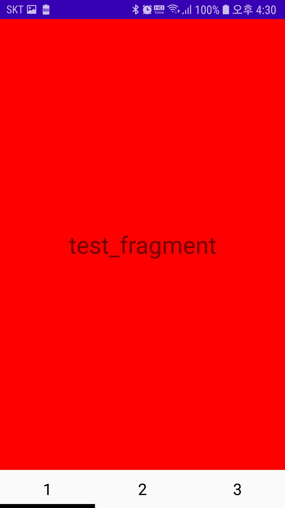
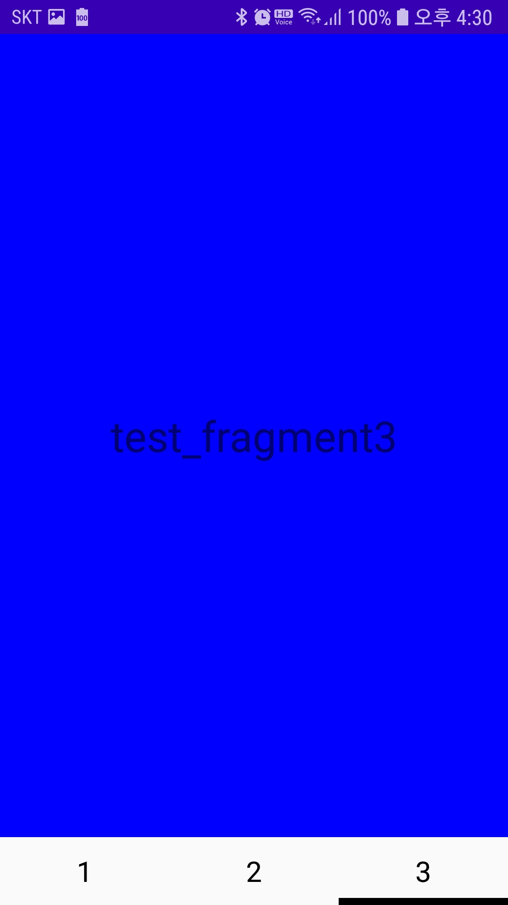

### Tablayout
-  Design Support Library를 통해 새롭게 추가된 위젯(Widget)
-  사용자가 직관적이고 쉽게 사용하여 Layout을 변경할 수 있게 도와줌


#### 1. Gradle에 추가
- build.gradle (:app)
```
dependencies { 
	...
	//다음을 추가한다
	implementation 'com.android.support:design:26.1.0'
}
  
```


#### 2. Activity.xml에 Tablayout추가
```xml
<?xml version="1.0" encoding="utf-8"?>
<LinearLayout xmlns:android="http://schemas.android.com/apk/res/android"
    xmlns:app="http://schemas.android.com/apk/res-auto"
    android:layout_width="match_parent"
    android:layout_height="match_parent"
    android:orientation="vertical">

    <FrameLayout
        android:id="@+id/fragment_frame"
        android:layout_width="match_parent"
        android:layout_height="wrap_content"
        android:layout_weight="10"></FrameLayout>

    <com.google.android.material.tabs.TabLayout
        android:id="@+id/tabLayout"
        android:layout_width="match_parent"
        android:layout_height="wrap_content"
        app:tabGravity="fill"
        app:tabIndicatorColor="@android:color/black"
        app:tabIndicatorGravity="bottom"
        app:tabIndicatorHeight="5dp"
        app:tabMode="fixed"
        app:tabUnboundedRipple="true" />
</LinearLayout>
```

- tabGravity


- tabIndicatorGravity


> tabIndicatorGravity를 STRECH로 할 경우 IndicatorHeight는 필요없어짐

- tabMode


#### 3. Tablayout에 들어갈 요소 layout만들기
> 사용자가 원하는데로 이미지, 텍스트를 설정할 수 있다
```xml
<?xml version="1.0" encoding="utf-8"?>
<LinearLayout xmlns:android="http://schemas.android.com/apk/res/android"
    android:layout_width="wrap_content"
    android:layout_height="wrap_content"
    android:orientation="vertical">

    <TextView
        android:id="@+id/txt_name"
        android:layout_width="match_parent"
        android:layout_height="wrap_content"
        android:gravity="center"
        android:textColor="#000000"
        android:textSize="20dp" />
</LinearLayout>
```

#### 4.  Activity에 Tablayout 만들기
```java
public class MainActivity extends AppCompatActivity {
@Override
    protected void onCreate(Bundle savedInstanceState) {
        super.onCreate(savedInstanceState);
        setContentView(R.layout.activity_main);
        context = getApplicationContext();

        TabLayout tabLayout = (TabLayout) findViewById(R.id.tabLayout);
        tabLayout.addTab(tabLayout.newTab().setCustomView(createTabView("1")));
        tabLayout.addTab(tabLayout.newTab().setCustomView(createTabView("2")));
        tabLayout.addTab(tabLayout.newTab().setCustomView(createTabView("3")));
        tabLayout.addOnTabSelectedListener(mTabSelect);
    }
	
    //TabLayoutdp 들어갈 요소 layout을 정해주고 반환시킨다
    private View createTabView(String tabName) {
        View tabView = LayoutInflater.from(context).inflate(R.layout.tab_list_custom, null);
        TextView txt_name = (TextView) tabView.findViewById(R.id.txt_name);
        txt_name.setText(tabName);
        return tabView;

    }
}
```

#### 5. addOnTabSelectedListener() 선택된 요소 레이아웃 실행
```java
TabLayout.OnTabSelectedListener mTabSelect = new TabLayout.OnTabSelectedListener() {
		//탭이 선택될 경우
        @Override
        public void onTabSelected(TabLayout.Tab tab) {
            fragmentManager= getSupportFragmentManager();
            fragmentTransaction = fragmentManager.beginTransaction();
            switch (tab.getPosition()) {
                case 0:
                    Fragment testFragment = new TestFragment();
                    fragmentTransaction.add(R.id.fragment_frame, testFragment).commitAllowingStateLoss();
                    break;
                case 1:
                    Fragment testFragment2 = new TestFragment2();
                    fragmentTransaction.add(R.id.fragment_frame, testFragment2).commitAllowingStateLoss();
                    break;
                case 2:
                    Fragment testFragment3 = new TestFragment3();
                    fragmentTransaction.add(R.id.fragment_frame, testFragment3).commitAllowingStateLoss();
                    break;
            }
        }
		
	    //탭이 선택되지 않을 경우
        @Override
        public void onTabUnselected(TabLayout.Tab tab) {
			
        }
		
	    //탭이 다시 선택될 경우
        @Override
        public void onTabReselected(TabLayout.Tab tab) {
            switch (tab.getPosition()) {
                case 0:
                    break;
                case 1:
                    break;
                case 2:
                    break;
            }
        }
    };
```


실행결과





참고 : https://itnext.io/android-tablayout-and-tabitem-268ac06ba966
