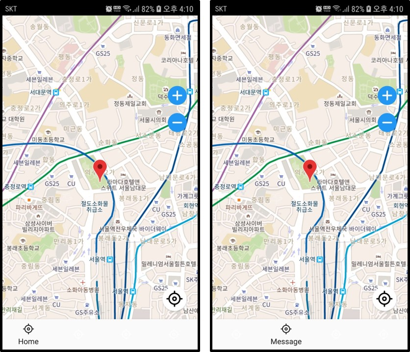
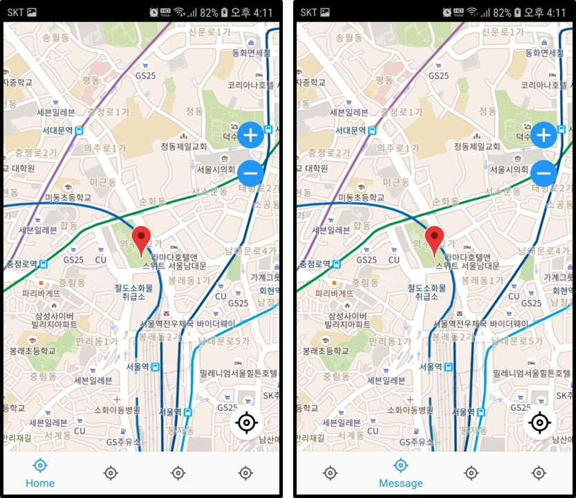
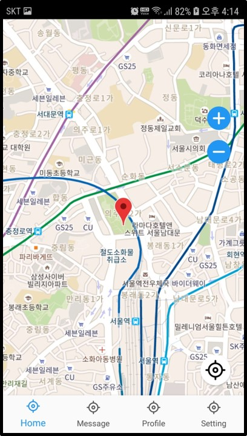
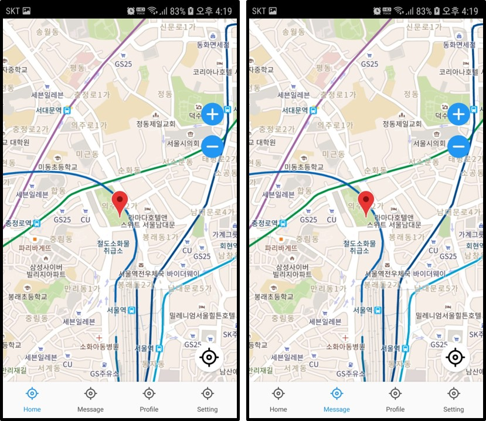

## BottomNavigationView

- 탭레이아웃과 비슷한 기능을 하지만 약간에 제약사항이 존재한다

  - 탭을 구성하는 item은 3개 이하로 구현하면 안됨
  - 탭을 구성하는 item은 5개 이상으로 구성하면 안됨
  - 텍스트는 길게 선언되면 안되고 한 라인에 끝맞춰야한다
  - 텍스트 사이즈를 줄이면 안됨
  - 다양한 색상의 아이콘, 텍스트 라벨을 사용하면 안됨
  - 탭을 스크롤되게 해서 안됨
  - 스와이프 방식으로 화면을 이동시키는 것을 권장하지 않음
  - 더 많은 정보는 [https://material.io/components/bottom-navigation](https://material.io/components/bottom-navigation)를 참고

- 이런 제약사항이 있는데도 불구하고 사용하는 이유는 잘 모르겠다

- 하지만 구글에서 만든 여러 앱들 중 플레이스토어, 구글맵을 보면 상위에 BottomNavigation이 있고 버텀네비케이션을 통해 표시되는 프래그먼트에는 TabLayout이 들어가는 구성을 갖는다

### 사용법
#### Gradle
```
implementation 'com.google.android.material:material:1.3.0-alpha02'
```
#### XML
- 바텀네비게이션은 menu(XML Resource)과 Activity.xml로 표현된다
- 추가적으로 selector, style등의 xml resource를 통해 디자인할 수 있다.
#### menu
- menu는 빈 프로젝트를 만들면 `res`폴더에 존재하지 않기에
- `res` 오른쪽 클릭 -> `new` -> `Android Resource Directory` -> `Resource type`을 `menu`로 변경 -> 폴더명은 자유롭게 -> 생성
- 생성된 폴더 오른쪽 클릭 -> `menu Resource File` -> 생성
```xml
<?xml version="1.0" encoding="utf-8"?>
<menu xmlns:android="http://schemas.android.com/apk/res/android"
    xmlns:app="http://schemas.android.com/apk/res-auto">
    <item
        android:id="@+id/btHome"
        android:title="Home"
        android:icon="@drawable/ic_gps"/>
    <item
        android:id="@+id/btMessage"
        android:title="Message"
        android:icon="@drawable/ic_gps"/>
    <item
        android:id="@+id/btProfile"
        android:title="Profile"
        android:icon="@drawable/ic_gps"/>
    <item
        android:id="@+id/btSetting"
        android:title="Setting"
        android:icon="@drawable/ic_gps"/>
</menu>
```
- 각 아이템 엘리먼트들이 실제 버텀네비게이션에 표시될 아이템들이다
- title : 버텀네비게이션에 표시될 아이템 이름
- icon : 버텀네비게이션에 표시될 아이콘

#### Activcity.xml

- constraintlayout으로 엮어서 일반적으로 구성한다
- 레이아웃 상단에는 릴레이티브 레이아웃으로 구글맵을 나타냈고
- 하단에는 BottomNavigationView을 나타냈다
- app:menu에 위에서 만든 menu.xml을 넣어 BottomNavigationView이 구성하는 아이템을 나타내게 한다

```xml
<?xml version="1.0" encoding="utf-8"?>
<androidx.constraintlayout.widget.ConstraintLayout xmlns:android="http://schemas.android.com/apk/res/android"
    xmlns:app="http://schemas.android.com/apk/res-auto"
    xmlns:tools="http://schemas.android.com/tools"
    android:layout_width="match_parent"
    android:layout_height="match_parent"
    android:orientation="vertical">

    <RelativeLayout
        android:id="@+id/map_layout"
        android:layout_width="match_parent"
        android:layout_height="match_parent"
        app:layout_constraintTop_toTopOf="parent"
        app:layout_constraintStart_toStartOf="parent"
        app:layout_constraintEnd_toEndOf="parent"
        tools:context=".map.TestActivity">

        <fragment
            android:id="@+id/map"
            android:name="com.google.android.gms.maps.SupportMapFragment"
            android:layout_width="match_parent"
            android:layout_height="match_parent"
            tools:context=".MapsActivity"/>
    </RelativeLayout>
    
    <com.google.android.material.bottomnavigation.BottomNavigationView
        android:id="@+id/bottomNavigationView"
        android:layout_width="match_parent"
        android:layout_height="wrap_content"
        android:background="#fafafa"
        app:menu="@menu/bottom_nav_menu"
        app:layout_constraintBottom_toBottomOf="parent"
        app:layout_constraintEnd_toEndOf="parent"
        app:layout_constraintStart_toStartOf="parent"/>

</androidx.constraintlayout.widget.ConstraintLayout>
```



> 기본 글자색이 흰색이고 네비게이션 배경을 흰색으로 하여 안보인다


#### Selector (아이템 클릭시 아이콘, 글자 색상변경)

- 아이템이 클릭될시 변경되는 색상과 클린안된 아이템의 생상을 Selector를 통해 변경할 수 있다
- `drawable` 오른쪽 클릭 -> `Drawable Resource File` -> `Root eletment`는 `selector`로 설정하고 생성
- state_checked 속성명으로 아이템 체크여부에 따라 색상을 지정한다
```xml
<?xml version="1.0" encoding="utf-8"?>
<selector xmlns:android="http://schemas.android.com/apk/res/android">
    <item android:color="#2196F3" android:state_checked="true" />
    <item android:color="#555555" android:state_checked="false" />
</selector>
```
- BottomNavigationView의 `itemIconTint`, ` itemTextColor`값을 selector로 지정해준다
```xml
<com.google.android.material.bottomnavigation.BottomNavigationView
	android:id="@+id/bottomNavigationView"
	android:layout_width="match_parent"
	android:layout_height="wrap_content"
	android:background="#fafafa"
	app:itemIconTint="@drawable/selector_bottom_nav"
	app:itemTextColor="@drawable/selector_bottom_nav"
	app:menu="@menu/bottom_nav_menu"
	app:layout_constraintBottom_toBottomOf="parent"
	app:layout_constraintEnd_toEndOf="parent"
	app:layout_constraintStart_toStartOf="parent"/>
```





#### 아이템 4개 이상

- BottomNavigationView을 구성하는 menu item이 4개 이상일 경우 클릭되지 안된 아이템의 글자가 사라지고 클릭된 아이템 아이콘만 나타내게 된다
- 항상 목록이름을 나타내고 싶다면
```xml
<com.google.android.material.bottomnavigation.BottomNavigationView
	android:id="@+id/bottomNavigationView"
	android:layout_width="match_parent"
	android:layout_height="wrap_content"
	android:background="#fafafa"
	app:itemIconTint="@drawable/selector_bottom_nav"
	app:itemTextColor="@drawable/selector_bottom_nav"
	app:menu="@menu/bottom_nav_menu"
	app:layout_constraintBottom_toBottomOf="parent"
	app:layout_constraintEnd_toEndOf="parent"
	app:layout_constraintStart_toStartOf="parent"
	app:labelVisibilityMode="labeled"/>
```
- `app:labelVisibilityMode="labeled"`을 추가하면 항상 라벨값(menu title)이 나타난다

  

  
#### Item Active, inActive (선택, 비선택시 글자크기 변경)

- 아이템을 클릭하게 되면 글자크기가 기본적으로 약간 크게 바뀐다
- 이런 효과를 원치 않는다면 style.xml에 다음을 추가한다
- 기존에 존재하는 style.xml에 추가해도 된다
- 선택, 비선택시 따로 아이템 텍스트를 나누어 준다
```xml
<resources>
    <style name="BottomNavigationView" parent="@style/TextAppearance.AppCompat.Caption">
        <item name="android:textSize">10sp</item>
    </style>

    <style name="BottomNavigationView.Active" parent="@style/TextAppearance.AppCompat.Caption">
        <item name="android:textSize">10sp</item>
    </style>
</resources>
```
- 그리고 BottomNavigationView에 `app:itemTextAppearanceActive`, `app:itemTextAppearanceInactive`을 추가한다
- app:itemTextAppearanceActive : 선택됬을때
- app:itemTextAppearanceInactive : 선택안될때
```xml
<com.google.android.material.bottomnavigation.BottomNavigationView
	android:id="@+id/bottomNavigationView"
	android:layout_width="match_parent"
	android:layout_height="wrap_content"
	android:background="#fafafa"
	app:itemIconTint="@drawable/selector_bottom_nav"
	app:itemTextColor="@drawable/selector_bottom_nav"
	app:itemTextAppearanceActive="@style/BottomNavigationView.Active"
	app:itemTextAppearanceInactive="@style/BottomNavigationView"
	app:menu="@menu/bottom_nav_menu"
	app:layout_constraintBottom_toBottomOf="parent"
	app:layout_constraintEnd_toEndOf="parent"
	app:layout_constraintStart_toStartOf="parent"
	app:labelVisibilityMode="labeled"/>
```


> 사이즈를 똑같이 해주었기에 변함이 없다