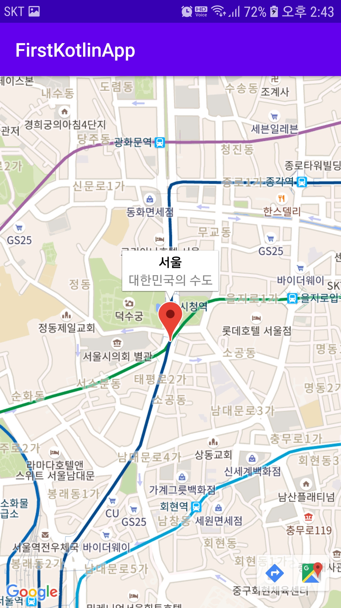

## Google Map 기본

- 구글맵을 이용한 여러 기능을 소개한다
- 지도위 마커표시, 퍼미션, 현재위치 찾기, 마커 클러스팅, 마커 커스터마이징, 마커클릭 이벤트, 마커 정보 DB연동에 대해 설명한다

### 설정
- [GoogleAPIs](https://console.developers.google.com/apis/library?folder=&organizationId=&project=spry-catcher-284006)에 접속한다
- Maps SDK for Android를 통해 프로젝트를 개설한다
- 만든 프로젝트에서 `사용자 인증 정보`에서 `+ 사용자 인증 정보 만들기`를 통해 API키를 발급받는다
- 발급된 API키를 설정한다
	- cmd창에 `"C:\Program Files\Android\Android Studio\jre\bin\keytool" -list -v -keystore "%USERPROFILE%\.android\debug.keystore" -alias androiddebugkey -storepass android -keypass android`를 입력하고 결과창에 SHA1의 값을 `Android앱의 사용량 제한`에 추가한다
	- 프로젝트의 패키지 명도 함께 기입한다
	- `API제한사항`에 `키제한`에 `Maps SDK for Android`를 체크한다
- 안드로이드 스튜디오에 설정에 기입한 패키지명과 함께 프로젝트를 만들고 Activity를 추가한다
- 만든 프로젝트의 `AndroidManifest.xml`에 다음 값을 추가한다
```xml
<application
	anroid:.....
	.....
    <uses-library android:name="org.apache.http.legacy" android:required="false"/>
	<meta-data
		android:name="com.google.android.geo.API_KEY"
		android:value="API키" />
	....
```
- 안드로이드 스튜디오 SDK Manager에서 Google Play Services를 체크하고 설치를 진행한다
- build.gradle에 Google Play Services라이브러리를 추가한다
```
implementation 'com.google.android.gms:play-services-maps:17.0.0'
implementation 'com.google.android.gms:play-services-location:17.0.0'
implementation 'com.google.maps.android:android-maps-utils:2.0.3'
```

### 사용법
- 새롭게 만든 Activity의 xml에 다음을 추가한다
- MapFragment는 앱 지도를 표시하기 위해 사용되는 컴포넌트로 관련처리를 자동으로 해준다
```xml
<?xml version="1.0" encoding="utf-8"?>
<LinearLayout xmlns:android="http://schemas.android.com/apk/res/android"
    xmlns:app="http://schemas.android.com/apk/res-auto"
    xmlns:tools="http://schemas.android.com/tools"
    android:layout_width="match_parent"
    android:layout_height="match_parent"
    android:id="@+id/map_layout"
    tools:context=".map.TestActivity">
    <fragment
        android:layout_width="match_parent"
        android:layout_height="match_parent"
        android:id="@+id/map"
        tools:context=".MapsActivity"
        android:name="com.google.android.gms.maps.SupportMapFragment" />
</LinearLayout>
```
- Activity를 다음과 같이 수정한다
- onMapReadCallBack 인터페이스를 구현한다
- getMapAsynce() 메소드 실행 후 바로 onMapReady(map: GoogleMap)이 실행된다
- 구글지도의 위도(lat),경도(lng)값을 대입한 변수를 선언해준다
- 위치, 타이틀, 설명이 포함된 makerOptions을 변수 선언해준다
- 옵션이 설정된 마커옵션, 즉 마커는 addMarker()메소드를 이용하여 추가한다
- cameraUpdate 변수를 위치와 줌레벨을 설정해주고 맵의 카메라를 움직인다
```kotlin
class TestActivity : AppCompatActivity(), OnMapReadyCallback{
    val TAG = "MapTestActivity"
    private var mMap: GoogleMap? = null
	private lateinit var mLayout : View
    
    override fun onCreate(savedInstanceState: Bundle?) {
        super.onCreate(savedInstanceState)
        setContentView(R.layout.activity_test)

        mLayout = findViewById(R.id.map_layout)

        val mapFragment = supportFragmentManager.findFragmentById(R.id.map) as SupportMapFragment
        mapFragment.getMapAsync(this)
    }
    
	override fun onMapReady(googleMap: GoogleMap) {
		mMap = googleMap
        val SEOUL = LatLng(37.564441, 126.977072)
        val markerOptions = MarkerOptions().let{
			it.position(SEOUL)
            it.title("서울")
            it.snippet("대한민국의 수도")
        }
        mMap?.addMarker(markerOptions)
        val cameraUpdate = CameraUpdateFactory.newLatLngZoom(SEOUL, 15f)
        mMap?.moveCamera(cameraUpdate)
	}
}
```

### 결과




참고 : [https://webnautes.tistory.com/647](https://webnautes.tistory.com/647),

 [https://imleaf.tistory.com/16?category=825355](https://imleaf.tistory.com/16?category=825355)


