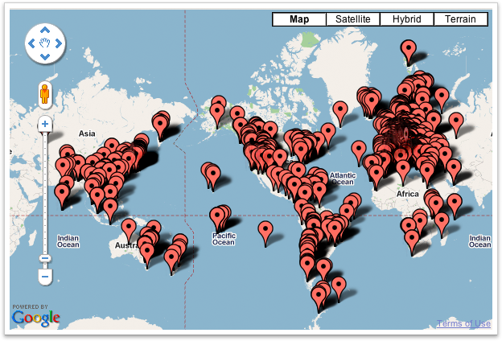
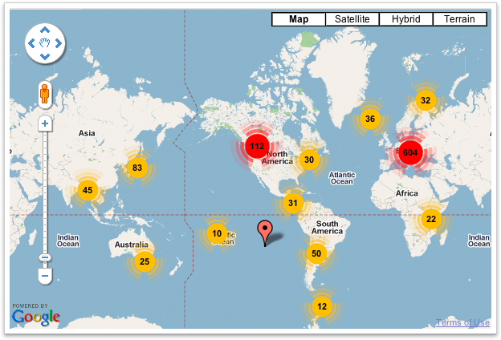
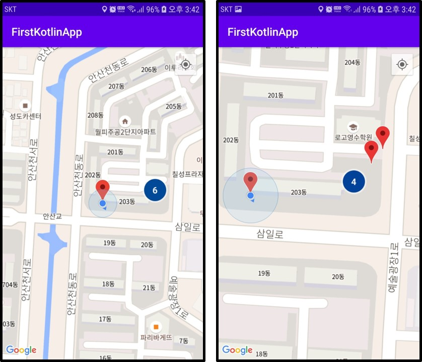
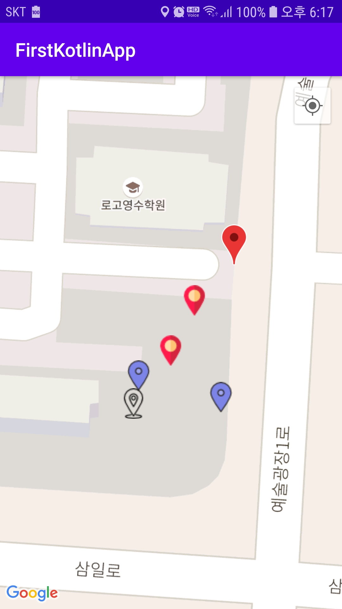

## Google Map Marker Clustering, Customize
- 클러스터링이랑 다음 그림으로 간단하게 설명할 수 있다
- 기존의 마커가 너무 많아 지도조차 보이지 않는 경우가 발생한다

- 하지만 이런 경우 마커 클러스터링을 통해 다음과 같이 나타낼 수 있다


- 마커가 존재하는 일정 범위를 숫자로 나타냄으로써 보기쉽게 나타낼 수 있다
- 또한 클러스터링 방식을 앱의 특성에 맞게 클러스터링을 할 수 있게 해준다
- 기본적으로 두가지 방법을 제공한다
	- `DefaultClusterRenderer`
	- `NonHierarchicalDistanceBasedAlgorithm` 

- 구글맵 클러스터링을 구현하기위해서는 ClusterItem, ClusterManager 클래스가필요하다
- 클러스터아이템 클래스는 화면에 표시되는 정보를 제공하기 위해 만드는 클래스 이다
- 클러스터 매니저는 마커를 표시를 관리하는 클래스이다

  
### ClusterItem Class
- ClusterItem 인터페이스를 상속받는 클래스를 구현해야한다.
```kotlin
data class MarkerDataVO(
     val location: LatLng,
     private val title: String,
     private val snippet: String,
     val writer: String,
     val content: String,
     val address: String
) : ClusterItem {
    override fun getPosition(): LatLng {
        return location
    }

    override fun getSnippet(): String? {
        return snippet
    }

    override fun getTitle(): String? {
        return title
    }
}
```
- 데이터 클래스에도 사용될 수 있다
- 이는 추가적으로 아이템에 담고 싶은 정보가 있다면 다음과 같이 할 수 있다(웹으로 부터 외부 데이터 값이 필요한 경우)

### ClusterItem Renderer Class
- 클래스터아이템 랜더러 클래스는 구글맵과, 클러스터 매니저를 인자로 받는다
- 클러스터링의 기능은 알로리즘, 렌더로 나뉘는데 ClusterManager에 setAlgorithm과 setRenderer메소드를 통해 커스텀 클래스를 등록할 수 있다
- 또한 기본적으로 `DefaultClusterRenderer`, `NonHierarchicalDistanceBasedAlgorithm` 을 사용할 수 있다
- 여기서는 `DefaultClusterRenderer` 를 통해 구현한다.
- 위에서 만든 ClusterItem 클래스 타입을 받도록 설정해준다

```kotlin
class ClusterRenderer(context: Context?, map: GoogleMap?, clusterManager: ClusterManager<MarkerDataVO>?): DefaultClusterRenderer<MarkerDataVO>(context, map, clusterManager) {

    init {
        clusterManager?.renderer = this
    }

    override fun setOnClusterItemClickListener(listener: ClusterManager.OnClusterItemClickListener<MarkerDataVO>?) {
        super.setOnClusterItemClickListener(listener)
    }
	
    //이 메소드를 이용하여 매니저로부터 추가된 마커는 이 메소드를 커치게 된다
    //MarkerDataVO가 갖는 데이터에 따라 마커의 옵션을 지정해줄 수 있다
    override fun onBeforeClusterItemRendered(item: MarkerDataVO, markerOptions: MarkerOptions) {
        //기본 마커로 설정
		markerOptions?.icon(BitmapDescriptorFactory.defaultMarker(BitmapDescriptorFactory.HUE_RED))
		markerOptions?.visible(true)
	}
}
```

#### Marker Customize

- onBeforeClusterItemRendered() 메소드에서 item의 값에 따라 마커를 사용자가 만든 bitmap파일의 이미지로 다음과 같이 대체할 수 있다

```kotlin
override fun onBeforeClusterItemRendered(item: MarkerDataVO, markerOptions: MarkerOptions) {
	when(item.content){
		"1" -> {
			markerOptions?.icon(BitmapDescriptorFactory.fromResource(R.drawable.ic_marker1))
			markerOptions?.visible(true)
		}
		"2" -> {
			markerOptions?.icon(BitmapDescriptorFactory.fromResource(R.drawable.ic_marker2))
			markerOptions?.visible(true)
		}
		"3" -> {
			markerOptions?.icon(BitmapDescriptorFactory.fromResource(R.drawable.ic_marker3))
			markerOptions?.visible(true)
		}
		else -> {
			markerOptions?.icon(BitmapDescriptorFactory.defaultMarker(BitmapDescriptorFactory.HUE_RED))
			markerOptions?.visible(true)
		}
	}
}
```


### MainActivity

```kotlin
override fun onMapReady(googleMap: GoogleMap) {
    mMap = googleMap

    setDefaultLocation()
    
    // 퍼미션 설정 관련-------------------
    
    //클러스터 매니저생성
	val clusterManager = ClusterManager<MarkerDataVO>(this, mMap)
	var clusterRenderer = ClusterRenderer(this, mMap, clusterManager)
    
    //맵에 리스너를 부착한다
	mMap?.setOnCameraIdleListener(clusterManager)
	mMap?.setOnMarkerClickListener (clusterManager)
    
    //밀집된 임의에 값을 만듬
	var testLatLng1 = LatLng(37.328294, 126.843297)
	var testLatLng2 = LatLng(37.328307, 126.843517)
	var testLatLng3 = LatLng(37.328350, 126.843310)
	var testLatLng4 = LatLng(37.328400, 126.843390)
	var testLatLng5 = LatLng(37.328500, 126.843450)
	var testLatLng6 = LatLng(37.328600, 126.843550)
    
	//clusterManager를 통해 아이템을 추가하는데 clusterItem을 상속받은 클래스를 통해 만들어준다
	clusterManager.addItem(MarkerDataVO(testLatLng1, "테스트", "테스트", "테스트", "1", "테스트"))
	clusterManager.addItem(MarkerDataVO(testLatLng2, "테스트", "테스트", "테스트", "2", "테스트"))
	clusterManager.addItem(MarkerDataVO(testLatLng3, "테스트", "테스트", "테스트", "2", "테스트"))
	clusterManager.addItem(MarkerDataVO(testLatLng4, "테스트", "테스트", "테스트", "3", "테스트"))
	clusterManager.addItem(MarkerDataVO(testLatLng5, "테스트", "테스트", "테스트", "3", "테스트"))
	clusterManager.addItem(MarkerDataVO(testLatLng6, "테스트", "테스트", "테스트", "5", "테스트"))
}
```

- 다음과 같은 결과를 얻을 수 있다




- 마커를 커스터마이징 할 경우 32px*32px 사이즈정도가 우측 상단에 위치한 기본마커와 크기가 비슷하다




참조 : [https://all-dev-kang.tistory.com/entry/안드로이드-구글맵-마커-클러스터링-커스텀-마커-마커-클릭-이벤트-구현?category=894155](https://all-dev-kang.tistory.com/entry/안드로이드-구글맵-마커-클러스터링-커스텀-마커-마커-클릭-이벤트-구현?category=894155)

[https://imleaf.tistory.com/18](https://imleaf.tistory.com/18)

[https://medium.com/flearning-edu/안드로이드-구글맵-마커-클러스터링-해보기-part-1-514bbd351378](https://medium.com/flearning-edu/안드로이드-구글맵-마커-클러스터링-해보기-part-1-514bbd351378)


