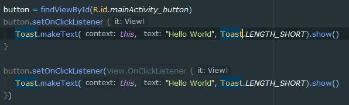

## 기본실습
### Logger
- 기존 Log와 같은 역할을 하는 Logger

```kotlin
class MainActivity : AppCompatActivity() {

    val logger = Logger.getLogger(MainActivity::class.java.name)

    override fun onCreate(savedInstanceState: Bundle?) {
        super.onCreate(savedInstanceState)
        setContentView(R.layout.activity_main)

        logger.info("onCreate")
    }
}
```

### 버튼 이벤트
- 기존 클릭이벤트에서 람다식으로 변형되어 간결하게 나타나는 것이 특징이다
- Button 타입의 변수가 후에 정의되기 때문에 lateinit이라는 예약어를 사용했다

```kotlin
class MainActivity : AppCompatActivity() {
	
	//지금 정의되지 않기에 lateinit 예약어가 사용됨
    lateinit var button : Button

    override fun onCreate(savedInstanceState: Bundle?) {
        super.onCreate(savedInstanceState)
        setContentView(R.layout.activity_main)

        button = findViewById(R.id.mainActivity_button)
        
        //아래의 두 리스너는 같은 의미이다
        button.setOnClickListener {
            Toast.makeText(this, "Hello World", Toast.LENGTH_SHORT).show()
        }
		
        button.setOnClickListener(View.OnClickListener {
            Toast.makeText(this, "Hello World", Toast.LENGTH_SHORT).show()
        })
        
    }
}
```

### 다른 Activity 호출하기

- 기존자바와 같이 Intent에 호출하고자하는 activity를 명시해주고 startActivity() 메소드를이용하여 호출할 수 있다.
- 월래 자바 클래스였기에 'Second_Activity::class.java' 명시해준다

```kotlin
class MainActivity : AppCompatActivity() {

    lateinit var button : Button

    override fun onCreate(savedInstanceState: Bundle?) {
        super.onCreate(savedInstanceState)
        setContentView(R.layout.activity_main)

        button = findViewById(R.id.mainActivity_button)
        button.setOnClickListener {
            Toast.makeText(this, "Hello World", Toast.LENGTH_SHORT).show()
            val intent : Intent = Intent(this, Second_Activity::class.java)
            startActivity(intent)
        }
    }
}
```
### 다른 Activity에 데이터 보내기
```kotlin
class MainActivity : AppCompatActivity() {

    lateinit var button : Button

    override fun onCreate(savedInstanceState: Bundle?) {
        super.onCreate(savedInstanceState)
        setContentView(R.layout.activity_main)

        button = findViewById(R.id.mainActivity_button)
        button.setOnClickListener {
            Toast.makeText(this, "Hello World", Toast.LENGTH_SHORT).show()
            val intent : Intent = Intent(this, Second_Activity::class.java)
            //기존 자바와 마찬가지로 key와 value의 한쌍으로 데이터를 intent에 저장한다
            intent.putExtra("textFromMain", "hello secondActivity")
            startActivity(intent)
        }
    }
}
```
- 자바와는 다르게 findViewById에 generic타입이 존재해서 어떤 타입의 변수인지 지정해줄 수 있다.
```kotlin
class Second_Activity : AppCompatActivity() {
    override fun onCreate(savedInstanceState: Bundle?) {
        super.onCreate(savedInstanceState)
        setContentView(R.layout.activity_second)
		
        //textFromMain 키 값을 가진 데이터를 StringFromMain이라는 이름의 변수에 담는다
        val stringFromMain = intent.getStringExtra("textFromMain")
        //기존 자바와는 다르게 findViewById에 generic타입을 지정해서 SecondTextView이라는 변수명 타입이 TextView라는 것을 알려준다
        val SecondTextView = findViewById<TextView>(R.id.secondActivity_button)
		//MainActivity에서 받아온 데이터를 SecondTextView에 표시한다.
        SecondTextView.text = stringFromMain
    }
}
```

### XML로부터 객체정의하기
- XML에 정의된 ID를 kotlin파일에서 직접 사용함으로써 findViewById 없이도 컴포넌트를 지정할 수 있다.
```xml
<LinearLayout xmlns:android="http://schemas.android.com/apk/res/android"
    android:layout_width="match_parent"
    android:layout_height="match_parent"
    android:orientation="vertical">

    <TextView
        android:layout_width="match_parent"
        android:layout_height="wrap_content"
        android:id="@+id/secondActivity_textView"/>
    <Button
        android:layout_width="match_parent"
        android:layout_height="wrap_content"
        android:id="@+id/secondActivity_button_fromXML"
        />
</LinearLayout>
```
```kotlin
package com.example.firstkotlinapp

import androidx.appcompat.app.AppCompatActivity
import android.os.Bundle
import android.widget.TextView
import kotlinx.android.synthetic.main.activity_second.*

class Second_Activity : AppCompatActivity() {
    override fun onCreate(savedInstanceState: Bundle?) {
        super.onCreate(savedInstanceState)
        setContentView(R.layout.activity_second)

        val stringFromMain = intent.getStringExtra("textFromMain")
        val SecondTextView = findViewById<TextView>(R.id.secondActivity_textView)

        SecondTextView.text = stringFromMain
		
        //findViewById 없이도 바로 사용할 수 있다.
        secondActivity_button_fromXML.setOnClickListener { 
            finish()
        }
    }
}
```
### startActivityForResult로 데이터 받기

- requestCode는 대문자로 정의한다

```kotlin
class MainActivity : AppCompatActivity() {

    lateinit var button : Button
    lateinit var mainActivity_textView : TextView

    private val REQUESTCODE_SECOND = 1000

    override fun onCreate(savedInstanceState: Bundle?) {
        super.onCreate(savedInstanceState)
        setContentView(R.layout.activity_main)
        button = findViewById(R.id.mainActivity_button)
        mainActivity_textView = findViewById(R.id.mainActivity_textView)
        button.setOnClickListener {
            Toast.makeText(this, "Hello World", Toast.LENGTH_SHORT).show()
            val intent : Intent = Intent(this, Second_Activity::class.java)
            intent.putExtra("textFromMain", "hello secondActivity")
            //시작하고자 하는 activity에 intent와 사용자가 임의로 정의한 requestCode를 넘겨준다
            startActivityForResult(intent, REQUESTCODE_SECOND)
        }
    }

    override fun onActivityResult(requestCode: Int, resultCode: Int, data: Intent?) {
        super.onActivityResult(requestCode, resultCode, data)
        //사전에 정의한 REQUESTCODE_SECOND가 종료된 activity의 requestCode를 확인하고
        //종료된 activity의 코드가 Activity.RESULT_OK일 경우 MainActivity에 TextView를 변경
        if(requestCode == REQUESTCODE_SECOND && resultCode == Activity.RESULT_OK){
            //넘겨온 intent가 null일 수 있으므로 data?.를 사용하여 존재할 경우 키의 값으로 매핑
            //없을 경우 null을 넘겨준다
            this.mainActivity_textView.text = data?.getStringExtra("returnValue")
        }
    }
}
```
- startActivityForResult 메소드에 시작된 activity가 종료될때 setResult를 이용하여 resultCode를 넘겨준다
```kotlin
class Second_Activity : AppCompatActivity() {
    override fun onCreate(savedInstanceState: Bundle?) {
        super.onCreate(savedInstanceState)
        setContentView(R.layout.activity_second)

        val stringFromMain = intent.getStringExtra("textFromMain")
        val SecondTextView = findViewById<TextView>(R.id.secondActivity_textView)

        SecondTextView.text = stringFromMain

        secondActivity_button_fromXML.setOnClickListener {
            val intent = Intent()
            intent.putExtra("returnValue", "go back main")
            setResult(Activity.RESULT_OK, intent)
            finish()
        }
    }
}
```
