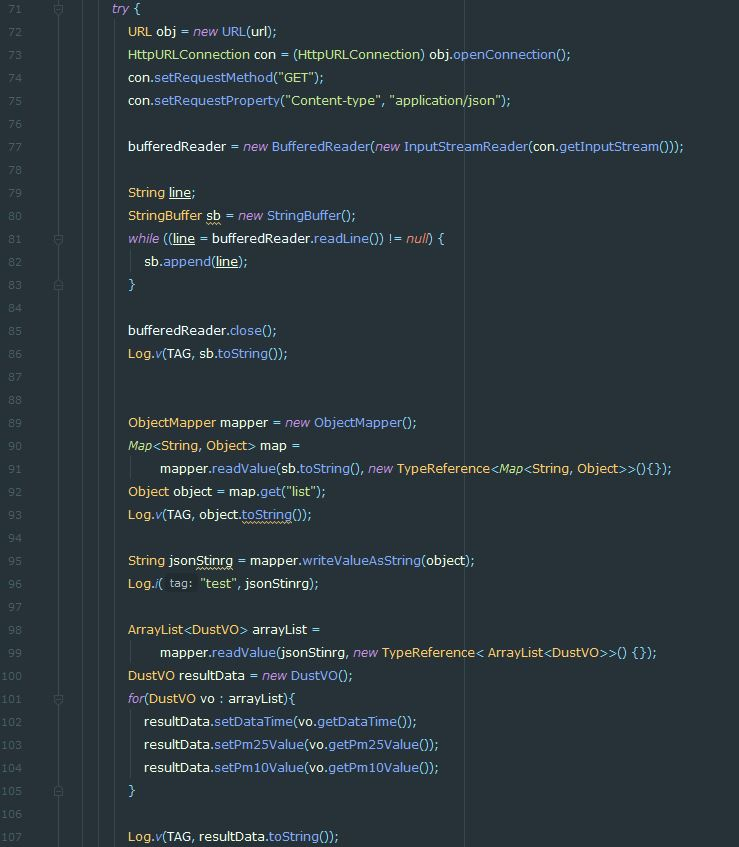

## Retrofit + Kotlin with Spring
### 기존 HttpRequest
- 기존 HttpRequest를 통해 Response.body를 파싱해서 사용할 수 있다
- 하지만 여러처리해야할 것들이 존재
	- 연결
	- 캐싱
	- 요청 재시도
	- 스레딩
	- 응답 분석
	- 오류 처리

### HttpURLConnection
- 그래서 HttpURLConnection 이용하여 연결을 구현했다
- 하지만 자유도가 높은 대신 직접 구현해야하는 것들이 많다
- 컨넥션 설정, input / out Stream생성들에 대해 많은 반복적인 작업이 수행된다


###  Retrofit
- 하지만 Retrofit은 속도, 편의성, 가독성이 장점이다
- 또한 `Okttp`를 이용하여 기존의 반복적인 작업을 도와준다
- 자체적인 비동기 실행과 스레드관리를 통해 속도가 빠르다

#### 구현
##### Spring
- [기존](https://github.com/vvvvvoin/TIL/tree/master/spring)작업된 것에서 새롭게 프로젝트를 만들었다

##### Kotlin
- retrofit은 인터페이스를 구현함으로써 get, post등의 다양한 요청방식에 annotation을 통해 쉽고 직관적으로 구현할 수 있다
- 다양한 요청방식에 대한 설명은 [이곳]()을 참조한다
```kotlin
import com.example.firstkotlinapp.dataClass.BoardVO
import retrofit2.Call
import retrofit2.http.GET

interface BoardService {
    @GET("EarthCommunity/dataTransform")
    fun getData() : Call<List<BoardVO>>
}
```
```kotlin
 val retrofit: BoardService = Retrofit.Builder()
            .baseUrl("http://175.196.190.80:8080//")
            .addConverterFactory(GsonConverterFactory.create())
            .build()
            .create(BoardService::class.java)
```

- BoardService타입의 변수에 retofit을 builder()를 만들어
- baseURL을 입력한다
- 변환타입을 설정해주고 buil() 후 서비스를 create()한다
- 인터페이스에 정의된 타입으로 값을 받는다
```kotlin
val call: Call<List<BoardVO>> = retrofit.getData()
```
- Callback 메소드를 실패했을 경우에 대한 결과 성공했을 때의 결과를 기입해준다
```kotlin
call.enqueue(object : Callback<List<BoardVO>> {
            override fun onFailure(call: Call<List<BoardVO>>, t: Throwable) {
                Log.d(TAG, "실패")
                Log.d(TAG, t.toString())
            }

            override fun onResponse(call: Call<List<BoardVO>>, response: Response<List<BoardVO>>) {
                Log.d(TAG, "성공")
                Log.d(TAG,  response.body().toString())
            }
        })
```


### RxJava + Restrofit

> Retrofit interface와 같이 업로드 될 예정