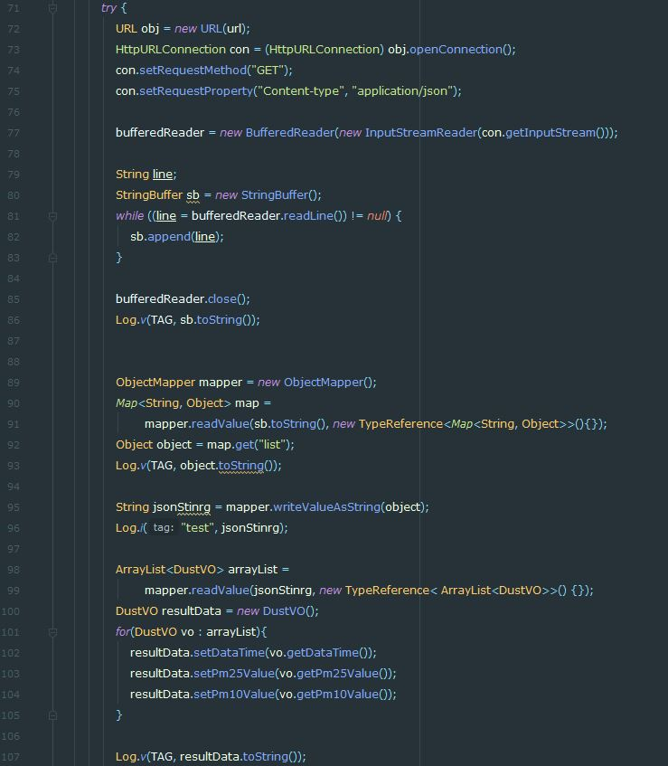
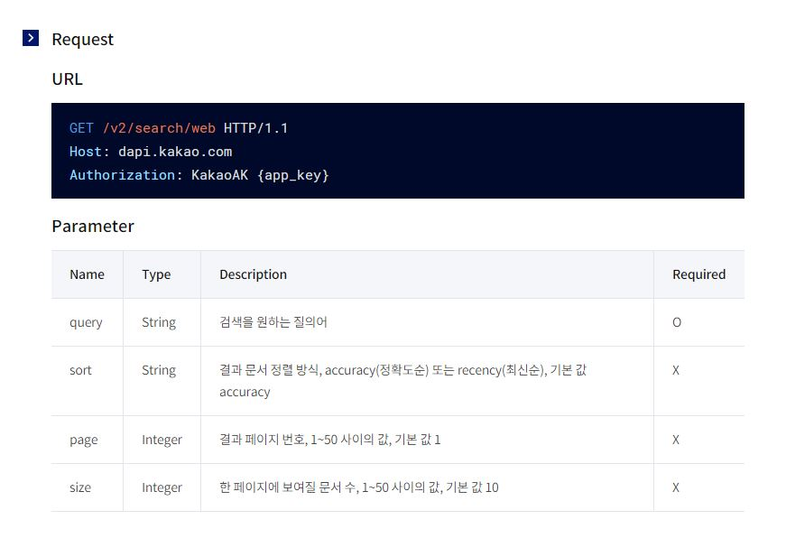
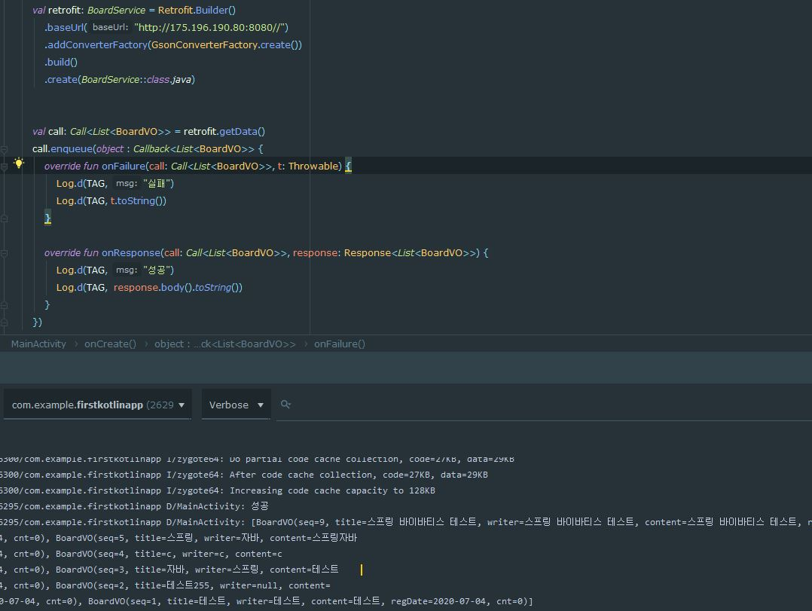

# Retrofit
- 서버와  통신하는데 자주 사용되는 유용한 라이브러리이다.
- Restful에서 HttpURLConnection을 사용하여 서버 통신을 연결할 수도 있다
- 하지만 다음과 같은 코드가 많아지고 직관적이지 못하다

- 현재 Retrofit 2.0은 인터페이스와 어노테이션을 사용하여 직관적이고 간결하게 서버통신을 구현할 수 있게 해준다

## 사용하기
### 설정
```
implementation 'com.squareup.retrofit2:retrofit:2.6.2'
implementation 'com.squareup.retrofit2:converter-gson:2.6.2'
implementation 'com.squareup.retrofit2:adapter-rxjava2:2.6.2'
```
- 추가적으로 안드로이드 `AndroidManifest.xml`에도 퍼미션을 허용해준다
```xml
<uses-permission android:name="android.permission.INTERNET" />
```
### Data 클래스
- 만약 서버로 부터 받아온 데이터가 다음과 같은 JSON형태이면

```json
{
	“name” : "retro"”
	“age” : 50
}
```
- 코틀린 Data 클래스를 다음과 같이 정의할 수 있다
```kotlin
data class person(val name:String, val age:Int)
```
### Interface
- 인터페이스는 어노테이션을 사용함으로써 직관적으로 구현할 수 있다

#### 기본
- 어떤 사이트에 어떤 호출방식으로 접속할지 어노테이션과 주소를 함께 써준다
- 그리고 메소드 이름을 정하고 어떤 방식과 형태로 받을지 작성해준다
```kotlin
interface kakao {
    @GET("/kakao/introduce/vision")
    fun getData() : Call<String>
}
```
#### Path
- 사이트의 주소가 다음과 같다면
	- /kakao/introduce/vision
	- /kakao/introduce/kakaoCulture
	- /kakao/introduce/kakaohistory
- Path를 사용하여 반복적 코드없이 구현없이 메소드의 파라미터로 다음과 같이 구현할 수 있다
```kotlin
interface kakao {
    @GET("/kakao/introduce/{introduceWaht}")
    fun getData(@Path("introduceWaht") introduceWaht: String) : Call<String>
}
```

#### Query
- 카카오 API를 이용하여 예제를 만들어 본다

- GET 호출방식으로 /v2/search/web 주소에 접속하여
- Hearder에 Authorization: KakaoAK {app_key} 값을 기입해야한다
- 또한 파라미터도 어노테이션을 이용하여 분류할 수 있다
- Single<?>는 어떻게 데이터를 받을지를 나타내는데
- Single, Observable, Subject등이 존재하고 ?에는 받은 데이터를 매핑할 Data 클래스가 보통 들어간다
```kotlin
interface kakaoApiService {
	@Headers("Authorization: KakaoAK {app_key}")
    @GET("v2/search/web")
    fun getData(
        @Query("query") query: String
        @Query("sort") sort: String
        @Query("page") page: Int
		@Query("size") size: Int
    ) : Single<?>
}
```

- 이를 해석하면 xxxxx/v2/search/web?query=kakao&sort=accuracy&page=1&size=10 Url에 접속한다는 의미이다
- 처음 xxxxx 값은 retrofit객체를 만들때 baseUrl을 의미한다 위치한다
- kakao api인 경우 baseUrl은 "https://dapi.kakao.com/" 이 baseUrl이 된다
- Query가 많은 경우 QueryMap을 이용할 수 있다 

```kotlin
interface kakaoApiService {
	@Headers("Authorization: KakaoAK {app_key}")
    @GET("/v2/search/web")
    fun getData(
         @QueryMap map:Map<String, String> 
    ) : Single<?>
}
```

#### POST
- POST 호출방식은 크게 2가지로 나뉜다

##### @Body
```kotlin
interface PostService {
    @POST("/post/service/web")
    fun getData(
         @Body name: String
    ) : Single<?>
}
```
##### @Field

- Field를 사용할 경우 `@FormUrlEncoded`어노테이션과 함께 사용한다

```kotlin
interface PostService {
    @FormUrlEncoded
    @POST("/post/service/web")
    fun getData(
         @Field("name") name: String
    ) : Single<?>
}
```
##### @FieldMap
- 다수의 쿼리가 필요할 때는`@QueryMap`과 마찬가지로 `@FieldMap`를 사용할 수 있다.

```kotlin
  interface PostService {
    @FormUrlEncoded
    @POST("/post/service/web")
    fun getData(
          @FieldMap map:Map<String, String> 
    ) : Single<?>
  }
```
### Main
- 인터페이스를 작성 후 Retrofit객체를 생성하고 데이터를 받아온다
- 사용된 인터페이스와 Data클래스는 아래 기입하였다
```kotlin
val retrofit: BoardService = Retrofit.Builder()
            .baseUrl("http://175.196.190.80:8080/")
            .addConverterFactory(GsonConverterFactory.create())
            .build()
            .create(BoardService::class.java)
```

- 연결하는 위치에서 객체를 받아오고 연결 성공과 실패에 대한 결과를 처리해준다
```kotlin
val call: Call<List<BoardVO>> = retrofit.getData()
        call.enqueue(object : Callback<List<BoardVO>> {
            override fun onFailure(call: Call<List<BoardVO>>, t: Throwable) {
                Log.d(TAG, "실패")
                Log.d(TAG, t.toString())
            }

            override fun onResponse(call: Call<List<BoardVO>>, response: Response<List<BoardVO>>) {
                Log.d(TAG, "성공")
                Log.d(TAG,  response.body().toString())
            }
        })
```

## BoardService
```kotlin
interface BoardService {
    @GET("EC/dataTransform")
    fun getData(
    ) : Call<List<BoardVO>>
}
```
## BoardVO
```kotlin
data class BoardVO (
    val  seq: Int,
    val  title: String,
    val  writer: String,
    val  content: String,
    val regDate: String,
    val  cnt: Int
)
```
## URL JSON값
```JSON
[
  {
    "seq": 9,
    "title": "스프링 바이바티스 테스트",
    "writer": "스프링 바이바티스 테스트",
    "content": "스프링 바이바티스 테스트",
    "regDate": "2020-07-15",
    "cnt": 0
  },
  {
    "seq": 8,
    "title": "mybatis 제목 (수정됨)",
    "writer": "hong",
    "content": "this is content test (수정됨)",
    "regDate": "2020-07-14",
    "cnt": 0
  },
  .........
]
```


