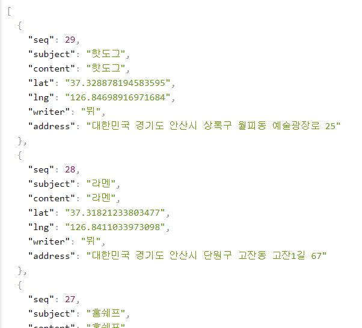
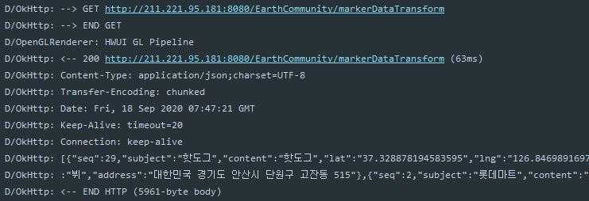
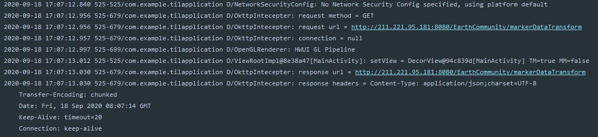

# Retrofit2 + RxJAVA + OkHttp3
- 기존의 Retrofit2 + RxJAVA에 OkHttp3 클라이언트를 결합은 REST API를 설명한다

### Dependency
```
// Retrofit, Gson, RxAdapter
implementation 'com.google.code.gson:gson:2.8.6'

implementation 'com.squareup.retrofit2:retrofit:2.6.2'
implementation 'com.squareup.retrofit2:converter-gson:2.6.2'
implementation 'com.squareup.retrofit2:adapter-rxjava2:2.6.2'
implementation 'com.squareup.retrofit2:converter-scalars:2.6.2'

implementation 'io.reactivex.rxjava2:rxandroid:2.1.1'
implementation 'io.reactivex.rxjava2:rxjava:2.2.13'
implementation 'io.reactivex.rxjava2:rxkotlin:2.4.0'

// okhttp3
implementation 'com.squareup.okhttp3:okhttp:4.0.1'
implementation 'com.squareup.okhttp3:logging-interceptor:4.0.1'
implementation 'com.squareup.okhttp3:okhttp-urlconnection:4.0.1'
```

- 받아오는 데이터는 다음과 같다



### Data Class

- 해당 JSON에 맞는 데이터 클래스를 정의 해준다

```kotlin
data class MarkerDataVO(
    var seq: Int = 0,
    var subject: String = "",
    var content: String = "",
    var lat: Double = 0.0,
    var lng: Double = 0.0,
    var writer: String = "",
    var address: String = "",
)
```

### Interface

- 접속하고자 하는 url를 Retrofit interface를 만들어준다
- 접속하고자 하는 URL은 "http://211.221.95.181:8080/EarthCommunity/markerDataTransform" 이다
- base url을 제외한 나머지 부분을 어노테이션, 메소드, 리턴값으로 정의해준다.
- 관련 자세한 내용은 [여기](https://github.com/vvvvvoin/TIL/blob/master/android/kotlin/Retrofit.md)를 참조한다
```kotlin
interface MarkerService {
    @GET("EarthCommunity/markerDataTransform")
    fun getDataList( ) : Single<List<MarkerDataVO>>
}
```

### OkHttpClient

- OkHttp 매니저와 retrofit을 만드는 하나의 object를 만들어 준다

```kotlin
object KotlinOKHttpRetrofitRxJavaManager {
    val TAG = "OkHttpManager"
    val CONNECT_TIMEOUT: Long = 15
    val WRITE_TIMEOUT: Long = 15
    val READ_TIMEOUT: Long = 15
    val API_URL: String = "http://211.221.95.181:8080/"
    var mOKHttpClient: OkHttpClient
    var mRetrofit: Retrofit
    var mKotlinRetrofitInterface: MarkerService

    init {
        val httpLoggingInterceptor = HttpLoggingInterceptor()
        httpLoggingInterceptor.level = HttpLoggingInterceptor.Level.BODY
        mOKHttpClient = OkHttpClient().newBuilder().apply {
            addInterceptor(httpLoggingInterceptor)
            connectTimeout(CONNECT_TIMEOUT, TimeUnit.SECONDS)
            writeTimeout(WRITE_TIMEOUT, TimeUnit.SECONDS)
            readTimeout(READ_TIMEOUT, TimeUnit.SECONDS)
        }.build()
        mRetrofit = Retrofit.Builder().apply {
            baseUrl(API_URL)
            client(mOKHttpClient)
            addConverterFactory(GsonConverterFactory.create())
            addCallAdapterFactory(RxJava2CallAdapterFactory.create())
        }.build()
        mKotlinRetrofitInterface = mRetrofit.create()
    }

    fun getInstance(): MarkerService {
        return mKotlinRetrofitInterface
    }
}
```
- 기존 Retrofit + RxJAVA와 달라진 점은 retrofit을 build하는 과정에서 clinet를 OkHttpClinet가 추가되었다.
- OkHttp클라이언트가 들어감에 따라 타임아웃시간 등을 따로 정의하거나, Intercepter를 이용하여 개발자에게 로그메시지를 알려줄 수 있다
- 또한 Intercepter는 상속받은 클래스를 만들어 커스텀으로 만들 수 있다
- 그외 쿠키값, 토큰 인증방식 구현하거나 retrofit에 header값을 Intercepter에 넣는 기능들을 지원한다
- 그리고 액티비티에서 object instance를 받아와 실제 값을 받아온다

### Activity

```kotlin
@SuppressLint("CheckResult")                                     
override fun onCreate(savedInstanceState: Bundle?) {             
    super.onCreate(savedInstanceState)                           
    setContentView(R.layout.activity_main)                       
                                                                 
    val service = KotlinOKHttpRetrofitRxJavaManager.getInstance()
    service.getDataList()                                        
        .subscribeOn(Schedulers.io())                            
        .observeOn(AndroidSchedulers.mainThread())               
        .subscribe({                                              
            Log.d(TAG, it.toString())                            
        }, {                                                      
            Log.d(TAG, it.toString())                            
        })                                                       

}                                                                
```

- 결과로 다음을 받을 수 있다



#### implement Intercepter

- 다음처럼 Intecepter class를 만들 수 있다

```kotlin
class OkttpIntecepter : Interceptor {
    private val TAG = "OkttpIntecepter"
    override fun intercept(chain: Interceptor.Chain): Response {
        val request = chain.request()
        Log.d(TAG, "request method = ${request.method}")
        Log.d(TAG, "request url = ${request.url}")
        Log.d(TAG, "connection = ${chain.connection()}")

        val response = chain.proceed(request)
        Log.d(TAG, "response url = ${response.request.url}")
        Log.d(TAG, "response headers = ${response.headers}")
        return response
    }
}
```

- 그리고 OkHttpClinet를 만들때 다음처럼 변경한다

```kotlin
val loggingInterceptor = OkttpIntecepter()
httpLoggingInterceptor.level = HttpLoggingInterceptor.Level.BODY
mOKHttpClient = OkHttpClient().newBuilder().apply {
	addInterceptor(loggingInterceptor)
	connectTimeout(CONNECT_TIMEOUT, TimeUnit.SECONDS)
	writeTimeout(WRITE_TIMEOUT, TimeUnit.SECONDS)
	readTimeout(READ_TIMEOUT, TimeUnit.SECONDS)
}.build()
```




참고 : https://like-tomato.tistory.com/231

https://developer88.tistory.com/67

https://jongmin92.github.io/2018/01/29/Programming/android-retrofit2-okhttp3/

