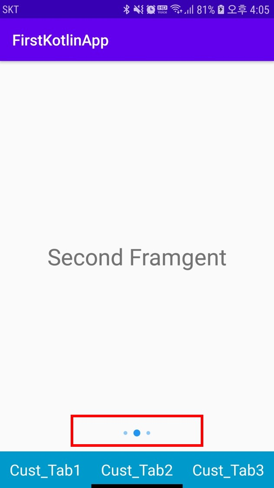

## ViewPager2 + Indicator3
- 다음 사진에서 Indicator를 확인할 수 있다
- 사용자가 화면에서 현재 어디에 위치했는지를 간단한 indicator로 확인할 수 있다.


### dependencies

```xml
implementation 'me.relex:circleindicator:2.1.4'
```

### indicator.xml
- 화면에 나타나는 인디케이터 디자인은 사용자가 xml파일 형식으로 만들어야한다.
- 파일명 `indicator_selected.xml`이다
```xml
<?xml version="1.0" encoding="utf-8"?>
<shape xmlns:android="http://schemas.android.com/apk/res/android"
    android:shape="oval">
    <solid android:color="#7121F3" />
</shape>
```
### MainActivity.xml
```xml
<?xml version="1.0" encoding="utf-8"?>
<LinearLayout xmlns:android="http://schemas.android.com/apk/res/android"
    xmlns:app="http://schemas.android.com/apk/res-auto"
    android:layout_width="match_parent"
    android:layout_height="match_parent"
    android:orientation="vertical">

    <FrameLayout
        android:layout_width="match_parent"
        android:layout_height="match_parent"
        android:layout_weight="10">
        <androidx.viewpager2.widget.ViewPager2
            android:id="@+id/viewPager"
            android:clipToPadding="false"
            android:clipChildren="false"
            android:layout_width="match_parent"
            android:layout_height="match_parent">
        </androidx.viewpager2.widget.ViewPager2>

        <me.relex.circleindicator.CircleIndicator3
            android:id="@+id/indicator"
            android:layout_width="match_parent"
            android:layout_height="48dp"
            android:layout_gravity="bottom"
            app:ci_drawable="@drawable/indicator_selected"
            app:ci_drawable_unselected="@drawable/indicator_unselected"
            />
    </FrameLayout>

    <com.google.android.material.tabs.TabLayout
        android:id="@+id/tabLayout"
        android:background="@android:color/holo_blue_dark"
        android:layout_width="match_parent"
        android:layout_height="wrap_content"
        app:tabGravity="fill"
        app:tabIndicatorColor="@android:color/black"
        app:tabIndicatorGravity="bottom"
        app:tabIndicatorHeight="5dp"
        app:tabMode="fixed"
        app:tabUnboundedRipple="true" />
</LinearLayout>
```
- 현재 `ci_drawable`의 값을 `@drawable/indicator_selected`으로 설정하였다
- 만약에 인디케이터 xml파일의 이름이 `white_radius.xml`일 경우xml에 `ci_drawable` , `ci_drawable_unselected`엘리먼트를 설정하지 않아도  `white_radius.xml`파일을 이용하여 자동적으로 선택, 비선택을 자동적으로 매핑해준다

| Properties                 | Default Value               |
| :------------------------- | :-------------------------- |
| app:ci_width               | 5dp                         |
| app:ci_height              | 5dp                         |
| app:ci_margin              | 5dp                         |
| app:ci_drawable            | R.drawable.white_radius     |
| app:ci_drawable_unselected | R.drawable.white_radius     |
| app:ci_animator            | R.animator.scale_with_alpha |
| app:ci_animator_reverse    | 0                           |
| app:ci_orientation         | horizontal                  |
| app:ci_gravity             | center                      |

### MainActivity
- 인디케이터를 선언해주고 어떤 View에 적용할지를 매핑한다
- 적용될 페이지의 크기또한 인디케이터에 매핑해줘야 한다
```kotlin
 /*indicator*/
val indicator = findViewById<CircleIndicator3>(R.id.indicator)
//원하는 viewpager에 인디케이터를 설정한다
indicator.setViewPager(viewPager)
//인디케이터가 표시할 갯수를 알려준다.
//2번째 파라미터는 초기 인디케이터의 위치를 나타낸다
indicator.createIndicators(fragmentList.size, 0)

//viewpager에 콜백메소드를 정의한다.
viewPager.registerOnPageChangeCallback(object : ViewPager2.OnPageChangeCallback() {
	override fun onPageScrolled(
		position: Int,
		positionOffset: Float,
		positionOffsetPixels: Int
		) {
			super.onPageScrolled(position, positionOffset, positionOffsetPixels)
			if (positionOffsetPixels == 0) {
			viewPager.currentItem = position
			}
		}
			override fun onPageSelected(position: Int) {
			super.onPageSelected(position)
            //현재 위치에 다라 인디케이터 위치를 바꾼다
			indicator.animatePageSelected(position)
		}
})
```

> app:ci_animator에 대한 내용과 기타 다양한 정보 보충하겠음