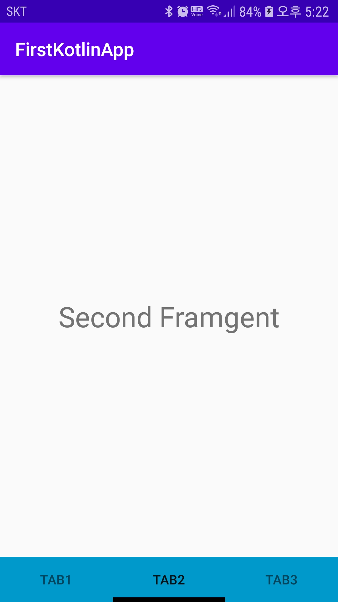
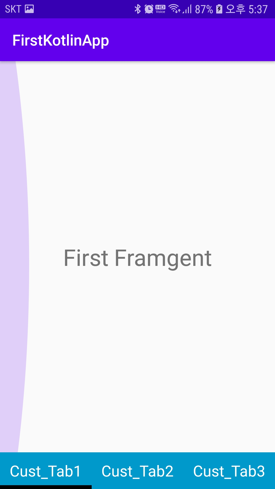
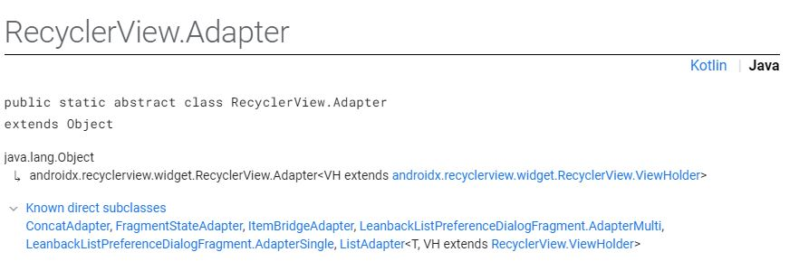
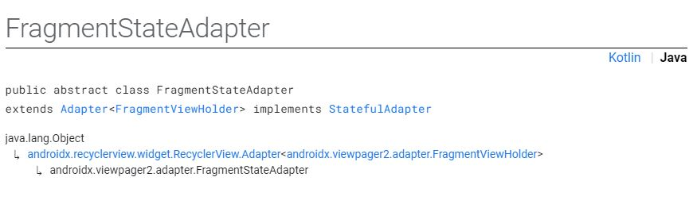

## ViewPager2 + TabLayout + FragmentStateAdapter
- ViewPager2와 RecyclerView를 이용한 [예제](https://github.com/vvvvvoin/TIL/blob/master/android/kotlin/ViewPager2.md)
- ViewPager2와 FragmentStateAdapter를 이용한 [예제](https://github.com/vvvvvoin/TIL/blob/master/android/kotlin/ViewPager2%EC%99%80%20FragmentStateAdapter.md)
- 위의 두가지를 활용하여 TabLayout와 연동하는 법을 소개한다
- TabLayout와 ViewPager를 이용하여 Fragment를 View한다
### dependencies
- 20.07.12 기준으로 최신버전을 사용하였다
```xml
implementation 'com.google.android.material:material:1.3.0-alpha01'
implementation 'androidx.viewpager2:viewpager2:1.1.0-alpha01'
```

### TabLayout.xml
- TabLayout 엘리먼트 속성은 [이곳](https://github.com/vvvvvoin/TIL/blob/master/android/java/Tablayout.md)에서 확인할 수 있다
```xml
<?xml version="1.0" encoding="utf-8"?>
<LinearLayout xmlns:android="http://schemas.android.com/apk/res/android"
    xmlns:app="http://schemas.android.com/apk/res-auto"
    android:layout_width="match_parent"
    android:layout_height="match_parent"
    android:orientation="vertical">

    <FrameLayout
        android:layout_width="match_parent"
        android:layout_height="match_parent"
        android:layout_weight="10">
        <androidx.viewpager2.widget.ViewPager2
            android:id="@+id/viewPager"
            android:clipToPadding="false"
            android:clipChildren="false"
            android:layout_width="match_parent"
            android:layout_height="match_parent">
        </androidx.viewpager2.widget.ViewPager2>

        <me.relex.circleindicator.CircleIndicator3
            android:id="@+id/indicator"
            android:layout_width="match_parent"
            android:layout_height="48dp"
            android:layout_gravity="bottom"/>
    </FrameLayout>

    <com.google.android.material.tabs.TabLayout
        android:id="@+id/tabLayout"
        android:background="@android:color/holo_blue_dark"
        android:layout_width="match_parent"
        android:layout_height="wrap_content"
        app:tabGravity="fill"
        app:tabIndicatorColor="@android:color/black"
        app:tabIndicatorGravity="bottom"
        app:tabIndicatorHeight="5dp"
        app:tabMode="fixed"
        app:tabUnboundedRipple="true" />
</LinearLayout>
```
### TabLayout에 Item 추가하기
#### 방법 1
- 방법1은 기본적으로 간단하게 item을 추가한다
- TabLayout id를 찾고 변수로 선언한다
- 탭 아이템에 들어갈 리스트를 정의한다
```kotlin
val tablayout = findViewById<TabLayout>(R.id.tabLayout)
val tabListitem = listOf("tab1", "tab2", "tab3")
```
- 현재기준으로 tablayout을 viewPager2에 바인딩할 수 없다
- 하지만 TabLayoutMediator 클래스로 수동적인 방법으로 바인딩시킬 수 있다
- 그러나 라이브러리와 개발자코드를 직접적으로 사용할 수 없다
- 그러므로 프로젝트에 다음코드를 복사해서 사용해야한다

```kotlin
/*TabLayout*/
val tablayout = findViewById<TabLayout>(R.id.tabLayout)
val tabListitem = listOf("tab1", "tab2", "tab3")

TabLayoutMediator(tablayout,viewPager){tab,position->
	tab.text = tabListitem[position]
}.attach()
```

- 이제 ViewPager2를 이용하여 스와이프로 프래그먼트를 이동하거나 TabLayout을 이용하여 터치를 통해 프래그먼트를 이동시킬 수 있다
- 하지만 현재는 리스트에 String타입으로만 tab에 저장될 아이템을 정하였다
- 사진 등 다양한 커스텀 탭을 만들기 위해서는 attach() 메소드에 대해 확인해야한다.
- TabLayoutMediator 를 초기화 후에는 attach()메소드가 호출되야 한다.
- attach()를 수행하면 다음 메소드도 같이 실행된다
```kotlin
void populateTabsFromPagerAdapter() {
    tabLayout.removeAllTabs();

    if (adapter != null) {
      int adapterCount = adapter.getItemCount();
      for (int i = 0; i < adapterCount; i++) {
        TabLayout.Tab tab = tabLayout.newTab();
        tabConfigurationStrategy.onConfigureTab(tab, i);
        tabLayout.addTab(tab, false);
      }
      // Make sure we reflect the currently set ViewPager item
      if (adapterCount > 0) {
        int lastItem = tabLayout.getTabCount() - 1;
        int currItem = Math.min(viewPager.getCurrentItem(), lastItem);
        if (currItem != tabLayout.getSelectedTabPosition()) {
          tabLayout.selectTab(tabLayout.getTabAt(currItem));
        }
      }
    }
  }
```
- tabLayout.removeAllTabs() 메소드가 기존 탭들을 모두 지우고 새로운 탭을 생성하여 미리 생성한 Tabitem이 사라지게 된다
- 하지만 TabLayoutMediator.OnConfigureTabCallback가 각 탭을 초기화하고 데이터를 변경할 수 있는 사용자 함수이기에 이를 활용하여 커스텀 탭을 제작할 수 있다.


#### 방법 2
- 방법2는 attach()에 문제를 보완하고 커스텀 탭을 제작할 수 있도록한다
- onConfigureTab 오버라이딩하여 position에 따른 tab을 설정해준다
```kotlin
val tablayout = findViewById<TabLayout>(R.id.tabLayout)
//커스텀 탭을 사용할 것이기에 필요없다
//val tabListitem = listOf("tab1", "tab2", "tab3")

TabLayoutMediator(tablayout, viewPager, object : TabLayoutMediator.TabConfigurationStrategy{
	override fun onConfigureTab(tab: TabLayout.Tab, position: Int) {
		when(position){
			0 -> tab.customView = createTabView("Cust_Tab1")
			1 -> tab.customView = createTabView("Cust_Tab2")
			2 -> tab.customView = createTabView("Cust_Tab3")
		}
	}
}).attach()

....
//View를 찾고 view에 맞는 위젯을 커스텀한다
private fun createTabView(tabName: String): View? {
	val tabView: View = LayoutInflater.from(this).inflate(R.layout.tab_list_custom, null)
	val textView = tabView.findViewById<TextView>(R.id.txt_name)
	textView.text = tabName
	return tabView
}
```

- tab_list_custom.xml

```xml
<?xml version="1.0" encoding="utf-8"?>
<LinearLayout android:layout_height="match_parent"
    android:layout_width="match_parent"
    android:orientation="vertical"
    xmlns:android="http://schemas.android.com/apk/res/android">

    <TextView
        android:id="@+id/txt_name"
        android:layout_width="match_parent"
        android:layout_height="wrap_content"
        android:gravity="center"
        android:textColor="#FFFFFF"
        android:textSize="20dp" />
</LinearLayout>
```

- 람다식으로 간소화 할 수 있다
```kotlin
TabLayoutMediator(tablayout, viewPager,
		TabLayoutMediator.TabConfigurationStrategy { tab, position ->
			when(position){
				0 -> tab.customView = createTabView("Tab1")
				1 -> tab.customView = createTabView("Tab2")
				2 -> tab.customView = createTabView("Tab3")
			}
}).attach()
```



> 참고 : [https://itnext.io/android-viewpager2-tablayout-3099aae2f396](https://itnext.io/android-viewpager2-tablayout-3099aae2f396)


## RecyclerView adapter Vs FragmentStateAdapter




- VIewPager2는 RecyclerVIew.Adapter와 FragmentStateAdapter를 모두 수용할 수 있다
- FragmentStateAdapter는 RecyclerVIew.Adapter의 종속(자식)되어 있다
- 그리고 둘의 차이점은 RecyclerVIew.Adapter는 View를 inflate하고 FragmentStateAdapter는 Fragment를 inflate하는 것이다
- 그러므로 RecyclerVIew.Adapter는 ViewPager2에서 static한 정보들을 표시할때 사용된다
- FragmentStateAdapter는 각 페이지의 생명주기를 고려할때 사용된다