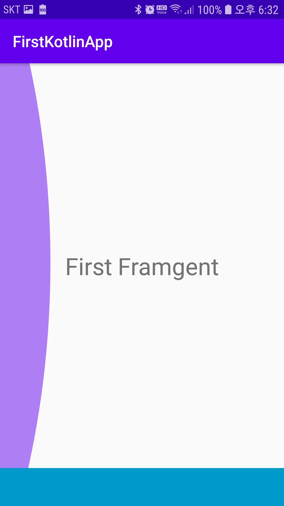
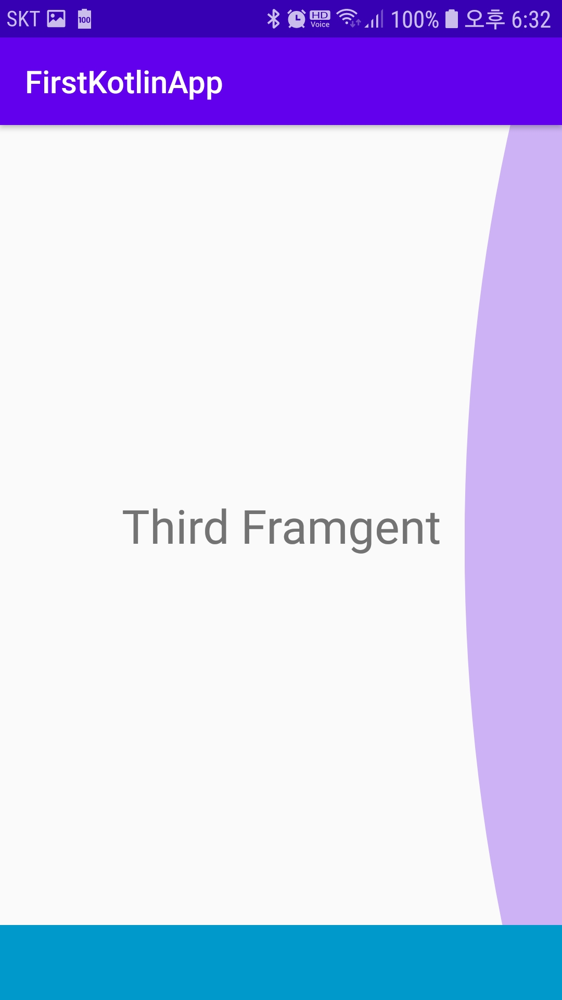

## ViewPager2와 FragmentStateAdapter 

- [이전](https://github.com/vvvvvoin/TIL/blob/master/android/kotlin/ViewPager2.md)에는 String list를 보내 viewPager에 나타냈다
- 이번에는 ViewPager2를 이용하여 fragment로 표시할 수 있도록한다.

### Fragment생성하기
- 화면에 표시될 간단한 텍스트뷰만 만든다
- 원하는 수 만큼 만들도록 한다.
```xml
<?xml version="1.0" encoding="utf-8"?>
<androidx.constraintlayout.widget.ConstraintLayout xmlns:android="http://schemas.android.com/apk/res/android"
    xmlns:app="http://schemas.android.com/apk/res-auto"
    xmlns:tools="http://schemas.android.com/tools"
    android:layout_width="match_parent"
    android:layout_height="match_parent"
    android:orientation="vertical">

    <TextView
        android:layout_width="wrap_content"
        android:layout_height="wrap_content"
        android:text="First Framgent"
        android:textSize="30dp"
        app:layout_constraintBottom_toBottomOf="parent"
        app:layout_constraintEnd_toEndOf="parent"
        app:layout_constraintHorizontal_bias="0.5"
        app:layout_constraintStart_toStartOf="parent"
        app:layout_constraintTop_toTopOf="parent" />

</androidx.constraintlayout.widget.ConstraintLayout>
```
```kotlin
class FirstFragment : Fragment() {

    override fun onCreateView(
        inflater: LayoutInflater, container: ViewGroup?,
        savedInstanceState: Bundle?
    ): View? {
        // Inflate the layout for this fragment
        return inflater.inflate(R.layout.fragment_first, container, false)
    }
}
```
### FragmentStateAdapter 만들기
- fragment를 ViewPager에 나타내기 위한 어댑터 클래스를 만들어 준다.
- 파라미터로 FragmentActivity와 Fragment 타입의 리스트를 받는다
- 받은 list변수는 arrayList listFragment로 받는다
- createFragment()는 현재 위치에 따라 프래그먼트를 만든다
- RecyclerViewAdapter와 비슷한 구조를 갖는다
```kotlin
class FragmentAdapter(fragmentActivity: FragmentActivity, list: List<Fragment>) :  FragmentStateAdapter(fragmentActivity) {
    private var listFragment: List<Fragment> = ArrayList()

    init {
        this.listFragment = list
    }

    override fun createFragment(position: Int): Fragment {
        return listFragment[position]
    }

    override fun getItemCount(): Int {
        return listFragment.size
    }

}
```
> 프래그먼트가 액티비티에 종속적인 하위 액티비티 개념인 만큼 상위 액티비티(여기서는 메인)에 대한 정보(fragmentActivity)가 필요하기에 FragmentStateAdapter 파라미터에 fragmentActivity가 들어간다.

- FragmentStateAdapter 생성자에도 getSupportFragmentManager() 메소드를 이용하여 FragmentManage생성하고 Fragment에 대한 트랜잭션을 관리함을 알 수 있다.
```java
public FragmentStateAdapter(@NonNull FragmentActivity fragmentActivity) {
        this(fragmentActivity.getSupportFragmentManager(), fragmentActivity.getLifecycle());
    }
```
- 그렇기에 MainActivity에서 트랜잭션에 관한 정의가 없다
- MainActivity 차이점은 [java fragment](https://github.com/vvvvvoin/TIL/blob/master/android/java/Fragment.md)에서 확인해 볼 수 있다.


### MainActvity
- 만든 프래그먼트를 초기화 해준다.
- 초기화된 프래그먼트를 list에 묶어 FragmentAdapter의 파라미터로 지정한다.
- viewPager 어탭터를 FragmentStateAdapter를 상속받은 FragmentAdapter로 설정한다
```kotlin
class MainActivity : AppCompatActivity() {

    override fun onCreate(savedInstanceState: Bundle?) {
        super.onCreate(savedInstanceState)
        setContentView(R.layout.activity_main)

        val firstFragment = FirstFragment()
        val secondFragment = SecondFragment()
        val thirdFragment = ThirdFragment()
        val fragmentList = arrayListOf(firstFragment, secondFragment, thirdFragment)

        val viewPager  = findViewById<ViewPager2>(R.id.viewPager)
        val fragmentAdapter = FragmentAdapter(this, fragmentList)
        viewPager.adapter = fragmentAdapter

    }
}
```




> FragmentStateAdapter 아직까지 많은 정보를 못 찾아 정말 기본적으로만 구현했고
> 추후에 더 잘된 FragmentStateAdapter를 구현하겠음