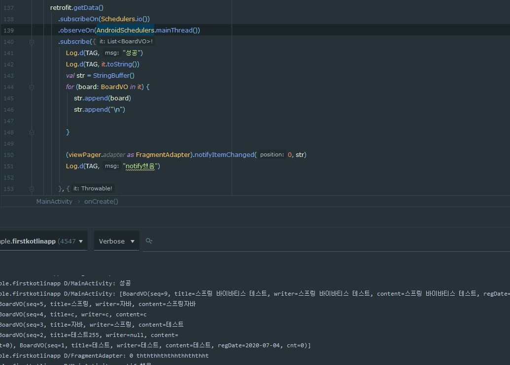

## ViewPager2의 FragmentStateAdapter 데이터 전달
- VIewPager2의 어탭터인 FragmentStateAdapter를 이용하여 viewpager로 작동하는 fragment를 생성하였다
- 이번에는 생성된 fragment에 데이터를 전달하는데 FragmentStateAdapter를 이용하여 구현한다.
- 구현방식이 기존의 [RecyclerVIew](https://github.com/vvvvvoin/TIL/blob/master/android/java/RecyclerView%20basic.md)와 유사하기에 다시 확인해 보면 도움이 된다.
- 지금 구현상태는 다음과 같다

- 실제 보여지는 View는 ViewPager2이고 프래그먼트를 스와이프하여 변경할 수 있다
### 구현

- 이전에 진행했던 FragmentStateAdapter의 생성자와 상속이 다음과 같이 바뀌었다.
```kotlin
class FragmentAdapter(fragmentManager: FragmentManager, lifecycle: Lifecycle, list: List<Fragment>) : FragmentStateAdapter(fragmentManager, lifecycle) {
    private val TAG = "FragmentAdapter"
    private var listFragment: List<Fragment> = ArrayList()
    private val fm = fragmentManager
    .....
```

- 기존 생성자는 `FragmentActivity`, `List`였지만 현재는 `FragmentManager`, `LifeCycler`로 바뀌었다
- 마찬가지로 FragmentStateAdapter에도 `FragmentManager`, `LifeCycler`를 인자로 전달한다
- FragmentStateAdapter에는 다음의 인자로 정의되어야 한다
	- (Fragment) defined in androidx.viewpager2.adapter.FragmentStateAdapter
	- (FragmentActivity) defined in androidx.viewpager2.adapter.FragmentStateAdapter
	- (FragmentManager, Lifecycle) defined in

- 수정 후 `alt` + `insert`를 이용하여 `override method`를 클릭하여 onBindViewHolder()를 정의해준다
```kotlin
    override fun onBindViewHolder(
        holder: FragmentViewHolder,
        position: Int,
        payloads: MutableList<Any>
    ) {
        super.onBindViewHolder(holder, position, payloads)
    }
```
- 모습이 RecyclerView의 onBindViewHolder() 매우 흡사하다
- 데이터 처리를 메인에서  notifyItemChanged() 메소드를 이용하여 변경된 데이터를 payloads에 담아 onBindViewHolder()를 실행하여 변경된 데이터를 처리한다
- 기존 RecyclerView와 다른점은 FragmentMager를 이용하여 findFragmentByTag() 태그 값을 찾아 프래그먼트를 정의하는 차이가 있다
- 우선 메인에서 데이터를 전달해야한다
```kotlin
(viewPager.adapter as FragmentAdapter).notifyItemChanged(0, str)
```
- notifyItemChanged(position, payload) payload는 전달한 데이터이고 타입은 MutableList<Any>이다
```kotlin
override fun onBindViewHolder(
	holder: FragmentViewHolder,
	position: Int,
	payloads: MutableList<Any>
   ) {
	super.onBindViewHolder(holder, position, payloads)
	val fragmentTag = "f" + holder.itemId
	val fragment: FirstFragment? = fm.findFragmentByTag(fragmentTag) as FirstFragment?
	fragment?.view?.findViewById<TextView>(R.id.first_fragment_tv)?.text = payloads.toString()
}
```

- fragmentTag값과 일치하는 FirstFragment를 찾아 변수화 한다
- 그리고 notifyItemChanged를 통해 받은 payload값을 TextView에 전달하였다.




- Retrofit으로 스프링에서 받아온 데이터를 ViewPager2의 어탭터인 FragmentStateAdapter에 전달하고 값을 프래그먼트에 표시하였다

### 문제

- 현재는 태그값을 이용해서 fragment를 찾았다
- 하지만 holder: FragmentViewHolder을 이용한 다양한 방법이 존재할것같다
- RecyclerView와 같은 방법이 있을 것이다