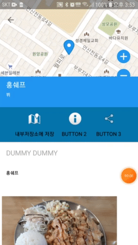
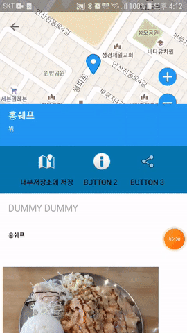

# 큰 비트맵을 효율적으로 로드 (InputStream)

- BitmapFactory.decode\* 에는 여러 타입을 비트맵으로 반환시켜줄 수 있도록한다
- 그중에서 InputStream을 비트맵으로 반환시키는 방법이다
- 그리고 효율적으로 로드하는 방법에 말한다

### 비트맵으로 변환

- InputStream으로 값을 bitmap변환하는 경우의 하나의 예로 웹 URL주소로 받아온 이미지 주소를 변환하여 비트맵 형식으로 변환에 이미지 뷰에 올리는 것일 것이다
- Retrofit으로 https://search.pstatic.net/common/?src=http%3A%2F%2Fblogfiles.naver.net%2Fdata42%2F2009%2F4%2F29%2F193%2F1600cat_12020_nobanaba.jpg&type=sc960_832 의 이미지를 변환할려면 다음과 같이 할 수 있다.


```kotlin
mRetrofit = Retrofit.Builder().apply {
                baseUrl("https://search.pstatic.net/common/?")
                addConverterFactory(GsonConverterFactory.create())
                addCallAdapterFactory(RxJava2CallAdapterFactory.create())
            }.build()
retrofit:service = mRetrofit.create()
```

```kotlin
@POST("src=http%3A%2F%2Fblogfiles.naver.net%2Fdata42%2F2009%2F4%2F29%2F193%2F1600cat_12020_nobanaba.jpg&type=sc960_832")
fun getImage(): Single<ResponseBody>
```

```kotlin
retrofit.getImage()
		.subscribeOn(Schedulers.io())
        .observeOn(AndroidSchedulers.mainThread())
		.subscribe({ //it:ResponseBody!
			Log.d(TAG, "성공")
			//BitmapFactory.decodeStream()를 이용하여 변환해주고 ImageView에 bitmap을 설정해준다
			imageView.setImageBitmap(BitmapFactory.decodeStream((it.byteStream())))
		},{	//it: Throwable!
			Log.d(TAG, "오류 = ${it}")
		})
```

### 효율적으로 로드

- 해당 소스의 해상도가 작다면 상관없지만 해상도가 커질수록 VIEW에서 해당 이미지를 보게되면 처리속도가 느려지는 것을 볼 수 있다


- 이러한 문제는 [android develper](https://developer.android.com/topic/performance/graphics/load-bitmap?hl=ko)에서 해결책을 알려주고 있다
- 해당 문서에는  BitmapFactory.decodeResource()에 대한 내용만 소개하고 있고  같은 방식으로 BitmapFactory.decode\* 메소드를 이용해 처리할 수 있다고 소개하고 있다
- 이미지 뷰에 setImageBitmap()하기 전 해당 IntputStream을 다음 메소드를 추가해 처리할 수 있도록 한다

```kotlin
retrofit.getImage()
		.subscribeOn(Schedulers.io())
        .observeOn(AndroidSchedulers.mainThread())
		.subscribe({ //it:ResponseBody!
			Log.d(TAG, "성공")
			imageView.setImageBitmap(decodeSampledBitmapFromResource(it.byteStream(), width, height))
		},{	//it: Throwable!
			Log.d(TAG, "오류 = ${it}")
		})
```

```kotlin
private fun decodeSampledBitmapFromResource(
        res: InputStream,
        reqWidth: Int,
        reqHeight: Int
    ): Bitmap {
        // First decode with inJustDecodeBounds=true to check dimensions
        return BitmapFactory.Options().run { //this: BitmapFactory.Option
            inJustDecodeBounds = true
            
            //InputStream을 BufferedInputStream을 만들어 처리해준다
            val bufferedInputStream = BufferedInputStream(res)
            bufferedInputStream.mark(bufferedInputStream.available())

            BitmapFactory.decodeStream(bufferedInputStream, null, this)

            bufferedInputStream.reset()
            // Calculate inSampleSize
            inSampleSize = calculateInSampleSize(this, reqWidth, reqHeight)
            // Decode bitmap with inSampleSize set
            inJustDecodeBounds = false

            BitmapFactory.decodeStream(bufferedInputStream, null, this)
        }!!
}
    
private fun calculateInSampleSize(options: BitmapFactory.Options, reqWidth: Int, reqHeight: Int): Int {
        // Raw height and width of image
        val (height: Int, width: Int) = options.run { outHeight to outWidth }
        var inSampleSize = 1

        if (height > reqHeight || width > reqWidth) {

            val halfHeight: Int = height / 2
            val halfWidth: Int = width / 2

            // Calculate the largest inSampleSize value that is a power of 2 and keeps both
            // height and width larger than the requested height and width.
            while (halfHeight / inSampleSize >= reqHeight && halfWidth / inSampleSize >= reqWidth) {
                inSampleSize *= 2
            }
        }
        return inSampleSize
}
```

- 개발자가 원하는 방식으로 처리 방식을 변경할 수 있다



- 하지만 구글에서는 Glide와 여러 이미지 처리 라이브러리를 추천하고 있다
- 커스텀방식으로 원할때는 위처럼 메소드를 만들어서 처리하면 된다.

