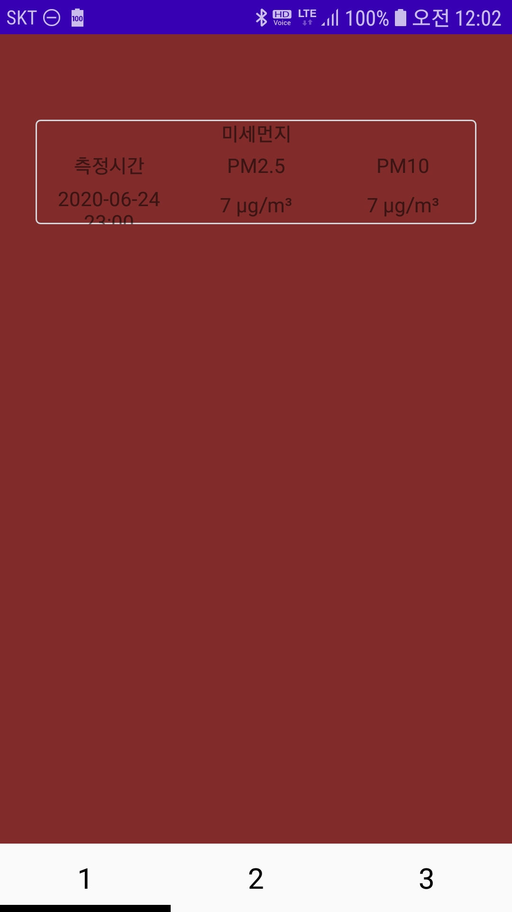

### REST API

- REST API를 이용한 공공데이터 포털 미세먼지 값 받아오기
- JSON형태로 받아와 VO객체에 매핑한다
- Chrome 확장 프로그램에서 json관련 프로그램을 설치하면 보다 보기 쉽게 만들어준다
- 다음과 값이 보기 편하게 나타내진다

#### JSON

```json
{
  "list": [
    {
      "_returnType": "json",
      "cityName": "안산시",
      "cityNameEng": "Ansan-si",
      "coValue": "0.2",
      "dataGubun": "",
      "dataTime": "2020-06-24 22:00",
      "districtCode": "031",
      "districtNumSeq": "015",
      "itemCode": "",
      "khaiValue": "",
      "no2Value": "0.011",
      "numOfRows": "10",
      "o3Value": "0.027",
      "pageNo": "1",
      "pm10Value": "17",
      "pm25Value": "9",
      "resultCode": "",
      "resultMsg": "",
      "searchCondition": "",
      "serviceKey": "",
      "sidoName": "경기",
      "so2Value": "0.003",
      "totalCount": ""
    }
 ],
  "parm": {
    "_returnType": "json",
    "cityName": "",
....
```
#### VO객체

- 사용자가 원하는 데이터를 받기 위해 json에서의 key값도 정확히 일치하는 VO객체를 만들어준다
```java
public class DustVO implements Serializable {
    String _returnType = "";
    String cityName = "";
    String cityNameEng = "";
    String coValue = "";
    String dataGubun = "";
    String dataTime = "";
    String districtCode = "";
    String districtNumSeq = "";
    String itemCode = "";
    String khaiValue = "";
    String no2Value = "";
    String numOfRows = "";
    String o3Value = "";
    String pageNo = "";
    String pm10Value = "";
    String pm25Value = "";
    String resultCode = "";
    String resultMsg = "";
    String searchCondition = "";
    String serviceKey = "";
    String sidoName = "";
    String so2Value = "";
    String totalCount = "";
    
    .....
    //getter, setter도 반드시 모두 만들어준다
    //하나에 변수에도 없을시 Error 발생, 실제로 경험함

```


- Android Service를 이용해서 REST API를 사용한다.
- 참고 : [https://github.com/vvvvvoin/TIL/blob/master/android/Service.md](https://github.com/vvvvvoin/TIL/blob/master/android/Service.md)
- 네트워크에 접속하게 되므로 Thread형태로 작동되야 한다.
- Service의 onStartCommand()에 관련 Thread를 정의한다.
#### SERVICE

```java
 @Override
    public int onStartCommand(Intent intent, int flags, int startId) {
        DustRestFulApiRunnable runnable = new DustRestFulApiRunnable();
        Thread t = new Thread(runnable);
        t.start();

        return super.onStartCommand(intent, flags, startId);
    }
```
- 편의성을 위해 inner class를 사용함
-  class DustRestFulApiRunnable implements Runnable {} 를 정의

```java
@Override
        public void run() {
            String url = "http://openapi.airkorea.or.kr/openapi/services/rest/ArpltnInforInqireSvc/getCtprvnMesureSidoLIst?" +
                    "serviceKey=개인에게 부여 되는 서비스키" +
                    "&numOfRows=한페이지에 표시하고자 하는 갯수" +
                    "&pageNo=몇 페이지" +
                    "&sidoName=공공데이터 포털에서 정한 지역명" +
                    "&searchCondition=공공데이터 포털 참조" +
                    //아래 값을 입력하면 xml에서 Json형태로 받아온다
                    "&_returnType=json";

            try {
            //URL객체에 접속하고자 하는 url를 넣는다
                URL obj = new URL(url);
                //URL connection 개방
                HttpURLConnection con = (HttpURLConnection) obj.openConnection();
                //연결에 대한 설정
                //대표적인 호출방식(GET, POST), 인증에 대한 처리
                con.setRequestMethod("GET");
                con.setRequestProperty("Content-type", "application/json");

                bufferedReader = new BufferedReader(new InputStreamReader(con.getInputStream()));

                String line;
                StringBuffer sb = new StringBuffer();
                while ((line = bufferedReader.readLine()) != null) {
                    sb.append(line);
                }
				//자원 반납
                bufferedReader.close();
                Log.v(TAG, sb.toString());


                ObjectMapper mapper = new ObjectMapper();
                //실제 위에 json파일을 받아오게 된다
                //현재는 list라는 key에 안산시에 대한 데이터들이 들어있다
                //numOfRows, pageNo 파라미터를 바꿀경우 더 많은 도시의 데이터를 받게 된다
                
                Map<String, Object> map =
                        mapper.readValue(sb.toString(), new TypeReference<Map<String, Object>>(){});
                //list라는 key에 있는 데이터(Object)를 받는다
                Object object = map.get("list");
                Log.v(TAG, object.toString());
				//받아온 Object 데이터를 String으로 변환
                String jsonStinrg = mapper.writeValueAsString(object);
                Log.i("test", jsonStinrg);
				//받아온 데이터가 여러개 일수 있으므로 VO객체 타입에 Arraylist를 정의하고 매핑시킨다
                ArrayList<DustVO> arrayList =
                        mapper.readValue(jsonStinrg, new TypeReference< ArrayList<DustVO>>() {});
                //원하는 데이터를 추출하는 VO객체정의
                DustVO resultData = new DustVO();
                //측정시간, pm2.5, pm10 데이터를 받는다.
                for(DustVO vo : arrayList){
                    resultData.setDataTime(vo.getDataTime());
                    resultData.setPm25Value(vo.getPm25Value());
                    resultData.setPm10Value(vo.getPm10Value());
                }

                Log.v(TAG, resultData.toString());

                Intent resultIntent = new Intent(getApplicationContext(), MainActivity.class);
                resultIntent.putExtra("resultData", resultData);
                resultIntent.addFlags(Intent.FLAG_ACTIVITY_NEW_TASK);
                resultIntent.addFlags(Intent.FLAG_ACTIVITY_CLEAR_TOP);
                resultIntent.addFlags(Intent.FLAG_ACTIVITY_SINGLE_TOP);
                startActivity(resultIntent);

            } catch (Exception e){
                e.printStackTrace();
            }
        }
```

> 모든 데이터를 VO객체에 정의한다는 번거러움이 존재
> 다른 JSON API를 써봤는데  Android Studio의 Gradle 문제로 잘 안됨
> JSONParson 를 추후에 적용해보겠음




