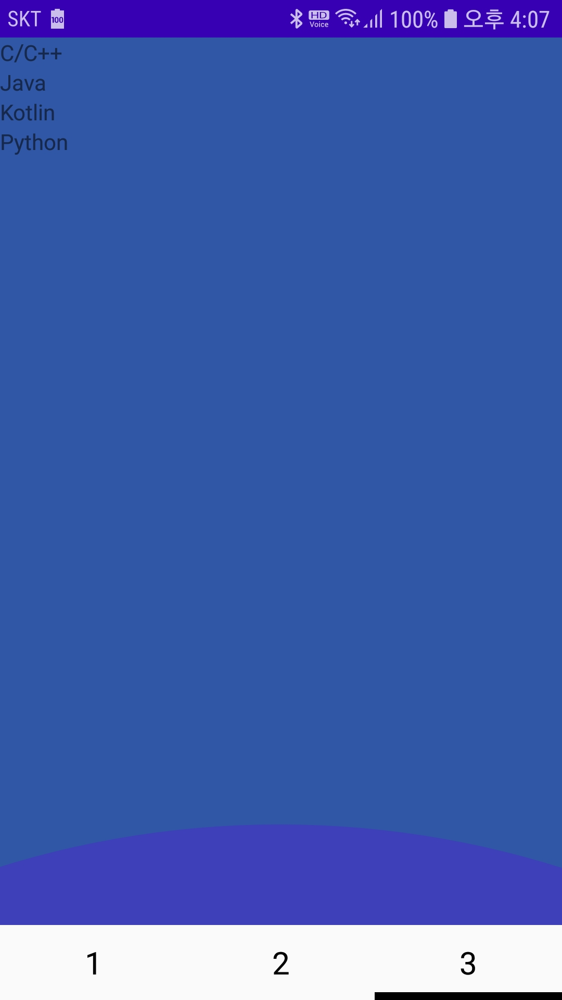

### RecyclerView

- ListView의 향상되고 유연한 버전인 RectclerView
- ListView의 상위 호환 위젯에 가깝다

#### ViewHolder
- RecyclerView는 ViewHolder를 통해 항목을 표시할 View를 관리하도록 설계됨
- RecyclerView는 화면에 표시되는 개수만큼 ViewHolder와 여분의 Viewholder를 기본생성하여 스크롤에 대비
- 스크롤 동작으로 사라지는(안보이는) 아이템을 ViewHolder에 새로 표시되는 아이템을 그리는데 재사용됨
- 대용량의 데이터라도 소수의 View를 이용해 표현가능


#### 사용하기
#### 1. dependencies
- Gradle에 RecyclerView추가
```
dependencies {
    ...
    implementation 'androidx.recyclerview:recyclerview:1.1.0'
    implementation 'com.google.android.material:material:1.1.0'
    implementation 'androidx.cardview:cardview:1.0.0'
    implementation 'com.android.support:cardview-v7:29.1.0'
    implementation 'com.android.support:recyclerview-v7:29.1.0'
}
```

#### 2. RecyclerView를 xml에 나타내기
- 표시를 원하는 Activity, fragment xml에 RecyclerView를 추가한다.
- list_item.xml
```xml
<?xml version="1.0" encoding="utf-8"?>
<LinearLayout xmlns:android="http://schemas.android.com/apk/res/android"
    android:layout_width="match_parent"
    android:layout_height="match_parent"
    android:background="#3057A5"
    android:clickable="true"
    android:orientation="vertical">

    <androidx.recyclerview.widget.RecyclerView
        android:id="@+id/recyclerView"
        android:layout_width="match_parent"
        android:layout_height="match_parent">
    </androidx.recyclerview.widget.RecyclerView>
</LinearLayout>
```

#### 3. Adapter, ViewHolder 만들기
- RecyclerView를 나타낼 java class를 만들어주고 RecyclerView.Adapter<RecyclerView.ViewHolder> 상속받는다.
```java
import androidx.recyclerview.widget.RecyclerView;

public class RecyclerViewAdapter extends RecyclerView.Adapter<RecyclerView.ViewHolder> {

    public RecyclerViewAdapter() {
    }

    @NonNull
    @Override
    public RecyclerView.ViewHolder onCreateViewHolder(@NonNull ViewGroup parent, int viewType) {
        return null;
    }

    @Override
    public void onBindViewHolder(@NonNull RecyclerView.ViewHolder holder, int position) {

    }

    @Override
    public int getItemCount() {
        return 0;
    }
}
```

#### 4. onCreateViewHolder()
- 리스트 내의 항목을 표시하기 위한 View를 생성하고, 해당 View를 관리할 ViewHolder를 생성하고 리턴
```java
public RecyclerView.ViewHolder onCreateViewHolder(@NonNull ViewGroup parent, int viewType) {
        Context context = parent.getContext();
        LayoutInflater inflater = (LayoutInflater) context.getSystemService(Context.LAYOUT_INFLATER_SERVICE);
        View view = inflater.inflate(R.layout.list_item, parent, false);
        ListItem listItem = new ListItem(view);
        return listItem;
    }
```

- ListItem이란 ViewHolder를 상속받은 사용자가 만든 클래스이다
- list_item.xml에 정의된 TextView를 찾고 변수로 지정한다
```java
public class ListItem extends RecyclerView.ViewHolder {
        public TextView textView;

        public ListItem(@NonNull View itemView) {
            super(itemView);
            this.textView = itemView.findViewById(R.id.textView);
        }
    }
```

#### 5. onBindViewHolder()
- 인자를 통해 전달된 ViewHolder 객체에 position에 기반한 데이터를 할당시킨다.
```java
@Override
    public void onBindViewHolder(@NonNull RecyclerView.ViewHolder holder, int position) {
        ((ListItem)holder).textView.setText(list.get(position));
    }
```

#### 6. Fragment에서 값 할당시켜주기
- 넘기고자 하는 데이터의 크기 또한 넘겨줘야한다.
- 넘겨준 사이즈에 따라 RecyclerView.Adapterd에 getItemCount()에게 값을 할당하다록 한다.
- 사이즈에 따라 onBindViewHolder(RecyclerView.ViewHolder holder, int position)에서 포지션 값이 변화되어 리스트 타입(사용자가 정의한 class)에 맞게 값을 할당 시켜준다
- 생성자를 통해서 size, list를 넘겨줌
```java
    @Override
    public View onCreateView(@NonNull LayoutInflater inflater, @Nullable ViewGroup container, @Nullable Bundle savedInstanceState) {
        Context context=container.getContext();
        view = inflater.inflate(R.layout.test_fragment3, container, false);

        ArrayList<String> list = new ArrayList<String>();
        list.add("C/C++");
        list.add("Java");
        list.add("Kotlin");
        list.add("Python");
        int size  = list.size();

        RecyclerView recyclerView = view.findViewById(R.id.recyclerView);
        LinearLayoutManager linearLayoutManager = new LinearLayoutManager(
                context, LinearLayoutManager.VERTICAL, false);
        RecyclerViewAdapter recyclerAdapter= new RecyclerViewAdapter(list, size);
        recyclerView.setLayoutManager(linearLayoutManager);
        recyclerView.setAdapter(recyclerAdapter);

        return view;
    }
    @Override
    public int getItemCount() {
        return size;
    }
```



#### viewType이란

1. getItemCount()
2. getItemViewType()
3. onCreateViewHolder()
4. onBindViewHolder()
의 순서대로 RecyclerView가 생성된다, getitemCount의 사이즈 만큼 반복실행
- getItemViewType()은 RecyclerVIew에 여러 종류의 Layout을 지정할 수 있도록 해준다
- 즉, activity, fragment에서 RecyclerVIew에 보낼 list에 int값으로 Layout을 구분할 값을 지정해준다
- 흐름에 따라 onCreateViewHolder()에서 조건문을 통해 viewType을 확인한다
- getItemViewType()에서 list가 갖는 viewType을 반환시킨다
```java
@Override
    public int getItemViewType(int position) {
        return list.get(position).getViewType();
    }
```

- 반환된 viewType은 onCreateViewHolder() 인자로 실행된다
```java
@Override
    public RecyclerView.ViewHolder onCreateViewHolder(@NonNull ViewGroup parent, int viewType) {
        context = parent.getContext();
        
        LayoutInflater inflater = (LayoutInflater) context.getSystemService(Context.LAYOUT_INFLATER_SERVICE);
        if (viewType == 1) {
           View view = inflater.inflate(R.layout.list_item, parent, false);
	        ListItem1 listItem = new ListItem1(view);
	        return listItem;
        } else if(viewType == 2){
            View view = inflater.inflate(R.layout.list_item, parent, false);
    	    ListItem2 listItem = new ListItem2(view);
	        return listItem;
        }
    }
```

> viewType을 확인할때에는 viewType class를 하나 만들어 final int로 저장하면 편리하다.
>
> ListItem1, ListItem2  2가지의 객체, 즉 다른 종류 레이아웃을 갖는 것으로 표시
>
> 이에 맞게 2가지의 클래스를 정의해준다

- 이에 따라 onBindViewHolder에서는 여러 종류의 타입에 holder가 넘어오게 된다.
- onBindViewHolder에서도 조건문을 통해 각각에 맞게 데이터를 기입한다

```java
@Override
    public void onBindViewHolder(@NonNull RecyclerView.ViewHolder holder, int position) {
	 if (holder instanceof ListItem1) {
        ((ListItem1)holder).textView.setText(list.get(position));
    }else if(holder instanceof ListItem2){
	    ((ListItem2)holder).textView.setText(list.get(position));
    }
```

> 예시에서는 같은 class로 하였음


참고 : [https://thepassion.tistory.com/294](https://thepassion.tistory.com/294)


