# Coroutine
- 코루틴은 비도익 프로그래밍을 처리할 수 있는 방법이다
- 기존의 Thread, AsyncTask, RxJAVA과 같은 기능을 수행한다
- 코루틴은 기본 스레드를 차단하여 앱이 응답하지 않게 만들 수 있는 장기 실행 작업(인터넷연결, DB처리 등)에 실행한다

## 기능
- 코루틴은 안드로이드 비동기 프로그래밍에 권장되는 방법이다.
- 다음 기능을 가지고 있다
	- 경량
	- 메모리 누수 감소
	- 기존 스레드와 달리 정지기능
	- 콘텍스르 전환이 쉽다(아래에 자세히 설명)

## 사용법
#### Gradle
- gradle에 다음을 추가한다
```
implementation "org.jetbrains.kotlinx:kotlinx-coroutines-android:1.3.0"
implementation "org.jetbrains.kotlinx:kotlinx-coroutines-core:1.3.0"
```

#### 기본
```kotlin
override fun onCreate(savedInstanceState: Bundle?) {
        super.onCreate(savedInstanceState)
        setContentView(R.layout.activity_main)

        GlobalScope.launch {
            Log.d(TAG, "Coroutine from thred = ${Thread.currentThread().name}")
        }
        Log.d(TAG, "from thred = ${Thread.currentThread().name}")
}
```
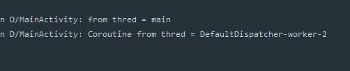

#### suspend
- 함수에 suspend를 붙임으로써 코루틴 내부에서만 동작하게 만들며 언제든 함수를 지연, 재개 할 수 있게 만든다
- 대표적으로 `delay` 그렇다
- delay함수에 suspend가 붙어있음을 알 수 있다

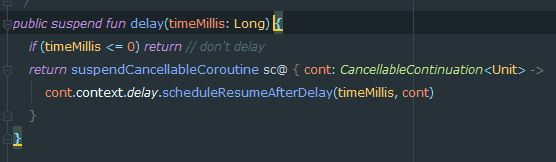

- 다음 코드를 실행하면 코루틴 내부에서는 delay가 2초가 두번 발생되어 4초후 데이터가 나타나게 된다

```kotlin
override fun onCreate(savedInstanceState: Bundle?) {
        super.onCreate(savedInstanceState)
        setContentView(R.layout.activity_main)

        GlobalScope.launch {
            val networkAnswer = networkProcess()
            val networkAnswer2 = networkProcess2()
            Log.d(TAG, networkAnswer)
            Log.d(TAG, networkAnswer2)
        }
    }

    suspend fun networkProcess() : String{
        delay(2000L)
        return "done networkProcess"
    }
    suspend fun networkProcess2() : String{
        delay(2000L)
        return "done networkProcess"
    }
}
```
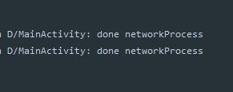

#### Swich Context
- 코루틴의 특징 중 하나가 비동기 처리과정 중 처리를 메인스레드나 다른 스레드로 내부에서 자유롭게 변경하여 사용할 수 있다

- 코루틴에서 사용하는 스레드의 종류는 다음과 같다
	- Main : 메인스레드에서 작업해야하는 것들에 사용한다
	- IO : 일반적으로 네트워크 작업, DB처리와 같이 백단에서 처리해야하는 것에 사용한다
	- Default : 크기가 큰 데이터를 다루고 필터링하는 등 무거운 연산작업에 사용된다

- 자유롭게 변경한다는 말은 스레드의 컨텍스트를 마음대로 지정할 수 있다는 말이다

- 다음과 같이 코루틴의 예약된 스레드로 처리방식을 지정할 수 있다

  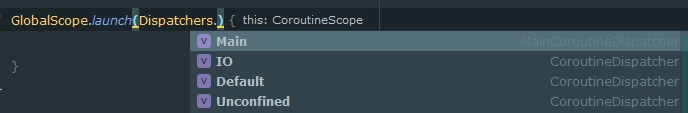

- 다음코드는 `Dispatchers.IO`로 처리하는 과정중 UI작업은 메인스레드에서 해야한다

- 그래서 `withContext(Dispatchers.Main)` 을 통해 컨텍스트를 변경하여 UI작업을 수행한다
```kotlin
override fun onCreate(savedInstanceState: Bundle?) {
        super.onCreate(savedInstanceState)
        setContentView(R.layout.activity_main)

        GlobalScope.launch(Dispatchers.IO) {
            val answer = networkProcess()
            Log.d(TAG, "CoroutinThread = ${Thread.currentThread().name}")
            withContext(Dispatchers.Main){
                Log.d(TAG, "withContext Thread = ${Thread.currentThread().name}")
                textView.text = answer
            }
        }
    }

    suspend fun networkProcess() : String{
        delay(2000L)
        return "done networkProcess"
    }
}
```
- 2초후 textView가 변경된다
- 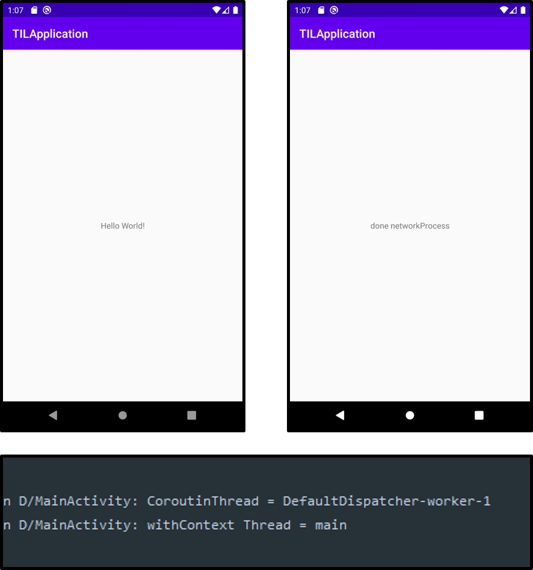

#### Join
- join은 하나의 job이 끝날때까지 기다리는 것을 의미한다
- GlobalScope.launch() 의 리턴타입은 `Job`이다
- 다음 코드는 job이 끝날때까지 기다리고 Log를 출력한다
```kotlin
override fun onCreate(savedInstanceState: Bundle?) {
        super.onCreate(savedInstanceState)
        setContentView(R.layout.activity_main)

        val job = GlobalScope.launch(Dispatchers.IO) {
            repeat(5){
                Log.d(TAG, "Coroutine is working ${it}")
                delay(1000L)
            }
        }

        GlobalScope.launch(Dispatchers.Main) {
            job.join()
            Log.d(TAG, "Main Thread is continuing")
        }
}
```
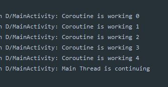

#### cancel

- cancel은 해당 job의 작업을 종료시킨다
- `job`이 5번의 결과를 보여줘야 하지만 2초 후 다른 `job`에서 이를 cancel()시킨다
```kotlin
override fun onCreate(savedInstanceState: Bundle?) {
        super.onCreate(savedInstanceState)
        setContentView(R.layout.activity_main)

        val job = GlobalScope.launch(Dispatchers.IO) {
            repeat(5){
                Log.d(TAG, "Coroutine is working ${it}")
                delay(1000L)
            }
        }

        GlobalScope.launch(Dispatchers.Main) {
            delay(2000L)
            job.cancel()
            Log.d(TAG, "Main Thread is continuing")
        }
}
```
- 기존과 다르게 중간에 작업이 취소됨을 확인할 수 있다

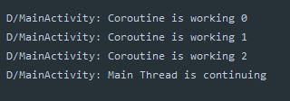


#### isActive
- 다음 코드는 `fib` 메소드를 실행 중 cancel하는 코드이다
- `fib` 메소드는 오래걸리는 작업이다
```kotlin
override fun onCreate(savedInstanceState: Bundle?) {
        super.onCreate(savedInstanceState)
        setContentView(R.layout.activity_main)

        val job = GlobalScope.launch(Dispatchers.IO) {
            Log.d(TAG, "start long calculation")
            for(i in 30..40){
                Log.d(TAG, "result for i = ${i} : ${fib(i)}")
            }
            Log.d(TAG, "end long calculation")
        }

        GlobalScope.launch(Dispatchers.Main) {
            delay(2000L)
            job.cancel()
            Log.d(TAG, "Cancel jog")
        }
    }

    fun fib(n:Int): Long{
        return if(n == 0) 0
        else if(n == 1) 1
        else fib(n - 1) + fib(n - 2)
    }
```
- 중간에 job을 cancel시켜도 40까지의 결과가 나타난다

  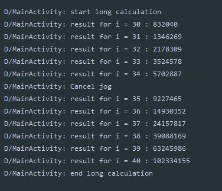
- 이유는 코루틴의 복잡한 계산을 하여 자신의 `job`이 cancel된 것을 매우 바뻐서 체크하지 못했기 때문이다
- 그래서 이런 복잡한 과정 중에는 수동으로 `isActive`를 통해 확인 시켜줘야 한다
```kotlin
....
val job = GlobalScope.launch(Dispatchers.IO) {
	Log.d(TAG, "start long calculation")
	for(i in 30..40){
		if(isActive){
			Log.d(TAG, "result for i = ${i} : ${fib(i)}")
		}
	}
	Log.d(TAG, "end long calculation")
}
....
```
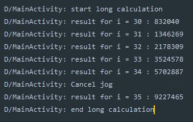


#### withTimeout
- 다른 job에서 cancel시키지 않고 내부적으로 시간을 계산하여 스스로 cancel되게 할 수 있다
- 다음 job은 3초뒤 스스로 중단된다

```kotlin
override fun onCreate(savedInstanceState: Bundle?) {
        super.onCreate(savedInstanceState)
        setContentView(R.layout.activity_main)

        val job = GlobalScope.launch(Dispatchers.IO) {
            Log.d(TAG, "start long calculation")
            withTimeout(3000L) {
                for (i in 30..40) {
                    if (isActive) {
                        Log.d(TAG, "result for i = ${i} : ${fib(i)}")
                    }
                }
            }
            Log.d(TAG, "end long calculation")
        }

    }
    fun fib(n: Int): Long {
        return if (n == 0) 0
        else if (n == 1) 1
        else fib(n - 1) + fib(n - 2)
    }
```

- 3초뒤 해당 job은 i = 40을 계산전에 중단되었다

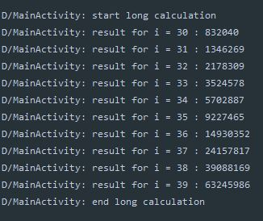

#### Async, Await
- 기존에 사용한 코드를 다시 본다
```kotlin
override fun onCreate(savedInstanceState: Bundle?) {
        super.onCreate(savedInstanceState)
        setContentView(R.layout.activity_main)

        GlobalScope.launch(Dispatchers.IO) {
            val time = measureNanoTime {
                val networkAnswer = networkProcess()
                val networkAnswer2 = networkProcess2()
                Log.d(TAG, networkAnswer)
                Log.d(TAG, networkAnswer2)
            }
            Log.d(TAG, "time is ${time} ms")
        }
    }

    suspend fun networkProcess() : String{
        delay(2000L)
        return "done networkProcess"
    }
    suspend fun networkProcess2() : String{
        delay(2000L)
        return "done networkProcess"
    }
}
```
- 위 코드를 실행하면 코루틴스코프에서 `networkProcess()` 메소드는 동시에 실행이되어 해당 작업을 수행하는 스레드는 4초간 정지하게 된다
- 이를 `measureNanoTime`이용하여 실제 시간을 출력해본다
- 그러면 약 4초의 시간이 걸린것을 확인할 수 있다.
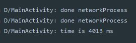

- 하지만 사용자 입장에서 동시에 실행이 되는 것이 아닌 싱크문제, 순차처리로 인해 `networkProcess()`메소드를 순서대로 실행시키고자 할 수 있다
- 그래서 기존에 배운 join()을 이용하여 다음과 같이 처리할 수 있다
```kotlin
GlobalScope.launch(Dispatchers.IO) {
            val time = measureTimeMillis {
                var answer1 : String? = null
                var answer2 : String? = null
                val job1 = launch { answer1 = networkProcess() }
                val job2 = launch { answer2 = networkProcess2() }
                job1.join()
                job2.join()
                Log.d(TAG, "${answer1}")
                Log.d(TAG, "${answer2}")
            }
            Log.d(TAG, "time is ${time} ms")
        }
```
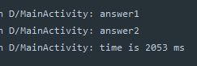
- 그러나 이런 코드는 권장하지 않는다
- 이런 처리를 위해 Async, Await 를 사용한다
- async는 launch와 마찬가지로 코루틴을 새롭게 시작하는데 launch의 리턴값이 unit인 반면에 async는 Deferred<T>로 나타난다
```kotlin
GlobalScope.launch(Dispatchers.IO) {
            val time = measureTimeMillis {
                val answer1 = async { networkProcess() }
                val answer2 = async { networkProcess2() }
                Log.d(TAG, "${answer1.await()}")
                Log.d(TAG, "${answer2.await()}")
            }
            Log.d(TAG, "time is ${time} ms")
        }
```
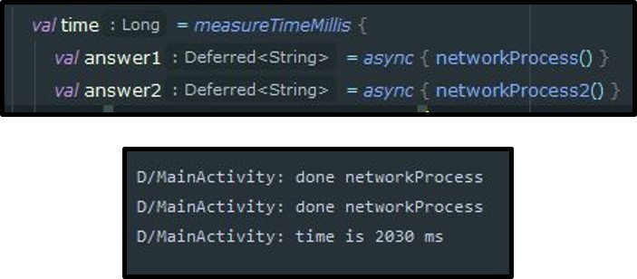

- 이는 async로 실행된 코루틴이 종료되고 이에 대한 반환값을 받으려면 await를 사용하는데 이때 Deferred안의 제너릭 값이 반환된다
- 이를 이용하여 복잡한 로직처리에서 유용하게 사용된다