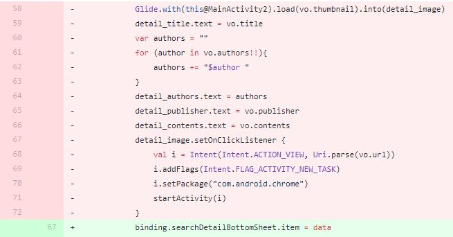

# DataBinding

## 개요

- DataBinding은 프로그래매틱 방식이 아닌 선언적 형식으로 레이아웃의 UI구성요소를 앱의 데이터 소스와 결합할 수 있는 라이브러리이다.

- `findViewById` 또는 `Kotlin Android Extensions`를 사용하는것보다 단순화되고 유지관리에 쉬워진다.
- 또한 레이아웃 파일에서 구성요소를 결합하면 activity에서 많은 UI 호출을 삭제할 수 있어 activity는 더욱 단순화된다.
- 결과적으로 앱 성능이 향상되며 메모리 누수 및 nullPointerException을 방지할 수 있다.

## DataBinding과 ViewBinding?

- ViewBinding은 `findViewById`를 대체하는 기능이다.
- `build.gradle`에 `module`에 viewBinding이 활성화 되있다면 앱에 존재하는 XML레이아웃 파일에 대한 바인딩 클래스가 자동으로 생성된다.
- 바인딩 클래스는 인스턴스에는 작성된 레이아웃에 ID가 파스칼표기법으로 작성되고 activity에서 이를 참조하여 사용하게 된다.

### 공통점

- dataBinding과 viewBinding은 바인딩 클래스를 생성하는 장점이 있다
- null안전 : 뷰를 직접 참조하여 생성하므로 유효하지 않은 뷰 ID로 인해 nullPointerException이 발생하지 않는다.
- 유형안전 : 바인딩 클래스에 있는 필드의 유형이 XML파일에서 참조하는 뷰와 일치한다.
- 결과적으로 `findViewById` 를 사용했을 때 코드사이에 비호환성으로 인해 런타임이 아닌 컴파일 시점에서 빌드 실패가 되는 것을 방지한다.

### 차이점

- viewBinding은 빠른 컴파일과 사용편의성에 장점이 있다
- 반변에 dataBinding은 레이아웃 변수, 표현식을 지원하고 동적 UI콘텐츠를 선언할 수 있다
- 그리고 양방향 데이터 결합을 지원한다.

> [레이아웃 변수 및 표현식](https://developer.android.com/topic/libraries/data-binding/expressions?hl=ko)

## 사용방법

### gradle

- `build.gradle`에 `module` 다음을 추가한다.

```gradle
apply plugin: 'kotlin-kapt'
android {
	...
	dataBinding {
		enabled = true
	}
}
```

- 추가적인 implementation코드는 없다.

### 레이아웃

- 기존과 차이점은 layout이 루트태그로 사용된다.
- 그리고 dataBinding할 클래스를 type과 name으로 선언해준다.

```xml
<?xml version="1.0" encoding="utf-8"?>
<layout xmlns:android="http://schemas.android.com/apk/res/android"
    xmlns:app="http://schemas.android.com/apk/res-auto"
    xmlns:tools="http://schemas.android.com/tools">

    <data>
        <variable
            name="item"
            type="com.example.test.sample" />
    </data>

    <FrameLayout
        android:layout_width="match_parent"
        android:layout_height="match_parent">

        <TextView
            android:id="@+id/tv_sample"
            android:layout_width="wrap_content"
            android:layout_height="wrap_content"
            android:layout_gravity="center"
            android:text="@{item.title}" />
    </FrameLayout>
</layout>
```

- layout태그안에는 하나의 레이아웃만 자식뷰로 가질 수 있다.
- 두 개 이상일 경우 오류가 발생한다.

- type의 sample클래스는 다음과 같다.

```kotlin
data class Sample(
	var title : String,
    var contents : String
)
```

- sample클래스를 item이라는 name으로 textView의 text에 @{item.title}로 바인딩 시켜주어 뷰에 표시해줄 수 있도록 한다.
- gradle과 레이아웃 세팅이 끝나면 안드로이드 스튜디오의 Build -> Rebuild Project를 클릭하여 바인딩 클래스를 생성해준다.

> 각 위젯마다 id를 반드시 부여해야 해야 xml파일이 BataBinding로 변환할 때 사용된다.
>
> 또한 해당 파일은 .java파일로 작성되기 때문에 기존 자바의 예약어를 id로 사용할 수 없게 된다.

### activity, fragment

- 리빌드가 끝나면 바인딩 클래스가 생성된다.
- 바인딩 클래스 이름은 xml이름이 activity_main.xml이었다면 ActivityMainBinding으로 생성된다.
- activity에서 바인딩 클래스를 사용하기 위해 다음과 같이 설정해준다.

```kotlin
class MainActivity : AppCompatActivity() {
    private lateinit var binding: ActivityMainBinding
    
    override fun onCreate(savedInstanceState: Bundle?) {
        super.onCreate(savedInstanceState)
        // ActivityMainBinding 는 자동적으로 생성된 바인딩클래스이다.
        binding = ActivityMainBinding.inflate(layoutInflater)
        val view = binding.root
        setContentView(view)
    }
}
```

- 보다 간단하게 다음과 같이 설정할 수 있다.

```kotlin
class MainActivity : AppCompatActivity() {
    private lateinit var binding: ActivityMainBinding
    
    override fun onCreate(savedInstanceState: Bundle?) {
        super.onCreate(savedInstanceState)
        binding  = DataBindingUtil.setContentView<ActivityMainBinding>(this, R.layout.activity_main)
    }
}
```

- 프래그먼트는 다음과 같이 한다.

```kotlin
private lateinit var binding : FragmentSampleBinding

override fun onCreateView(
	inflater: LayoutInflater, container: ViewGroup?,
	savedInstanceState: Bundle?
	): View {
		binding = DataBindingUtil.inflate(inflater, R.layout.fragment_sample, container, false)
    	val view = binding.root
		return view
}
```

- 이제 바인딩 인스턴스를 이용하여 데이터를 다음과 같이 바인딩 시킬 수 있다.

```kotlin
binding.tvSample.text = "테스트"	//<TextView> id = tv_sample
```

- 번거로운 과정을 거쳤지만 기존 `findViewById`를 사용하는 방법이 더 편리해 보일 수 있다.
- 하지만 바인딩하는 데이터가 많아지고 viewModel을 사용하게 되면 activity에 많은 코드가 작성되고 가독성이 떨이지고 실수를 하게 될 것이다.
- 또한 데이터 클래스에 수많은 데이터를 일일이 하나하나 하는 것이아닌  한번에 바인딩 시킬 수도 있다.
- 결과적으로 로직과 데이터를 분리시킴으로서 유지보수에 유리해진다.

### binding

- 이제 레이아웃에 선언해준 변수명`item`에 data class로 생성된 인스턴스를 바인딩 시켜준다.

```kotlin
binding  = DataBindingUtil.setContentView<ActivityMainBinding>(this, R.layout.activity_main)
val data = Sample("제목", "내용")
binding.item = data
```

- 단 한줄로 레이아웃에 값을 세팅해줄 수 있다.
- 만약 외부 API로 받아온 데이터값이 많다면 단 한줄로 바인딩이 가능하다.
- 각 컴포넌트에 id값이 필요없이 값을 설정해줄 수 있다.

```xml
<TextView
	android:layout_width="wrap_content"
	android:layout_height="wrap_content"
	android:layout_gravity="center"
	android:text="@{item.title}" />

<TextView
	android:layout_width="wrap_content"
	android:layout_height="wrap_content"
	android:layout_gravity="center"
	android:text="@{item.contents}" />
```

### custom binding

- 단 한줄로 값을 바인딩 시킬 수 있지만 해당 값이 이미지url일 경우는 어떻게 될까?
- imageView컴포넌트에는 해당 url을 확인하여 자동적으로 이미지가 바인딩되지는 않는다. 
- 그렇기에 이러한 문제는 커스텀 바인딩 어탭터 파일을 생성해줘야 한다.
- data class에 url변수를 추가한다.

```kotlin
data class Sample(
	var title : String,
    var contents : String,
    var imageUrl : String
)
```

- activity에서는 기존과 동일한 방법으로 바인딩 시켜준다.

```kotlin
binding  = DataBindingUtil.setContentView<ActivityMainBinding>(this, R.layout.activity_main)
val data = Sample("제목", "내용", "http://image.yes24.com/goods/74035266/800x0")
binding.item = data
```

- 그리고 바인딩 어탭터 코틀린 파일을 생성한다.
- 파일명은 개발자가 보기 편리하게 자유롭게 작성한다.

```kotlin
@BindingAdapter("bind_image")
fun bindImage(view: ImageView, url: String?) {
    Glide.with(view.context)
        .load(url)
        .into(view)
}
```

- 그리고 레이아웃 imageVIew에 `@BindingAdapter`의 값인 `app:bind_image`라는 속성을 추가한다.

```xml
<ImageView
	android:layout_width="250dp"
	android:layout_height="250dp"
	android:layout_gravity="center"
	android:layout_marginVertical="20dp"
	app:bind_image="@{item.imageUrl}"/>
```

- 이제 binding.item 으로 값을 매핑시켜주면 `app:bind_image`라는 속성을 바인딩 어탭터에서 찾아 이미지를 보여주게 된다.
  - 컴파일시 ActivityMainBindingImpl라는 클래스가 생성되어 setter메소드를 호출한다.

#### 바인딩 어탭터 주의사항

- 바인딩 어탭터의 메소드명도 자유롭게 작성할 수 있다.
- 하지만 매개변수의 첫번째에는 반드시 해당 속성값을 기입한 컴포넌트 타입이 위치해야한다.
- 위에서는 이미지 컴포넌트에 `app:bind_image`를 사용했으므로 첫번째 매개변수에는 ImageVIew타입이 와야한다.

### viewModel과 함께 사용하기

- dataBinding은 viewModel + liveData와 함께 사용하면 더욱 강력해진다.

- 생성된 이미지를 클릭하면 item에 존재하는 url로 접속하는 기능을 만들어 본다.
- viewModel class를 만들어 준다.

```kotlin
class MainViewModel() : ViewModel(){
    private val _openWep = MediatorLiveData<String>()
    val openWep : LiveData<String>
        get() = _openWep
    
    fun openWep(url : String){
        _openWep.value = url
    }
}
```

- 데이터 클래스에도 접속할 url데이터를 담을 수 있도록 한다.

```kotlin
data class Sample(
	var title : String,
    var contents : String,
    var imageUrl : String,
    var url : String
)
```

- 이전에 바인딩 어탭터를 만들면서 사용한 imageView 컴포넌트를 다음과 같이 수정한다.

```xml
<data>
	<variable
		name="item"
		type="com.example.test.Sample" />
	<variable
		name="viewModel"
		type="com.example.test.MainViewModel" />
</data>
....
<ImageView
	android:layout_width="250dp"
	android:layout_height="250dp"
	android:layout_gravity="center"
	android:layout_marginVertical="20dp"
	app:bind_image="@{item.imageUrl}"
	app:link="@{item.url}"
	app:viewModel="@{viewModel}"/>
....
```

- 바인딩 어탭도도 수정한다.

```kotlin
@BindingAdapter("bind_image", "link", "viewModel")
fun bindImage(
    view: ImageView, imageUrl: String?, url: String?, viewModel : MainViewModel 
) {
    Glide.with(view.context)
        .load(imageUrl)
        .into(view)
    
    view.setOnClickListener {
        if(url != null){
            viewModel.openWep(url)
        }
    }
}
```

#### 바인딩 어탭터 주의사항

- 바인딩어탭터 어노테이션에 값이 많아지게 어노테이션에 입력 순서와 메소드 매개변수와 일치하게 해야한다.
- 위의 예제에서는 `app:bind_image`에는 이미지url, `app:link`에는 url, `app:viewModel`에는 viewModel이 위치하게 된다.
- 또한 컴포넌트를 제외한 바인딩 되는 값(imageUrl, url)은 nullable로 해줘야한다.
- 그렇지 않으면 `Parameter specified as non-null is null: method kotlin.jvm.internal.Intrinsics.checkParameterIsNotNull, parameter {YOUR_PARAMETER_NAME}`오류가 발생한다.

- 하지만 viewModel과 viewModel의 라이브 데이터 변수는 예외다.

------------

- 그리고 activity에서 viewModel과 observer 콜백을 만들어 준다.

```kotlin
class MainActivity : AppCompatActivity() {
    private lateinit var binding: ActivityMainBinding
    private val viewModel: ViewModel by viewModel()		//koin
    
    override fun onCreate(savedInstanceState: Bundle?) {
        super.onCreate(savedInstanceState)
        binding  = DataBindingUtil.setContentView<ActivityMainBinding>(this, R.layout.activity_main)
        	.apply{
                //<data>태그에서 정의한 viewModel에 MainActivity에서 생성한 viewModel인스턴스를 알려준다.
				viewModel =this@MainActivity.viewModel
				lifecycleOwner = this@MainActivity2    //viewModel을 사용할지 lifecyclerOwner을 설정해줘야 한다.
            }
        
        viewModel.openWep.observe(this, Observer {
			val intent = Intent(Intent.ACTION_VIEW, Uri.parse(it))
			intent.addFlags(Intent.FLAG_ACTIVITY_NEW_TASK)
			intent.setPackage("com.android.chrome")
			try {
				startActivity(intent)
			} catch (e: ActivityNotFoundException) {
				Toast.makeText(this, "링크를 열수 없습니다.", Toast.LENGTH_SHORT).show()
			}
		})
        
    }	//end onCreate
}
```

> EventWrapper를 이용하여 만들어줘야 하지만 간단하게 만들었음

- 이제 이미지뷰를 클릭하면 바인딩 어탭터에 만든 클릭 리스너로 인해 viewModel의 openWeb메소드가 실행되고 _openWep값이 바뀌면 activity에서 이를 observe하여 해당 데이터를 가지고 chrome을 열게 된다.

## 결론

- dataBinding을 사용함으로써 activity와 fragment에 UI처리 코드가 크게 줄어들게 되고 앱 성능향상과 가독성이 커지게 되었다.
- 바인딩 클래스가 생성됨으로써 null, 타입에러 같은 문제들이 줄어들었다.
- 바인딩 어탭터와 viewModel를 사용함으로써 다양한 기능을 설계할 수 있게 되었다.
- MVVM 패턴과 함께 사용할 수 있다.
- 실제로 사용하여 기존코드가 단 한줄로 바뀐것을 볼 수 있다.



