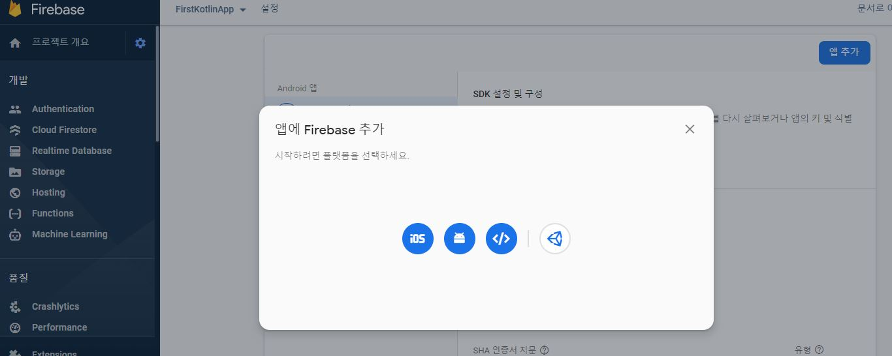
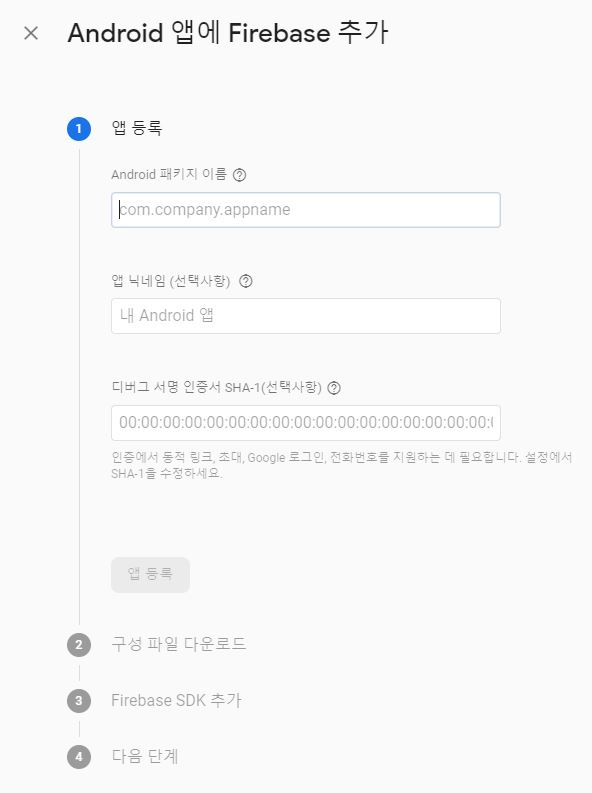
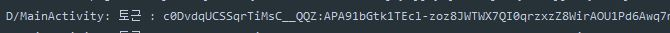
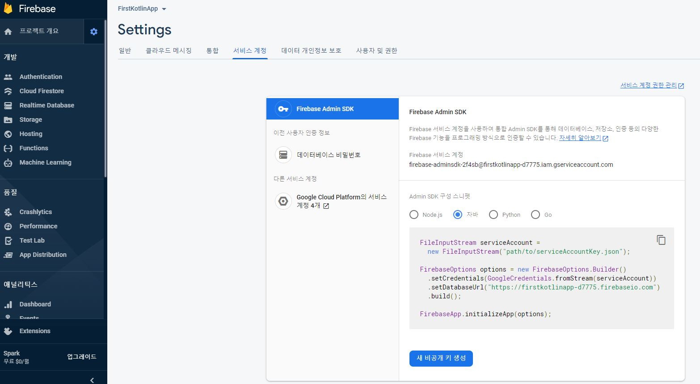
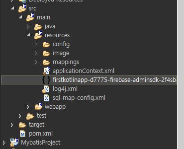
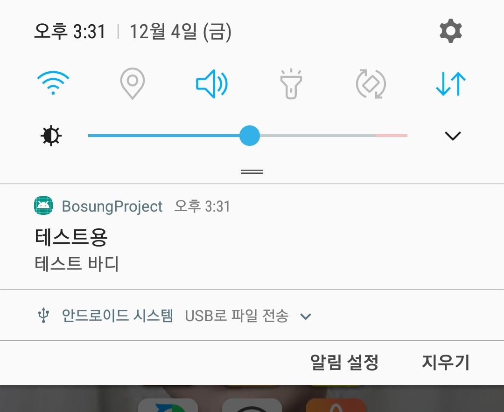

# FCM - Spring에서 안드로이드 Notification으로 알리기

- Firebase 클라우스 메시징은 뮤료로 메시지를 안정적으로 전송할 수 있는 교차 플랫폼 메시징 솔류션이다.
- 기능
  - 알림 메시지 또는 데이터 메시지 전송
  - 다양한 메시지 타켓팅
  - 클라이언트 앱에서 메시지 전송
- 여기서는 Spring에 요청이 오면 해당 요청을 스프링 컨트롤러에서 처리하여 안드로이드에 Notification으로 알림을 뜨게하는 방법을 소개한다.


## 사용법

### 1. firebase에 앱 추가하기



- firebase프로젝트를 만든 후 앱 추가 버튼을 눌러 안드로이드 아이콘을 클릭한다.



- 디버그 섬명 인증서 SHA-1은 안드로이드 스튜디오 화면에 우측상단에 gradle - Tasks - android - signingReport를 클릭하면 콘솔창에 SHA-1 값이 나온다.

- 그리고 앱 등록 버튼을 눌러 firebase 가이드를 따르도록 한다.

### 2. 안드로이드 gradle

- firebase가이드를 따랐으면 안드로이드 스튜디오 gradle에 다음이 추가 되있을 것이다
- 추가적으로 firebase-messaging-ktx을 추가한다.

```
//기존 가이드
implementation platform('com.google.firebase:firebase-bom:26.1.1')
implementation 'com.google.firebase:firebase-analytics-ktx'

//messaging도 추가
implementation 'com.google.firebase:firebase-messaging-ktx'
```

### 3. 안드로이드 Token값

- firebase로 부터 특정 값을 구분하여 알림을 보내기 때문에 단말이 갖는 token값을 알아야한다.
- onCreate에 다음 코드를 작성해 로그캣창에 토근값을 알아낸다.

```kotlin
    override fun onCreate(savedInstanceState: Bundle?)  {
        super.onCreate(savedInstanceState)
        setContentView(R.layout.activity_main)

        FirebaseMessaging.getInstance().token.addOnCompleteListener(OnCompleteListener { task ->
            if (!task.isSuccessful) {
                Log.w(TAG, "Fetching FCM registration token failed", task.exception)
                return@OnCompleteListener
            }
            // Get new FCM registration token
            val token = task.result
            // Log and toast
            Log.d(TAG, "토근 : $token")
        })
    }
```



### 4. firebase Admin SDK & dependency



- 파이어베이스 콘솔에 들어간 후 좌측 상단에 톱니바퀴 - 프로젝트설정 - 서비스 계정을 들어가면 다음 화면을 볼 수 있다.
- 그리고 새 비공개 키 생성을 통해 json타입의 파일을 다운 받는다.
- 다운 받은 파일은 Spring 프로젝트에 원하는 곳에 넣도록 한다.



- 그리고 Spring 프로젝트에서도 firebase를 이용할 수 있도록 pom.xml에 dependency를 추가해야한다.

```xml
<dependency>
	<groupId>com.google.firebase</groupId>
	<artifactId>firebase-admin</artifactId>
	<version>6.7.0</version>
</dependency>
```

### 5. FCM Class

- 이 내용은 컨트롤러에 넣어도 되지만 따로 클래스를 만들어 메소드를 정의하였다

```java
public class FcmUtil {
	public void send_FCM() {

		FileInputStream serviceAccount;
		try {
            // 4. firebase Admin SDK에서 샘플로 나온 코드를 복사하면 된다.
            // SDK파일의 절대경로를 입력한다.
			serviceAccount = new FileInputStream(
					"C:\\xxxxx\\xxxxxx\\src\\main\\resources\\firstkotlinapp-d7775-firebase-adminsdk-2f4sb-e45f9a2df9.json");

			FirebaseOptions options = new FirebaseOptions.Builder()
					.setCredentials(GoogleCredentials.fromStream(serviceAccount))
					.setDatabaseUrl("https://firstkotlinapp-d7775.firebaseio.com").build();
			// end 4. firebase Admin SDK에서 샘플로 나온 코드를 복사하면 된다.
            
			if (FirebaseApp.getApps().isEmpty()) {
				FirebaseApp.initializeApp(options);
			}
			
            // 3. 안드로이드 Token값에서 찾은 Token값을 이곳에 넣는다
			String registrationToken = "c0DvdqUCSSqrTiMsC__QQZ:APA91bGtk1TEcl-";
			
            // Message 객체에 어떤 옵션으로 Notification할지 설정한다
			Message msg = Message.builder()
					.setAndroidConfig(AndroidConfig.builder().setTtl(3600 * 1000)
							.setPriority(AndroidConfig.Priority.NORMAL)
							.setNotification(AndroidNotification.builder()
									.setTitle("테스트용")
									.setBody("테스트 바디")
									.build())
							.build())
					.setToken(registrationToken).build();
			
			String response;
            // 실제로 msg를 보내는 코드
			response = FirebaseMessaging.getInstance().send(msg);
			System.out.println("Successfully sent message: " + response);
            
		} catch (FirebaseMessagingException e) {
			e.printStackTrace();
		} catch (FileNotFoundException e) {
			e.printStackTrace();
		} catch (IOException e) {
			e.printStackTrace();
		}
	}
}
```

> 추가옵션은 https://firebase.google.com/docs/reference/fcm/rest/v1/projects.messages?hl=ko#Message 에서 찾아볼 수 있다.

### 6. Spring Controller

- 스프링 컨트롤러는 요청 URL에 맞게 FCM class 객체 메소드를 실행 시켜줄 수 있도록 한다.
- GET, POST방식을 이용해 매개변수를 send_FCM()메소드에 넣어 DB를 활용해 특정 기기에 전달할 수 있도록 만들 수 있다.

```java
@RequestMapping(value = "/notifytest")
public String notifyTest(){
	FcmUtil fcm = new FcmUtil();
	fcm.send_FCM();
	return "";
}
```


## 결과


- 이 방법은 Token값으로 특정 기기에게만 notification하는 것이고 https://firebase.google.com/docs/cloud-messaging/send-message?hl=ko 을 통해서 여러 기기, 특정주제 등 다양한 방식이 있다.
- 또한 포그라운드, 백그라운드에 따른 설정도 추가할 수 있다.