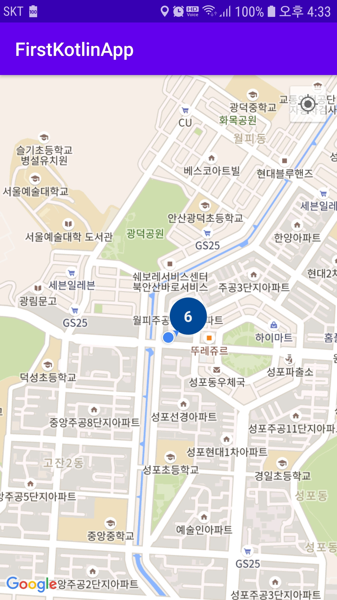
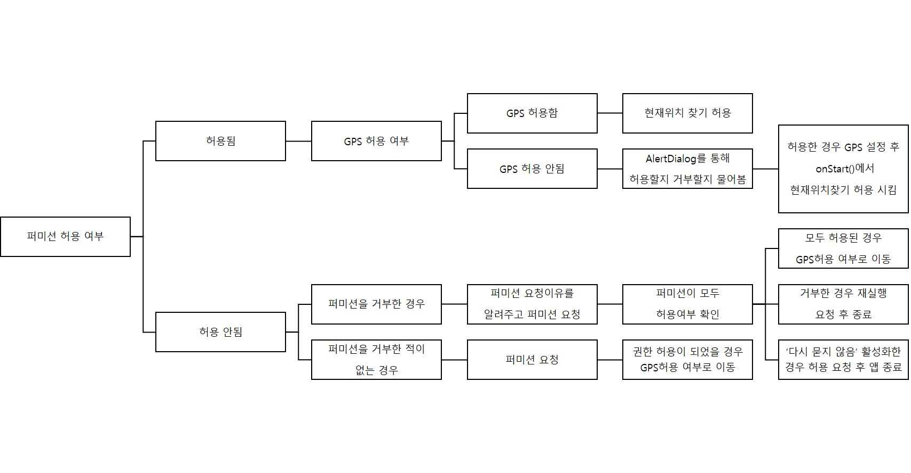

## Google Map 현재위치 찾기, 퍼미션

- GPS 기반으로 자신의 위치를 찾기 위해서는 2가지 퍼미션이 필요하다
	- `ACCESS_FINE_LOCATION`, `PERMISSION_GRANTED`
- 2가지 퍼미션에 대한 권한설정과 자신위 위치에 찾는 방법을 설명한다


### Permission

- AndroidManifest.xml에 다음을 추가한다

```xml
<uses-permission android:name="android.permission.ACCESS_FINE_LOCATION" />
<uses-permission android:name="android.permission.ACCESS_COARSE_LOCATION"/>
```

- onCreate()에서 `mapFragment.getMapAsync(this)` 호출 후 `onMapReady()`가 실행되는데 이때에 퍼미션과 초기 설정을 적용한다
- 퍼미션 여부를 묻기전 초기 위치를 정하지 않으면 이상한곳으로 표시가 되므로 초기 보여지는 위치를 설정한다.
```kotlin
 private fun setDefaultLocation() {
        //초기 위치, Seoul
        val SEOUL = LatLng(37.564441, 126.977072)
        val cameraUpdate = CameraUpdateFactory.newLatLngZoom(SEOUL, 15f)
        mMap?.moveCamera(cameraUpdate)
}
```

- 퍼미션은 설정은 다음과 같다
- 전역변수에 퍼미션값을 가지는 리스트를 정의해준다
- onMapReady() 메소드 실행 후 초기 위치를 서울로 나타낸 후 퍼미션관련 설정을 진행해준다

```kotlin
class TestActivity : AppCompatActivity(){

	var REQUIRED_PERMISSIONS = arrayOf<String>(
		Manifest.permission.ACCESS_FINE_LOCATION,
		Manifest.permission.ACCESS_COARSE_LOCATION
	)
    
    override fun onMapReady(googleMap: GoogleMap) {
        mMap = googleMap
        setDefaultLocation()
        
        val hasFineLocationPermission = ContextCompat.checkSelfPermission(this, Manifest.permission.ACCESS_FINE_LOCATION)
        val hasCoarseLocationPermission = ContextCompat.checkSelfPermission(this, Manifest.permission.ACCESS_COARSE_LOCATION)
        
        if (hasFineLocationPermission == PackageManager.PERMISSION_GRANTED &&
            hasCoarseLocationPermission == PackageManager.PERMISSION_GRANTED   ) {
            //퍼미션 허용이 되어있으면 기존 로직 수행
        }else {
            //퍼미션 요청을 허용한 적이 없다면 퍼미션 요청이 필요합니다. 2가지 경우가 있습니다.
            // 1. 사용자가 퍼미션 거부를 한 적이 있는 경우에는
            if (ActivityCompat.shouldShowRequestPermissionRationale(this, REQUIRED_PERMISSIONS[0])) {
                // 요청을 진행하기 전에 사용자가에게 퍼미션이 필요한 이유를 설명해줄 필요가 있습니다.
                Snackbar.make(mLayout, "이 앱을 실행하려면 위치 접근 권한이 필요합니다.",
                    Snackbar.LENGTH_INDEFINITE).setAction("확인"){
                        ActivityCompat.requestPermissions(this, REQUIRED_PERMISSIONS, PERMISSIONS_REQUEST_CODE)
                }.show();

            } else {
                // 2. 사용자가 퍼미션 거부를 한 적이 없는 경우에는 퍼미션 요청을 바로 합니다.
                // 요청 결과는 onRequestPermissionResult에서 수신됩니다.
                ActivityCompat.requestPermissions( this, REQUIRED_PERMISSIONS, PERMISSIONS_REQUEST_CODE);
            }
            ......
        }
        
	override fun onRequestPermissionsResult(permsRequestCode: Int, permissions: Array<String>, grandResults: IntArray) {
		if (permsRequestCode == PERMISSIONS_REQUEST_CODE && grandResults.size == REQUIRED_PERMISSIONS.size) {
            // 요청 코드가 PERMISSIONS_REQUEST_CODE 이고, 요청한 퍼미션 개수만큼 수신되었다면
            var check_result = true
            // 모든 퍼미션을 허용했는지 체크합니다.
            for (result in grandResults) {
                if (result != PackageManager.PERMISSION_GRANTED) {
                    check_result = false
                    break
                }
            }

            if (check_result) {
                // 퍼미션을 허용했다면 퍼미션 설정 이후의 로직을 수행합니다
            } else {
                // 거부한 퍼미션이 있다면 앱을 사용할 수 없는 이유를 설명해주고 앱을 종료합니다.2 가지 경우가 있습니다.
                if (ActivityCompat.shouldShowRequestPermissionRationale(this,REQUIRED_PERMISSIONS[0])|| ActivityCompat.shouldShowRequestPermissionRationale(this, REQUIRED_PERMISSIONS[1])) {
                    // 사용자가 거부만 선택한 경우에는 앱을 다시 실행하여 허용을 선택하면 앱을 사용할 수 있습니다.
                    Snackbar.make(
                        mLayout, "퍼미션이 거부되었습니다. 앱을 다시 실행하여 퍼미션을 허용해주세요. ",
                        Snackbar.LENGTH_INDEFINITE
                    ).setAction("확인") { finish() }.show()
                } else {
                    // "다시 묻지 않음"을 사용자가 체크하고 거부를 선택한 경우에는 설정(앱 정보)에서 퍼미션을 허용해야 앱을 사용할 수 있습니다.
                    Snackbar.make(
                        mLayout, "퍼미션이 거부되었습니다. 설정(앱 정보)에서 퍼미션을 허용해야 합니다. ",
                        Snackbar.LENGTH_INDEFINITE
                    ).setAction("확인") { finish() }.show()
                }
            }
        }
    }
}
```

> 권한 허용은 0, 거부는 -1로 나타내어진다

- 권한 설정이 완료가 되었으면 GPS활성 여부에 대해 설정을 물어봐야 한다

```kotlin
private val GPS_ENABLE_REQUEST_CODE = 2001

override fun onMapReady(googleMap: GoogleMap) {
	mMap = googleMap
	setDefaultLocation()
    
    //퍼미션 설정 완료 후---------------
    
    //GPS설정여부는 2가지 경우가 존재한다
    //GPS를 설정 하지 않았을 경우
	if (!checkLocationServicesStatus()) {
		showDialogForLocationServiceSetting()
	}else{//GPS설정을 한 경우
        //퍼미션 체크를 다시한 후 isMyLocationEnabled true로 변환하여 자신의 위치 찾기를 허용시킨다
		if (checkPermission()) mMap?.isMyLocationEnabled = true
	}
}

//GPS활성화가 안되었을 경우 설정버튼을 클릭하면 GPS설정화면을 보여주거나 취소버튼으로 취소한다
private fun showDialogForLocationServiceSetting() {
	val builder: AlertDialog.Builder = AlertDialog.Builder(this)
	builder.setTitle("위치 서비스 비활성화")
	builder.setMessage("앱을 사용하기 위해서는 위치 서비스가 필요합니다."+ "위치 설정을 수정하실래요?")
	builder.setCancelable(true)
	builder.setPositiveButton("설정") { dialog, id ->
		val callGPSSettingIntent = Intent(Settings.ACTION_LOCATION_SOURCE_SETTINGS)
		startActivityForResult(callGPSSettingIntent, GPS_ENABLE_REQUEST_CODE)
	}
	builder.setNegativeButton("취소"
	) { dialog, id -> dialog.cancel() }
	builder.create().show()
}

//permission관련 boolean 타입 리턴
private fun checkPermission(): Boolean {
	val hasFineLocationPermission = ContextCompat.checkSelfPermission( this, Manifest.permission.ACCESS_FINE_LOCATION)
	val hasCoarseLocationPermission = ContextCompat.checkSelfPermission( this, Manifest.permission.ACCESS_COARSE_LOCATION)
	return hasFineLocationPermission == PackageManager.PERMISSION_GRANTED && hasCoarseLocationPermission == PackageManager.PERMISSION_GRANTED
}

//GPS활성화에 대한 boolean 타입 리턴
private fun checkLocationServicesStatus(): Boolean {
	val locationManager: LocationManager = getSystemService(Context.LOCATION_SERVICE) as LocationManager
	return (locationManager.isProviderEnabled(LocationManager.GPS_PROVIDER) || locationManager.isProviderEnabled(LocationManager.NETWORK_PROVIDER))
}

override fun onActivityResult(requestCode: Int,resultCode: Int,data: Intent? ) {
	super.onActivityResult(requestCode, resultCode, data)
	when (requestCode) {
		GPS_ENABLE_REQUEST_CODE ->
		//사용자가 GPS 활성 시켰는지 검사
		if (checkLocationServicesStatus()) {
			Log.d(TAG, "onActivityResult : GPS 활성화 되있음")
			return
		}
	}
}

//onStart는 퍼미션 체크 후 GPS설정이 안됬을 경우 GPS설정창이 나타나고 설정 후 애플리케이션으로 돌아왔을때에
//퍼미션체크과 GPS활성화 여부를 체크하여 isMyLocationEnabled에 대한 설정을 변경한다
override fun onStart() {
	super.onStart()
	Log.d(TAG, "onStart")
	if (checkPermission()) {
        if(checkLocationServicesStatus()) {
			if (mMap != null) mMap?.isMyLocationEnabled = true
        }
	}
}
```


### 현재위치 찾기

- isMyLocationEnabled true로 설정후

```kotlin
override fun onMapReady(googleMap: GoogleMap) {
	mMap = googleMap
	setDefaultLocation()
    
    //퍼미션 설정 완료 후---------------
    
    //GPS설정여부는 2가지 경우가 존재한다
    //GPS를 설정 하지 않았을 경우
	if (!checkLocationServicesStatus()) {
		showDialogForLocationServiceSetting()
	}else{//GPS설정을 한 경우
        //퍼미션 체크를 다시한 후 isMyLocationEnabled true로 변환하여 자신의 위치 찾기를 허용시킨다
		if (checkPermission()) mMap?.isMyLocationEnabled = true
	}
    //자신의 위치를 나타내는 버튼UI를 나태내주도록 한다
    mMap?.uiSettings?.isMyLocationButtonEnabled = true
}
```

- `isMyLocationButtonEnabled = true`로 하지 않아도 `isMyLocationEnabled = true`이면 버튼UI가 나타난다
- 단 `isMyLocationButtonEnabled = false`일 경우 나타나지 않는다
- 현재위치 버튼이 우측 상단이 활성화 되어있고 클릭시 GPS기반으로 현재위치를 나타내준다




### 전체적인 흐름도



참고 : [https://webnautes.tistory.com/647](https://webnautes.tistory.com/647),

 [https://imleaf.tistory.com/16?category=825355](https://imleaf.tistory.com/16?category=825355)


