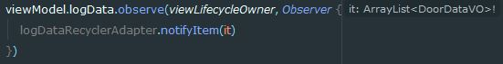

# Koin으로 DI적용

## DI?

- `DI, Dependency Injecttion` 의존성 주입을 의미한다.
  - 의존성 주입은 간단하게 테스팅을 하기 위해서 한다.
- 의존성이란 클래스간 객체로 참조가 되는 것을 말한다.
- 간단한 예는 다음과 같다.

```kotlin
class Engine {}

class SuperCar{
    val engine = Engine() 
    ...
}
class sportCar{
    val engine = Engine() 
    ...
}

fun main(){
    val superCar = SuperCar()
    val sportCar = SportCar()
}
```

- 위 코드에서는 `superCar`, `sportCar`모두 `Engine`에 의존성을 가지고 있다.
- 하지만 `Engine`클래스에 변화가 생긴다면 의존성을 갖는 모든 클래스가 변경되어야 한다.
- 즉 `superCar`, `sportCar` 두 클래스 내에 `Engine` 객체를 수정해야한다.

- 소규모 프로젝트일 경우 다음과정은 큰 작업이 아닐지라도 대형 프로젝트일 경우 해당 작업을 수행하는데 힘들것이다.
- 마찬가지로 `EngineTest` 클래스를 새로만들어 테스트하게 된다면 똑같은 문제에 직면하게 된다.
- 이 문제에 DI를 적용하면 다음과 같이 된다.

```kotlin
class Engine {}
class SuperCar(val engine : Engine){
    ...
}
class sportCar(val engine : Engine){
    ...
}

fun main(){
    val engine = Engine()
    val superCar = SuperCar(engine)
    val sportCar = SportCar(engine)
}
```

- `main`에서 객체를 생성 후 생성자를 통해 각 클래스에 의존성을 주입시켰다.
- 이제 `EngineTest` 클래스를 새롭게 만들어도 테스트하기 쉬워졌다.

## DI 장점

- 코드의 가독성과 재사용성을 높여준다.
- 단위 테스트하기 편리하다.
- 객체 간의 의존관계를 직접 설정할 수 있다.
- 객체 간의 결합도를 낮출 수 있다.

## Koin

- 이러한 `DI`작업을 android에서 도와주는 것이 `Koin`이다

### 설치

- gradle

```
// koin
implementation "org.koin:koin-androidx-scope:1.0.2"
implementation "org.koin:koin-androidx-viewmodel:1.0.2"
testImplementation 'org.koin:koin-test:1.0.1'
```

### 모듈 생성

- 의존성을 주입시킬 객체(모듈)를 어떻게 어디에 주입시킬지 .kt 파일을 만든다.

```kotlin
var retrofitPart = module {
    single<MyService> {
		Retrofit.Builder()
		.baseUrl(BASE_URL)
		.addCallAdapterFactory(RxJava2CallAdapterFactory.create())
		.addConverterFactory(GsonConverterFactory.create())
		.build()
		.create(MyService::class.java)
    }
}

var modelPart = module {
    factory<RetrofitRepository> {
        RetrofitRepository(get())
    }
}

var viewModel = module {
    viewModel {
        LogViewModel(get())
    }
}

var myDiModule = listOf(retrofitPart, modelPart, viewModel)
```

- module{ } 내부에는 `single`, `factory`, `viewModel` 3가지로 나뉜다.
  - `single`은 의존성을 주입하는 객체를 싱글톤 방식으로 생성하여 앱 실행 중 하나의 객체만 생성된다.
    - 위 코드에서는 retrofit을 싱글톤으로 사용한 것이다.
  - `factory`는 다른 클래스에서 해당 객체를 필요로 한다면 새롭게 생성하여 의존성을 주입시킨다.
  - `viewModel`은 ViewModel을 만든다.


  - LogViewModel(get()) 에서 get()은 실제 LogViewModel에 맞는 의존성 객체를 찾아서 매핑해준다.

> DI, koin이 없을 경우 주석처럼 사용했었다


- 그러면 `factory`에서 RetrofitRepository 클래스를 생성하는데 마찬가지로 MyService 의존성을 찾아 매핑된다.

- 마지막으로 module들을 묶은 변수를 선언해준다.

### 모듈 등록

- module들을 묶은 변수를 이용하여 모듈을 등록시켜줘야 한다. (일일이 등록해줘도 된다)
- 모듈은 Application 클래스의 `onCreate`에 `startKoin`에 바인딩 시켜준다.

```kotlin
class MyApplication : Application() {
    override fun onCreate() {
        super.onCreate()
        startKoin(applicationContext, myDiModule)
    }
}
```

- 그리고 Application 클래스를 생성했다면 manifest.xml에 등록해야한다.

```xml
<application
	android:name=".MyApplication"
```

### 의존성 주입

- 이제 등록한 모듈을 주입받아 사용할 수 있게 되었다.
- 등록된 모듈을 사용하기 위해서는 `by inject()`를 이용하여 주입할 수 있다
- viewModel인 경우는 `viewModel()`를 사용한다.


- viewModel은 기존 주석처럼 viewMode을 초기화해줬지만 `DI`를 해줬기에 다음과 같이 사용할 수 있다.



## Koin의 특징

### 장점

- 러닝커브가 Dagger에 비해 낮다
- Kotlin환경에 매우 쉬움
- ViewModel 의존성 주입을 사용할 수 있는 라이브러리가 존재

### 단점

- Dagger와 달리 런타임 에러가 발생할 수 있다
- Activity나 Fragment, Service등이 아닌 곳에서 사용하기 위해서는 생성자로 넘기거나 별도의 구현이 필요하다. (`Engine`, `SuperCar`, `SportCar` 처럼)