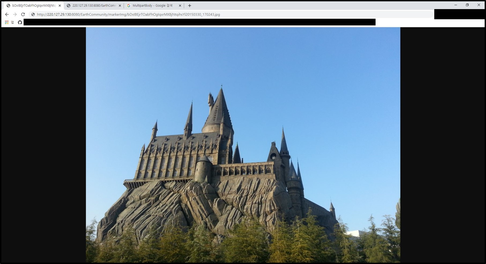
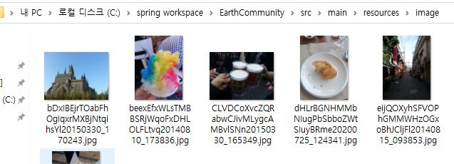

# Retrofit + OkHttp3를 이용하여 Spring 서버에 파일전송하기

- OkHttp3에서 제공하는 MultipartBody.part를 이용하여 안드로이드에서 이미지를 선택하고 이를 객체와 함게 retrofit으로 Spring서버에서 받고 Spring에서 처리하는 방법을 소개한다.
- [이전](https://github.com/vvvvvoin/TIL/blob/master/android/kotlin/Retrofit2%20%2B%20RxJAVA%20%2B%20OkHttp3.md)에서 했던 것의 연장선이되므로 이전 글을 참조한다.

## Spring

- 스프링 컨트롤러에서는 객체만 넘어오거나 객체와 파일이 함께 넘어노는 경우를 나뉘어 설계한다.
- 시작전 몇가지 설정을 해야한다.

### dependency

```xml
<dependency>
	<groupId>commons-fileupload</groupId>
	<artifactId>commons-fileupload</artifactId>
	<version>1.3.3</version>
</dependency>
```

### presentaion-layer.xml 혹은 servlet-context.xml

- 전송되는 파일 크기에 맞게 value값을 지정한다.
- 추가적으로 업로드 경로를 지정해준다

```xml
<bean id="multipartResolver" class="org.springframework.web.multipart.commons.CommonsMultipartResolver">
	<property name="maxUploadSize" value="100000000"></property>
</bean>

<bean id="uploadPath" class="java.lang.String">
	<constructor-arg value="C:\\workspace\\project-name\\src\\main\\resources\\image" />
</bean>
```

### server

- 사용하는 서버가 Tomcat이라면 해당 서버 프로젝트 config에 server.xml에 다음을 추가한다.
- 다음 설정을 추가하면 이미지에 접근할때 uri에 /project-name/img/xxxxx.jpg의 형태로 접근할 수 있다.
- 실제 서버의 로컬에 접근하는 형태이다

```xml
<Context docBase="C:\workspace\project-name\src\main\resources\image" path="/project-name/img" reloadable="true"/>
```

### Controlor

- 여기서 중요한 것은 @RequestPart의 value의 값을 기억해야한다.
- 안드로이드에서 서버에 맞게 지정해줘야 이미지가 있는지를 확인할 수 있기 떄문이다.
- 그리고 required를 false하여 해당 fileList가 없어도 컨트롤러가 수행될 수 있게 한다.
- presentaion-layer.xml or servlet-context.xml에서 정의한 업로드 경로도 지정해준다.

```java
@Resource(name = "uploadPath")
String uploadPath;

@RequestMapping("/insert.do")
public String insert(@RequestPart(value = "image",  required = false) List<MultipartFile> fileList, VO_Object vo) throws IOException{
    
	....
    // 이미지 리스트가 있을 경우 수행
	if (fileList != null) {
		String randStr;
		for (MultipartFile file : fileList) {
            // RandomStringBuilder는 외부 라이브러리르 사용함
            // 이미지를 랜덤글자 32자로 이용하여 파일명을 정함
			randStr = new RandomStringBuilder().putLimitedChar(RandomStringBuilder.ALPHABET).setLength(32).build();
			String fileNmae = file.getOriginalFilename();
			file.transferTo(new File(uploadPath, randStr + fileNmae));
		}
	}
	....
}
```

- 일반적으로 이미지, 파일은 집적 DB에 저장하지 않고 저장된 위치를 DB에 저장한다.
- 그리고 해당 이미지, 파일이 필요할 경우 DB에 주소값을 불러와 url 형태로 반환시킨다.

## Android

- kotlin으로 사용했고 [이곳](https://github.com/vvvvvoin/EC-Project)에서 사용한 코드를 발취했다.

### Retrofit Service

```kotlin
@Multipart
@POST("EarthCommunity/insert.do")
fun putDataWithImage(
	@Part("data") data: String,
	@Part file : List<MultipartBody.Part>?
) : Single<VO_Object>
```

### ImageSelectActivity

- 버튼 이벤트 등을 통해 갤러리를 열어 이미지를 선택할 수 있도록 한다.
- 선택된 이미지는 onActivityResult에서 imageList에 담도록 한다.

```kotlin
private var imageList = arrayListOf<Uri>()

override fun onCreate(savedInstanceState: Bundle?) {
	super.onCreate(savedInstanceState)
    ....
	val intent = Intent(Intent.ACTION_OPEN_DOCUMENT)
	intent. setDataAndType(android.provider.MediaStore.Images.Media.EXTERNAL_CONTENT_URI, "image/*")
	//다수선택 허용
	intent.putExtra(Intent.EXTRA_ALLOW_MULTIPLE, true)
	startActivityForResult(intent, OPEN_GALLERY)
    ....
}
override fun onActivityResult(requestCode: Int, resultCode: Int, data: Intent?) {
	super.onActivityResult(requestCode, resultCode, data)
	when (requestCode) {
		OPEN_GALLERY -> let {
		if (resultCode == Activity.RESULT_OK ) {
			imageList.clear()
			if(data?.data != null){
				imageList.add(data.data!!)
			}else{
				for (i in 0 until data?.clipData?.itemCount!!) {
					imageList.add(data.clipData?.getItemAt(i)?.uri!!)
				}
			}
		}else if(resultCode == Activity.RESULT_CANCELED){
			Toast.makeText(this, "취소함", Toast.LENGTH_SHORT).show()
		}else{
			Toast.makeText(this, "오류 발생", Toast.LENGTH_SHORT).show()
		}
	}
}
```

- 그리고 애플리케이션에 맞게 imageList를 main 혹은 필요한 곳에 넘겨주도록한다.

```kotlin
val intent = Intent(this, MainActivity::class.java)
intent.putExtra("marker_image_list", imageList)
setResult(RESULT_COD, intent)
finish()
```

### MainActivity

- 받은 결과를 ActivityResult에서 처리한다.
- 선택한 이미지는 URI를 담은 리스트이고 이를 다시 MultipartBody.part의 형태로 변환시켜 리스트에 다시 담아야 한다.

```kotlin
override fun onActivityResult(requestCode: Int, resultCode: Int, data: Intent?) {
	super.onActivityResult(requestCode, resultCode, data)
	when (requestCode) {
        RESULT_COD -> let {
			val imageURI = data.getParcelableArrayListExtra<Uri>("marker_image_list")
            // 선택한 이미지 uri값을 MultipartBody.part로 담을 변수
            val imageList = mutableListOf<MultipartBody.Part>()
            // uri값을 MultipartBody.part로 변환
            for(image : uri in selectImageUriList){
                imageList.add(makeMultipartBody(image, app))
            }
            
            //이전에 만든 Retrofit2 + OkHttp3 + RXjava를 참고
            retrofit.putDataWithImage(data, applicationContext)
	            .subscribeOn(Schedulers.io())
	            .observeOn(Schedulers.io())
				.subscribe({
	                //처리 성공 후 나머지 작업
				}, {
	                //처리 실패 후 나머지 작업
	            })
	}
}
```

### Method : makeMultipartBody

- 선택한 uri를 실제 파일의 형태로 변환시켜 multipartBodt에 담을 수 있도록 한다.

```kotlin
@RequiresApi(Build.VERSION_CODES.KITKAT)
fun makeMultipartBody(uri: Uri, context: Context): MultipartBody.Part {
    val parcelFileDescriptor = context.contentResolver.openFileDescriptor(uri, "r", null)
    val inputStream = FileInputStream(parcelFileDescriptor?.fileDescriptor)
    val file = File(context.cacheDir, context.contentResolver.getFileName(uri))
    val outputStream = FileOutputStream(file)
    inputStream.copyTo(outputStream)
    val requestBody: RequestBody =  file.asRequestBody("multipart/form-data".toMediaTypeOrNull())
    return MultipartBody.Part.createFormData("image", file.name, requestBody)
}
```

## 결과
- 다음과 같은 형태로 파일에 접근 할 수 있다.
- `서버IP` + `:포트번호/` +`project-name/img` + `파일명`
- /project-name/img의 경우 톰캣 server.xml에 지정한 경로명이 들어간다.





> 해당 문서에서는 기존에 만든 프로젝트에서 일부 필요한 기능만을 추려서 설명이 부족할 수 있다
>
> [이곳](https://github.com/vvvvvoin/EC-Project)을 통해 사용된 코드를 찾을 수 있다.

