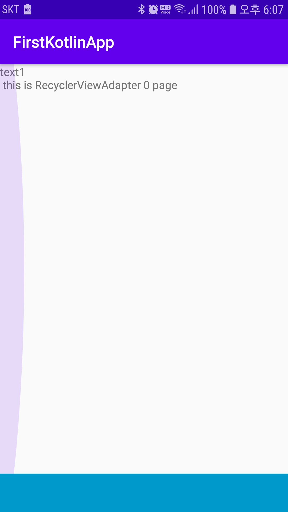
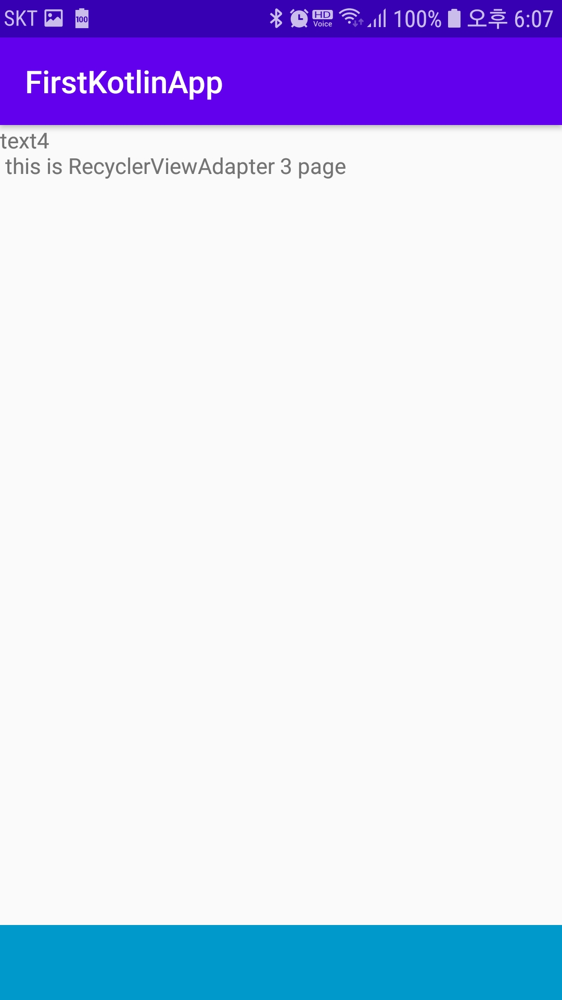
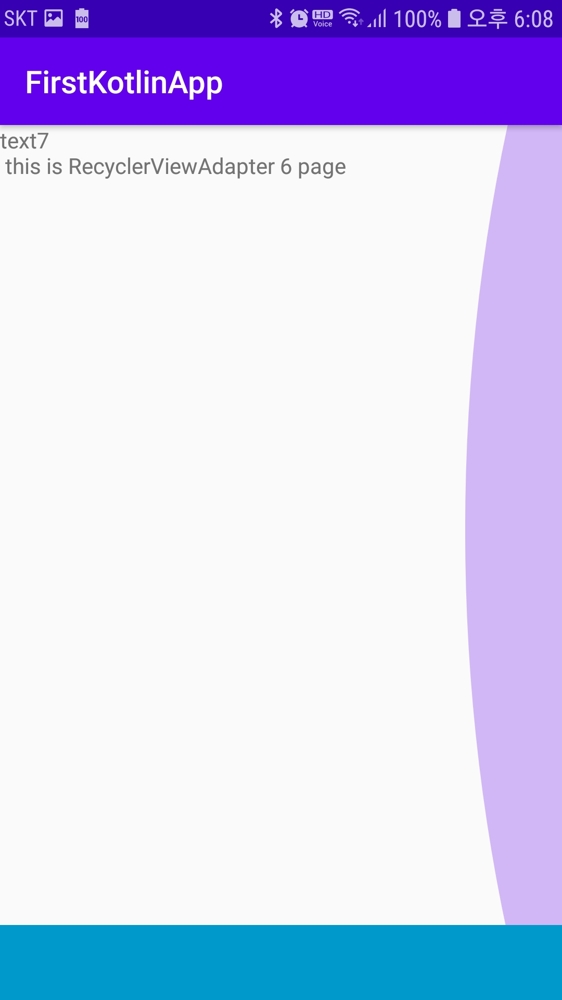

## ViewPager2
- 기존 ViewPager의 단점과 버그 수정으로 나옴
- 사용법이 RecyclerView와 유사하기에 사용하기 쉬움

### 1. gradle
- 버전 1.1.0-alpha01, 2020년 4월 1일이 최신버전이다

```xml
dependencies {
    implementation "androidx.viewpager2:viewpager2:1.0.0"
}
```

### 2. MainActivity.xml
- TabLayout은 추후 연동하기 위해 추가했다
- androidx.viewpager2.widget.ViewPager2을 이용하여 ViewPager2를 추가한다
```xml
<?xml version="1.0" encoding="utf-8"?>
<LinearLayout xmlns:android="http://schemas.android.com/apk/res/android"
    xmlns:app="http://schemas.android.com/apk/res-auto"
    android:layout_width="match_parent"
    android:layout_height="match_parent"
    android:orientation="vertical">

    <androidx.viewpager2.widget.ViewPager2
        android:id="@+id/viewPager"
        android:layout_width="match_parent"
        android:layout_height="match_parent"
        android:layout_weight="10">
    </androidx.viewpager2.widget.ViewPager2>

    <com.google.android.material.tabs.TabLayout
        android:id="@+id/tabLayout"
        android:background="@android:color/holo_blue_dark"
        android:layout_width="match_parent"
        android:layout_height="wrap_content"
        app:tabGravity="fill"
        app:tabIndicatorColor="@android:color/black"
        app:tabIndicatorGravity="bottom"
        app:tabIndicatorHeight="5dp"
        app:tabMode="auto"
        app:tabUnboundedRipple="true" />

</LinearLayout>
```
### 3. VIewPager_item.xml
- 리싸이클러뷰와 마찬기지로 커스텀한 뷰가 viewpager에 나타나야 하기때문에 만들어야 한다.
- 리니어 레이아웃에 텍스트뷰 하나만 추가하였다.
```xml
<?xml version="1.0" encoding="utf-8"?>
<LinearLayout xmlns:android="http://schemas.android.com/apk/res/android"
    android:layout_width="match_parent"
    android:layout_height="match_parent"
    android:orientation="vertical">

    <TextView
        android:layout_width="match_parent"
        android:layout_height="wrap_content"
        android:id="@+id/viewpager_tv"/>
</LinearLayout>

```

### 4. ViewPagerAdapter.kt

- 기존 [자바](https://github.com/vvvvvoin/TIL/blob/master/android/java/RecyclerView%20basic.md)를 이용한 RecylcerView를 보면 유사함을 볼 수 있다.
- ViewPageAdapter 클래스는 스트링 리스트를 받는 파라미터를 만들었다
- 이 리스트의 크기는 getItemCount()에 의해 크기를 받는다
- 크기값은 getItemViewType() -> onCreateViewHolder() -> onBindViewHolder() 을 반복하여 뷰페이즈를 구현한다.
- onCreateViewHolder에서 알맞은 viewType을 찾아 RecyclerView.ViewHolder를 상속받은 클래스를 객체화하여 view를 리턴한다.
- 리턴된 view는 onBindViewHolder()에서 holder에 맞게 나타날 값이 지정된다.

```kotlin
class ViewPageAdapter(val text : List<String>) : RecyclerView.Adapter<RecyclerView.ViewHolder>() {
    
	 //viewType에 맞는 레이아웃을 찾아 부모 뷰 그룹에 inflate시키고 RecyclerView.ViewHolder를 상속받은 객체로 반환한다
    override fun onCreateViewHolder(parent: ViewGroup, viewType: Int): RecyclerView.ViewHolder {
        val view = LayoutInflater.from(parent.context).inflate(R.layout.viewpager_item, parent, false)
        return ViewPagerViewHolder(view)
    }
    
    ////onCreateViewHolder()에서 반환된 holder에 viewHolder를 찾아 값을 지정한다
    override fun onBindViewHolder(holder: RecyclerView.ViewHolder, position: Int) {
       when(holder){
           is ViewPagerViewHolder -> {
               //Main으로 받은 리스트에 담고 있는 String text값을 설정
               (holder).textView.setText(text[position])
               (holder).bind(position)
           }
       }
    }
	
    //ViewPageAdapter가 만들어지고 받은 List<String>의 크기값을 반환한다.
    override fun getItemCount(): Int {
        return text.size
    }
	
    //RecyclerView.ViewHolder를 상속받아 onCreateViewHolder()에서 리턴되도록 해준다
    inner class ViewPagerViewHolder(itemview : View) : RecyclerView.ViewHolder(itemview){
        val textView = itemview.findViewById<TextView>(R.id.viewpager_tv)
		
        //onBindViewHolder()에서 위치값을 텍스트 뷰에 append한다
        fun bind(position: Int){
            textView.append("\n this is RecyclerViewAdapter ${position} page")
        }
    }
}
```
- 구글이 정해준 ViewHolder의 샘플
```java
// Provide a reference to the views for each data item
// Complex data items may need more than one view per item, and
// you provide access to all the views for a data item in a view holder
public class ViewHolder extends RecyclerView.ViewHolder {
    // each data item is just a string in this case
    public TextView mTextView;
    public ViewHolder(TextView v) {
        super(v);
        mTextView = v;
    }
}
```

### 4. MainActivity.kt

- viewPage에 보낼 리스트를 선언
- MainActivity.xml에 있는 ViewPager2를 찾는다
- ViewPageAdapter()에 리스트를 담아 객체를 생성한다.
- ViewPager2에 adapter를 ViewPageAdapter객체를 담는다

```kotlin
class MainActivity : AppCompatActivity() {
    private lateinit var context: Context

    override fun onCreate(savedInstanceState: Bundle?) {
        super.onCreate(savedInstanceState)
        setContentView(R.layout.activity_main)

        val texts = listOf(
            "text1",
            "text2",
            "text3",
            "text4",
            "text5",
            "text6",
            "text7"
        )

        val viewPager  = findViewById<ViewPager2>(R.id.viewPager)
        val viewPageAdapter = ViewPageAdapter(texts)
        viewPager.adapter = viewPageAdapter
    }
}
```
- 추가적으로 *viewPager.orientation = ViewPager2.ORIENTATION_VERTICAL*을 사용하여 뷰페이지를 수직으로 이동하게 만들수 있다






> 아래 청색은 정의되지 않은 TabLayout이다