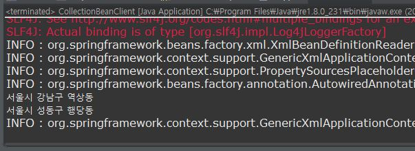

### 켈렉션(Collection) 객체 설정
- 프로그램을 개발하다 보면 배열이나 List같은 컬렉션 객체를 이용하여 데이터 집합을 사용하는 경우가 존재
- 이때 컬렉션 객체를 의존성 주입하면되는데, 스프링에서는 이를 위한 컬렉션 매핑과 관련된 엘리먼트를 지원한다
	- list : <list>
	- set :  <set>
	- map : <map>
	- Properties : <props>

#### List 타입 매핑
```java
public class CollectionBean {
	private List<String> addressList;
	public List<String> getAddressList() {
		return addressList;
	}
	public void setAddressList(List<String> addressList) {
		this.addressList = addressList;
	}	
}
```
```xml
<bean id="collectionBean" class="com.springbook.ioc.injection.CollectionBean">
	<property name="addressList">
		<list>
			<value>서울시 강남구 역상동</value>
			<value>서울시 성동구 행당동</value>
		</list>
	</property>
</bean>
```
```java
public class CollectionBeanClient {	
	public static void main(String[] args) {
		AbstractApplicationContext factory = new GenericXmlApplicationContext("applicationContext.xml");
		CollectionBean bean = (CollectionBean) factory.getBean("collectionBean");
		
		List<String> addressList = bean.getAddressList();
		for(String address : addressList) {
			System.out.println(address.toString());
		}
		 factory.close();		
	}
}
```


#### Map 타입 매핑
```java
public class CollectionBean {
	private Map<String, String> addressList;
	public void setAddressList(Map<String, String> addressList) {
		this.addressList = addressList;
	}	
}
```
```xml
<bean id="collectionBean" class="com.springbook.ioc.injection.CollectionBean">
	<property name="addressList">
		<map>
			<entry>
				<key><value>고길동</value></key>
				<value>서울시 강남구 역삼동</value>
			</entry>
			<entry>
				<key><value>마이콜</value></key>
				<value>서울시 서초구</value>
			</entry>
		</map>
	</property>
</bean>
```

#### Set 타입 매핑
```java
public class CollectionBean {
	private Set<String> addressList;
	public void setAddressList(Set<String> addressList) {
		this.addressList = addressList;
	}
}
```
```xml
<bean id="collectionBean" class="com.springbook.ioc.injection.CollectionBean">
	<property name="addressList">
		<set value-type="java.lang.String">
			<value>서울시 강남구 역삼동</value>
			<value>서울시 성동구 성수동</value>
			<value>서울시 성동구 성수동</value>
		</set>
	</property>
</bean>
```
#### Properties 타입 매핑
```java
public class CollectionBean {
	private Properties addressList;
	public void setAddressList(Properties addressList) {
		this.addressList = addressList;
	}
}
```
```xml
<bean id="collectionBean" class="com.springbook.ioc.injection.CollectionBean">
	<property name="addressList">
		<props>
			<prop key="고길동">서울시 강남구 역삼동</prop>
			<prop key="마이콜">서울시 서초구</prop>
		</props>
	</property>
</bean>
```


