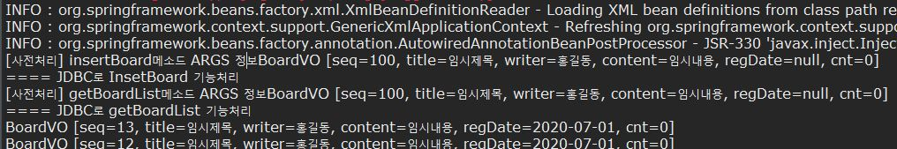
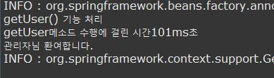

### JointPoint와 바인드 변수
- 횡단 관심에 해당하는 어드바이스 메소드를 의미 있게 구현하려면 클라이언트가 호출한 비즈니스 메소드 정보가 필요하다.
- After Throwing기능의 어드바이스 메소드가 구현된었다면, 예외가 발생한 비즈니스 메소드 이름이 무엇인지, 메소드가 속한 클래스, 패키지 정보가 무엇인지 알아야 정확한 예외처리르 할 수 있다.
- 스프링은 이런 정보를 JointPoint 인터페이스를 통해 제공한다.

#### JoinPoint 메소드
- 다음은 JoinPoint가 제공하는 유용한 메소드 이다.
	- Signature getSignature() : 클라이언트가 호출한 메소드의 시그니처(리턴타입, 이름, 매개변수) 정보가 저장된 Signature 객체 리턴
	- Object getTarget() : 클라이언트가 호출한 비즈니스 메소드를 포함하는 비즈니스 객체 리턴
	- Object[] getArgs() : 클라이언트가 메소드를 호출할 때 넘겨준 인자 목록을 Object배열로 리턴


#### Before 어드바이스

- before 어드바이스는 비즈니스 메소드가 실행되기 전에 동작할 로직을 구현한다.
- 따라서 호출된 메소드 시그니처만 알 수 있으면 다양한 사전처리 로직을 구현할 수 있다.
- java 클래스
```java
package com.springbook.biz.common;

public class BeforeAdvice {
	public void beforeLog(JoinPoint jp) {
		String method = jp.getSignature().getName();
		Object[] args = jp.getArgs();
		
		System.out.println("[사전처리] " + method + "메소드 ARGS 정보" + args[0].toString());
	}
}
```



#### After Returning 어드바이스

- After Returning은 비즈니스 메소드가 수행되고 나서, 결과 데이터를 리턴할 때 동작하는 어드바이스이다.
- 어떤 메소드가 어떤 값을 리턴했는지를 알아야 사후 처리 기능을 다양하게 구현할 수 있다.
- Object 타입의 변수도 매개변수로 추가되었는데 이를 '바인드 변수'라고 한다.
- 바인드 변수는 비즈니스 메소드가 리턴한 결과값을 바인딩할 목적으로 사용하며, 어떤 값이 리턴될지 모르기에 Object 타입으로 정한다.

```java
package com.springbook.biz.common;

public class AfterReturningAdvice {
	public void afterLog(JoinPoint jp, Object returnObj) {
		String method = jp.getSignature().getName();
		if(returnObj instanceof UserVO) {
			UserVO user = (UserVO) returnObj;
			if(user.getRole().equals("Admin")) {
				System.out.println(user.getName() + " 로그인(Admin)");
			}
		}
		
		System.out.println("[사후처리] " + method + " 메소드 리턴값 : " + returnObj.toString());
	}
}
```
```xml
<bean id="afterReturning" class="com.springbook.biz.common.AfterReturningAdvice"></bean>
<aop:config>
	<aop:pointcut expression="execution(* com.springbook.biz..*Impl.get*(..))" id="getPointcut"/>
	<aop:aspect ref="afterReturning">
		<aop:after-returning method="afterLog" pointcut-ref="getPointcut" returning="returnObj"/>
	</aop:aspect>
</aop:config>
```

- ter returning 어드바이스 메소드에 JoinPoint만 선언되어 있다면 스프링 설정파일은 수정하지 않아도 된다.
- 하지만 바인드 변수가 추가 됐다면 반드시 바인드 변수에 매핑하는 returning="returnObj"을 추가한다.
- returning= 속성값은 반드시 어드바이스 메소드 매개변수로 선언된 바인드 변수 이름과 같아야 한다.


#### After Throwing 어드바이스

- After Throwing은 비즈니스 메소드가 수행되다가 예외가 발생할 때 동작하는 어드바이스이다.
- 따라서 어떤 메소드에서 어떤 예외가 발생했는지를 알아야 한다.

```java
package com.springbook.biz.common;

public class AfterThrowingAdvice {
	public void exceptionLog(JoinPoint jp, Exception exceptObj) {
		String method = jp.getSignature().getName();
		System.out.println("[예외처리]" + method + "메소드 수행 중 발생된 예외 발생 메세지" + exceptObj.getMessage());
	}
}
```
- exceptionLog() 메소드는 예외가 발생한 메소드 정보를 알아내기 위해 joinPoint객체를 매개변수로 받는다. 
- 비즈니스 메소드에서 발생한 예외 객체를 exceptObj라는 바인드 변수를 통해 받는다.
- 마찬가지로 After Throwing 어드바이스에 바인드 변수가 있다면 throwing속성을 추가한다.
```xml
<bean id="afterThrwing" class="com.springbook.biz.common.AfterThrowingAdvice"></bean>
<aop:config>
	<aop:pointcut expression="execution(* com.springbook.biz..*Impl.*(..))" id="allPointcut"/>
	<aop:aspect ref="afterThrwing">
		<aop:after-throwing pointcut-ref="allPointcut" method="exceptionLog" throwing="exceptObj"/>
	</aop:aspect>
</aop:config>
```
```java
public void insertBoard(BoardVO vo) {
	if(vo.getSeq() == 0) {
		throw new IllegalArgumentException("0번 글은 등록할 수 없습니다");
	}
	boardDAO.insertBoard(vo);
}
```

> 강제로 vo.setSeq(0)을 이용하여 예외를 발생시킴

- 또한 exceptionLog() 메소드를 구혀낳ㄹ 때 발생하는 예외 객체를 종류에 따라 다양하게 처리할 수 있다.
```java
public class AfterThrowingAdvice {
	public void exceptionLog(JoinPoint jp, Exception exceptObj) {
		String method = jp.getSignature().getName();
		System.out.println(method + "메소드 수행 중 발생된 예외 발생");
		
		if(exceptObj instanceof IllegalArgumentException) {
			System.out.println("부적합한 값이 입력되었습니다");
		}else if(exceptObj instanceof NumberFormatException) {
			System.out.println("숫자 형식이 아닙니다");
		}else if(exceptObj instanceof Exception) {
			System.out.println("오류가 발생했습니다.");
		}	
	}
}
```


#### Around 어드바이스

- Around 어드바이스는 다른 어드바이스와는 다르게 반드시 ProceedingJoinPoint 객체를 매개변수로 받아야한다.
- ProceedingJoinPoint 객체는 비즈니스 메소드를 호출하는 proceed()메소드를 가지고 있으면 JoinPoint를 상속한다.

```java
package com.springbook.biz.common;

public class AroundAdvice {
	public Object aroundLog(ProceedingJoinPoint pjp) throws Throwable {
		String method = pjp.getSignature().getName();
		StopWatch stopWatch = new StopWatch();
		stopWatch.start();
		
		Object obj = pjp.proceed();
		
		stopWatch.stop();
		
		System.out.println(method + "메소드 수행에 걸린 시간" + stopWatch.getTotalTimeMillis() + "ms초");
		return obj;
	}
}
```



