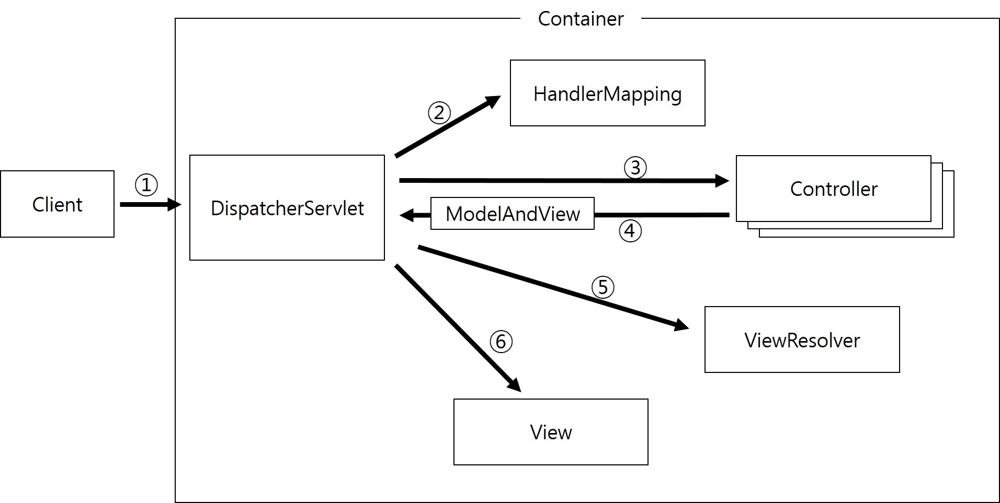

## Spring MVC 
### Spring MVC 수행흐름
- 스프링 mvc는 [MVC프레임워크](https://github.com/vvvvvoin/TIL/blob/master/spring/MVC%20%ED%94%84%EB%A0%88%EC%9E%84%EC%9B%8C%ED%81%AC.md)와 비슷한 구조를 가졌다.
- 그래서 하나의 프레임워크만 잘 이해한다면 다른 프레임워크도 쉽게 이해할 수 있다.


- Spring MVC의 구조와 수행흐름이 [MVC프레임워크](https://github.com/vvvvvoin/TIL/blob/master/spring/MVC%20%ED%94%84%EB%A0%88%EC%9E%84%EC%9B%8C%ED%81%AC.md)에 적용된 Contoller 구조와 유사하다.
- 다른 점은 Controller의 리턴타입이 Stirng이 아닌 ModelAndVIew로 바뀌었다.

### DispatcherServlet 등록 및 스프링 컨테이너
#### DispatcherServlet 등록
- 스프링 MVC에서 가장 중요한 요소가 모든 클라이언트의 요청을 가장 먼저 받아들이는 DispatcherServlet 이다.
- 따라서 스프링 MVC 적용에서 가장먼저 해야할 일은 web.xml파일에 DispatcherServlet 클래스를 스프링 프레임워크에서 제공하는 DispatcherServlet 으로 변경한다.
```xml
<servlet>
	<servlet-name>action</servlet-name>
	<servlet-class>org.springframework.web.servlet.DispatcherServlet</servlet-class>
</servlet>
<servlet-mapping>
	<servlet-name>action</servlet-name>
	<url-pattern>*.do</url-pattern>
</servlet-mapping>
```
- 이제는 요청을 서버에 전달하면 서블릿 컨테이너는 web.xml파일에 action이라는 이름으로 등록된 DispatcherServlet클래스의 객체를 생성한다.

#### 스프링 컨테이너 구동
- 클라이언트의 요청으로 DispatcherServlet 객체가 생성되고 나면 DispatcherServlet 클래스에 재정의된 init 메소드가 자동으로 실행되어 XmlWebApplicationContext라는 스프링 컨테이너가 구동된다.
- XmlWebApplicationContext는 DispatcherServlet이 생성한다.
- 스프링 MVC 의 구성요소 중에서 DispatcherServlet 클래스가 유일한 서블릿 이다.
- 서블릿 컨테이너는 web.xml 파일에 등록된 DispatcherServlet만 생성한다.
- 하지만 DispatcherServlet객체 혼자서는 클라이언트 용청을 처리할 수 없고 반드시 HandlerMapping, Controller, ViewResolver 객체들과 상호작용해야 한다.
- 이 객체들을 메모리에 생성하기 위해 DispatcherServlet은 스프링 컨에니러르 구동하는 것이다.
- 이전에는 HandlerMapping, Controller, ViewResolver 객체를 직접 생생했지만 스프링에서 제공하는 DispatcherServlet은 스프링 컨테이너를 통해 이 객체들을 생성하는 것이 다를 뿐이다.
- 서블릿 켄테이너가 DispatcherServlet 객체를 생성하고 나면 재정의된 init 메소드가 자동으로 실행된다.
- init 메소드는 스프링 설정 파일(action-servlet.xml)을 로딩하여 XmlWebApplicationContext를 생성한다.
- 스프링 설정파일(action-servlet.xml)에 DispatcherServlet이 사용할 HandlerMapping, Controller, ViewResolver클래스를 bean 등록하면 스프링 컨에티너가 해당 객체들을 생성해준다.

#### 스프링 설정파일 등록
- 현재 상태에서는 DispatcherServlet이 스프링 컨테이너를 구동할때 무조건 /WEB-INF/action-servlet.xml을 찾아 로딩한다.
- DispatcherServlet은 스프링 컨테이너를 구동할때 web.xml 파이레 등록된 서블릿 이름뒤에 '-servlet.xml'을 붙여서 스프링 설정파일을 찾는다.
- WEB-INF파일에 Spring Bean configurationfile을 action-servlet.xml파일을 만든다.

#### 스프링 설정파일 변경
- DispatcherServlet은 자신이 사용할 객체들을 생성하기 위해서 스프링 컨테이너를 구동한다.
- 필요에 따라서는 설정 파일의 이름을 바/꾸거나 위치를 변경할 수도 있다.
- WEB-INF폴더의 config폴더를 만들고 action-servlet.xml을 presentation-layer.xml으로 변경한다.
- 그리고 web.xml에 init-param설정을 추가한다.
- param-name 에릴먼트로 지정한 contextConfigLocation은 대소문자를 구분하여 정확히 입력한다.
```xml
<servlet>
	<servlet-name>action</servlet-name>
	<servlet-class>org.springframework.web.servlet.DispatcherServlet</servlet-class>
	<init-param>
		<param-name>contextConfigLocation</param-name>
		<param-value>/WEB-INF/config/presentation-layer.xml</param-value>
	</init-param>
</servlet>
<servlet-mapping>
	<servlet-name>action</servlet-name>
	<url-pattern>*.do</url-pattern>
</servlet-mapping>
````

#### 인코딩 설정
- 이전에는 DispatcherServlet에 get, post방식을 나뉘어 post방식에 인코딩방식을 설정했다.
- 하지만 현재에는 스프링 MVC를 적용하여 DispatcherServlet 클래스를 집적 만들지 못하여 이전처럼 인코딩 설저을 추가할 수 없다.
- 스프링에서는 인코딩 처리를 위해 CharacterEncodingFilter클래스를 제공하고 이를 web.xml파일에 등록하면 모든 클라이언트의 요청에 대해서 일괄적으로 인코딩 처리할 수 있다.
```xml
<filter>
	<filter-name>characterEncoding</filter-name>
	<filter-class>org.springframework.web.filter.CharacterEncodingFilter</filter-class>
	<init-param>
		<param-name>encoding</param-name>
		<param-value>UTF-8</param-value>
	</init-param>
</filter>

<filter-mapping>
	<filter-name>characterEncoding</filter-name>
	<url-pattern>*.do</url-pattern>
</filter-mapping>
	
<servlet>
	<servlet-name>action</servlet-name>
	<servlet-class>org.springframework.web.servlet.DispatcherServlet</servlet-class>
	<init-param>
		<param-name>contextConfigLocation</param-name>
		<param-value>/WEB-INF/config/presentation-layer.xml</param-value>
	</init-param>
</servlet>
<servlet-mapping>
	<servlet-name>action</servlet-name>
	<url-pattern>*.do</url-pattern>
</servlet-mapping>
```
- 필터는 엘리먼트 이름나 다를 뿐, 서블릿과 거의 비슷한 형태로 등록한다.
- characterEncoding이라는 이름으로 등록한 CharacterEncodingFilter객체가 생성ㄷ괴고 나면 init-param으로 설정한 encoding 파라미터 정보를 읽어 인코딩 방식을 설정한다.
- filter-mapping에서 url-pattern 설정을 *.do로 했으므로 모든 클라이언트의 *.do 요청에 대해서 CharacterEncodingFilter 객체가 일괄적으로 한글을 처리한다.

### Spring MVC 적용
#### 준비
- 스프링 MVC를 적용하기전 만든 Controller패키지에 관련 파일을 모두삭제한다.
- 이제는 스프링 MVC에서 제공하는 Controller를 통해서 처리되며 hadnlerRequest메소드의 리턴타입은 Stirng이 아닌 ModelAndView로 바뀐다.

#### 클래스
- 기존의 로그인 기능을 다음과 같이 클래스를 변경한다.
```java
package com.springbook.view.user;

import javax.servlet.http.HttpServletRequest;
import javax.servlet.http.HttpServletResponse;

import org.springframework.web.servlet.ModelAndView;
import org.springframework.web.servlet.mvc.Controller;

import com.springbook.biz.user.UserVO;
import com.springbook.biz.user.impl.UserDAO;

public class LoginController implements Controller {

	@Override
	public ModelAndView handleRequest(HttpServletRequest request, HttpServletResponse response) {
		System.out.println("로그인 처리");
		
		// 1. 사용자 입력 정보 추출
		String id = request.getParameter("id");
		String password = request.getParameter("password");

		// 2. DB 연동 처리
		UserVO vo = new UserVO();
		vo.setId(id);
		vo.setPassword(password);

		UserDAO userDAO = new UserDAO();
		UserVO user = userDAO.getUser(vo);

		// 3. 화면 네비게이션
		ModelAndView mav = new ModelAndView();
		if (user != null) {
			mav.setViewName("getBoardList.do");
		} else {
			mav.setViewName("login.jsp");
		}
		return mav;
	}

}
```
- 기존에 사용하던 LoginController클래스에서 handlerRequest 메소드의 리턴타입을 ModelAndView로 수정한다.
- 화면 네비게이션에서 로그인 성공, 실패일 때 실행될 각 화면 정보를 ModelAndView 객체에 저장하고 리턴한다.
- 기존 Implements된 com.springbook.view.controller.Controller 대신 import org.springframework.web.servlet.mvc.Controller 로 변경되었다.

#### HandlerMapping 등록
- 작성된 LoginController가 클라이언트의 login.do요청에 대해서 동작하게 하려면 스프링 설정파일인 presentation-layer.xml에 HandlerMapping과 LoginController를 bean 등록한다.

```xml
<!-- HandlerMapping 등록 -->
<bean class="org.springframework.web.servlet.handler.SimpleUrlHandlerMapping">
	<property name="mappings">
		<props>
			<prop key="/login.do">login</prop>
		</props>
	</property>
</bean>

<!-- Controller 등록 -->
<bean id="login" class="com.springbook.view.user.LoginController"></bean>
```
- 위 설정에서 SimpleUrlHandlerMappings 객체는 Setter 인젝션을 통해 Properties 타입의 컬렉션 객체를 의존성 주입하고 있다.
- 의존성 주입된 Properties컬렉션에는 login.do 경로 요청에 대해 아이디가 login인 객체가 매핑되어 있다.
- LoginController 클래스를 bean 등록하는데 반드시 SimpleUrlHandlerMapping에서 login.do 키값으로 매핑한 값과 같은 아이디로 등록해야한다.

### 글 목록 검색 기능

#### GetBoardListController 구현
- 글 목록을 출력하기 위해 기존에 사용한 GetBoardListController 클래스를 수정한다.
```java
package com.springbook.view.board;

import java.util.List;

import javax.servlet.http.HttpServletRequest;
import javax.servlet.http.HttpServletResponse;
import javax.servlet.http.HttpSession;

import org.springframework.web.servlet.ModelAndView;
import org.springframework.web.servlet.mvc.Controller;

import com.springbook.biz.board.BoardVO;
import com.springbook.biz.board.impl.BoardDAO;

public class GetBoardListController implements Controller {

	@Override
	public ModelAndView handleRequest(HttpServletRequest request, HttpServletResponse response) {
		System.out.println("글 목록 검색 처리");
		
		// 1. 사용자 입력 정보 추출(검색 기능은 나중에 구현)
		// 2. DB 연동 처리
		BoardVO vo = new BoardVO();
		BoardDAO boardDAO = new BoardDAO();
		List<BoardVO> boardList = boardDAO.getBoardList(vo);
		
//		// 3. 검색 결과를 세션에 저장하고 목록 화면을 리턴한다.
//		HttpSession session = request.getSession();
//		session.setAttribute("boardList", boardList);
//		return "getBoardList";
		
		// 3. 검색 결과와 화면 정보를 ModelAndView에 저장하여 리턴한다.
		ModelAndView mav = new ModelAndView();
		mav.addObject("boardList", boardList); 	// Model 정보 저장
		mav.setViewName("getBoardList.jsp"); 	// View 정보 저장
		return mav;
	}
}
```

- 기존 세션에 객체를 저장하는 방식을 사용했는데 이는 서버에 부담이 된다.
- 결국 세션이 아닌 서버에 부담이 되지 않는 HttpServletRequest 객체에 저장되는 것이 맞다.
- 하지만 해당 클래스는 ModelAndView에 저장하고 클래스 이름에서 알 수 있듯이 Model과 View정보를 저장하여 리턴할 때 사용한다.
- DIspatcherServlet은 Controller가 리턴한 ModelAndView객체에서 Model정보를 추출한 다음 HttpServletRequest 객체에 검색 결과에 해당하는 Model 정보를 저장하여 JSP로 포워딩한다.
- 즉 JSP파일에서는 검색 결과를 세션이 아닌 HttpServletRequest로부터 꺼내쓴다.

#### HandlerMapping등록
- SimpleUrlHandlerMapping에 매핑 정보를 추가한다.
```xml
<!-- HandlerMapping 등록 -->
<bean class="org.springframework.web.servlet.handler.SimpleUrlHandlerMapping">
	<property name="mappings">
		<props>
				<prop key="/login.do">login</prop>
			<prop key="/getBoardList.do">getBoardList</prop>
			</props>
	</property>
</bean>

<!-- Controller 등록 -->
<bean id="login" class="com.springbook.view.user.LoginController"></bean>
<bean id="getBoardList" class="com.springbook.view.board.GetBoardListController"></bean>
```


1. 클라이언트로부터 /getBoaardList.do 요청을 전송하면 DispatcherServlet이 요청을 받는다
2. SimpleUrlHandlerMapping을 통해 요청을 처리할 GetBoardListContoller를 검색한다
3. DispatcherServlet은 검색된 GetboardListController를 실행하여 요청을 처리한다.
4. GetBoardListController는 검색결과인 List<Board>와 getBoardList.jsp이름을 ModelAndView객체에 저장하여 리턴한다.
5. DispatcherServlet은 ModelAndView로부터 View 정보를 추출하고 ViewResolver를 이용하여 응답으로 사용할 getBoardList.jsp를 검색한다.
6. DispatcherServlet은 getBoardList.jsp를 실행하여 글 목록 화면을 전송한다.

### 글 등록, 수정, 삭제
#### InsertBoardController 구현
- 기존의 InsertBoardController, UpdateBoardController, DeleteBoardController 클래스를 수정한다.
```java
package com.springbook.view.board;

import javax.servlet.http.HttpServletRequest;
import javax.servlet.http.HttpServletResponse;

import org.springframework.web.servlet.ModelAndView;
import org.springframework.web.servlet.mvc.Controller;

import com.springbook.biz.board.BoardVO;
import com.springbook.biz.board.impl.BoardDAO;

public class InsertBoardController implements Controller {

	@Override
	public ModelAndView handleRequest(HttpServletRequest request, HttpServletResponse response) {
		System.out.println("글 등록 처리");
		
		// 1. 사용자 입력 정보 추출
		// request.setCharacterEncoding("EUC-KR");
		String title = request.getParameter("title");
		String writer = request.getParameter("writer");
		String content = request.getParameter("content");
		
		// 2. DB 연동 처리
		BoardVO vo = new BoardVO();
		vo.setTitle(title);
		vo.setWriter(writer);
		vo.setContent(content);
		
		BoardDAO boardDAO = new BoardDAO();
		boardDAO.insertBoard(vo);
		
		// 3. 화면 네비게이션
		ModelAndView mav = new ModelAndView();
		mav.setViewName("getBoardList.do");
		return mav;			
	}
}
```

#### HandlerMapping 등록

- nsertBoardController, UpdateBoardController, DeleteBoardController 클래스를 등록한다.

```xml
<!-- HandlerMapping 등록 -->
<bean class="org.springframework.web.servlet.handler.SimpleUrlHandlerMapping">
	<property name="mappings">
		<props>
			<prop key="/login.do">login</prop>
			<prop key="/getBoardList.do">getBoardList</prop>
			<prop key="/getBoard.do">getBoard</prop>
			<prop key="/insertBoard.do">insertBoard</prop>
			<prop key="/updateBoard.do">updateBoard</prop>
			<prop key="/deleteBoard.do">deleteBoard</prop>
		</props>
	</property>
</bean>

<!-- Controller 등록 -->
<bean id="login" class="com.springbook.view.user.LoginController"></bean>
<bean id="getBoardList" class="com.springbook.view.board.GetBoardListController"></bean>
<bean id="getBoard" class="com.springbook.view.board.GetBoardController"></bean>
<bean id="insertBoard" class="com.springbook.view.board.InsertBoardController"></bean>
<bean id="updateBoard" class="com.springbook.view.board.UpdateBoardController"></bean>
<bean id="deleteBoard" class="com.springbook.view.board.DeleteBoardController"></bean>
```

> 마찬가지로 update, delete controller 클래스를 만들고 HandlerMapping 등록한다.

### 로그아웃 기능 구현
- 사용자가 로그아웃 링크를 클릭했을 때 로그아웃 처리를 위해 LogoutController를 수정한다.

```java
package com.springbook.view.user;

import javax.servlet.http.HttpServletRequest;
import javax.servlet.http.HttpServletResponse;
import javax.servlet.http.HttpSession;

import org.springframework.web.servlet.ModelAndView;
import org.springframework.web.servlet.mvc.Controller;

public class LogoutController implements Controller {

	@Override
	public ModelAndView handleRequest(HttpServletRequest request, HttpServletResponse response) {
		System.out.println("로그아웃 처리");
		
		// 1. 브라우저와 연결된 세션 객체를 강제 종료한다.
		HttpSession session = request.getSession();
		session.invalidate();
		
		// 2. 세션 종료후, 메인 화면으로 이동한다.
		ModelAndView mav = new ModelAndView();
		mav.setViewName("login.jsp");
		return mav;	
	}
}
```
### ViewResolver 활용하기
- 스프링 설정파일인 presentation-layer.xml에 HandlerMapping, Controller 클래스들을 bean등록하여 스프링 컨테이너가 객체를 생성하도록 하였다.
- 이번에는 ViewResolver를 이용하여 클라이언트로부터의 직접적인 JSP호출을 차단하도록 한다
- 만약 getBoardList.jsp를 부라우저에서 직접호출하면 오류는 발생하지는 않지만, 아무 데이터가 출력되지 않는다.
- 글 목록 화면에 아무런 데이터가 출력되지 않는 것은 getBoardList.jsp파일이 실행되기 전에 게시글을 검색하는 GetBoardListController가 실행되지 않았기 때문이다.
- 따라서 사용자가 getBoardList.jsp 파일을 직접 호출하려면 에러가 발생하고 GetBoardListController부터 실행할 수 있도록 ViewResolve를 이용하여 제어해야 한다.
- ViewResolver 여러 가지가 있지만 JSP를 View로 사용하는 경우에는 InternalResourceViewResolver를 사용한다.

#### ViewResolver 적용
- /WEB-INF/board 폴터를 생성하고 getBoardList, getBoard jsp파일을 이동시킨다.
- WEB-INF폴더는 브라우저에서 접근할 수 없다
- 하지만 InternalResourceViewResolver를 다음과 같이 설정하면 WEB-INF 폴더에 있는 JSP파일을 View화면으로 사용할 수 있다.

```xml
<!-- ViewResolver 등록 -->
<bean id="viewResolver"
	class="org.springframework.web.servlet.view.InternalResourceViewResolver">
	<property name="prefix" value="/WEB-INF/board/"></property>
	<property name="suffix" value=".jsp"></property>
</bean>
```
#### Controller 수정
- ViewResolver를 적용했을 때 ModelAndVIew 객체에 저장되는 View이름은 ViewResolver설정을 고려하여 등록해야한다.
- LoginController 클래스의 내비게이션 코드를 수정해야한다.

```java
......
	// 3. 화면 네비게이션
	ModelAndView mav = new ModelAndView();
	if (user != null) {
	mav.setViewName("redirect:getBoardList.do");
	} else {
	mav.setViewName("redirect:login.jsp");
	}
	return mav;
}
```
- 로그인에 성공하거나 실패했을 때 View 이름 앞에 redirect:을 붙여서 지정해야 한다.
- 이렇게 하면 ViewResolver가 설정되어 있더라도 이를 무시하고 리다이렉트한다.
- 로그인에 성공했을때 실행되는 GetBoardListController에서는 확장자 jsp를 제거한다.
```java
	.....
	// 3. 검색 결과와 화면 정보를 ModelAndView에 저장하여 리턴한다.
	ModelAndView mav = new ModelAndView();
	mav.addObject("boardList", boardList); 	// Model 정보 저장
	mav.setViewName("getBoardList"); 	// View 정보 저장
	return mav;
}
```

- 게시글 목록을 검색하고 나면 getBoardList.jsp파일이 실행되어야 한다.
- 이때 확장자 .jsp를 생략하면 ViewResolver가 접두사, 접미사를 할당하여 /WEB-INF/board/getBoardList.jsp파일을 실행한다.
- 결국 InternalResourceViewResolver를 등록했을 대는 모든 View이름에서 확장자 .jsp를 제거해야 한다.
- 그리고 확장자가 .do인 요청에는 redirect:를 붙여서 ViewResolver가 동작하지 않도록 한다.

- InserBoard, UpdateBoard, DeleteBoard Controller 클래스는 모두 redirect:getBoardList.do를 View 이름으로 설정한다.

```java
	....
	// 3. 화면 네비게이션
	ModelAndView mav = new ModelAndView();
	mav.setViewName("redirect:getBoardList.do");
	return mav;			
}
```

마지막으로  LogoutController는 로그아웃 처리 후에 로그인 화면으로 이동할 수 있도록 login.jsp화면으로 넘기면 된다.

```java
	....
	// 2. 세션 종료후, 메인 화면으로 이동한다.
	ModelAndView mav = new ModelAndView();
	mav.setViewName("redirect:login.jsp");
	return mav;	
}
```

