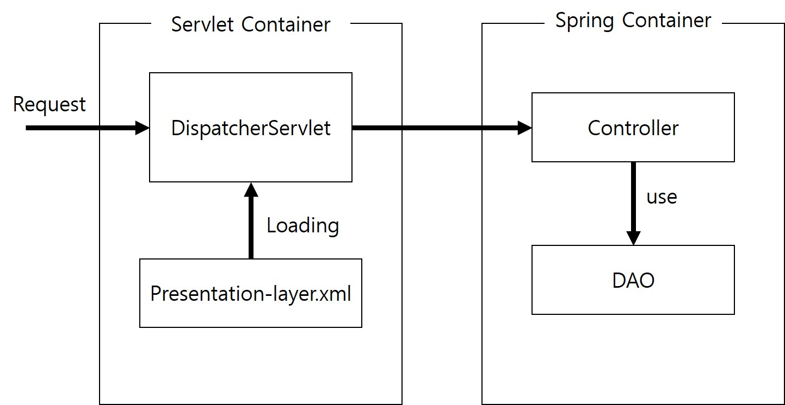
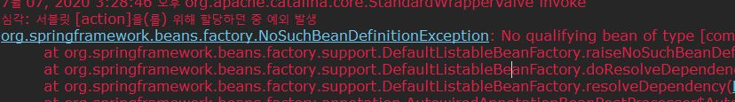
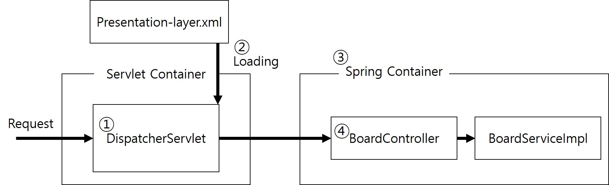
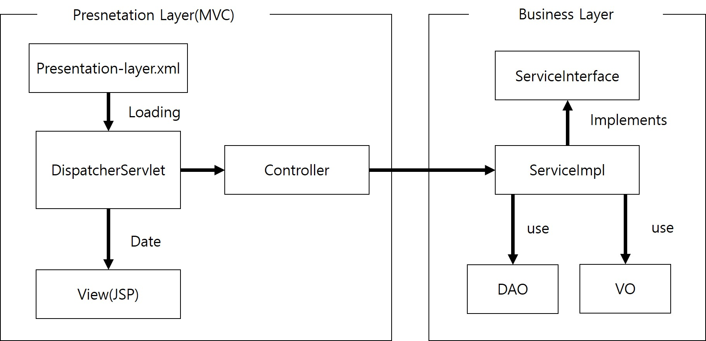
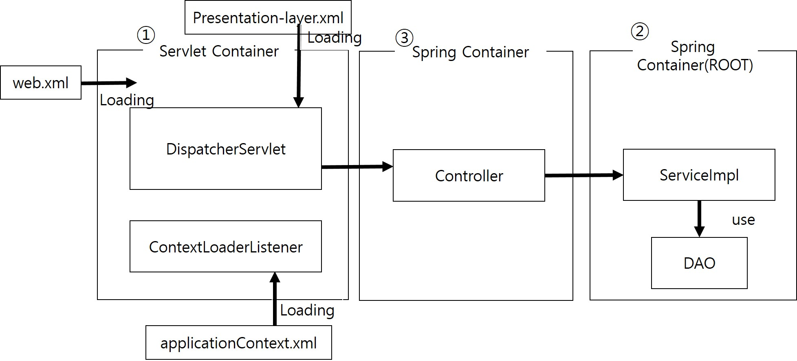

## 프레젠테이션 레이어와 비즈니스 레리어 통합
- 다음은 Spring MVC기반 프로그램 순서이다

- 브라우저에서 버튼, 하이퍼링크를 이용하여 서버에 요청을 전송하면, 모든 요청을 서블릿 컨테이너가 생성한 DispatcherServlet이 받는다.
- DispatcherServlet은 스프링 컨테이너가 생성한 Controller에게 요청을 전달하고, Controller는 매개변수를 통해 전달된 DAO 객체를 이용하여 사용자 로직을 처리하게 된다.
- 현재의 프로그램은 문제가 될 것이 없지만, Controller가 DAO 객체를 직접 이용해서는 안되며 반드시 비즈니스 컴포넌트를 이용해야한다.

### 비즈니스 컴포넌트
#### DAO 클래스 교체
- Controller 메소드에서 DAO의 메소드를 호출하면 안되는 첫 번째 이유는 유지보수 과정에서 DAO 클래스를 다른 클래스로 쉽게 교체하기 위해서다.
- 현재 BoardController의 모든 메소다가 BoardDAO객체를 매개변수로 받아서 DB처리까지 하고 있다.
- 만약 DAO 클래를 따른 것으로 변경하게 된다면 BoardController의 모든 메소드를 수정해야 할 것이다.
- 또한 교체해야하는 클래스가 하나면 상관없겠지만 다수의 클래스가 있다면 해당 클래스를 모두 확인하여 수정해야할 것이다ㅏ.
- 당연히 유지보수에 어려울 수 밖에 없다.
- 이러한 문제를 해결하기 위해 클라이언트가 인터페이스를 통해서 비즈니스 컴포넌트를 이용하면 컴포넌트의 구현 클래스를 수정하거나 다른 클래스로 대체해도 이를 사용하는 클라이언트는 수정하지 않아도 된다.
- 이것이 다형성의 장점이자 객체지향의 언어의 중요한 특징이다.
- 이제 BoardController의 메소드를 BoardService 컴포넌트의 인터페이스를 이요하여 수정한다.

```java
@Controller
@SessionAttributes("board")
public class BoardController {
	
	@Autowired
	private BoardService boardService;

	//글등록
	@RequestMapping("/insertBoard.do")
	public String insertBoard(BoardVO vo){
		boardService.insertBoard(vo);
		return "getBoardList.do";
	}
	
	//글수정
	@RequestMapping("/updateBoard.do")
	public String updateBoard(@ModelAttribute("board")BoardVO vo ) {
		boardService.updateBoard(vo);
		return "getBoardList.do";
	}
    
	//글삭제
	@RequestMapping("/deleteBoard.do")
	public String deleteBoard(BoardVO vo) {
		boardService.deleteBoard(vo);
		return "getBoardList.do";
	}
	
	//글 상세 조회
	@RequestMapping("/getBoard.do")
	public String getBoard(BoardVO vo, Model model) {
		model.addAttribute("board", boardService.getBoard(vo));
		return "getBoard.jsp";
	}
		
	//검색 조건 목록 설정
	@ModelAttribute("conditionMap")
	public Map<String, String> searchConditionMap(){
		Map<String, String> conditionMap = new HashMap<String, String>();
		conditionMap.put("제목", "TITLE");
		conditionMap.put("내용", "CONTENT");
		return conditionMap;
	}
    
	//글 목록 조회
	@RequestMapping("/getBoardList.do")
	public String getBoardList(BoardVO vo, Model model) {
		model.addAttribute("boardList", boardService.getBoardList(vo));
		return "getBoardList.jsp";
	}
}
```

- 우선 boardService라는 멤버변수를 선언했고, 변수 위에 @Autowired를 설정했으므로 BoardService타입의 BoardServiceImpl 객채게 우존성 주입된다.
- 모든 메소드에서 매개변수로 선언된 BoardDAO를 제거했고, 대신 boardService변수를 이용하여 비즈니스 컴포넌트를 사용하도록 수정했다.
- 이제 BoardServiceImpl 클래스의 멤버변수로 선언된 BoardDAO를 다른 DAO클래스로 얼마든지 변경할 수 있다.
```java
@Service("boardService")
public class BoardServiceImpl implements BoardService{
	@Autowired
	private BoardDAO boardDAO;
	
	public void insertBoard(BoardVO vo) {
		boardDAO.insertBoard(vo);
	}

	public void updateBoard(BoardVO vo) {
		boardDAO.updateBoard(vo);		
	}

	public void deleteBoard(BoardVO vo) {
		boardDAO.deleteBoard(vo);
	}

	public BoardVO getBoard(BoardVO vo) {
		return boardDAO.getBoard(vo);
	}

	public List<BoardVO> getBoardList(BoardVO vo) {
		return boardDAO.getBoardList(vo);
	}
}
```


```java
public interface BoardService {
	void insertBoard(BoardVO vo);
	void updateBoard(BoardVO vo);
	void deleteBoard(BoardVO vo);
	BoardVO getBoard(BoardVO vo);
	List<BoardVO> getBoardList(BoardVO vo);
}
```

- 이제는 BoardServiceImpl 클래스에서 사용하는 DAO클래스가 변경되어도 클라이언트에 해당하는 BoardController는 수정할 필요가 없다는 것이다.

#### AOP설정 적용
- Controller 메소드에서 DAO 메소드를 호출하면 안되는 두 번재 이유는 AOP적용 때문이다.
- 모든 비즈니스 컴포넌트의 메소드에서 공통으로 사용할 기능들을 횡단 관심, 즉 어드바이스로 군현했다.
- 이 어드바이스가 적절한 시점에 동작할 수 있도록 AOP관련 설정을 XML, 어노테이션으로 처리했다.
- 하지만 이런 처리는 [AOP 어드바이스 동작시점](https://github.com/vvvvvoin/TIL/blob/master/spring/AOP%20%EC%96%B4%EB%93%9C%EB%B0%94%EC%9D%B4%EC%8A%A4%20%EB%8F%99%EC%9E%91%EC%8B%9C%EC%A0%90.md)을 보면 횡단관심에 해당하는 어드바이스가 동작하려면 반드시 Service 구현 클래스의 비즈니스 메소드가 실행되어야 한다.
- 포인트컷 설정 부분은 다음과 같았다.
```xml
<aop:pointcut expression="execution(* com.springbook.biz..*Impl.*(..))" id="allPointcut"/>
```
```java
@Service
public class LogAdvice {
	@Pointcut("execution(* com.springbook.biz..*Impl.*(..))")
	public void allPointcut() {	}
	
	@Pointcut("execution(* com.springbook.biz..*Impl.get*(..))")
	public void getPointcut() {}
	....
}
```
- 중요한 것은 포인트컷을 설정할 때는 DAO클래스 메소드를 지정하는 것이 아니라 Service구현 클래스의 메소드에 설정했다는 것이다.
- 따라서 구현한 모든 어드바이스는 반드시 비즈니스 클래스의 메소드가 호출될 떄 동작한다.
- 결국 Controller가 매개변수로 DAO 객체를 받아서 DAO의 메소드를 직접 호출하는 상황에서는 AOP로 설정한 어떤 어드바이스도 동작할 수 없다.
- AOP 설정이 처리되어 어드바이스를 동작하기 위해서는 비즈니스 컴포넌트를 사용하는 클라이언트는 인터페이스의 추상 메소드를 호출하여 인터페이스를 구현한 Service 구현 객체의 메소드를 실행할 수 있다.
- 다음과 같이 실행했다.
```java
AbstractApplicationContext container = new GenericXmlApplicationContext("applicationContext.xml");
		
BoardService boardService = (BoardService) container.getBean("boardService");
```
- 따라서 Controller 클래스는 비즈니스 컴포넌트의 인터페이스 타입의 멤버변수를 가지고 있어야 하며, 이 변수에 비즈니스 객체를 의존성 주입해야한다.
- 그러면 Controller 메소드에서는 인터페이스를 통해서 비즈니스 객체의 메소드를 호출할 수 있고 결국 AOP로 설정한 어드바이스가 동작할 것이다.

#### 비즈니스 컴포넌트 의존성 주입
- 하지만 현재 설정되로 실행하면 다음과 같은 오류가 발생한다.


- 이유는 BoardController가 @Autowired로 의존성을 주입하려는데 BoardService타입의 객체가 메모리가에 없어서 오류가 발생한다.
- @Autowired어노테이션을 사용하려면 의존성 주입 대상이 되는 객체가 반드시 메모리에 올라가야 한다.
- 이 오류는 다음과정에 의해 발생한다.

1. 클라이언트로부터 요청이 들어오면 스블릿 컨테이너는 DispatcherServlet을 생성한다.
2. DispatcherServlet은 스프링 설정 파일인 presentation-layer.xml을 로딩한다
3. 스프링 컨테이너를 구동한다
4. 이때 BoardController 객체마느메모리에 생성되고 @Autowired로 의존성 주입할 BoardServiceImpl 객체는 생성되지 않는다.

- 결론은 BoardController보다 의존성 주입될 BoardServiceImpl객체를 먼저 생성해야하는 것이다.
- 하지만 presentation-layer.xml 파일에는 다음과 같이 Controller객체들만 컴포넌트 스캔하도록 설정했기 때문에 BoardServiceImpl 객체가 생성되지 않는다.

```xml
<?xml version="1.0" encoding="UTF-8"?>
<beans xmlns="http://www.springframework.org/schema/beans"
	xmlns:xsi="http://www.w3.org/2001/XMLSchema-instance"
	xmlns:context="http://www.springframework.org/schema/context"
	xsi:schemaLocation="http://www.springframework.org/schema/beans http://www.springframework.org/schema/beans/spring-beans.xsd
		http://www.springframework.org/schema/context http://www.springframework.org/schema/context/spring-context-4.2.xsd">

	<context:component-scan base-package="com.springbook.view"></context:component-scan>
</beans>
```

- 결국 Controller보다 의존성 주입 대상이 되는 비즈니스 컴포넌트를 먼저 생성하려면 비즈니스 컴포넌트를 먼저 생성하는 또 다른 스프링 컨테이너 필요하다.
- 이 컨테이너를 Controller를 메모리에 생성하는 컨테이너보다 먼저 구동하면 된다.

### 비즈니스 컴포넌트 로딩
#### 2-layer아키텍처
- 일반적으로 프레임워크 기반의 웹 프로젝트를 보면 다음 그림과 같이 두개의 레이어로 나누어 시스템을 개발하는데 이를 2-layer아키텍처 스타일 이라고 한다.

- 이미 이런 구조로 프로그램을 개발했다.
- src/main/resource 폴더에는 비즈니스레이어 설정파일인 applicationContext.xml이 있다
- WEB-INF/config 폴더에는 프레젠테이션레이어에 해당하는 presentation-layer.xml이 있다
- DispatcherServlet이 생성되어 presentaion-layer.xml파일을 일고 스프링 컨테이너를 구동하면 Controller 객체들이 메모리에 생성된다.,
- 하지만 Controller객체들이 생성되기 전에 누군가가 먼저 src/main/resource소스 폴더의 applicationContext.xml파일을 읽어 비즈니스 컴포넌트들을 메모리에 생서해야한다.
- 이때 사용하는 클래스가 스프링의 ContextLoaderListener이다.

#### ContextLoaderListener 등록
- Listener는 Servlet 이나 Filter 클래스와 마찬가지로 web.xml에 등록한다.
- listener 태그 하위에 listener-class 태그를 이용하여 스프링에서 제공하는 ContextLoaderListener클래스를 등록하면 된다.
- 중요한 점은 ContextLoaderListener 클래스는 서블릿 컨테이너가 web.xml 파일을 읽어서 구동될때 자동으로 메모리에 생성된다.
- 즉 ContextLoaderListener는 클라이언트 요청이 없어도 컨테이너가 구동될때 Pre-loading되는 객체이다.
- web.xml에 등록한다

```xml
<listener>
	<listener-class>
		org.springframework.web.context.ContextLoaderListener
	</listener-class>
</listener>
```
- 이제 서버를 재구동하면 서블릿 컨테이너가 ContextLoaderListener 객체를 생성하는지 확인하면 된다.
- 하지만 서버를 구동하면 FileNotFoundException오류가 발생한다.
- 이는 ContextLoaderListener가 기본적으로 WEB-INF/applicationContext.xml파일을 읽어 스프링컨테이너를 구동하기 때문이다.
- 따라서 src/main/resource 소스폴더에 있는applicationContext.xml파일을 WEB-INF폴더에 복사하면 ContextLoaderListener는 해당 XML파일을 읽어 스프링 컨테이너를 정상적으로 구동할 수 있다.
- 하지만 이런 스프링 설정파일이 두곳에 존재해 관리상 문제가 될 수 있다.
- 이를 해결하기 위해 src/main/resource소스 폴더에 위치한 스프링 설정파일을 web.xml파일에 context-param설정을 추가해 해결한다.
```xml
<context-param>
	<param-name>contextConfigLocation</param-name>
	<param-value>classpath:applicationContext.xml</param-value>
</context-param>

<listener>
	<listener-class>
		org.springframework.web.context.ContextLoaderListener
	</listener-class>
</listener>
```
- 이제 web.xml파일을 저장하고 서버를 재공하면 ContextLoaderListener객체가 pre-loading되어 스프링 컨터이너를 먼저 구동하고 비즈니스 컴포넌트 객체를 생성하는 것을 볼 수 있다.

#### 스프링 컨테이너와 관계

- 서버를 구동하면

1. web.xml파일을 로딩하여 서블릿 컨테이너가 구동된다
2. 서블릿 컨테이너느 web.xml파일에 등록된 ContextLoaderListener객체를 생성한다
	- 이때 ContextLoaderListener 객체는 src/main/resource 포럳의 applicationContext.xml파일을 로딩하여 스프링 컨에이너를 구동하는데 이를 Root컨테이너라고한다.
	 - Service구현 클래스나 DAO 객체들이 메모리에 생성된다
	 - 사용자가 로그인 버튼을 클릭하여 .do 요청을 서버에 전달하면 서블릿 컨테이너는 DispatcherServlet 객체를 생성한다

3. DispatcherServlet 객체는 /WEB-INF/config 폴더에 있는 presentation-layer.xml 파일을 로딩하여 두 번재 스프링 컨테이너를 구동한다
	- 스프링 컨테이너가 Controller 객체를 메모리에 생성한다.

- 스프링 컨테이너는 두 개가 구동된다.
- ContextLoaderListener와 DispatcherServlet이 각각 XmlWebApplicationContextn를 생성하는데 이 때 두 스프링 컨테이너의 역할과 기능이 다르다
- 우선 ContextLoaderListener가 생성하는 스프링 컨테이너를 Root컨테이너라고 하며 쉽게 부모 컨테이너라고 생각하면 된다.
- DispatcherServlet이 생성한 컨테이너는 ROOT컨테이너가 생성한 객체를 이용하는 자식 컨테이너가 된다.
- 따라서 부모 컨테이너가 생성한 비즈니스 객체를 자식 컨테이너가 생성한 Controller에서 참조해서 사용할 수 있다.


