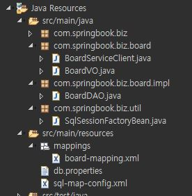

## Mybatis 프레임워크
- 마이바티스는 두가지 특징이 있다
	- 한두 줄의 자바 코드로 DB연동 처리가 가능
	- SQL 명령어를 자바 코드에서 분리하여 XML파일에 따로 관리
- 유지보수 관점에서 DB연동에 사용된 복잡한 자바 코드는 더 중요하지 않다
- 개발자는 샐행되는 SQL만 관리하면 되며 Mybatis는 개발자가 이 SQL 관리에 집중할 수 있도록 도와준다.
- Mybatis는 XML파일에 저장된 SQL명령어를 대신 실행하고 실행 겨로가를 VO같은 자바 객체에 자동으로 매핑해준다.
- 그래서 Mybatis 프레임워크를 데이터 맵퍼라고 부른다.
- 그리고 기존 JDBC를 이용항다면 SQL명령어가 DAO같은 자바 클래스에 저장되면 SQL명령어만 수정하는 상황에서 자바 클래스를 다시 컴파일 해야한다.
- 또한 SQL 명령어들을 한 곳에 모아서 관리하기도 쉽지 않다.
- 결국 SQL 명령어에 대한 통합 관리를 위해서라도 자바 소스에서 SQL을 분리하는 것은 매우 중요하다.

### Java ORM Plugin 설치
- 스프링 프로젝트를 개발할 때 STS플러그인 프로그램을 이용하면 스프링 환경설정 파일을 비롯하여 다양한 기능을 수행할 수 있다.
- Mybatis도 java ROM이라는 플러그인 프로그램이 있어서 이 플러그인을 이용하면 Mybatis와 관련된 복잡한 XML설정 파일들을 자동으로 만들고 관리할 수 있다
- `help` -> `Eclipse Marketplace` -> `orm` 검색 -> `Java ORM Plugin` 설치

### 프로젝트 생성 및 설정
- Mybatis는 스프링과 연동하지 않으면 사용하기 불편한 점이 많다
- 하지만 이 장에서는 구조와 기능에 대해 설명하기에 Mybatis만으로 수행한다
- `file` -> `new` -> `Spring Legacy Project` -> 프로젝트명 `MybatisProject`  -> 템플릿 중에서 `simple Spring Mavent` 선택
- 만약 `simple Spring Mavent`을 선택하고 프로젝트에 내용물이 생성되지 않는다면 `Spring MVC Project`로 생성해도 무방하다
- 프로젝트에 마우스 우 클릭하여 `properties`탭 -> `Project Facets` -> `java version 1.8`로 변경
- DB연동을 위한 H2 Driver, Mybatis, iBatis라이브러리를 pom.xml에 추가한다
```xml
		<dependency>
			<groupId>com.h2database</groupId>
			<artifactId>h2</artifactId>
			<version>1.4.200</version>
		</dependency>
		
		<dependency>
			<groupId>org.mybatis</groupId>
			<artifactId>mybatis</artifactId>
			<version>3.3.1</version>
		</dependency>
		
		<dependency>
			<groupId>org.apache.ibatis</groupId>
			<artifactId>ibatis-core</artifactId>
			<version>3.0</version>
		</dependency>
```
> DB 드라이버는 실제 컴퓨터에 설치된 DB와 버전이 일치하도록 한다
> 

### VO 클래스 생성
```java
package com.springbook.biz.board;

import java.util.Date;

public class BoardVO {
	private int seq;
	private String title;
	private String writer;
	private String content;
	private Date regDate;
	private int cnt;
	private String searchCondition;
	private String searchKeyword;
		
	public String getSearchCondition() {
		return searchCondition;
	}
	
	public void setSearchCondition(String searchCondition) {
		this.searchCondition = searchCondition;
	}
	
	public String getSearchKeyword() {
		return searchKeyword;
	}
	
	public void setSearchKeyword(String searchKeyword) {
		this.searchKeyword = searchKeyword;
	}
	
	public int getSeq() {
		return seq;
	}
	public void setSeq(int seq) {
		this.seq = seq;
	}
	public String getTitle() {
		return title;
	}
	public void setTitle(String title) {
		this.title = title;
	}
	public String getWriter() {
		return writer;
	}
	public void setWriter(String writer) {
		this.writer = writer;
	}
	public String getContent() {
		return content;
	}
	public void setContent(String content) {
		this.content = content;
	}
	public Date getRegDate() {
		return regDate;
	}
	public void setRegDate(Date regDate) {
		this.regDate = regDate;
	}
	public int getCnt() {
		return cnt;
	}
	public void setCnt(int cnt) {
		this.cnt = cnt;
	}
	@Override
	public String toString() {
		return "BoardVO [seq=" + seq + ", title=" + title + ", writer=" + writer + ", content=" + content + ", regDate="
				+ regDate + ", cnt=" + cnt + "]";
	}
}	
```

### SQL Mapper XML파일
- SQML Mapper XML파일은 Mybatis에서 중요한 파일이다
- 이 파일에 DB연동에 필요한 SQL명령어들이 저장되기 때문이다.
- `mybatisProject` -> `new` -> `ohter` -> `Mybatis Mapper XML` -> board-mapping.xml으로 입력하고 finish
- src/main/resource폴더에 mapping패키지를 생성하고 board-mapping.xml파일을 이동
- board-mapping.xml
```xml
<?xml version="1.0" encoding="UTF-8" ?>
<!DOCTYPE mapper PUBLIC "-//mybatis.org//DTD Mapper 3.0//EN"
  "http://mybatis.org/dtd/mybatis-3-mapper.dtd">

<mapper namespace="BoardDAO">
	<insert id="insertBoard">
		insert into board(seq, title, writer, content)
		values((select nvl(max(seq), 0)+1 from board),#{title},#{writer},#{content})
	</insert>
	
	<update id="updateBoard">
		update board set title=#{title}, content=#{content} where seq=#{seq}
	</update>
	
	<delete id="deleteBoard">
		delete board where seq=#{seq}
	</delete>
	
	<select id="getBoard" resultType="board">
		select * from board where seq=#{seq}
	</select>
	
	<select id="getBoardList" resultType="board">
		select * from board
		where title like '%'||#{searchKeyword}||'%'
		order by seq desc
	</select>
</mapper>
```
### Mybatis 환경설정 파일
- MybatisProject를 선택하고 -> `new` -> `other` -> `java ORM Plugin` -> `Mybatis Configuration XML` -> 이름을 `sql-map-config.xml`으로 설정
- 생성된 `db.properties`, `sql-map-config.xml`파일을 src/main/resource 폴더로 이동


- DB연동 설정을 위해 `db.properties`파일을 수정한다
```properties
jdbc.driverClassName=org.h2.Driver
jdbc.url=jdbc:h2:tcp://localhost/~/test
jdbc.username=sa
jdbc.password=
```

- `sql-map-config.xml` 에는 전체적인 틀만 제공하기에 세부사항을 수정해야한다
```xml
<?xml version="1.0" encoding="UTF-8" ?>
<!DOCTYPE configuration
  PUBLIC "-//mybatis.org//DTD Config 3.0//EN"
  "http://mybatis.org/dtd/mybatis-3-config.dtd">
<configuration>
	<!-- Properties 파일 설정 -->
	<properties resource="db.properties" />
	<!-- Alias 설정 -->
	<typeAliases>
		<typeAlias alias="board" type="com.springbook.biz.board.BoardVO" />
	</typeAliases>
	<!-- DataSource 설정 -->
	<environments default="development">
		<environment id="development">
			<transactionManager type="JDBC" />
			<dataSource type="POOLED">
				<property name="driver" value="${jdbc.driverClassName}" />
				<property name="url" value="${jdbc.url}" />
				<property name="username" value="${jdbc.username}" />
				<property name="password" value="${jdbc.password}" />
			</dataSource>
		</environment>
	</environments>
	<!-- Sql Mapper 설정 -->
	<mappers>
		<mapper resource="mappings/board-mapping.xml" />
	</mappers>
</configuration>
```
- `<properties>` 엘리먼트는 XML 설정에서 사용할 프로퍼티를 선언하거나 외부 프로퍼티 파일을 참조할 때 사용한다
- 이렇게 선언된 프로퍼니틑 ${프로퍼티 이름 } 으로 참조하여 사용할 수 있다
- `<typeAliases>`엘리먼트는 여러개 가질수 있으며 특정 클래스의 별칭을 선언할 수 있다
- 이 alias는 SQL명령어들이 저장되는 SQL Mapper에서 사용할 수 있으며 이를 통해서 SQL Mapping 파일의 크기를 줄여주고 설정을 간단히 처리할 수 있다.
- sql 명령어에 resultType으로 반환되는 값을 설정해줘야 하는데 이는 VO객체에 클래스 주소명이 다음과 같이 들어가는데
```xml
<select id="getBoard" resultType="com.springbook.biz.board.BoardVO">
		select * from board where seq=#{seq}
</select>
```
- 이를 별칭(alias)하여 다음과 같이 간결하게 나타낼 수 있다.
```xml
<select id="getBoard" resultType="board">
		select * from board where seq=#{seq}
</select>
```

- `<environments>`설정을 통해 DBMS로부터 커넥션을 획득하고 DB연동을 처리하기 위해 DataSource 정보를 알아낸다
- `<mappers>`엘러먼트는 여러 mapper를 가질 수 있으므로 `<mapper>`를 이용하여 SQL 명령어들이 저장된 SQL파일을 등록할 수 있다.

### SqlSession 객체 생성
- Mybatis를 이용하여 DAO를 구현하려면  SqlSession 객체가 필요하다
- 이 SqlSession객체를 얻으려면 SqlSessionFactory객체가 필요하다
- 그래서 DAO 클래스를 구현하기에 앞서 SqlSessionFactory객체를 생성하는 유틸리티 클래스를 작성해야한다.
```java
package com.springbook.biz.util;

import java.io.Reader;

import org.apache.ibatis.io.Resources;
import org.apache.ibatis.session.SqlSession;
import org.apache.ibatis.session.SqlSessionFactory;
import org.apache.ibatis.session.SqlSessionFactoryBuilder;

public class SqlSessionFactoryBean {
	private static SqlSessionFactory sessionFactory = null;
	static {
		try {
			if(sessionFactory == null) {
				Reader reader = Resources.getResourceAsReader("sql-map-config.xml");
				sessionFactory = new SqlSessionFactoryBuilder().build(reader);
			}
		}catch(Exception e) {
			e.printStackTrace();
		}
	}
	
	public static SqlSession getSqlSessionInstance() {
		return sessionFactory.openSession();
	}
}
```
- 위 코드에서의 핵심은 두 가지이다
- 우선 메인설정인 `sql-map-config.xml`파일로부터 설정 정보를 읽어 들이기 위한 입력 스트림을 생성하고 sql-map-config.xml파일을 읽어 SqlSessionFactory객체를 생성한다
```java
Reader reader = Resources.getResourceAsReader("sql-map-config.xml");
sessionFactory = new SqlSessionFactoryBuilder().build(reader);
```
- getSqlSessionInstance() 메소드드는 SqlSessionFactory 객체로부터 SqlSession객체를 얻어내어 리턴한다
- 이 메소드를 이용하여 SqlSession객체가 필요한 DAO 클래스를 구현하면 된다

### DAO 클래스
```java
package com.springbook.biz.board.impl;

import java.util.List;

import org.apache.ibatis.session.SqlSession;

import com.springbook.biz.board.BoardVO;
import com.springbook.biz.util.SqlSessionFactoryBean;

public class BoardDAO {
	private SqlSession mybatis;

	public BoardDAO() {
		mybatis = SqlSessionFactoryBean.getSqlSessionInstance();
	}

	public void insertBoard(BoardVO vo) {
		mybatis.insert("BoardDAO.insertBoard", vo);
		mybatis.commit();
	}

	public void updateBoard(BoardVO vo) {
		mybatis.update("BoardDAO.updateBoard", vo);
		mybatis.commit();
	}

	public void deleteBoard(BoardVO vo) {
		mybatis.delete("BoardDAO.deleteBoard", vo);
		mybatis.commit();
	}

	public BoardVO getBoard(BoardVO vo) {
		return (BoardVO) mybatis.selectOne("BoardDAO.getBoard", vo);
	}

	public List<BoardVO> getBoardList(BoardVO vo) {
		return mybatis.selectList("BoardDAO.getBoardList", vo);
	}
}
```
- BoardDAO 클래스는 생성자에서 SqlSessionFactoryBean을 이용하여 SqlSession객체를 얻는다
- 구현된 메소드를 보면 두 개의 정보가 전달된다
- 첫번째 인자는 실행된 SQL id정보이다
- 이때 SQL Mapper에 선언된 넹미스페이스와 아이디를 조합하여 아이디를 지정해야한다.
- 두번째 인자는 parameterType 속성으로 지정된 파라미터 객체이다
- 등록, 수정. 삭제는 insert, update, delete메소드로 처리하고, 한건의 조회, 목록조회는 selectOne, SelectList 메소드로 처리한다.

### 테스트 클라이언트
```java
package com.springbook.biz.board;

import java.sql.SQLException;
import java.util.List;

import com.springbook.biz.board.impl.BoardDAO;

public class BoardServiceClient {
	public static void main(String[] args) throws SQLException {
		BoardDAO boardDAO = new BoardDAO();

		BoardVO vo = new BoardVO();
		vo.setTitle("mybatis 제목");
		vo.setWriter("hong");
		vo.setContent("this is content test");
		boardDAO.insertBoard(vo);

		vo.setSearchCondition("TITLE");
		vo.setSearchKeyword("");
		List<BoardVO> boardList = boardDAO.getBoardList(vo);
		for (BoardVO board : boardList) {
			System.out.println("-----> " + board.toString());
		}
	}
}
```
- 클라이언트 실행 후 글 등록 성공 결과를 확인 할 수 있다



