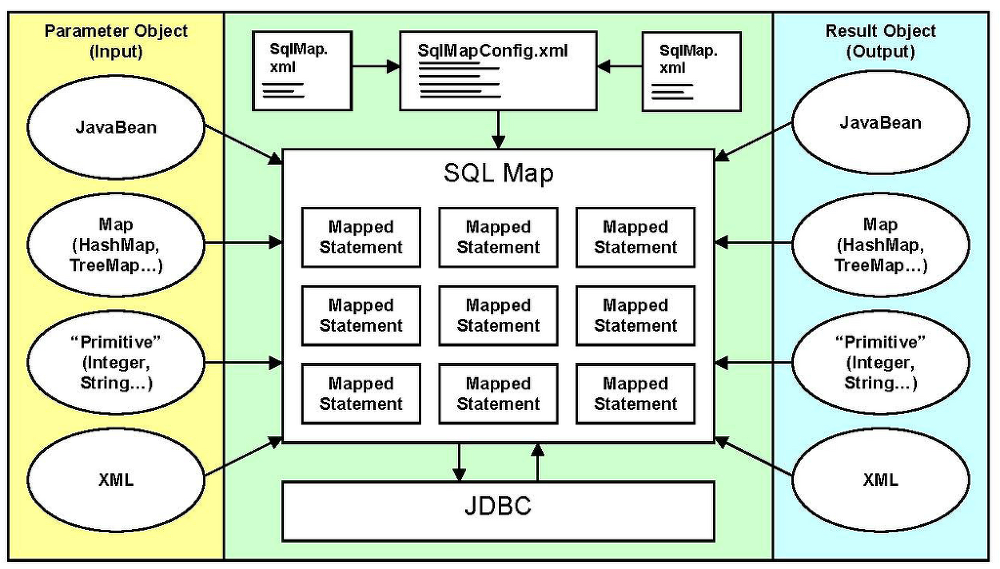
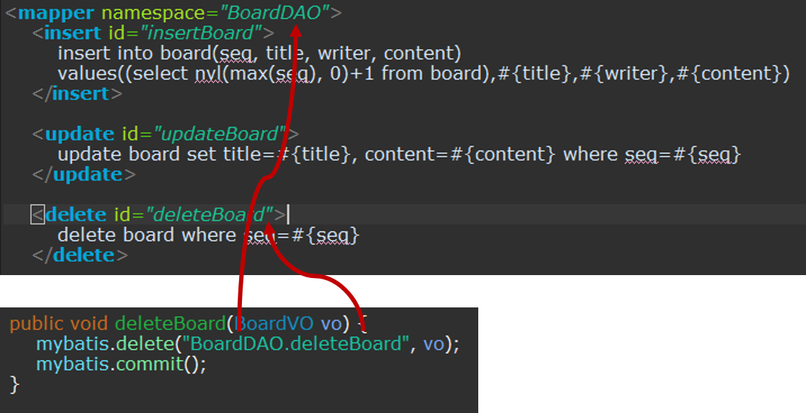
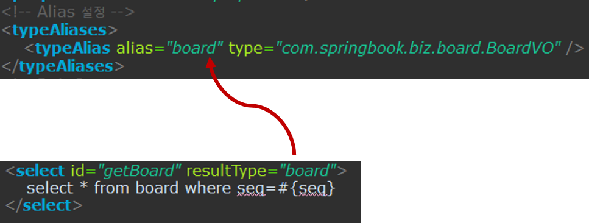
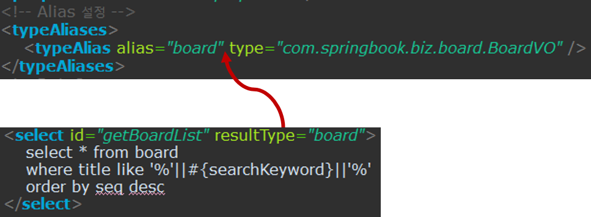
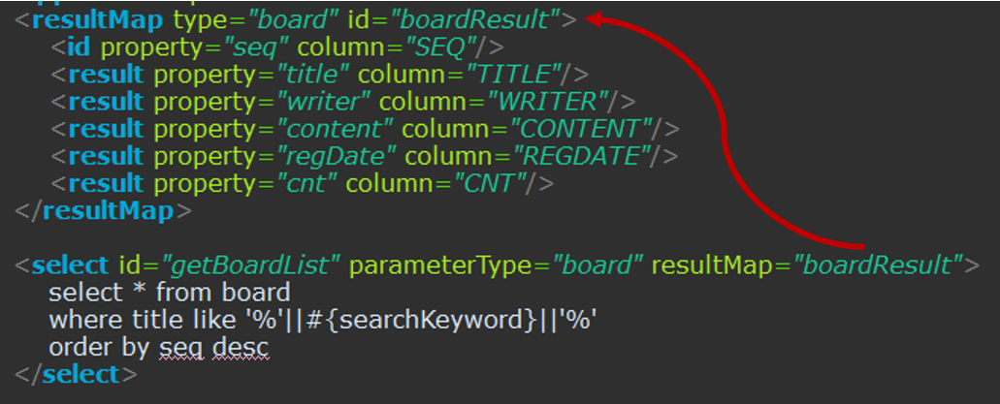

## Mapper XML 파일 설정
### SQL Mapper XML기본 설정
#### Mybatis 구조

- SqlMapConfig.xml파일은 Mybatis메인 환경설정파일이다
- Mybatis는 이 파일을 읽어들여 어떤 DMBS와 커넥션을 맺을지 어떤 SQL Mapper XML파일들이 등록되어 있는지 알 수 있다.
- Mybatis는 SqlMap.xml파일에 등록된 각 SQL 명령어들을 Map구조로 저장하여 관리한다.
- 각 SQL 명령어는 고유한 아이다 값을 가지고 있으므로 특정 아이디로 등록된 SQL을 실행 할 수 있다.
- SQL이 실행될 때 피룡한 값들은 input 형태의 데이터로 활당하고, 실행된 SQL이 SELECT구문일 떄는 output형태의 데이터로 리턴한다

#### Mapper XML 파일구조
- Mybatis 프레임워크에서 가장 중요한 파일은 SQL 명령어들이 저장되는 SQL Mapper XML파일이다
- Mapper는 `<mapper>`를 루트 에릴먼트로 가지는 XML파일이다
- `<mapper>`엘러먼트는 namespace속성을 가지는데 이 네임스페이스를 이용하여 쉽게 유일한 SQL 아디이디를 만들 수 있다
- 네임스페이스가 지정된 Mapper의 SQL을 DAO클래스에서 참조할 때는 다음과 같이 네임스페이스와 SQL 아이디를 결합하여 참조해야 한다.

- mapper파일에 SQL명령어들을 등록할 때는 SQL 구문의 종류에 따라 적절한 엘리먼트를 사용한다
- INSERT구문은 `<insert>`, SELECT구문은 `<Select>`을 사용하는 식이다.

#### select 엘리먼트
- select에릴먼트는 데이터를 조회하는 SELECT구문을 작성할 떄 사용한다.
- select에릴먼트는 parameterType, resultType속성을 사용한다.
- id 속성
	- select 에릴먼트에 선언된 id 속성은 필수 속성이고 유일한 id이어야 한다.
	- id 속성과 관련하여 살펴볼 것이 루트 엘리먼트인 mapper이다
	- mapper 엘림너트에 설정된 네임스페이스는 mapper엘리먼트안에서 선언된 여러 아이디를 하나의 네임스페이스로 묶을 수 있다
	- 다음과 같이 getTotalCount라는 아이디는 네임스페이스가 다르므로 다른 아이디로 취급된다
	```xml
	<mapper namespace="BoardDAO">
	<insert id="getTotalCount" resultType="int">
	    select count(*) from board
	</insert>
	<mapper>
	```
	```xml
	<mapper namespace="UserDao">
	<insert id="getTotalCount" resultType="int">
	    select count(*) from users
	</insert>
	<mapper>
	```
- parameterType속성
	- mapper파일에 등록된 SQL을 실행하려면 SQL 실행에 필요한 데이터를 외부로부터 받아야한다
	- 이때 사용하는 속성이 parameterType속성이다.
	- parameterType속성값은 일반적으로 기본형이나 VO클래스로 지정한다
	```xml
	<select id="getBoard" resultType="com.springbook.biz.board.BoardVO">
		select * from board where seq=#{seq}
	</select>
	```
	- 이때 Mybatis설정 파일에 등록된 `<typeAlias>`를 사용하면 간결하게 처리가 된다.
	
	- parameterType으로 지정된 클래스에는 사용자가 입력한 값들을 저장할 여러변수가 있다
	- 변수들을 이용하여 SQL 구문에 사용자 입력값들을 설정하는데 이때 #{변수명} 표현을 사용한다.
	- 그리고 parameterType속성을 생략할 수 있으면 생략한다.
- resultType 속성
	- SQL 구문이 실행되면 ResultSet이 리턴되며 ResultSet예 저장된 검색 결과를 어떤 자바 객체에 매핑하맂 지정하는데 이 때 사용하는 것이 resultType 속성이다
	
	- resultType 속성값으로도 Alias를 사용할 수 있는데 만약 resultType속성값으로 위와 같이 board를 사용했다면 SELECT실행결과를 BoardVO객채에 매핑하여 리턴한다는 의미이다.
	- resultType속성은 select 엘리먼트에서만 사용할 수 있으며, parameterType 속성과 달리 select속성에서 절대 생략할 수 없는 속성이다.

#### insert 엘리먼트
- insert 구문은 자식 요소로 selectKey 엘리먼트를 가질 수 있다
- 관계형 데이터베이스에서는 기본 키 필드의 자동 생성을 지원하는데 Mybatis에서는 insert 요소의 자식 요소인 selectKey요소를 사용하여 생성된 키를 쉽게 가져올 수 있는 방법을 제공한다.

```xml
<insert id="updateBoard" parameterType="board">
    <selectKey keyProperty="seq" resultType="int">
    	select board_seq.nextval as seq from dual
    </selectKey>
		insert into board(seq, title, writer, content) values(#{seq}, #{title}, #{writer}, #{content})
</insert>
```

- 이 설정은 BOARD_SEQ라는 시퀀스로부터 유일한 키값을 얻어내어 글 등록에서 일련번호 값으로 사용하는 설정이다.

#### update 엘리먼트

```xml
<mapper namespace="BoardDAO">
	<update id="updateBoard">
		update board set title=#{title}, content=#{content} where seq=#{seq}
	</update>
</mapper>
```


#### update 엘리먼트
```xml
<mapper namespace="BoardDAO">
	<delete id="deleteBoard">
		delete board where seq=#{seq}
	</delete>
</mapper>
```

### SQL Mapper XML  추가설정
#### resultMap 속성
- 검색 결과를 특정 자바 객체에 매핑하여 리턴하기 위해서는 parameterType 속성을 사용한다.
- 그러나 검색 결과를 parameterType 속성으로 매핑할 수 없는 사례가 있다
- 만약 검색 쿼리가 단순 테이블 조회가 아닌 JOIN구문을 포함할 때는 검색 결과를 정확하게 하나의 자바 객체로 매핑할 수 없다.
- 또는 검색된 테이블의 칼럼 이름과 매핑에 사용될 자바 객체의 변수 이름이 다를 때에 검색 결과가 정확하게 자바 객체로 매핑되지 않는다.
- 이럴때는 resultMap속성을 사용하여 처리한다.
- resultMap 속성을 사용하려면 먼저 resultMap 에릴먼트를 사용하여 매핑 규칙을 지정해야 한다.

- 위설정에서는 boardReulst라는 아이디로 resultMap을 설정했다
- resultMap설정은 PK(primary key)에 해당하는 SEQ칼럼나 id 엘리먼트를 사용했고 나머지 result엘리먼트를 이용하여 검색 결과로 얻어낸 칼럼의 값과 BoardVO객체의 변수를 매핑하고 있다.
- 이렇게 설정된 resultMap을 getBoardList로 등록된 쿼리에서 resultMap속성으로 참조하고 있다.

#### CDATA Section사용
- sql 구문에 `<` 기호를 사용하면 오류가 발생한다.
- 이는 XML파서가 XMl파일을 처리할때 `<` 를 `작다` 라는 의미의 연산자가 아닌 또 다른 태그의 시작으로 처리하기 때문이다.
- 결국 Mapper파일에 등록된 SQL구문에서는 `<`, `>`를 사용하면 오류가 발생한다.
- 하지만 CDATA Section으로 SQL 구문을 감싸주면 에러를 처리할 수 있다.
```xml
<select id="getBoard" resultType="board">
	<![CDATA[
		select * 
		from board 
		where seq <=#{seq}
	]]>
</select>
```
- CDATA Section은 Mybatis와는 상관없는 XMl 고유의 문법으로서 CDATA영역에 작성된 데이터는 단순한 문자 데이터이므로 XML파서가 해석하지 않도록 한다.
- 추후에 `<`, `>`를 사용할 것을 대비에 CDATA Section으로 SQL구문을 처리한다

#### SQL 대문자로 설정하기
- Mapper 파일에 등록되는 SQL 구문은 일반적으로 대문자로 작성한다
- 사실 SQL구믄은 대소문자를 구분하지 않는다
- 하지만 파라미터들을 바인딩할 떄 대부분 칼럼명과 변수명이 같으므로 SQL구문이 조금이라도 복잡해지면 이 둘을 구분하기 어렵다
- 따라서 SQL은 모두 대문자로 표현하여 식별성을 높인다
```xml
<update id="updateBoard">
	update board set
    	title=#{title}, 
    	content=#{content} 
    where seq=#{seq}
</update>
```
```xml
<update id="updateBoard">
	UPDATE BOARD SET
    	TITLE = ${title}.
    	CONTENT = ${content}
    WHERE SEQ = ${seq}
</update>
```

- board-mapping.xml
```xml
<?xml version="1.0" encoding="UTF-8"?>
<!DOCTYPE mapper PUBLIC "-//mybatis.org//DTD Mapper 3.0//EN"
"http://mybatis.org/dtd/mybatis-3-mapper.dtd">
<mapper namespace="BoardDAO">

	<resultMap id="boardResult" type="board">
		<id property="seq" column="SEQ" />
		<result property="title" column="TITLE" />
		<result property="writer" column="WRITER" />
		<result property="content" column="CONTENT" />
		<result property="regDate" column="REGDATE" />
		<result property="cnt" column="CNT" />
	</resultMap>
	
	<insert id="insertBoard" parameterType="board">
		<![CDATA[
		INSERT INTO BOARD(SEQ, TITLE, WRITER, CONTENT)
		VALUES((SELECT NVL(MAX(SEQ), 0) + 1 FROM BOARD),
		#{title}, #{writer}, #{content})
		]]>
	</insert>
	
	<update id="updateBoard">
		<![CDATA[
		UPDATE BOARD SET
		TITLE = #{title},
		CONTENT = #{content}
		WHERE SEQ = #{seq}
		]]>
	</update>
	
	<delete id="deleteBoard">
		<![CDATA[
		DELETE BOARD
		WHERE SEQ = #{seq}
		]]>
	</delete>
	
	<select id="getBoard" resultType="board">
		<![CDATA[
		SELECT *
		FROM BOARD
		WHERE SEQ = #{seq}
		]]>
	</select>
	
	<select id="getBoardList" resultMap="boardResult">
		<![CDATA[
		SELECT *
		FROM BOARD
		WHERE TITLE LIKE '%'||#{searchKeyword}||'%'
		ORDER BY SEQ DESC
		]]>
	</select>
</mapper>
```

### Mybatis JAVA API
#### SqlSessionFactoryBuilder 클래스
- Mybatis Mapper 설정이 끝났으면 이제 남은 작업은 Mybatis 프레임워크에서 제공하는 API를 이용해서 DAO 클래스를 구현하는 것이다.
- DAO클래스의 CRUD 메소드를 구현하려면 Mybatis에서 제공하는 SqlSession객체를 얻어와야 하는데 이는 SqlSessionFactory객체에서 생성하므로 SqlSessionFactory 클래스를 생성해야한다.
- SqlSessionFactory 객체를 생성하려면 SqlSessionFactoryBuilder의 build() 메소드를 이용하는데 build()메소드는 Mybatis 설정파일을 로딩하여 SqlSessionFactory객체를 생성한다.
- 설정파일을 로딩하려면 입력 스트림인 Reader를 사용한다
- 그리고 로딩된 설정파일은 SqlSessionFactory객체를 생성하는데 사용한다.
```java
Reader reader = Resources.getResourceAsReader("sql-map-config.xml");
sessionFactory = new SqlSessionFactoryBuilder().build(reader);
```
#### SqlSessionFactory 클래스
- SqlSessionFactory는 SqlSession 객체를 제공하는 역할을 한다.
- SqlSessionFactory 객체는 openSession() 메소드를 이용하여 SqlSession 객체를 얻을 수 있다
```java
SqlSessionFactory sessionFactory = new SqlSessionFactoryBuilder().build(reader);
SqlSession session = sessionFactory.openSession();
session.insert("BoardDAO.insertBoard", vo);
```
#### 유틸리티 클래스 작성
- Mybatis를 사용하여 DB연동을 간단하게 처리함려면 최종적으로 Mybatis가 제공하는 SqlSession객체를 사용해야한다.
- DAO클래스에서 좀 더 쉽게 SqlSession객체를 획득할 수 있도록 공통으로 제공할 유틸리티 클래스를 만든다.

```java
public class SqlSessionFactoryBean {
	private static SqlSessionFactory sessionFactory = null;
	static {
		try {
			if(sessionFactory == null) {
				Reader reader = Resources.getResourceAsReader("sql-map-config.xml");
				sessionFactory = new SqlSessionFactoryBuilder().build(reader);
			}
		}catch(Exception e) {
			e.printStackTrace();
		}
	}
	
	public static SqlSession getSqlSessionInstance() {
		return sessionFactory.openSession();
	}
}
```
- 현재는 직접 클래스를 작성했지만, Mybatis와 스프링을 연동할 떄는 프레임워크가 제공하는 클래스를 사용하면 된다.

#### SqlSession 객체
- SqlSession 객체는 Mapper XML에 등뢱돈 SQL을 실행하기 위한 다양한 API를 제공한다

1. selectOne()
	- selectOne 메소드는 하나의 데이터를 검색하는 SQL구문을 실행할 때 사용한다
	- 쿼리가 한 개의 레코드만 리턴되는지 검사하므로 만약 쿼리의 수행결과로 두 개 이상의 레코드가 리턴될 때에는 예외가 발생한다.
		- public Obejct selectOne(String statement)
		- public Obejct selectOne(String statement, Object parameter)
	- statement매개변수는 MapperXMl 파일에 등록된 SQL의 아이디이다
	- 이때 SQL의 아이디를 네임스페이스와 결합하여 지정한다.
	- 실행될 SQL 구문에서 사용할 파라미터 정보를 두 번째 인자로 지정하면 된다.

2. selectList()
	- selectList 메소드는 여러 개의 데이터가 검색되는 SQL구믄을 실행할때 사용더ㅣ며 매개변수의 의미는 selectOne() 메소드와 같다
		- public List selectList(String statement)
		- public List selectList(String statement, Object parameter)

3. insert(), update(), delete()
	- 각각의 메소드는 실행된 SQL 구문으로 인해 몇 건의 데이터가 처리되었는지를 리턴한다.
		- public int insert(String statement, Object parameter)
		- public int update(String statement, Object parameterObject) throws SQLException
		- public int delete(String statement, Object parameterObject) throws SQLException


