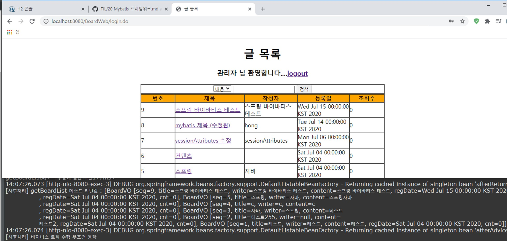

## Spring과 Mybatis 연동
- Mybatis 프레임워크는 iBatis에서 파생되었으므로 Mybatis의 전체적인 구조는 iBatis와 매우 유사하다.
- 기존 BoardWeb 프로젝트로 연동한다

### 라이브러리
- 스프링과 Mybatis 연동에 필요한 라이브러리들을 pom.xml파일에 다음과 같은 `<dependency>`를 추가한다

```xml
<!-- Mybatis -->
<dependency>
	<groupId>org.mybatis</groupId>
	<artifactId>mybatis</artifactId>
	<version>3.3.1</version>
</dependency>
	
<!-- Mybatis Spring -->
<dependency>
	<groupId>org.mybatis</groupId>
	<artifactId>mybatis-spring</artifactId>
	<version>1.2.4</version>
</dependency>
```

### Mybatis 설정 파일 복사 및 수정
- 스프링과 Mybatis연동을 위해 [이전](https://github.com/vvvvvoin/TIL/blob/master/spring/20%20Mybatis%20%ED%94%84%EB%A0%88%EC%9E%84%EC%9B%8C%ED%81%AC.md)에 사용한 `sql-map-config.xml`, `mappings directoty`가 필요하다
- 현재 프로젝트에 src/main/resource소스 폴더에 추가한다.


- `sql-map-config.xml`파일은 다음과 같이 수정한다
```xml
<?xml version="1.0" encoding="UTF-8" ?>
<!DOCTYPE configuration
  PUBLIC "-//mybatis.org//DTD Config 3.0//EN"
  "http://mybatis.org/dtd/mybatis-3-config.dtd">
<configuration>
	<!-- Alias 설정 -->
	<typeAliases>
		<typeAlias alias="board" type="com.springbook.biz.board.BoardVO" />
	</typeAliases>
	
	<!-- Sql Mapper 설정 -->
	<mappers>
		<mapper resource="mappings/board-mapping.xml" />
	</mappers>
</configuration>
```
- 기존에 DB연동과 관련된 `<environments>`태그, DB property 태그인 `<properties>`를 삭제해준다
- DB관련 태그를 삭제한 이유는 두 가지이다
	- 기존 스프링 프레임워크에 이미 등록된 DB 연동설정이 존재하기 때문
	- 그리고 이 연동설정이 트랜잭션 처리처럼 다양한 곳에서 사용할 수 있기에 Mybatis 설정이 아닌 스프링 설정 파일에서 제공한다

- SQL 명령어가 저장된 `Mappers`는 수정할 필요가 없다

### 스프링 연동 설정
- 스프링과 Mybatis를 연동하려면 스프링 설정 파일에 SqlSessionFactoryBean 클래스를 Bean등록해야한다.
- 그래야 SqlSessionFactoryBean 객체로부터 DB연동 구현에 사용할 SqlSession객체를 얻을 수 있다

```xml
<bean id="sessionFactory" class="org.mybatis.spring.SqlSessionFactoryBean">
		<property name="dataSource" ref="dataSource"></property>
		<property name="configLocation" value="classpath:sql-map-config.xml"></property>
	</bean>
```

- 기존에는 다음과 같은 클래스를 작성했었다
```java
public class SqlSessionFactoryBean {
	private static SqlSessionFactory sessionFactory = null;
	static {
		try {
			if(sessionFactory == null) {
				Reader reader = Resources.getResourceAsReader("sql-map-config.xml");
				sessionFactory = new SqlSessionFactoryBuilder().build(reader);
			}
		}catch(Exception e) {
			e.printStackTrace();
		}
	}
	
	public static SqlSession getSqlSessionInstance() {
		return sessionFactory.openSession();
	}
}
```
- 하지만 이 클래스는 Mybatis가 제공하므로 굳이 작성할 필요가 없이 스프링 설정파일에 Bean 등록하면 된다.
- SqlSessionFactoryBean 객체가 SqlSession 객체를 생산하려면 반드시 DataSource와 SQL Mapper정보가 필요하다
- 따라서 등록된 DataSource를 Setter인젝션으로 참조하고, SQL Mapper가 등록된 sql-map-config.xml파일도 Setter인젝션으로 설정해야한다.
- 그래야 bean 등록된 SqlSessionFactoryBean이 SqlSessionFactory객체를 생성할 수 있다

### DAO 클래스 구현
#### 방법 1
- SqlSessionDaoSupport 클래스 상속을 통해 구현할 수 있다
```java
@Repository
public class BoardDAOMybatis extends SqlSessionDaoSupport{
	
	@Autowired
	public void setSqlSessionFactory(SqlSessionFactory sqlSessionFactory) {
		super.setSqlSessionFactory(sqlSessionFactory);
	}

	public void insertBoard(BoardVO vo) {
		getSqlSession().insert("BoardDAO.insertBoard", vo);
	}

	public void updateBoard(BoardVO vo) {
		getSqlSession().update("BoardDAO.updateBoard", vo);
	}

	public void deleteBoard(BoardVO vo) {
		getSqlSession().delete("BoardDAO.deleteBoard", vo);
	}

	public BoardVO getBoard(BoardVO vo) {
		return (BoardVO) getSqlSession().selectOne("BoardDAO.getBoard", vo);
	}

	public List<BoardVO> getBoardList(BoardVO vo) {
		return getSqlSession().selectList("BoardDAO.getBoardList", vo);
	}
}
```
- 재정의한 setSqlSessionFactory() 메소드에 @Autowired를 통해 스프링 컨테이너가 setSqlSessionFactory() 메소드를 자동으로 호출한다.
- 이떄 스프링 설정파일에 bean 등록된 SqlSessionFacotryBean객체를 인자로 받아 부모인 SqlSessionDaoSupport에 setSqlSessionFaoctry() 메소드로 설정해준다.
- 이렇게 해야 SqlSessionDaoSupport 클래스로부터 상속된 getSqlSession() 메소드를 호출하여 SqlSession 객체를 리턴받을 수 있다.

#### 방법2
- SqlSessionTemplate클래스를 bean등록하여 DAO클래스 구현한다
- 스프링설정파일에 template클래스를 등록한다.
```xml
<bean id="sqlSession" class="org.mybatis.spring.SqlSessionFactoryBean">
	<property name="dataSource" ref="dataSource"></property>
	<property name="configLocation" value="classpath:sql-map-config.xml"></property>
</bean>

<bean class="org.mybatis.spring.SqlSessionTemplate">
	<constructor-arg ref="sqlSession"></constructor-arg>
</bean>
```
- SqlSessionTemplate 클래스에는 Setter 메소드가 없어서 Setter인젝션을 할 수 없다
- 따라서 생성자 메소드를 이용한 Constructor주입으로 처리할 수 밖에 없다.
- 그 후 DAO클래스를 구현할때 SqlSessionTemplate객체를 @Autowired를 이용하여 의존성 주입처리하면 SqlSessionTemplate객체로 DB연동 로직을 처리할 수 있다
```java
@Repository
public class BoardDAOMybatis {

	@Autowired
	private SqlSessionTemplate mybatis;

	public void insertBoard(BoardVO vo) {
		mybatis.insert("BoardDAO.insertBoard", vo);
	}

	public void updateBoard(BoardVO vo) {
		mybatis.update("BoardDAO.updateBoard", vo);
	}

	public void deleteBoard(BoardVO vo) {
		mybatis.delete("BoardDAO.deleteBoard", vo);
	}

	public BoardVO getBoard(BoardVO vo) {
		return (BoardVO) mybatis.selectOne("BoardDAO.getBoard", vo);
	}

	public List<BoardVO> getBoardList(BoardVO vo) {
		return mybatis.selectList("BoardDAO.getBoardList", vo);
	}
}
```
### 연동 테스트
- 의존성을 주입할 수 있도록 BoardServiceImpl 클래스를 수정한다.
```java
@Service("boardService")
public class BoardServiceImpl implements BoardService{
	//위에서 만든 BoardDAOMybatis객체를 생성할 수 있도록 해준다
	@Autowired
	private BoardDAOMybatis boardDAO;
	
	public void insertBoard(BoardVO vo) {
		boardDAO.insertBoard(vo);
	}
	....
```




### Dynamic SQL
#### Dynamic SQL 사용하기 전
- 만약 검색기능을 추가하는데 2가지 경우에 따라 기능이 수행된다고 하면 SQL 쿼리문이 다음과 같이 추가 될 것이다

```xml
<select id="getBoardList_T" resultMap="boardResult">
	<![CDATA[
		SELECT *
		FROM BOARD
		WHERE TITLE LIKE '%'||#{searchKeyword}||'%'
		ORDER BY SEQ DESC
	]]>
</select>

<select id="getBoardList_C" resultMap="boardResult">
	<![CDATA[
		SELECT *
		FROM BOARD
		WHERE CONTENT LIKE '%'||#{searchKeyword}||'%'
		ORDER BY SEQ DESC
	]]>
</select>
```
- 검색을 제목, 내용을 나누어 두 가지의 쿼리문이 작성되었다
- 그리고 이에 해당하는 DAO 클래스도 수정이 이루워져야 한다.
```java
public List<BoardVO> getBoardList(BoardVO vo) {
    if(vo.getSearchCondition.equals("TITLE")){
        return mybatis.selectList("BoardDAO.getBoardList_T", vo);
    }else if(vo.getSearchCondition.equals("CONTENT")){
        return mybatis.selectList("BoardDAO.getBoardList_C", vo);
    }
    return null;
}
```
- 이런 방식으로 검색 기능을 구현한다면 이후에 추가되는 검색 조건에 대해서 비슷한 SQL 구문들을 반보갷서 작성해야 할 것이다.
- 이는 결국 유지보수에 어려움으로 이루워질 것이다
- 또한 SQL 구문의 개수만큼 분기 처리 로직을 추가해야하므로 DAO 클래스도 수정해야한다

#### Dynamic SQL 사용한 후
- 이런 SQL의 중복문제를 해결하기 위해 Mybatis는 Dynamic SQL 을 지원한다.
- 기존의 쿼리문을 다음과 같이 수정할 수 있다

```xml
<select id="getBoardList" resultMap="boardResult">
	SELECT *
	FROM BOARD
	WHERE 1 = 1
	<if test="searchCondition == 'TITLE'">
		AND TITLE LIKE '%'||#{searchKeyword}||'%'
	</if>
	<if test="searchCondition == 'CONTENT'">
		AND CONTENT LIKE '%'||#{searchKeyword}||'%'
	</if>
	ORDER BY SEQ DESC
</select>
```
- 수정된 SQL 구문을 보면 `if` 라는 동적 요소를 사용하여 조건에 따른 분기 처리를 하고 있다
- 만약 searchCondition 변수값이 TITLE을 가지고 있으면 제목 검색에 해당하는 조건이 추가되고, CONTENT라는 값을 가지고 있으면 애용 검색에 해당하는 조건이 추가되어 실행된다.
- 이렇게 동적 엘리먼트를 이용하여 SQL을 처리할 수 있으므로 검색과 관련된 쿼리는 하나만 있으면 된다.
- 마찬가지로 DAO클래스 메소드 역시 원래 코드로 유지할 수 있다.
```java
public List<BoardVO> getBoardList(BoardVO vo) {
	return mybatis.selectList("BoardDAO.getBoardList", vo);
}
```
- 이제 새로운 검색 조건이 추가되도 수정할 필요 없어지고 유지보수는 좀 더 편리해질 것이다.