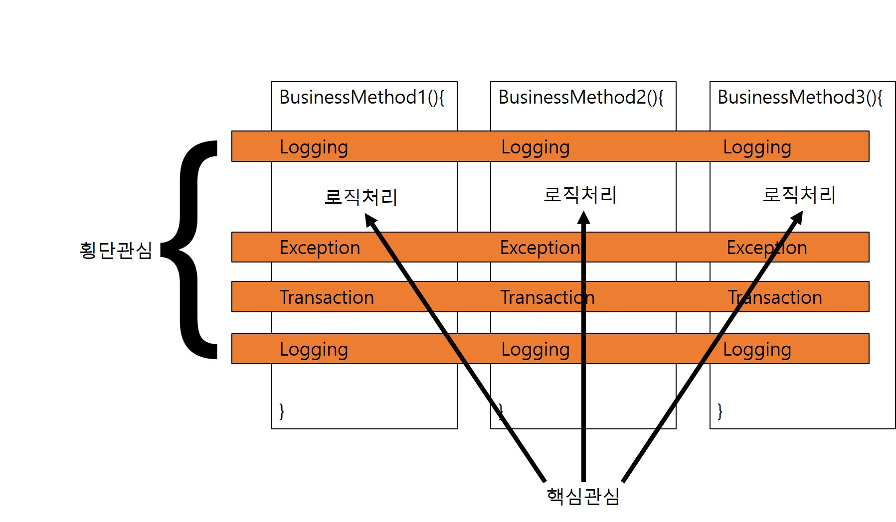
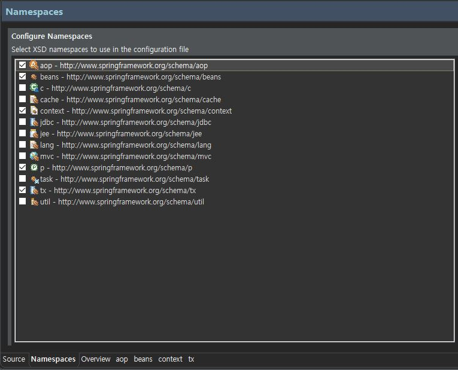
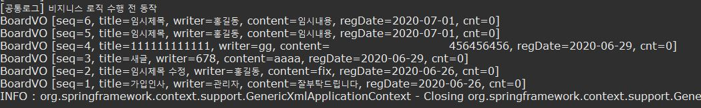

### AOP
#### AOP이해하기
- 애플리케이션의 메소드들은 대부분 다음과 같이 복잡한 코드들로 구성되어 있다

```java
businessMothod(){
	Logging
	비지니스 로직
	Exception Handle
	Transaction Handle
	Logging
}
```
- 핵심 비즈니스 로직은 몇 줄 안되고 주로 로깅, 예외처리, 트랜잭션 처리같은 부가적인 코드가 대부분이다.
- 이런 부가적인 코드로 메소드는 복잡해지고 개발자를 지치게 한다.
- 하지만 이런 부가적인 코드도 비즈니스 로직만큼 중요하기에 소훌히 할 수 없다.
- AOP를 이해하는데 가장 중요한 핵심 개념이 바로 관심 분리이다.
- AOP에서는 메소드마다 공토응로 등장하는 로깅, 예외, 트랜잭션 처리같은 코드들을 횡단 관심이라고 한다.
- 이에 반해 사용자의 요처엥 따라 실제로수행되는 비즈니스 로직을 핵심관심이라고 한다.



- 만약 이 두 관심을 완벽하게 분리할 수 있다면 구현하는 메소드는 간결하고 응집도 높은 코드가 될것이다.
- 문제는 횡단관심에 해당하는 공통코드를 완벽하게 분리하기 어렵다
	- log 클래스를 만들어 Service 클래스의 모든 메소드마다 log를 처리하는 메소드를 모두 넣어줘야한다.
	- 만약 모든 메소드에 처리하였다면, log클래스보다 좋은 성능의 logAdvance 클래스가 나온다면 모든 메소드마다 다 처리를 해줘야한다.
	- 즉 결합력이 매우 높아진 것을 알 수 있다.
- 정리하면 모듈화가 뛰어난 언어로 개발하더라도 공통 모듈에 해당하는 클래스 객체를 생성하고 공통 메소드를 호출하는 코드가 비즈니스 메소드에 있다면 핵심, 횡단 관심을 완벽하게 분리할 수 없다.
- 이를 해결하는 것이 스피링의 AOP이다.

#### AOP 시작하기
##### AOP 라이브러리 추가
- AOP를 적용하기 위해 pom.xml파일에 AOP 라이브러리를 추가한다.
```xml
<!-- AspectJ -->
		<dependency>
			<groupId>org.aspectj</groupId>
			<artifactId>aspectjrt</artifactId>
			<version>${org.aspectj-version}</version>
		</dependency>
		<dependency>
			<groupId>org.aspectj</groupId>
			<artifactId>aspectjweaver</artifactId>
			<version>1.8.8</version>
		</dependency>
```
##### 네임스페이스 추가 및 AOP 설정
- 스프링 설정파일에 Namespace탭을 클릭하여 aop네임스페이스를 추가한다.

- 간단한 Log 클래스 작성한다.
```java
package com.springbook.biz.common;

public class Log{
	public void printLog(){
		System.out.println("[공통로그] 비지니스 로직 수행 전 동작");
	}
}
```
- Log클래스를 스프링 설정파일에 <bean>등록후 AOP관련 설정을 추가한다.

```xml
<!-- aop 처리 -->
<bean id="log" class="com.springbook.biz.Log"></bean>

<aop:config>
	<aop:pointcut expression="execution(* com.springbook.biz..*Impl.get*(..))" id="allPointcut"/>
	<aop:aspect ref="log">
		<aop:before method="printLog" pointcut-ref="allPointcut"/>
	</aop:aspect>
</aop:config>
```



- 후에 더 좋은 Log 클래스가 나왔다면 <bean>의 class와 <aop:before>의 method만 변경해주면 된다.
- 이로써 핵심관심 메소드와 횡단 관심메소드 사이에서 소스상의 결합은 발생하지 않으며, 이것이 AOP를 사용하는 주된 목적이다.


