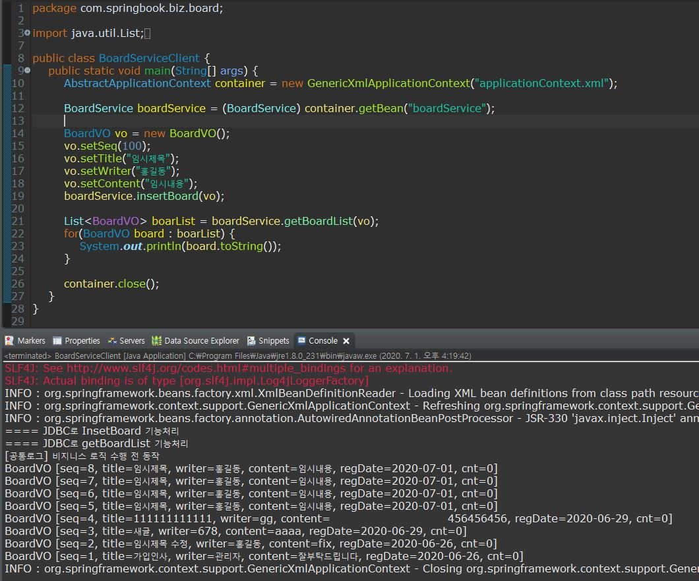

### AOP 용어 및 기본 설정
#### AOP 용어
##### 조인포인트
- 조인포인트는 클라이언트가 호출하는 모든 비즈니스 메소드로서 ServiceImpl 클래스의 모든 메소드를 조인 포인트라고 생각하면 된다.

##### 포인트컷
- 클라이언트가 호출하는 모든 비즈니스 메소드가 조인포인트라면, 포인트컷은 필터링된 조인포인트를 의미한다.
- 수많은 비즈니스 메소드 중에서 우리가 원하는 특정 메소드에서만 횡단 관심에 해당하는 공통 기느을 수행시키기 위해서 포인트 컷이 필요하다.
- 포인터큿을 이용하면 메소드가 포함된 클래스와 패키즈는 물론이고 메소드 시그니처까지 정화하게 지정할 수 있다.

```xml
	<bean id="log" class="com.springbook.biz.common.Log"></bean>
	<aop:config>
		<aop:pointcut expression="execution(* com.springbook.biz..*Impl.*(..))" id="allPointcut"/>
		<aop:pointcut expression="execution(* com.springbook.biz..*Impl.get*(..))" id="getPointcut"/>
		<aop:aspect ref="log">
			<aop:after pointcut-ref="getPointcut" method="printLog"/>
		</aop:aspect>
	</aop:config>
```

- 다음과 같이 설정하면 com.springbook.biz패키로 시작하는 클래스중 Impl로 끝나고 get으로 시작하는 메소드만 포인트 컷으로 지정되었다.



> insert 메소드에는 로그기록이 남지 않는 것을 확인 할 수 있다.
> 
##### 어드바이스
- 어드바이스는 횡단 관심에 해당하는 공통 기능의 코드를 의미한다.
- 어드바이스로 구현된 메소드가 언제 동작할지 스프링 설정 파일을 통해서 지정할 수 있다.
- 스프링에서는 어디바이스 동작 시점을 before, after, after-returning, after-throwing, around 다섯 가지로 지정할 수 있다.

```xml
<aop:after pointcut-ref="getPointcut" method="printLog"/>
<aop:before pointcut-ref="getPointcut" method="printLog"/>
```

##### 위빙
- 위빙은 포인트컷으로 지정한 핵신 관심 메소드가 호출될 때 어드바이스에 해당하는 횡돤 관심 메소드가 삽입되는 과정을 의미한다.
- 위빙을 통해서 비즈니스 메소드를 수정하지 않고도 횡단 관심에 해당하는 기능을 추가하거나 변경할 수 있다.

##### 애스팩트 또는 어드바이저
- AOP의 핵심은 바로 애스팩트이다
- 애스팩트는 포인트컷과 어드바이저의 결합으로서 어떤 포인트컷 메소드에 대해서 어떤 어드바이스 메소드를 실행할지 결정한다.


- getPointcut으로 설정된 메소드가 호출될 때(1), log라는 어드바이스 객체(2)의 printLog()메소드가 실행되고(3), 이때 printLog() 메소드 동작 시점이 aop:after (4)의 설정이다.

#### AOP 엘리먼트
##### aop:config
- aop설정에서 aop:config 는 루트 엘리먼트이다.
- 스프링 설정파일에 aop:config 엘리먼트는 여러 번 사용할 수 있으며, aop:pointcut, aop:aspect가 하위에 위치해야한다

##### aop:pointcut
- aop:pointcut은 포인트컷을 지정한다.
- aop:config의 자식이나  aop:aspect의 자식 엘리먼트로 사용된다.
- aop:aspect하위에 설정된 포인트컷은 해당 aop:aspect에서만 사용할 수 있다.
```xml
<aop:config>
	<aop:pointcut expression="execution(* com.springbook.biz..*Impl.*(..))" id="allPointcut"/>
	<aop:aspect ref="log">
		<aop:after pointcut-ref="allPointcut" method="printLog"/>
	</aop:aspect>
</aop:config>
```

- allPointcut이라는 포인트컷은 com.springbook.biz 패키지로 시작하는 클래스 중에서 이름이 Impl로 끝나는 클래스의 모든 메소드를 포인트컷으로 설정하고 있다.
- 그리고 애스팩트 설정에서 aop:before 엘러먼트의 pintcut-ref 속성으로 포인터컷을 참조하고 있다.
##### aop:aspect
- 애스팩트 aop:aspect 엘리먼트로 설정하며, 핵심관심에 해당하는 포인트컷 메소드와 횡단 관심에 해당하는 어드바이스 메소드를 결합하기 위해 사용한다.


##### aop:advisor
- aop:advisor 엘리먼트는 포인트컷과 어드바이스를 결합한다는 점에서 애스팩트와 같은 기능을 한다.
- 하지만 트랜잭션 설정 같은 몇몇 특수한 경우에는 애스팩트가 아닌 어드바이저를 사용해야한다.
- 만약에 어드바이스 객체의 아이디를 모르거나 메소드 이름을 확인할 수 없을 때는 애스팩트를 설정할 수 없다.
- 다음은 트랜잭션 처리 관련 설정이 포홤된 스프링 설정파일이다.
- 여기서 핵심은 트랜잭션관리 어드바이스 설정인데, 이 어드바이스의 아이디는 txAdvice로 설정했다.
- 하지만 문제는 이 어드바이스의 메소드 이름을 확인할 수 없다는 것이다.

```xml
<bean id="txManager" class="org.springframework.jdbc.datasource.DataSourceTransactionManager">
		<property name="entityManagerFactory" ref="entityManagerFactory"></property>
</bean>
	
<tx:advice id="txAdvice" transaction-manager="txManager">
	<tx:attributes>
		<tx:method name="get*" read-only="true"/>
		<tx:method name="*"/>
	</tx:attributes>
</tx:advice>

<aop:config>
	<aop:pointcut id="allPonintcut"  expression="execution(* com.springbook.biz..*(..))"/>
	
	<aop:advisor pointcut-ref="allPonintcut" advice-ref="txAdvice"/>
</aop:config> -->
```

- 스프링 컨테이너는 설정 파일에 등록된 tx:advice 엘러먼트를 해석하여 트랜잭션 관리기능의 어드바이스 객체를 메모리에 생성한다.
- 어떻게 tx:advice를 설정하느냐에 따라 생성되는 어드바이스의 기능과 동작 방식은 달라진다.
- 하지만 문제는 어렇게 생성된 어드바이스의 아이디는 확인되지만 메소드 이름은 확인할 방법이 없다.
- 이때에는 aspect를 쓰지못하고 advisor를 사용해야한다.


