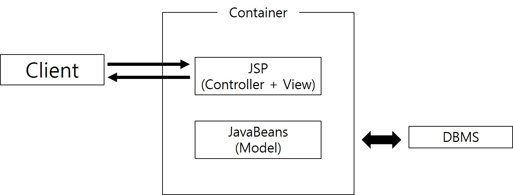
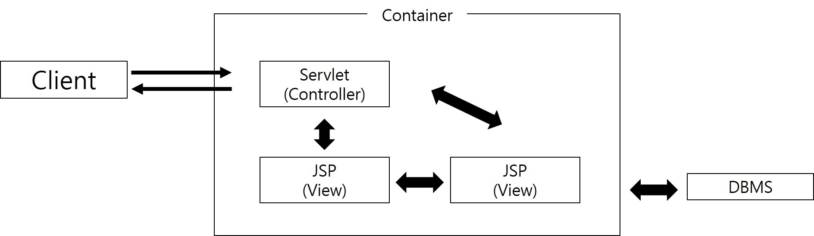

## MODEL 1
- 90년대 부터 2000년대 초까지는 자바 기반의 웹 애플리케이션 개발에 Model 1 아키텍처가 사용되었다.

- Model 1 아키텍처에서는 JSP파일이 가장 중요한 역할을 수행한다.
- JSP가 Controller, view 기능을 모두 처리하기 때문이다.
- 결과적으로 JSP파일에 자바 코드와 마크업 관련 코드들이 뒤섞여 있어서 역할 구분이 명확하지 않고, JSP 파일에 대한 디버깅과 유지보수에 많은 어려움이 생길수 밖에 없다.
- 따라서 Model1 구조는 적은 개발인력으로 간단한 프로젝트를 수행하는데 무리는 없지만, 엔터프라이즈급의 복잡한 시스템에는 부적절한 모델이다.
- 그래서 등장한 것이 Model 2 즉 MVC 아키텍처이다.
- model, view, controller 요소로 기능을 분리하여 개발한다

[모델1](https://github.com/vvvvvoin/TIL/tree/master/spring/board_jsp)

## MODEL 2
- 모델1은 자바 로직과 화면 디자인이 통합되어 유지보수가 어렵다
- 이를 고안한게 Controller이다.
- 모델2는 기존에 JSP가 담당했던 Controller로직이 별도의 Controller기능의 서블릿으로 옮겨졌다.
- 따사서 기존의 모델1 아키텍처로 개발한 프로그램에서 JSP파일에 있는 자바코드만 Controller로 이동하면 모델2가 된다.
- 결과적으로 Controller로직이 사라진 JSP에는 View와 관련된 디자인만 남게 된다.

### Controller 구현하기
#### 서블릿 생성 및 등록
- 이클립스 프로젝트 탐색창에서 [new] > [serlvet]을 선택
- 패키지, 클래스명을 정하고 next, URL mapping 의 /action의 pattern을 *.do 로 설정후 완료하면 DispatcherServlet클래스가 만들어진다.
#### Controller 서블릿 구현
- 서블릿 클래스가 만들어질 때 자동으로 추가되는 주석은 모두삭제한다.
```java
public class DispatcherServlet extends HttpServlet {
	private static final long serialVersionUID = 1L;

	public DispatcherServlet() {
		super();
	}

	protected void doGet(HttpServletRequest request, HttpServletResponse response)
			throws ServletException, IOException {
		process(request, response);
	}

	protected void doPost(HttpServletRequest request, HttpServletResponse response)
			throws ServletException, IOException {
		request.setCharacterEncoding("EUC-KR");
		process(request, response);
	}

	private void process(HttpServletRequest request, HttpServletResponse response) throws IOException {
		// 1. 클라이언트의 요청 path 정보를 추출한다.
		String uri = request.getRequestURI();
		String path = uri.substring(uri.lastIndexOf("/"));
		System.out.println(path);

		// 2. 클라이언트의 요청 path에 따라 적절히 분기처리 한다.
		if (path.equals("/login.do")) {
			System.out.println("로그인 처리");
			// 1. 사용자 입력 정보 추출
			String id = request.getParameter("id");
			String password = request.getParameter("password");

			// 2. DB 연동 처리
			UserVO vo = new UserVO();
			vo.setId(id);
			vo.setPassword(password);
			UserDAO userDAO = new UserDAO();
			UserVO user = userDAO.getUser(vo);

			// 3. 화면 네비게이션
			if (path.equals("/login.do")){
                System.out.println("로그인 처리");
            } else if (path.equals("/logout.do")) {
				System.out.println("로그아웃 처리");
			} else if (path.equals("/insertBoard.do")) {
				System.out.println("글 등록 처리");
			} else if (path.equals("/updateBoard.do")) {
				System.out.println("글 수정 처리");
			} else if (path.equals("/deleteBoard.do")) {
				System.out.println("글 삭제 처리");
			} else if (path.equals("/getBoard.do")) {
				System.out.println("글 상세 조회 처리");
			} else if (path.equals("/getBoardList.do")) {
				System.out.println("글 목록 검색 처리");
			}
	}
}
```

- DispatcherServlet에는 GET, POST방식에 따른 각각의 메소드가 정의되어있지만 어떤 방식이든 process() 메소드를 통해 클라이언트 요청을 받는다.
- 또한 POST방식에서 한글이 깨지지 않도록 인코딩을 추가한다.
- DispatcherServlet에 가장 주용한 process() 메소드에서는 가장 먼저 클라이언트 요청 URI로부터 path정보를 추출하는데 이때 추출된 path는 URI 문자열에서 마지막 /xxxx.do 문자열이다
- 추출된 path 문자열에 따라서 복잡한 분기처리 로직이 실행된다.

### 기능구현하기
#### 로그인
- 로그인 기능을 MVC로 변환하려면 login.jsp파일의 form엘러먼트의 action속성값을 login.do로 수정한다.
- *.do 형태의 요청에 대해서만 DispatcherServlet이 동작하기 때문이다.

```html
....
<form action="login.do" method="post">
		<table border="1" cellpadding="0" cellspacing="0">
		 	<tr>
		 		<td bgcolor="orange">아이디</td>
....
```
- login_proc.jsp 파일에 있는 모든 자바 로직을 DispatcherServlet에 추가한다.
> proc파일은 [모델1](https://github.com/vvvvvoin/TIL/tree/master/spring/board_jsp)를 참조한다
```java
....
if (path.equals("/login.do")) {
	System.out.println("로그인 처리");
	// 1. 사용자 입력 정보 추출
	String id = request.getParameter("id");
	String password = request.getParameter("password");
		// 2. DB 연동 처리
	UserVO vo = new UserVO();
	vo.setId(id);
	vo.setPassword(password);
	UserDAO userDAO = new UserDAO();
	UserVO user = userDAO.getUser(vo);

	// 3. 화면 네비게이션
	if (user != null) {
		response.sendRedirect("getBoardList.jsp");
	} else {
		response.sendRedirect("login.jsp");
	}
} else if (path.equals("/logout.do")) {
	System.out.println("로그아웃 처리");
....
```
#### 로그아웃
- logout_proc.jsp링크를 logout.do 링크로 수정
```html
....
<h3>
	테스트님 환영합니다...<a href="logout.do">Log-out</a>
</h3>
....
```
- logout_proc.jsp파일의 로직을 DispatcherServlet 클래스 /logout.do 분기에 복사한다.
```java
....
} else if (path.equals("/logout.do")) {
	System.out.println("로그아웃 처리");
	
	// 1. 브라우저와 연결된 세션 객체를 강제 종료한다.
	HttpSession session = request.getSession();
	session.invalidate();
	// 2. 세션 종료 후, 메인 화면으로 이동한다.
	response.sendRedirect("login.jsp");
} else if (path.equals("/insertBoard.do")) {
....
```
#### 글 목록 검색
- 로그인 기능과 마찬로 getBoardList.jsp파일에서 Controller로직에 해당하는 자바코드를 DispatcherServlet에 복사한다.

```java
....
else if (path.equals("/getBoardList.do")) {
	System.out.println("글 목록 검색 처리");
	
	BoardVO vo = new BoardVO();
	BoardDAO boardDAO = new BoardDAO();
	List<BoardVO> boardList = boardDAO.getBoardList(vo);
	
	HttpSession session = request.getSession();
	session.setAttribute("boardList", boardList);
	response.sendRedirect("getBoardList.jsp");
}
....
```
- 리다이렉트되는 getBoardList.jsp 화면에서 검색 결과를 출력하기 위해 세션 객채를 사용한다.
- 검색 결과를 JSP에 공유하기 위해 세션에 저장하는 것은 문제가 있다.
- 세션은 브라우저당 서버 메모리에 하나씩 유지되는 객체이므로 사용자가 많을수록 많인 세션이 생성되고, 세션에 정보가 많이 저장될수록 서버입장에서는 부답스럽다.
- 따라서 검색 결과는 세션이 아닌 HttpServletRequest객체에 저장하여 공유해야한다.
- HttpServletRequest객체는 클라이언트가 서버에 요청을 전송할 때마다 매번 새롭게 생성되고 응답메시지가 브라우저에 전ㅅ공되면 바로 삭제되는 1회성 객체이므로 공유할 데이터를 HttpServletRequest에 저장하면 서버에 부담되지 않는다.
> 간결한 코드 사용위해 session을 사용함 추후에 Spring MVC로 변환하면로 HttpServletRequest로 수정할 것임

- getBoardList.jsp 파일은 글 몰록을 검색하는 자바 코드 대신에 세션에 저장된 글 목록을 꺼내서 출력하도록 한다.
```html
<%@page contentType="text/html; charset=EUC-KR"%>

<%
	List<BoardVO> boardList = (List) session.getAttribute("boardList");
%>
<!DOCTYPE html PUBLIC "-//W3C//DTD HTML 4.01 Transitional//EN"
....
```
- 하지만 getBoardList.jsp파일을 직접 요청하거나 login.jsp파일을 통해 로그인을 성공하면 오류화면을 볼 수 있다.
- getBoardList.jsp 파일에서 세션에 저장된 글 몰록을 꺼내려면 당연히 DispatcherServlet이 먼저 실행되어 검색 결과를 세션에 저장해야 하므로 반드시 브라우저는 "/getBoardList.do"로 요청해야한다.
- 따라서 글 목록 화면을 출력하려면 getBoardList.jsp파일을 직접요청하는 않고 getBoardList.do를 요청해야한다. 로그인에 성공했을 때도 글 몰록을 정상 출력하려면 getBoardList.do로 수정한다.
```java
....
	// 3. 화면 네비게이션
	if (user != null) {
		response.sendRedirect("getBoardList.do");
	} else {
		response.sendRedirect("login.jsp");
	}
} else if (path.equals("/logout.do")) {
	System.out.println("로그아웃 처리");
....
```
> 글 상세조회도 위와 같은 패턴을 통해 처리할 수 있다.

#### 글 등록, 수정, 삭제

- 등록, 수정, 삭제 기능을 MVC로 변환라려먼 각각의 jsp파일의 form엘리먼트의 action속성값을 xxxx.do로 수정한다.
- 그리고 xxxx_proc.jsp파일에 자바코드를 DispatcherServlet 클래스의 각 분기마다 복사한다.
```java
....
} else if (path.equals("/insertBoard.do")) {
	System.out.println("글 등록 처리");
 
 	// 1. 사용자 입력 정보 추출
	request.setCharacterEncoding("EUC-KR");
	String title = request.getParameter("title");
	String writer = request.getParameter("writer");
	String content = request.getParameter("content");
	
	// 2. DB 연동 처리
	BoardVO vo = new BoardVO();
	vo.setTitle(title);
	vo.setWriter(writer);
	vo.setContent(content);
	BoardDAO boardDAO = new BoardDAO();
	boardDAO.insertBoard(vo);
	
	// 3. 화면 네비게이션
	response.sendRedirect("getBoardList.jsp");
} else if (path.equals("/updateBoard.do")) {
....
```
> 나머지 삭제, 수정 코드또한 proc.jsp에 로직을 DispatcherServlet의 분기마다 복사한다.


- 먼저 model 기능의 vo, dao 클래스는 재사용 되었고, DispatcherServlet이라는 Controller 기능의 서블릿 클래스가 추가되었다.
- 가장큰 변화는 View기능의 jsp파일인데 Controller기능의 자바로직이 DispatcherServlet로 이동하여 xxxx_proc.jsp파일이 모두 삭제됬다.
- 또한 gerBoard.jsp, getBoardList.jsp파일에도 Controller자바 로직은 사라진 상태다.

> getBoard, getBoardList에는 아직까지 자바코드 for루프가 남아있다.
> 하지만 이런코드를 Controller 로직이라고 하지 않아 의미는 없다
> 이런 자바코드는 EL, jSTL을 이용하여 제거가능하다


