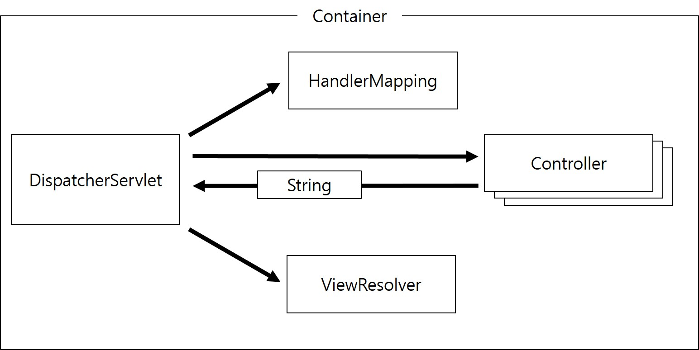
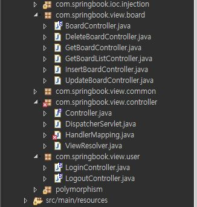

## MVC 프레임워크 개발
### MVC 프레임워크 구조
- DispatcherServlet 클래스 하나로 Controller 기능을 구현했다.
- 하지만 이렇게 하나의 서블릿으로 Controller를 구현하면 클라이언트의 모든 요청을 하나의 서블릿이 처리하게 된다.
- 따라서 수많은 분기 처리 로직을 가질 수밖에 없고, 이는 오히려 개발과 유지보수를 어렵게 만든다.
```java
private void process(HttpServletRequest request, HttpServletResponse response) throws IOException {
		// 1. 클라이언트의 요청 path 정보를 추출한다.
		String uri = request.getRequestURI();
		String path = uri.substring(uri.lastIndexOf("/"));
		System.out.println(path);

		// 2. 클라이언트의 요청 path에 따라 적절히 분기처리 한다.
		if (path.equals("/login.do")) {
			System.out.println("로그인 처리");
		} else if (path.equals("/logout.do")) {
			System.out.println("로그아웃 처리");
		} else if (path.equals("/insertBoard.do")) {
			System.out.println("글 등록 처리");
		} else if (path.equals("/updateBoard.do")) {
			System.out.println("글 수정 처리");
		} else if (path.equals("/deleteBoard.do")) {
			System.out.println("글 삭제 처리");
		} else if (path.equals("/getBoard.do")) {
			System.out.println("글 상세 조회 처리");
		} else if (path.equals("/getBoardList.do")) {
			System.out.println("글 목록 검색 처리");
		}
	}
```

- 위 코드가 분기 처리 로직 대신 간단한 메시지를 출력하였지만, 이전 DispatcherServlet 클래스는 더욱 복잡하다.
- 이런 구현은 특정 기능을 찾고 수정하는게 쉽지가 않다.
- 결국 Controller를 서블릿 클래스 하나로 구현하는 것은 여러 측면에서 문제가 있다.
- 하지만 프레임워크에서 제공하는 Controller를 사용하면 우리가 직접 Controller를 구현하지 않아도 된다.
- Spring같은 MVC프레임워크를 사용하는 이유가 이런 프레임워크들이 효율적인 Controller를 제공하기 때문이다.
- 이 문서에서는 Spring MVC를 적용하기 전에 Spring MVC와 동일한 구조의 프레임워크를 적용한다.


### MVC 프레임워크 구현
#### Controller 인터페이스 작성
- Controller를 구성하는 요소 중에서 DispatcherServlet은 클라이언트의 요청을 가장 먼저 받아들이는 Controller이다
- 하지만 클라이언트 요청을 처리하기 위해 DispatcherServlet이 하는일은 거싀 없고, 실질적인 요청 처리는 각Controller에서 담당한다
- 구체적인 Controller 클래스들을 구현하기에 앞서 모든 Controller를 같은 타입으로 관리하기 위해 인터페이스를 만들어야 한다.
- DispatcherServlet은 HandlerMapping을 통해 Controller객체를 검색하고, 검색된 Controller를 실해한다.
- 이때 어떤 Controller 객체가 검색되더라도 같은 코드로 실행하려면 모든 Controller의 최상위 인터페이스가 필요하다.
```java
package com.springbook.view.controller;

import javax.servlet.http.HttpServletRequest;
import javax.servlet.http.HttpServletResponse;

public interface Controller {
	String handleRequest(HttpServletRequest request, HttpServletResponse response);
}
```
#### Controller  클래스 구현
- Controller인터페이스를 구현한 LoginController 클래스를 만든다.
- 기존 DispatcherServle 클래스의 소스를 복사한다.
```java
package com.springbook.view.user;

import javax.servlet.http.HttpServletRequest;
import javax.servlet.http.HttpServletResponse;

import com.springbook.biz.user.UserVO;
import com.springbook.biz.user.impl.UserDAO;
import com.springbook.view.controller.Controller;

public class LoginController implements Controller {

	@Override
	public String handleRequest(HttpServletRequest request, HttpServletResponse response) {
		System.out.println("로그인 처리");
		
		// 1. 사용자 입력 정보 추출
		String id = request.getParameter("id");
		String password = request.getParameter("password");

		// 2. DB 연동 처리
		UserVO vo = new UserVO();
		vo.setId(id);
		vo.setPassword(password);

		UserDAO userDAO = new UserDAO();
		UserVO user = userDAO.getUser(vo);

		// 3. 화면 네비게이션
		if (user != null) {
			return "getBoardList.do";
		} else {
			return "login";
		}
	}
}
```
- 로그인 처리 소스는 DispatcherServlet의 로그인 처리 기능과 같다
- 하지만 Controller인터페이스의 handlerRequest() 메소드를 재정의했으므로 로그인 처리 기능의 마지막은 이동할 화면을 리다이렉트하지 않고 리턴하는 것으로 처리한다.
- 로그인 실패시 login.jsp가 아닌 login 이다
- 이는 다음에 추가될 ViewResolver 클래스를 만듬으로써 자동적으로 .jsp확장자가 붙어서 처리되는 것을 알 수 있다.

#### HandlerMapping 클래스
- HandlerMapping은 모든 Controller 객체를 저장하고 있다가, 클라이언트의 요청이 들어오면 처리할 특정 Controller를 검색하는 기능을 제공한다.
- HandlerMapping객체는 DispatcherServlet이 사용하는 객체이다.
- 따라서 DispatcherServlet이 생성되고 init() 메소드가 호출될 떄 단한번 생성된다.
```java
package com.springbook.view.controller;

import java.util.HashMap;
import java.util.Map;

import com.springbook.view.board.DeleteBoardController;
import com.springbook.view.board.GetBoardController;
import com.springbook.view.board.GetBoardListController;
import com.springbook.view.board.InsertBoardController;
import com.springbook.view.board.UpdateBoardController;
import com.springbook.view.user.LoginController;
import com.springbook.view.user.LogoutController;

public class HandlerMapping {
	private Map<String, Controller> mappings;

	public HandlerMapping(){
		mappings = new HashMap<String, Controller>();
		mappings.put("/login.do", new LoginController());
	}
	
	public Controller getController(String path) {
		return mappings.get(path);
	}	
}
```
- HandlerMappin은 Map 타입의 켈렉션을 멤버변수로 가지고 있으면서 게시판 프로그램에 필요한 모든 Controller 객체들을 등록하고 관리한다.
- getController 메소드 는 매개변수로 받은 path에 해당하는 Controller 객체를 HashMap 컬렉션으로부터 검색하여 리턴한다.
- 지속적으로 Controller객체가 추가되고, HashMap에 등록된 정보를 보면 Controller객체가 어던 .do 요청과 매핑되는지 확인할 수 있다.

#### ViewResolver 클래스
- ViewResolver 클래스는 Controller가 리턴한 View 이름에 접두사와 접미사를 결합하여 최종으로 실해오딜 View경로와 파일명을 완성한다. 
- ViewResolver도 HandlerMaapping과 마찬가지로 DispatcherSerlvet의 init()메소드가 호출될때 생성된다.
```java
package com.springbook.view.controller;

public class ViewResolver {
	public String prefix;
	public String suffix;
	
	public void setPrefix(String prefix) {
		this.prefix = prefix;
	}
	public void setSuffix(String suffix) {
		this.suffix = suffix;
	}
	
	public String getView(String viewName) {
		return prefix + viewName + suffix;
	}
}
```
#### DispatcherSerlvet 클래스 수정
- DispatcherSerlvet은 Controller 기능을 하는 클래스로서 Controller 구성 요소 중 가장 중요한 역할을 한다.
```java
package com.springbook.view.controller;

import java.io.IOException;

import javax.servlet.ServletException;
import javax.servlet.http.HttpServlet;
import javax.servlet.http.HttpServletRequest;
import javax.servlet.http.HttpServletResponse;

public class DispatcherServlet extends HttpServlet {
	private static final long serialVersionUID = 1L;
	private HandlerMapping handlerMapping;
	private ViewResolver viewResolver;
	
	public void init() throws ServletException{
		handlerMapping = new HandlerMapping();
		viewResolver = new ViewResolver();
		viewResolver.setPrefix("./");
		viewResolver.setSuffix(".jsp");
	}
    
	protected void doGet(HttpServletRequest request, HttpServletResponse response)
			throws ServletException, IOException {
		process(request, response);
	}

	protected void doPost(HttpServletRequest request, HttpServletResponse response)
			throws ServletException, IOException {
		request.setCharacterEncoding("UTF-8");
		process(request, response);
	}

	private void process(HttpServletRequest request, HttpServletResponse response) throws IOException{
		String uri = request.getRequestURI();
		String path = uri.substring(uri.lastIndexOf("/"));
		
		Controller ctrl = handlerMapping.getController(path);
		String viewName = ctrl.handleRequest(request, response);
		
		String view = null;
		if(!viewName.contains(".do")) {
			view = viewResolver.getView(viewName);
		}else {
			view = viewName;
		}
		response.sendRedirect(view);
	}
}
```

- 수정된 DispatcherSerlvet 클래스에는 init()메소드가 재정의 되어 있다.
- 서블릿의 init() 메소드는 서블릿 객체가 생성된 후에 멤버젼수를 초기화하기 위해 자동으로 실행된다.
- 따라서 HandlerMapping, ViewResolver객체가 초기화된다.

기능처리 순서


1. 클라이언트가 요청하면 DispatcherServlet이 요청을 받느다
2. DispatcherServlet은 HandlerMapping객체를 통해 요청을 처리할 Controller를 검색한다
3. 검색된 Controller의 handerlRequset()메소드를 호출하여 로직이 처리됨
4. 처리 후에 이동할 화면 정보가 리턴된다
5. DispatcherServlet은 ViewResolver를 통해 접두사와 접미사가 붙은 JSP파일의 이름과 경로를 리턴받는다.
6. JSP를 실행하고 실행결과가 브라우저에 응답된다.

### MVC프레임워크 적용
#### 글 목록 검색 구현
- 이전에는 로그인에 대한 프레임워크 구현을 했었다.
- 지금부터는 Controller인터페이스를 구현한 GetBoardLIstController클래스를 작성한다.
```java
package com.springbook.view.board;

import java.util.List;

import javax.servlet.http.HttpServletRequest;
import javax.servlet.http.HttpServletResponse;
import javax.servlet.http.HttpSession;

import com.springbook.biz.board.BoardVO;
import com.springbook.biz.board.impl.BoardDAO;
import com.springbook.view.controller.Controller;

public class GetBoardListController implements Controller {

	@Override
	public String handleRequest(HttpServletRequest request, HttpServletResponse response) {
		System.out.println("글 목록 검색 처리");
		// 1. 사용자 입력 정보 추출(검색 기능은 나중에 구현)
		// 2. DB 연동 처리
		BoardVO vo = new BoardVO();
		BoardDAO boardDAO = new BoardDAO();
		List<BoardVO> boardList = boardDAO.getBoardList(vo);
		// 3. 검색 결과를 세션에 저장하고 목록 화면을 리턴한다.
		HttpSession session = request.getSession();
		session.setAttribute("boardList", boardList);
		return "getBoardList";
	}
}
```
- jsp 이름을 확장 없이 리턴하고 있는데 이는 ViewResolver를 이용하여 View이름을 완성하기에 생략했다.
- GetBoardListController객체를 HandlerMapping 에 등록한다.
```java
public class HandlerMapping {
	private Map<String, Controller> mappings;

	public HandlerMapping(){
		mappings = new HashMap<String, Controller>();
		mappings.put("/login.do", new LoginController());
		mappings.put("/getBoardList.do", new GetBoardListController());
	}
	
	public Controller getController(String path) {
		return mappings.get(path);
	}	
}
```
#### 글 등록, 수정, 삭제 구현
- 기존 DispatcherSerlvet에서 글 등록 관련 소스를 복사하여 InsertBoardController 클래스를 작성한다.
> 등록, 수정,삭제의 형태는 같기에 등록만 구현
```java
package com.springbook.view.board;

import javax.servlet.http.HttpServletRequest;
import javax.servlet.http.HttpServletResponse;

import com.springbook.biz.board.BoardVO;
import com.springbook.biz.board.impl.BoardDAO;
import com.springbook.view.controller.Controller;

public class InsertBoardController implements Controller {

	@Override
	public String handleRequest(HttpServletRequest request, HttpServletResponse response) {
		System.out.println("글 등록 처리");
		
		// 1. 사용자 입력 정보 추출
		// request.setCharacterEncoding("EUC-KR");
		String title = request.getParameter("title");
		String writer = request.getParameter("writer");
		String content = request.getParameter("content");
		
		// 2. DB 연동 처리
		BoardVO vo = new BoardVO();
		vo.setTitle(title);
		vo.setWriter(writer);
		vo.setContent(content);
		
		BoardDAO boardDAO = new BoardDAO();
		boardDAO.insertBoard(vo);
		
		// 3. 화면 네비게이션
		return "getBoardList.do";
	}
}
```
- 메소드 처리 후에 getBoardList.do 문자열을 리턴하는 이유는 글 등록에 성공하면 등록된 글이 포함된 글 목록을 다시 검색해야하기 때문이다.
- 따라서 getBoardList.do 문자열을 리턴하여 리다이렉트 처리한다.
- 마찬가지로 HandlerMaaping 클래스에도 등록한다.
```java
public class HandlerMapping {
	private Map<String, Controller> mappings;

	public HandlerMapping(){
		mappings = new HashMap<String, Controller>();
		mappings.put("/login.do", new LoginController());
		mappings.put("/getBoardList.do", new GetBoardListController());
		mappings.put("/insertBoard.do", new InsertBoardController());
	}
	
	public Controller getController(String path) {
		return mappings.get(path);
	}	
}
```
#### 로그아웃 구현
- DispatcherSerlvet에서 로그아웃 소스를 복사하여 LogoutController 클래스를 작성한다.

```java
package com.springbook.view.user;

import javax.servlet.http.HttpServletRequest;
import javax.servlet.http.HttpServletResponse;
import javax.servlet.http.HttpSession;

import com.springbook.view.controller.Controller;

public class LogoutController implements Controller {

	@Override
	public String handleRequest(HttpServletRequest request, HttpServletResponse response) {
		System.out.println("로그아웃 처리");
		
		// 1. 브라우저와 연결된 세션 객체를 강제 종료한다.
		HttpSession session = request.getSession();
		session.invalidate();
		
		// 2. 세션 종료후, 메인 화면으로 이동한다.
		return "login";
	}
}
```
- HandlerMapping에 등록한다.

```java
public class HandlerMapping {
  private Map<String, Controller> mappings;
  
  public HandlerMapping() {
  	mappings = new HashMap<String, Controller>();
  	mappings.put("/login.do", new LoginController());
  	mappings.put("/getBoardList.do", new GetBoardListController());
  	mappings.put("/getBoard.do", new GetBoardController());
  	mappings.put("/insertBoard.do", new InsertBoardController());
  	mappings.put("/updateBoard.do", new UpdateBoardController());
  	mappings.put("/deleteBoard.do", new DeleteBoardController());
  	mappings.put("/logout.do", new LogoutController());		
  }
  
  public Controller getController(String path) {
  	return mappings.get(path);
  }
}
```
> 나머지 세부 글, 삭제, 수정도 구현해준다.
> 


- Controller를 구성하는 클래스를 개발하면 너무나 복잡한 구조와 수많은 클래스때문에 혼란스러울 수 있다.
- 하지만 Controller를 통해 구현하는 이유는 DispatcherServlet 클래스는 유지보수 과정에서 기존의 기능을 수정하거나 새로운 기능을 추가허더라도 절대 수정되지 않는다.
- 예를 들어 특정 기능을 추가한다면, 관련 Controller클래스를 작성하고 HandlerMapping에 관련 Controller객체를 등록하면 된다.
- 이 과정에서 DispatcherServlet 클래스의 수정이 필요가 없다