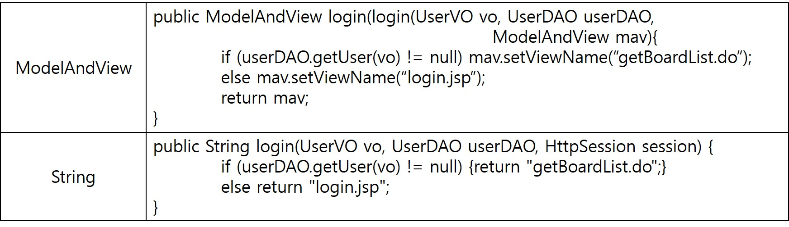

## Spring MVC Annotation
- 스프링은 어토네이션 기반 설정을 제공함으로써 과도한 XML 설정으로 인한 문제를 해결한다.
- 스프링 MVC도 스프링 설정 파일에 HandlerMapping, Controller, ViewResolver같은 클래스를 등록해야 하므로 어노테이션 설정으로 활용하여 XML설정을 최소화할 필요가 있다.

### 어노테이션 관련 설정
- 기존 [SpringMVC](https://github.com/vvvvvoin/TIL/blob/master/spring/Spring%20MVC.md)의 presentation-layer.xml 모든 HandlerMapping, Controller, ViewResolver bean 을 삭제하고 context:component-scan 엘리먼트로 대체한다.
```xml
<?xml version="1.0" encoding="UTF-8"?>
<beans xmlns="http://www.springframework.org/schema/beans"
	xmlns:xsi="http://www.w3.org/2001/XMLSchema-instance"
	xmlns:context="http://www.springframework.org/schema/context"
	xsi:schemaLocation="http://www.springframework.org/schema/beans
                        http://www.springframework.org/schema/beans/spring-beans.xsd
						http://www.springframework.org/schema/context
                        http://www.springframework.org/schema/context/spring-context-4.2.xsd">

	<context:component-scan base-package="com.springbook.view"></context:component-scan>
</beans>
```

- 기존 [SpringMVC](https://github.com/vvvvvoin/TIL/blob/master/spring/Spring%20MVC.md)의 ViewResolver 설정을 삭제하기 위해 getBoard, getBoardList.jsp 파일을 src/main/webapp폴더로 되돌려 놓는다.

### @Controller 사용하기
- 기존 스프링MVC에서는 컨테이너가 Controller 클래스를 생성하기 위해서 Controller클래스들을 bean 등록해야 했다.
- 하지만 어노테이션을 사용하면 일일이 bean등록없이 클래스 선언부에 @Controller를 선언하면된다.
- @Component를 상속한 @Controller는 @Controller가 붙은 클래스의 객체를 메모리에 생성하는 기능을 제공한다.
- 또한 DispatcherServlet이 인식하는 Controller객체로 만들어 준다.
- 기존 스프링MVC에서는 @Controller를 사용하지 않아 스프링에서 제공하는 Controller 인터페이스를 구현해야했다.
- 그리고 handleRequest() 메소드를 반드시 재정의 하여 DispatcherServlet이 모든 Controller의 handleRequest메소드를 호출할 수 있도록 해야했다.
```java
import org.springframework.web.servlet.mvc.Controller;

//Controller 인터페이스를 구현
public class InsertBoardController implements Controller {
    // handleRequest() 메소드를 반드시 재정의 하여 DispatcherServlet이 모든 Controller의 handleRequest메소드를 호출
	@Override
	public ModelAndView handleRequest(HttpServletRequest request, HttpServletResponse response) {
		System.out.println("글 등록 처리");
        ....
```
- 이렇게 구현한 Controller는 스프링 프레임워크가 지향하는 POJO(Plain Old Java Object) 스타일의 클래스가 아니다.
- Controller를 POJO 스타일의 클래스로 구현하려면 implements Controller를 제거하고 @Controller를 선언한다.
- 기존 Spring MVC InsertBoardController를 다음과 같이 수정한다.
```java
package com.springbook.view.board;

import javax.servlet.http.HttpServletRequest;

import org.springframework.stereotype.Controller;

import com.springbook.biz.board.BoardVO;
import com.springbook.biz.board.impl.BoardDAO;

@Controller
public class InsertBoardController{
	
	public void insertBoard(HttpServletRequest request) {
		System.out.println("글 등록 처리");
		
		// 1. 사용자 입력 정보 추출
		// request.setCharacterEncoding("EUC-KR");
		String title = request.getParameter("title");
		String writer = request.getParameter("writer");
		String content = request.getParameter("content");
		
		// 2. DB 연동 처리
		BoardVO vo = new BoardVO();
		vo.setTitle(title);
		vo.setWriter(writer);
		vo.setContent(content);
		
		BoardDAO boardDAO = new BoardDAO();
		boardDAO.insertBoard(vo);	
	}
}
```

- 이제 InsertBoardController 클래스 객체는 스프링 컨테이너가 자동으로 생성하고, Controller 객체로 인식한다.
- InsertBoardController가 POJO클래스로 변경되었으므로 메소드 이름을 insertBoard, 리턴타입을 void 매개변수를 HttpServletRequest로 변경할 수 있다.

### @RequestMapping 사용하기
- @Controller를 클래스 위에 추가함으써 InsertBoardController 객체를 생성하고 Controller로 인식했지만, 클라이언트의 /insertBoard.do 요청에 대해서 insertBoard() 메소드를 실행되도록 할 수 없다.
- 기존 스프링MVC에서는 HandlerMapping을 이용하여 클라이언트 요청을 처리했다.
- 스프링에서는 @RequestMapping을 이용하여 HandlerMapping설정을 대체한다.
```java
package com.springbook.view.board;

@Controller
public class InsertBoardController{
	
	@RequestMapping(value="/insertBoard.do")
	public void insertBoard(HttpServletRequest request) {
		System.out.println("글 등록 처리");
		
		// 1. 사용자 입력 정보 추출
		// request.setCharacterEncoding("EUC-KR");
		String title = request.getParameter("title");
		String writer = request.getParameter("writer");
		String content = request.getParameter("content");
		
		// 2. DB 연동 처리
		BoardVO vo = new BoardVO();
		vo.setTitle(title);
		vo.setWriter(writer);
		vo.setContent(content);
		
		BoardDAO boardDAO = new BoardDAO();
		boardDAO.insertBoard(vo);	
	}
}
```
- 클라이언트로 부터 "/insertBoard.do"라는 요청이 있을때 insertBoard 메소드를 매핑하겠다는 설정이다.
- @RequestMapping의 value속성은 생략할수 있으며, 특별한 경우가 아니면 대부분 생략한다.
- 다음 XML과 같은 의미이다.
```xml
<!-- HandlerMapping 등록 -->
<bean class="org.springframework.web.servlet.handler.SimpleUrlHandlerMapping">
	<property name="mappings">
		<props>
			<prop key="/insertBoard.do">insertBoard</prop>
		</props>
	</property>
</bean>

<!-- Controller 등록 -->
<bean id="insertBoard" class="com.springbook.view.board.InsertBoardController"></bean>
```
> XML에 HandlerMapping, Controller을 등록할 필요없이 간결해젔다.

### 클라이언트 요청 처리
- 대부분 Controller는 사용자의 입력 정보를 추출하여 VO객체에 저장한다.
- 그리고 비즈니스 컴포넌트의 메소드를 호출할 때 VO객체를 인자로 전달한다.

```java
@Controller
public class InsertBoardController{
	
	@RequestMapping(value="/insertBoard.do")
	public void insertBoard(HttpServletRequest request) {
		System.out.println("글 등록 처리");
		
		// 1. 사용자 입력 정보 추출
		// request.setCharacterEncoding("EUC-KR");
		String title = request.getParameter("title");
		String writer = request.getParameter("writer");
		String content = request.getParameter("content");
		....
```
- 사용자 입력정보는 HttpServletRequest의 getParameter 메소드를 사용하여 추출한다.
- InsertBoardController를 위와 같이 작겅하고 실행해도 글 등록 작업은 정상처리된다.
- 하지만 문제는 사용자가 입력하는 정보가 많거나 변경되는 상황이다.
- 사용자 입력 정보가 많으면 그 만큼 자바코드가 추가될것이고 입력 정보가 변경될 때마다 Controller 클래스는 수정되야 한다.
- 하지만 Command 객체를 이용하여 이런 문제를 해결할 수 있다.
- Command 객체는 Controller메소드 매개변수로 받은 VO객체라고 보면 된다.
- InsertBoardController클래스의 insertBoard메소드를 Command객체를 이용하여 구현한다.
```java
@Controller
public class InsertBoardController{
	
	@RequestMapping(value="/insertBoard.do")
	public void insertBoard(BoardVO vo) {
		System.out.println("글 등록 처리");
		
		BoardDAO boardDAO = new BoardDAO();
		boardDAO.insertBoard(vo);
	}
}
```
- insertBoard 메소드의 매개변수로 사용자가 입력한 값을 매핑할 BoardVO 클래스를 선언하면 스프링 컨테이너가 insertBoard 메소드를 실행할 때 Command 객체를 생성하여 넘겨준다.
- 이때 사용자가 입력한 값들을  Command 객체에 세팅까지 해서 넘겨준다.
- 결과적으로 사용자 입력정보 추출과 VO객체 생성, 값 설정을 모두 컨테이너가 자동으로 처리해준다.

- 클라이언트가 글 등록 정보를 입력하고 서버에 insertBoard.do 요청을 전달하면 스프링컨테이너는 @Controller가 붙은 모든 컨트롤러 객체를 생성하고 insertBoardController가 가지는 insertBoard 메소드를 실행한다.
- 이때 매개변수에 해당하는 BoardVO 객체를 스프링 컨테이너가 생성하여 전달한다

1. 매개변수에 해당하는 BoardVO 객체를 생성하고
2. 사용자가 입력한 파라미터(title, writer, contents) 값들을 추출하여 BoardVO객체에 저장한다. 이때 BoardVO클래스의 Setter 메소드들이 호출된다.
3. insertBoard() 메소드를 호출할 때, 사용자 입력값들이 설정된 BoardVO객체가 인자로 전달된다.
- 중요한 점은 Form태그안의 파라미터 이름과 Command 객체의 Setter 메소드 이름이 일치해야한다.


### 글등록
- 위에서 진행한 InsertBoardController 클래스에서 리턴타입과 매개변수를 수정한다.
```java
@Controller
public class InsertBoardController{
	
	@RequestMapping(value="/insertBoard.do")
	public String insertBoard(BoardVO vo, BoardDAO boardDAO) {		
		boardDAO.insertBoard(vo);	
		return "getBoardList.do";
	}
}
```
- Command객체로 받기 위해 BoardVO, BoardDAO를 매개변수로 선언했다.
- DAO 객체 역시 Command 객체와 마찬가지로 매개변수로 선언하면 컨테이너가 해당 객체를 생성하여 전달해준다.

### 글목록 검색
```java
@Controller
public class GetBoardListController{

	@RequestMapping("/getBoardList.do")
	public ModelAndView getBoardList(BoardVO vo, BoardDAO boardDAO, ModelAndView mav) {
		mav.addObject("boardList", boardDAO.getBoardList(vo)); 	// Model 정보 저장
		mav.setViewName("getBoardList.jsp"); 	// View 정보 저장
		return mav;
	}
}
```
### 글 수정, 삭제
```java
@Controller
public class UpdateBoardController {

	@RequestMapping("/updateBoard.do")
	public String updateBoard(BoardVO vo, BoardDAO boardDAO) {
		boardDAO.updateBoard(vo);
		return "getBoardList.do";
	}
}
```
- 수정, 삭제, 등록의 요청에 맞게 각 메소드들을 실행 후 getBoardList.do를 리턴하여 글 목록 화면으로 이동한다.
>삭제도 형태가 같으므로 같게 만들어준다.
>

### 로그인 기능
```java
@Controller
public class LoginController {

	@RequestMapping("/login.do")
	public String login(UserVO vo, UserDAO userDAO) {
		if (userDAO.getUser(vo) != null)
			return "getBoardList.do";
		else
			return "login.jsp";
	}
}
```
- board와 마찬가지로 user 클래스또한 매개변수로 선언하였다.
### 로그아웃 기능
```java
@Controller
public class LogoutController {

	@RequestMapping("/logout.do")
	public String logout(HttpSession session) {
		session.invalidate();
		return "login.jsp";
	}
}
```
- 로그아웃 처리를 위해 세션 객체가 필요하다.
- HttpSession을 매개변수로 선언하면 스프링 컨테이너가 로그아웃을 요청한 브라우저와 매핑된 세션 객체를 찾아서 넘겨준다.
- 따라서 매개변수로 받은 세션 객체를 강제 종료하면 된다.

##### Controller의 리턴타입
- Controller의 메소드를 정의할 때 리턴타입은 개발자 마음대로 정할 수  있다.
- 다음은 ModelAndView 와 String 리턴타입을 비교한 것이다

- 위 소스코드의 실행결과는 같지만 프로젝트에서는 일관성 있는 코드를 중요하게 생각한다.
- 따라서 메소드마다 리턴타입을 다르게 하는것보다 통일하는 것이 좋고, ModelAndView보다 String 을 사용하는 것이 더 간결하기에 대부분 리턴타입을 String으로 통일한다.

```java
//글 상세 조회
@RequestMapping("/getBoard.do")
public String getBoard(BoardVO vo, Model model) {
	model.addAttribute("board", boardService.getBoard(vo));
	return "getBoard.jsp";
}

//글 목록 조회
@RequestMapping("/getBoardList.do")
public String getBoardList( String keyword,	BoardVO vo, Model model) {
	model.addAttribute("boardList", boardService.getBoardList(vo));
	return "getBoardList.jsp";
}
```

- 두 메소드는 리턴타입을 String으로 변경했다.
- 매개변수가 ModelAndView 에서 Model로 변경되었는데 이제는 검색 결과를 Model에 저장해야한다.
- ModelAndView 는 Model과 View 모두 저장했지만, 이제 리턴된 JSP화면에 검색 결과를 출력하려면 Model에 저장해야한다.

### Controller 통합하기

- 어노테이션을 이용하여 Controller 클래스를 구현하면 간단하게 구현이 된다.
- 이제 모든 Controller를 하나의 클래스에 묶어서 처리하면 편리할 것이다.

```java
package com.springbook.view.board;

@Controller
public class BoardController {
	
	//글등록
	@RequestMapping("/insertBoard.do")
	public String insertBoard(BoardVO vo){
        boardService.insertBoard(vo);
		return "getBoardList.do";
	}
	
	//글삭제
	@RequestMapping("/deleteBoard.do")
	public String deleteBoard(BoardVO vo) {
		boardService.deleteBoard(vo);
		return "getBoardList.do";
	}
	
	//글 상세 조회
	@RequestMapping("/getBoard.do")
	public String getBoard(BoardVO vo, Model model) {
		model.addAttribute("board", boardService.getBoard(vo));
		return "getBoard.jsp";
	}
	
	//글 목록 조회
	@RequestMapping("/getBoardList.do")
	public String getBoardList( String keyword,	BoardVO vo, Model model) {
		model.addAttribute("boardList", boardService.getBoardList(vo));
		return "getBoardList.jsp";
	}
	
	//글수정
	@RequestMapping("/updateBoard.do")
	public String updateBoard(@ModelAttribute("board")BoardVO vo ) {
		boardService.updateBoard(vo);
		return "getBoardList.do";
	}
}
```

- 위와 같이 통합해서 Controller를 만들 수 있다.

