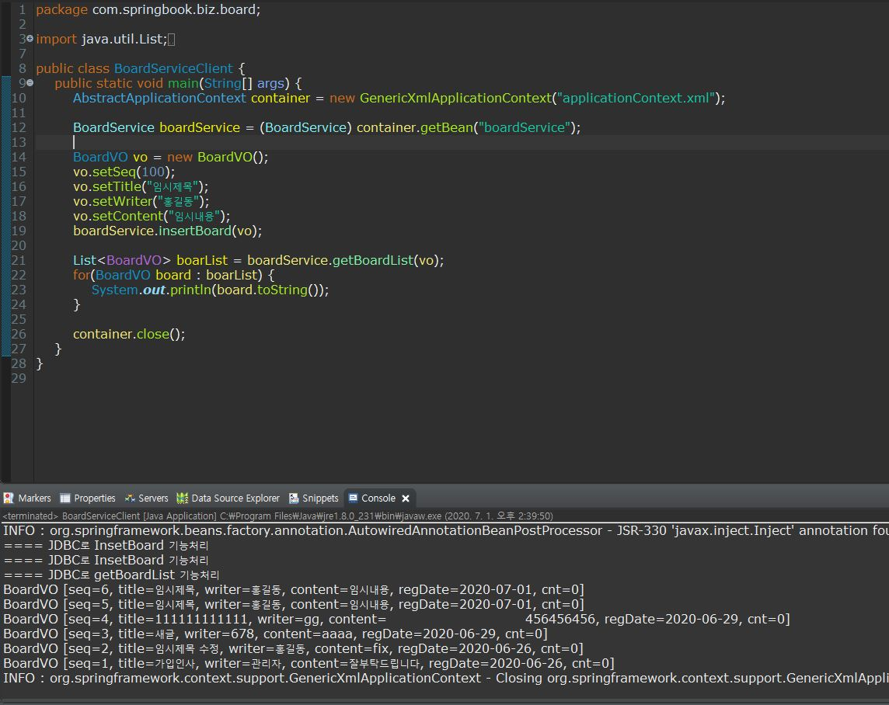

### 비지니스 컴포넌트 실습
- 일반적으로 프로젝트에서 사용하는 구조로 비지니스 컴포너트를 구현
- 일반적으로 비지니스 컴포넌트는 4 개의 자바파일로 구성됨
	- VO, DAO, Service, ServiceImpl(Implement)

#### VO(Value Object)클래스 작성
- VO클래스는 레이어와 레리어 사이에서 관련된 데이터를 한번에 주고받을 목적으로 사용하는 클래스
- DTO(Data Transfer Object)라 하기도 한다.
- 데이터를 주고받기 위한 객체라고 생각해도 된다.
- VO클래스를 작성하기전 DB에 작성된 테이블 구조를 알아야 한다.

```sql
CREATE TABLE BOARD(
	SEQ NUMBBER(5) PRIMARY KEY,
	TITLE VARCHAR2(200).
	WRITER VARCHAR2(20),
	CONTENT VARCHAR2(2000),
	REGDATE DATE DEFAULT SYSDATE,
	CNT NUMBER(5) DAFAULT 0
);
```
- board 테이블 이름 뒤에 VO, DTO를 붙여서 클래스 이름으로 사용한다.
- board테이블에 포홤된 카럶과 같은 이름의 멤버변수를 private접근제한자로 선언한다.
- 모든 멤버변수에 접근하는 getter/setter메소드를 선언하여 VO클래스를 완성시킨다.
- 추가적으로 toString()도 생성하면 나중에 VO값을 출력하는데 편리하다

```java
package com.springbook.biz.board;

public class BoardVO {
	private int seq;
	private String title;
	private String writer;
	private String content;
	private Date regDate;
	private int cnt;
	
	public int getSeq() {
		return seq;
	}
	public void setSeq(int seq) {
		this.seq = seq;
	}
	
	.... //나머지 getter/setter
	
	@Override
	public String toString() {
		return "BoardVO [seq=" + seq + ", title=" + title + ", writer=" + writer + ", content=" + content + ", regDate="
				+ regDate + ", cnt=" + cnt + "]";
	}
}	
```

#### DAO (Data Access Object)클래스 작성
- DAO 클래스는 DB 연동을 담당하난 클래스이다.
- DAO 클래스에는 CRUD(create, read, update, delete) 기능의 메소드가 구현되야한다.
- 그리고 이런 기능을 위한 JDBC 드라이버가 필요하다.
- 사용자가 원하는 DB는 https://mvnrepository.com/ 에서 찾을 수 있다.
- 사용자가 다운로드 DB의 버전과 https://mvnrepository.com/ 에서 받은 버전을 일치시켜야 한다
> 여기서는 H2 DB를 기준으로 작성되었다.
> 

##### JDBC Utility 클래스
- Mybatis 같은 프레임워크를 사용하기 전까지는 JDBC로 DB연동처리를 해야한다

```java
package com.springbook.biz.common;

public class JDBCUtil {
	public static Connection getConnection() {
		try {
			Class.forName("org.h2.Driver");
			return DriverManager.getConnection("jdbc:h2:tcp://localhost/~/test", "sa", "");
		}catch (Exception e) {
			e.printStackTrace();
		}
		return null;
	}
	
	public static void cloase(PreparedStatement stmt, Connection conn) {
		if(stmt != null) {
			try {
				if(!stmt.isClosed()) stmt.close();
			}catch (Exception e) {
				e.printStackTrace();
			}finally {
				stmt = null;
			}
		}
		
		if(conn != null) {
			try {
				if(!conn.isClosed()) conn.close();
			}catch (Exception e) {
				e.printStackTrace();
			}finally {
				conn = null;
			}
		}
	}
	
	public static void cloase(ResultSet re, PreparedStatement stmt, Connection conn) {
		if(re != null) {
			try {
				if(!re.isClosed()) re.close();
			}catch (Exception e) {
				e.printStackTrace();
			}finally {
				re = null;
			}
		}
		
		if(stmt != null) {
			try {
				if(!stmt.isClosed()) stmt.close();
			}catch (Exception e) {
				e.printStackTrace();
			}finally {
				stmt = null;
			}
		}
		
		if(conn != null) {
			try {
				if(!conn.isClosed()) conn.close();
			}catch (Exception e) {
				e.printStackTrace();
			}finally {
				conn = null;
			}
		}
	}
}	
```

##### DAO 클래스 작성
```java
package com.springbook.biz.board.impl;

@Repository("boardDAO")
public class BoardDAO {
	private Connection conn = null;
	private PreparedStatement stmt = null;
	private ResultSet rs = null;
	
	private final String BOARD_INSERT = "INSERT INTO BOARD(SEQ, TITLE, WRITER, CONTENT) VALUES((SELECT NVL(MAX(SEQ), 0)+1 FROM BOARD), ?,?,?)";
	private final String BOARD_UPDATE = "UPDATE BOARD SET TITLE=?, CONTENT=? WHERE SEQ=?";
	private final String BOARD_DELETE = "DELETE BOARD WHERE SEQ=?";
	private final String BOARD_GET = "SELECT * FROM BOARD WHERE SEQ=?";
	private final String BOARD_LIST = "SELECT * FROM BOARD ORDER BY SEQ DESC";
	
	public void insertBoard(BoardVO vo) {
		System.out.println("==== JDBC로 InsetBoard 기능처리");
		try {
			conn = JDBCUtil.getConnection();
			stmt = conn.prepareStatement(BOARD_INSERT);
			stmt.setString(1, vo.getTitle());
			stmt.setString(2, vo.getWriter());
			stmt.setString(3, vo.getContent());
			stmt.executeUpdate();
		} catch (SQLException e) {
			e.printStackTrace();
		} finally {
			JDBCUtil.cloase(stmt, conn);
		}
	}
	
	public void updateBoard(BoardVO vo) {
		System.out.println("==== JDBC로 updateBoard 기능처리");
		try {
			conn = JDBCUtil.getConnection();
			stmt = conn.prepareStatement(BOARD_UPDATE);
			stmt.setString(1, vo.getTitle());
			stmt.setString(2, vo.getContent());
			stmt.setInt(3, vo.getSeq());
			stmt.executeUpdate();
		} catch (SQLException e) {
			e.printStackTrace();
		} finally {
			JDBCUtil.cloase(stmt, conn);
		}
	}
	
	public void deleteBoard(BoardVO vo) {
		System.out.println("==== JDBC로 deleteBoard 기능처리");
		try {
			conn = JDBCUtil.getConnection();
			stmt = conn.prepareStatement(BOARD_DELETE);
			stmt.setInt(1, vo.getSeq());
			stmt.executeUpdate();
		} catch (SQLException e) {
			e.printStackTrace();
		} finally {
			JDBCUtil.cloase(stmt, conn);
		}
	}	

	public BoardVO getBoard(BoardVO vo) {
		System.out.println("==== JDBC로 getBoard 기능처리");
		BoardVO board = null;
		try {
			conn = JDBCUtil.getConnection();
			stmt = conn.prepareStatement(BOARD_GET);
			stmt.setInt(1, vo.getSeq());
			rs = stmt.executeQuery();
			if(rs.next()) {
				board = new BoardVO();
				board.setSeq(rs.getInt("SEQ"));
				board.setTitle(rs.getString("TITLE"));
				board.setWriter(rs.getString("WRITER"));
				board.setContent(rs.getString("CONTENT"));
				board.setRegDate(rs.getDate("REGDATE"));
				board.setCnt(rs.getInt("CNT"));
			}
		} catch (SQLException e) {
			e.printStackTrace();
		} finally {
			JDBCUtil.cloase(rs, stmt, conn);
		}
		return board;
	}
	
	public List<BoardVO> getBoardList(BoardVO vo) {
		System.out.println("==== JDBC로 getBoardList 기능처리");
		List<BoardVO> boardList = new ArrayList<BoardVO>();
		try {
			conn = JDBCUtil.getConnection();
			stmt = conn.prepareStatement(BOARD_LIST);
			rs = stmt.executeQuery();
			while(rs.next()) {
				BoardVO board = new BoardVO(); 
				board.setSeq(rs.getInt("SEQ"));
				board.setTitle(rs.getString("TITLE"));
				board.setWriter(rs.getString("WRITER"));
				board.setContent(rs.getString("CONTENT"));
				board.setRegDate(rs.getDate("REGDATE"));
				board.setCnt(rs.getInt("CNT"));
				boardList.add(board);
			}
		} catch (SQLException e) {
			e.printStackTrace();
		} finally {
			JDBCUtil.cloase(rs, stmt, conn);
		}
		return boardList;
	}
}
```
- DAO 클래스 이름은 board 테이블 이름 뒤에 DAO만 추가하여 사용한다.
- 이 클래스 객체를 스프링 컨테이너가 생성할 수 있도록 클래스 선언부에 @Repository 어노테이션을 설정한다.
- @Component 를 사용해도 문제되지 않는다.
- 다만 DAO 기능의 클래스에는 @Component보다 @Repository를 사용하는 것이 유리하다.
- @Repository는 DB 연동과정에서 밸상해는 예외를 변환시켜주는 특별한 기능이 추가되어있음

#### Service 인터페이스 작성
- DAO 클래스에서 <alt> + <Shift> + <T>를 이용하여 BoardSService 인터페이스를 작성한다.
- 이때 인터페이스가 만들어지는 동시에 BoardDAO 클래스에 implements 코드가 자동으로 가성되는데 삭제한다.
- BoardService인터페이스는 BoardServiceImpl 클래스가 구현해야 하고, BoardDAO클래스는 독립된 클래스로 구현되어야 한다.
- BoardService 인터페이스를 구현한 BoardServiceImpl 클래스는 BoardService 인터페이스의 모든 추상 메소드를 재정의하여 구현한다.
- 클래스 선언부에 객체 생성을 위한 @Service가 선언되어 있으며 클라이언트 프로그램에서 boardService라는 이름으로 객체를 요청할 수 있도록 아이디를 설정한다.
- BoardServiceImpl은 DB연동이 포함된 비즈니스 로직처리릉 ㅟ해서 BoardDAO 타입의 객체를 멤버변수로 가지고 있다.
- BoardDAO 타입의 객체를 의존성 주입하기 위해서 변수 위에 @Autowired를 설정한다.
```java
package com.springbook.biz.board;

public interface BoardService {

	void insertBoard(BoardVO vo);
	void updateBoard(BoardVO vo);
	void deleteBoard(BoardVO vo);
	BoardVO getBoard(BoardVO vo);
	List<BoardVO> getBoardList(BoardVO vo);
}
```

#### Service 구현 클래스 작성
- BoardServiceImpl 클래스의 비지니스 메소드를 구현할 떄, 멤버변수로 선언된 BoardDAO를 이용하면 된다.
```java
package com.springbook.biz.board.impl;

@Service("boardService")
public class BoardServiceImpl implements BoardService{
	@Autowired
	private BoardDAOSpring boardDAO;
	
	public void insertBoard(BoardVO vo) {
		boardDAO.insertBoard(vo);
	}

	public void updateBoard(BoardVO vo) {
		boardDAO.updateBoard(vo);		
	}

	public void deleteBoard(BoardVO vo) {
		boardDAO.deleteBoard(vo);
	}

	public BoardVO getBoard(BoardVO vo) {
		return boardDAO.getBoard(vo);
	}

	public List<BoardVO> getBoardList(BoardVO vo) {
		return boardDAO.getBoardList(vo);
	}
}
```

#### BoardService 컴포넌트 테스트
##### 스프링 설정 파일 수정
```xml
<context:component-scan base-package="com.springbook.biz">	</context:component-scan>
```
##### 클라이언트 작성 및 실행
```java
package com.springbook.biz.board;

public class BoardServiceClient {	
	public static void main(String[] args) {
		AbstractApplicationContext container = new GenericXmlApplicationContext("applicationContext.xml");
		
		BoardService boardService = (BoardService) container.getBean("boardService");
		
		BoardVO vo = new BoardVO();
		vo.setSeq(100);
		vo.setTitle("임시제목");
		vo.setWriter("홍길동");
		vo.setContent("임시내용");
		//boardService.insertBoard(vo);
		
		List<BoardVO> boarList = boardService.getBoardList(vo);
		for(BoardVO board : boarList) {
			System.out.println(board.toString());
		}
		container.close();
	}
}
```

> 클라이언트 프로그램을 실행전 DB서버가 구동중인지 확인해야한다.




