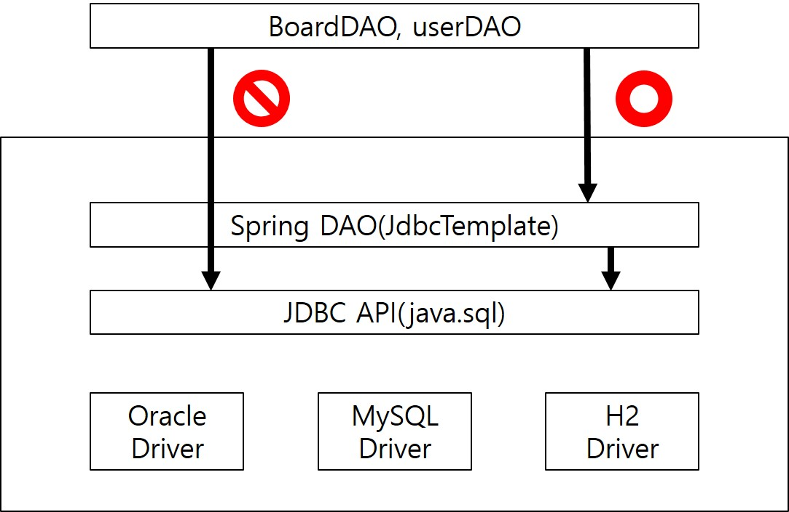
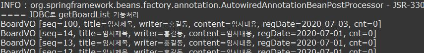

### 스프링 JDBC
- JDBC는 가장 오랫동안 자바 개발자들이 사용한 DB 연동 기술이다.
- JDBC를 이용하여 DB연동 프로그램을 개발하면 데이터베이스에 비종속적인 DB 연동 로직을 구현할 수 있다.
- 하지만 JDBC 프로그램을 이용하려면 개발자가 작성해야할 코드가 너무 많다.
- 그런데 스프링 JDBC기반의 DB연동 프로그램을 쉽게 개발할 수 있도록 JdbcTemplate 클래스를 지원한다.

#### JdbcTemplate 클래스
- JdbcTemplate는 디자인 패턴 중 템플릿 메소드 패턴이 적용된 클래스이다.
- 탬플릿 메소드는 패턴은 복잡하고 반복되는 알로리즘을 캡슐화해서 재사용하는 패턴으로 정의할 수 있다.
- 탬플릿 메소드를 이용하면 반복해서 사용되는 알고리즘인 JDBC의 코딩 순서를 정용화된 기술로 사용할 수 있게 해준다.
- 즉 DB얀동 로직은 JdbcTemplate클래스 탬플릿 메소드가 제공하고, 개발자는 달라진 SQL구문만 재정의만 하면된다.



- jdbcTemplate은 JDBC의 반복적인 코드를 제거하기 위해 제공하는 클래스이다.
- 따라서 DAO 클래스에서는 jdbcTemplate 클래스가 제공하는 템플릿 메소드를 호출하여 DB연동을 간단히 처리할 수 있다.

#### 스프링 JDBC 설정
##### 라이브러리 추가
- pom.xml 파일에 DBCP관련 디펜던시를 추가
```xml
<dependency>
	<groupId>commons-dbcp</groupId>
	<artifactId>commons-dbcp</artifactId>
	<version>1.4</version>
</dependency>
```
##### DataSource 설정
- JdbcTemplate 클래스가 JDBC API를 이용하여 DB연동을 처리하려면 DB로부터 컨넥션을 얻어야 한다.
- 따라서 JdbcTemplate 객체가 사용할 DataSource를 bean 등록하여 스프링컨테이너가 이를 생성해야한다.
- DataSource 설정은 스프링 JDBC만을 위한 설정은 아니고 트랜잭션, Mybatis, JPA 연동에서 사용이 된다.
- DataSource 인터페이스를 구현한 클래스는 다양하지만, 일반적으로 가장 많이 사용되는 apache의 BasicDataSource를 등록한다.
- BasicDataSource 객체가 삭제되기 전에 연결을 해제하고자 close() 메소드를 destroy-method 속성으로 지정
```xml
<bean id="dataSource" class="org.apache.commons.dbcp.BasicDataSource" destroy-method="close">
	<property name="driverClassName" value="org.h2.Driver" />
	<property name="url" value="jdbc:h2:tcp://localhost/~/test" />
	<property name="username" value="sa"/>
	<property name="password" value="" />
</bean>
```
##### 프로퍼티 파일을 활용한 DataSource 설정
- PropertyPlaceholderConfigurer를 이용하면 외부의 프로퍼티 파일을 참조하여 DataSource를 설정할 수 있다.
- src/main/resource 에 config폴터를 생성하기 database.rpoperties파일을 생성한다.

```properties
jdbc.driver=org.h2.Driver
jdbc.url=jdbc:h2:tcp://localhost/~/test
jdbc.username=sa
jdbc.password=
```
- 이제 Properties파일에 설정된 프로퍼티들을 이용하여 DataSource를 설정하려면 다음과 같이 context:Property-placeholder 엘리먼트를 사용한다.
```xml
<context:property-placeholder location="classpath:config/database.properties"/>

<bean id="dataSource" class="org.apache.commons.dbcp.BasicDataSource"
		destroy-method="close">
	<property name="driverClassName" value="${jdbc.driver}" />
	<property name="url" value="${jdbc.url}" />
	<property name="username" value="${jdbc.username}" />
	<property name="password" value="${jdbc.password}" />
</bean>
```
#### JdbcTempate메소드
- 스프링 JDBC를 위한 기본 설정이 마무리되면 이제 JdbcTemplate 객체를 이요하여 DB연동을 간단이 처리할 수 있다.
##### Update 메소드

- 첫번째 방법 - ? 수만큼 값들을 차례대로 나열하는 방식

```java
public void insertBoard(BoardVO vo) {
	String BOARD_INSERT = "UPDATE BOARD SET TITLE=?, CONTENT=? WHERE SEQ=?";
	int cnt = jdbcTemplate.update(BOARD_UPDATE, vo.getTitle(), vo.getWriter(), vo.getContent());
    System.out.println(cnt + "건 데이터 수정");
}
```

- 2번째 방법 - SQL 구문의 설정된 ? 수만큼의 값들을 세팅하여 배열 객체를 두번째 인자로 전달하는 방식
 ```java
public void insertBoard(BoardVO vo) {
	String BOARD_INSERT = "UPDATE BOARD SET TITLE=?, CONTENT=? WHERE SEQ=?";
    Object[] args = {vo.getTitle(), vo.getContent(), vo.setSeq()};
	int cnt = jdbcTemplate.update(BOARD_INSERT, args);
    System.out.println(cnt + "건 데이터 수정");
}
 ```
##### queryForInt 메소드
- SELECT 구문으로 검색된 정수값을 리턴받으러면 queryForInt 메소드를 사용한다.
```java
public void getBoardTotalCount(BoardVO vo) {
	String BOARD_TOT_COUNT = "SELECT COUNT(*) FROM BOARD";
	int cnt = jdbcTemplate.quertForInt(BOARD_TOT_COUNT);
    System.out.println("전체 게시글 수 : " + count + " 건");
}
```
##### queryForObject 메소드
- queryForObject 메소드는 SELECT 구문의 실행 결과를 특정 자바객체로 매핑하여 리턴받을 때 사용한다.
- queryForObject메소드는 검색결과가 없거나 검색결과가 두 개 이상이면 예외를 발생시킨다.
```java
public BoardVO getBoard(BoardVO vo) {
	String BOARD_GET = "SELECT * FROM BOARD WHERE SEQ=?";
	Object[] args = {vo.getSeq()};
	return jdbcTemplate.queryForObject(BOARD_GET, args, new BoardRowMapper());
}
```

- 검색 결과를 특정 VO객체에 매핑하여 리턴하려면 RowMapper 인터페이스를 구현한 RowMapper클래스가 필요하다
- 결국 RowMapper클래스는 테이블 당 하나씩은 필요하게 된다.
- RowMapper 인터페이스에는 mapRow()메소드가 있어서 검색 결과로 얻어낸 Row 정보를 어떤 VO에 어떻게 매핑할 것인지를 구현해주면 된다.

```java
class BoardRowMapper implements RowMapper<BoardVO>{
	public BoardVO mapRow(ResultSet rs, int rowNum) throws SQLException{
		BoardVO board = new BoardVO();
		board.setSeq(rs.getInt("SEQ"));
		board.setTitle(rs.getString("TITLE"));
		board.setWriter(rs.getString("WRITER"));
		board.setContent(rs.getString("CONTENT"));
		board.setRegDate(rs.getDate("REGDATE"));
		board.setCnt(rs.getInt("CNT"));
		return board;
	}
}
```


##### query 메소드
- query 메소드는 SELECT문의 실행 결과가 목록일때 사용한다.
- 기본 사용법은 queryForObject와 같다.
- 따라서 qeury 메소드에서도 검색 결과를 VO객체에 매핑하려면 RowMapper객체를 사용한다.
```java
public List<BoardVO> getBoardList(BoardVO vo) {
	String BOARD_LIST = "SELECT * FROM BOARD ORDER BY SEQ DESC";
	return jdbcTemplate.query(BOARD_LIST, new BoardRowMapper());
}
```

- query 메소드가 실행되면 여러 건의 ROW 정보가 검색되며 검색된 데이터 ROW수만큼 RowMapper객체의 mapRow()메소드가 실행된다.
- 이렇게 ROW정보가 매핑된 VO객체 여러개가 List컬렉션에 저장되어 리턴된다.


#### DAO 클래스 구현
- JdbcTemplate 객체를 이용한 DAO클래스에서 JdbcTemplate객체를 얻는 방법이 두 가지이다.

##### 첫 번째 방법 : JdbcDaoSupport 클래스 상속
```java
@Repository
public class BoardDAOSpring  extends JdbcDaoSupport{
	@Autowired
	public void setSuperDataSource(DataSource dataSource){
		super.setDataSource(dataSource);
	}
	
	private final String BOARD_INSERT = "INSERT INTO BOARD(SEQ, TITLE, WRITER, CONTENT) VALUES(?, ?,?,?)";
	private final String BOARD_UPDATE = "UPDATE BOARD SET TITLE=?, CONTENT=? WHERE SEQ=?";
	private final String BOARD_DELETE = "DELETE BOARD WHERE SEQ=?";
	private final String BOARD_GET = "SELECT * FROM BOARD WHERE SEQ=?";
	private final String BOARD_LIST = "SELECT * FROM BOARD ORDER BY SEQ DESC";
	
	public void insertBoard(BoardVO vo) {
		System.out.println("==== JDBC로 InsetBoard 기능처리");
		jdbcTemplate.update(BOARD_INSERT, vo.getSeq(), vo.getTitle(), vo.getWriter(), vo.getContent());
	}
	......
```
- DAO 클래스를 구현할때 JdbcDaoSupport 클래스를 부모 클래스를 지정하면 getJdbcTemplate 메소드를 상속받는다.
- getJdbcTemplate 메소드를 호출하면 JdbcTemplate 객체가 리턴되어 모든 메소드를 JdbcTemplate객체로 구현할 수 있다.
- 문제는 getJdbcTemplate 메소드가 JdbcTemplate객체를 리턴하려면 DataSource객체를 가지고 있어야 한다.
- 따라서 부모 클래스인 JdbcDaoSUpport 클래스의 setDataSource메소드를 호출하여 데이터소스 객체를 의존성 주입해야한다.
```java
@Autowired
public void setSuperDataSource(DataSource dataSource){
	super.setDataSource(dataSource);
}
```



##### 두 번째 방법 : JdbcDaoSupport 클래스 bean등록 의존성 주입
- 일반적으로 JdbcTemplate클래스를 bean에 등록하고 의존성 주입 방법을 사용한다.
```xml
<bean id="dataSource" class="org.apache.commons.dbcp.BasicDataSource"
	destroy-method="close">
	<property name="driverClassName" value="${jdbc.driver}" />
	<property name="url" value="${jdbc.url}" />
	<property name="username" value="${jdbc.username}" />
	<property name="password" value="${jdbc.password}" />
</bean>
<bean id="jdbcTemplate" class="org.springframework.jdbc.core.JdbcTemplate">
	<property name="dataSource" ref="dataSource"></property>
</bean>
```
- 반드시 JdbcTemplate 객체에 DataSource객체를 의존성 주입해야한다.
- DAO클래스에서는 @Autowired어노테이션을 이용하여 JdbcTemplate타입의 객체를 의존성 주입처리한다.
```java
@Repository
public class BoardDAOSpring  {
	@Autowired
	private JdbcTemplate jdbcTemplate;
	
	private final String BOARD_INSERT = "INSERT INTO BOARD(SEQ, TITLE, WRITER, CONTENT) VALUES(?, ?,?,?)";
	private final String BOARD_UPDATE = "UPDATE BOARD SET TITLE=?, CONTENT=? WHERE SEQ=?";
	private final String BOARD_DELETE = "DELETE BOARD WHERE SEQ=?";
	private final String BOARD_GET = "SELECT * FROM BOARD WHERE SEQ=?";
	private final String BOARD_LIST = "SELECT * FROM BOARD ORDER BY SEQ DESC";
	
	public void insertBoard(BoardVO vo) {
		System.out.println("==== JDBC로 InsetBoard 기능처리");
		jdbcTemplate.update(BOARD_INSERT, vo.getSeq(), vo.getTitle(), vo.getWriter(), vo.getContent());
	}
	,,,,,
```

> 수정된 소스는 기존 JDBC 기반으로 동작했던 BoardDAO가 아닌 JDBC기반의 DAOSpring으로 DB연동이 처리된다는 점만 다르고 결과는 같다.


