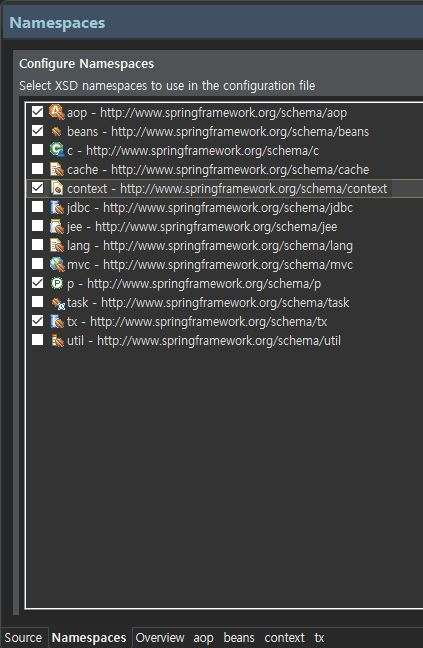

### 어노테이션 설정
- 대부분의 프레임워크가 그렇듯이 스프링 프레임워크 역시 XML설정이 중요
- XML파일의 과도한 설정에 대한 부담도 크며, 이로 인해 프레임워크 사용을 꺼리기도한다.
- 따라서 대부분의 프레임워크는 어노테이션을 이용한 설정을 지원한다.

#### 네임스페이스 추가
- 어노테이션 설정을 추가하려면 스피링 설정파일에 Context 관련 네임스페이스를 추가한다.

#### 컴포넌트 스캔 설정
- 스프링설정 파일에 애플리케이션에서 사용할 객체들을 <bean> 등록하지 않고 자동생성하기 위해서는  <context:component-scan> 엘리먼트를 이용
-  base-package 속성의 값에 존재하는 패키지를 스캔 대상에 포함시킴

```xml
<context:component-scan base-package="polymorphism"></context:component-scan>
```
> 그외 설정을 제외한 <bean>설정을 삭제하거나 주석처리

#### @component
- <context:component-scan> 설정으로 스프링 설정 파일에 클래스들을 일일이 <bean> 엘리먼트로 등록할 필요가 없음
- @component만 클래스 선언부 위에 설정한다.
- 다음  xml설정은 어노테이션 설정과 같은 의미이다.

```xml
<bean class="polymorphism.SonySpeaker"></bean>
```
```java
@Component
public class SonySpeaker implements Speaker {
	public SonySpeaker() {
		System.out.println("===== SonySpeaker 객체 생성");
	}
	......
}

```
> 단 두 설정 모두 해당 클래스에 기본생성자가 존재해야 한다.

- 그러나 클라이언트는 SonySpeaker 객체를 요청할 수 없다.
- 컨테이너가 생성할 객체를 요청하려면 요청할떄 사용할 아이디나 이름이 반드시 설정되야하기 때문이다.

```java
//1. 스프링 컨테이너를 구동
AbstractApplicationContext factory = 
	new GenericXmlApplicationContext("applicationContext.xml");
//2. 스프링 컨테이너로부터 필요한 객체를 요청
Speaker speaker = (Speaker)factory.getBean("speaker");
```

- 따라서 클라이언트 요청을 위해서 다음과 같은 아이디 설정이 필요하다
- 다음  xml설정은 어노테이션 설정과 같은 의미이다.

```xml
<bean id="speaker" class="polymorphism.SonySpeaker"></bean>
```
```java
@Component("speaker")
public class SonySpeaker implements Speaker {
	public SonySpeaker() {
		System.out.println("===== SonySpeaker 객체 생성");
	}
	......
}
```
##### id나 name 속성 미지성 시 이름 규칙
- id, name 속성을 클래스 객체를 생성할때 지정하지 않았다면, 컨테이너가 자동적으로 이름을 설정해준다
- 규칙은 클래스 이름의 첫글자를 소문자로 변경
- 만약 id, name속성이 없는 LgTV라는 객체를 요청하려면 lgTV라는 이름을 사용한다

#### 의존성 주입 어노테이션
##### @Autowired
- @Autowired는 생성자, 메소드, 멤버변수에 모두 사용가능하다.
- 대부분 멤버변수 위에 선언한다.
- 스프링 컨테이너는 멤버 변수위에 붙은 @Autowired를 확인하는 순간 해당 변수의 타입을 체크
- 그 타입에 객체가 메모리에 존재하는지 확인 후 그 객체를 변수에 주입
- 만약 @Autowired가 붙은 객체가 메모리에 없을시 NosuchBeanDefinitinoException오류 발생

```java
@Component("tv")
public class SamsumgTV implements TV{
	@Autowired
	private Speaker speaker;
	
	public SamsumgTV() {
		System.out.println("==== samsungTV(1) 객체 생성");
	}

	public void powerOn() {
		System.out.println("samsungTV 전원컨다.");
	}

	public void powerOff() {
		System.out.println("samsungTV 전원끈다");
	}

	public void volumeUp() {
		speaker.volumeUp();
	}

	public void volumeDown() {
		speaker.volumeDown();		
	}

}

```

- 위처럼 설정하면 SamsumgTV 클래스에는 의존성 주입에 사용한 Setter 메소드나 생성자는 필요없다
- 그러나 Speaker에 대한 객체가 메모리가 없으면 에러가 발생하므로 Speaker 객체를 메모리에 생성한다
- 다음  xml설정은 어노테이션 설정과 같은 의미이다.
```xml
<bean id="sony" class="polymorphism.SonySpeaker"></bean>
```
```java
@Component("sony")
public class SonySpeaker implements Speaker {
	public SonySpeaker() {
		System.out.println("===== SonySpeaker 객체 생성");
	}
	
	public void volumeUp() {
		System.out.println("sonySpeaker 소리 올리다");
	}

	public void volumeDown() {
		System.out.println("sonySpeaker 소리 줄이다");
	}
}
```

##### @Qualifier
- 문제는 의존성 주입 대상이 되는 Speaker타입이 두 개 이상일 때 발생한다.
- 만약 SonySpeaker, AppleSpeaker 객체 모두 메모리에 생성된 상황이면 컨테이너는 어떤 객체를 할당할지 모르고 NoUniqueBeanDefinitionException 에러가 발생한다.

```java
@Component("sony")
public class SonySpeaker implements Speaker {
	public SonySpeaker() {
		System.out.println("===== SonySpeaker 객체 생성");
	}
	...
}
```
```java
@Component("apple")
public class AppleSpeaker implements Speaker {
	public AppleSpeaker() {
		System.out.println("===== AppleSpeaker 객체 생성");
	}
	...
}
```
```java
@Component("tv")
public class SamsumgTV implements TV{
	//@Autowired 메모리에 Speaker 객체가 두가지여서 어떤것을 할당할지 판단 못함
	@Autowired
	private Speaker speaker;
	....
}
```
- @Autowired 메모리에 Speaker 객체가 두가지여서 어떤것을 할당할지 판단 못함
- 이를 구별하기 위해 @Autowired다음에 @Qulifier 어노테이션을 사용하여 구분한다
```java
@Component("tv")
public class SamsumgTV implements TV{
	@Autowired
	//apple라는 Speaker객체를 할당받는다
	@Qulifier("apple")
	private Speaker speaker;
	....
}
```
- 이를 이용하여 apple이라는 id의 객체를 할당받는다.
###### @Resource
- @Resource는 객체 이름을 이용하여 의존성 주입을 처리한다.
- @Resource는 name속성을 사용할 수 있어서, 스프링 컨테이너가 해당 이름으로 생성된 객체를 검색하여 의존성 주입을 처리한다.

```java
@Component("tv")
public class SamsumgTV implements TV{
	@Resource(name="sony")
	private Speaker speaker;
	....
}
```
#### 어노테이션과  XML 설정 병행하여 사용
- 스프링 의존성 주입을 처리할 때 xml설정과 어노테이션 설정은 장단점이 서로 상충한다.
- XML방식은 자바 소스를 수정하지 않고 XML파일의 설정만 변경하면 Speaker객체를 교체하여 유지보수에 편하다.
- 하지만 XML설정에도 부담이 존재한다. 자바와 관련된 어떤 메타데이터가 없으므로 XML설정을 해석해야만 무슨 객체가 의존성 주입되는지 확인할 수 있다.
- 반변 어노테이션 설정은 XML 설정에 대한 부담도 없고 의존관계한 대한 정보가 자바소스에 있어서 편리하다.
- 하지만 객체의 이름이 자바소스에 명시도어야 하므로 자바  소스를 수정하지 않고 Speaker를 교체할 수 없다.
- 이런 문제를 어노테이션과  XML 설정 병행하여 사용하여 해결한다.


- 우선 SamsungTV클래스 Speaker변수를 @Autowired 어노테이션만 설정한다
- ```java
  @Component("tv")
  public class SamsumgTV implements TV{
  //@Autowired 메모리에 Speaker 객체가 두가지여서 어떤것을 할당할지 판단 못함
  @Autowired
  private Speaker speaker;
  ....
  }
  ```
```
- @Autowired 메모리에 Speaker 객체가 두가지여서 어떤것을 할당할지 판단 못함
- 하지만 기존의 두 가지 Speaker객체의 @Component를 제거하여 객체가 자동으로 생성되는 것을 차단
​```java
//@Component("sony")
public class SonySpeaker implements Speaker {
	public SonySpeaker() {
		System.out.println("===== SonySpeaker 객체 생성");
	}
	...
}
```
```java
//@Component("apple")
public class AppleSpeaker implements Speaker {
	public AppleSpeaker() {
		System.out.println("===== AppleSpeaker 객체 생성");
	}
	...
}
```
- 그리고 둘 중 하나만 스프링 설정파일에 <bean> 등록하여 처리한다.
- 다음과 같은 설정이면 @Autowired에 의해 SonySpeaker 객체가 의존성 주입이 된다.
- 그리고 AppleSpeaker로 교체할때는 SonySpeaker를 AppleSpeaker로 교체만 하면된다.
```xml
<beans>
	<context:component-scan base-package="polymorphism"></context:component-scan>
	<bean class="polymorphism.SonySpeaker"></bean>
	<!-- <bean class="polymorphism.AppleSpeaker"></bean> -->
</beans>
```

- 결국 클라이언트가 요청한 SamsungTV는 @Component 어노테이션으로 처리하고, 의존성 주입 역시 @Autowired로 처리한다
- 다만, 변경될 Speaker만 스프링 설정 파일에 <bean>등록함으로 자바코드 수정없이 XML수정만으로 Speaker를 굧체할 수 있다.


