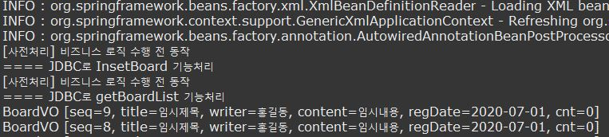
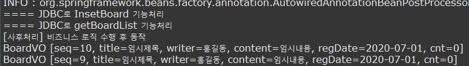
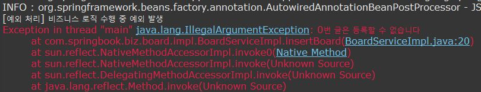
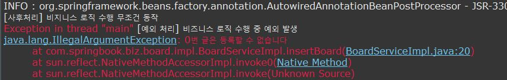
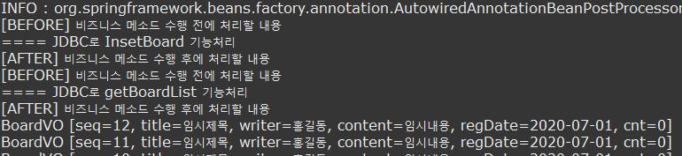

### 어드바이스 동작시점
- 어드바이스는 각 조인포인트에 삽입되어 동작할 횡단 관심에 해당하는 공통기능이다
- 동작시점은 AOP 기술마다 다르고 다섯 가지의 동작 시점을 제공한다
	- Before : 비즈니스 메소드 실행 전 동작
	- After
		- After Returning : 비즈니스 메소드가 성곡적으로 리턴되면 동작
		- After Throwing : 비즈니스 메소드 실행 중 예외가 발생하면 동작
		- After : 비즈니스 메소드 실행된 후 무조건 실행
	- Around : 메소드 호출 자체를 가로채 비즈니스 메소드 실행 전후에 처리할 로직을 삽입할 수 있다

#### Before 어드바이스
- Before 어드바이스는 포인트컷으로 지정된 메소드 호출 시, 메소드가 실행되기 전에 처리될 내용들을 기술하기 위해 사용된다.

1. Before 어드바이스 클래스 구현
```java
public class BeforeAdvice {
	public void beforeLog() {
		System.out.println("[사전처리] 비즈니스 로직 수행 전 동작" );
	}
}
```
2. 스프링 설정
```xml
<bean id="before" class="com.springbook.biz.common.BeforeAdvice"></bean>
<aop:config>
	<aop:pointcut expression="execution(* com.springbook.biz..*Impl.*(..))" id="allPointcut"/>
	<aop:aspect ref="before">
		<aop:before method="beforeLog" pointcut-ref="allPointcut"/>
	</aop:aspect>
</aop:config>
```
3. 결과


#### After Returning 어드바이스

- After Returning어드바이스는 포인트컷으로 지정된 메소드가 정상적으로 실행되고나서 메소드 수행 결과로 생성된 데이터를 리턴하는 시점에 동작한다.

1. After Returning 어드바이스 클래스 구현

```java
package com.springbook.biz.common;

public class BeforeAdvice {
	public void beforeLog(JoinPoint jp) {
		System.out.println("[사전처리] 비즈니스 로직 수행 전 동작");
	}
}
```

2. 스프링 설정

```xml
<bean id="afterReturning" class="com.springbook.biz.common.AfterReturningAdvice"></bean>
<aop:config>
	<aop:pointcut expression="execution(* com.springbook.biz..*Impl.get*(..))" id="getPointcut"/>
	<aop:aspect ref="afterReturning">
		<aop:after-returning method="afterLog" pointcut-ref="getPointcut"/>
	</aop:aspect>
</aop:config>
```

3. 결과
   

#### After Throwing 어드바이스

- After Throwing 어드바이스는 포인트컷으로 지정된 메소드가 실행되다가 예외가 발생하는 시점에 동작한다.
- try-catch 문의 catch문의 역할과 같다

1. After Throwing 어드바이스 클래스 구현

```java
package com.springbook.biz.common;

public class AfterThrowingAdvice {
	public void exceptionLog() {
		System.out.println("[예외 처리] 비즈니스 로직 수행 중 예외 발생");
	}
}
```

2. 스프링 설정

```xml
<bean id="afterThrwing" class="com.springbook.biz.common.AfterThrowingAdvice"></bean>
<aop:config>
	<aop:pointcut expression="execution(* com.springbook.biz..*Impl.*(..))" id="allPointcut"/>
	<aop:aspect ref="afterThrwing">
		<aop:after-throwing pointcut-ref="allPointcut" method="exceptionLog"/>
	</aop:aspect>
</aop:config>
```

3. 자바 파일 수정
```java
	public void insertBoard(BoardVO vo) {
		if(vo.getSeq() == 0) {
			throw new IllegalArgumentException("0번 글은 등록할 수 없습니다");
		}
		boardDAO.insertBoard(vo);
	}
```
4. 결과
   

#### After 어드바이스

- After 어드바이스는 finally 블록처럼 예외 발생 여부에 무조건 상관없이 무조건 수행되는 어드바이스를 등록할 때 after 어드바이스를 사용한다

1. After 어드바이스 클래스 구현

```java
package com.springbook.biz.common;

public class AfterAdvice {
	public void finallyLog() {
		System.out.println("[사후처리] 비지니스 로직 수행 무조건 동작");
	}
}
```

2. 스프링 설정

```xml
<bean id="after" class="com.springbook.biz.common.AfterAdvice"></bean>
<aop:config>
	<aop:pointcut expression="execution(* com.springbook.biz..*Impl.*(..))" id="allPointcut"/>
	<aop:aspect ref="after">
		<aop:after method="finallyLog" pointcut-ref="allPointcut"/>
	</aop:aspect>
</aop:config>
```

3. 결과
   

- 예외가 발생한 상황에서도 after로 설정한 finallyLog() 메소드가 먼저 실행되고 exceptionLog()가 처리되는 것을 확인할 수 있다.

#### Around 어드바이스

- 어떤 상황에서는 하나의 어드바이스가 비즈니스 메소드 실행 전과 후에 모두 동작하여 로직을 처리하는 경우가 있을 것이다.
- 이때 사용되는 어드바이스가 Around이다
- Around 어드바이스는 클라이언트 메소드 호출을 가로챈다.
- 클라이언트가 호출한 비즈니스 메소드가 실행되기 저넹 사전 처리 로직을 수행할 수 있으며, 비즈니스 메소드가 모두 실행되고 나서ㅜ사후 처리 로직을 수행할 수 있다.

1. Around 어드바이스 클래스 구현

```java
package com.springbook.biz.common;

public class AroundAdvice {
	public Object aroundLog(ProceedingJoinPoint pjp) throws Throwable {
		System.out.println("[BEFORE] 비즈니스 메소드 수행 전에 처리할 내용");
		Object returnObj = pjp.proceed();
		System.out.println("[AFTER] 비즈니스 메소드 수행 후에 처리할 내용");
		return returnObj;
	}
}}
```

2. 스프링 설정

```xml
<bean id="around" class="com.springbook.biz.common.AroundAdvice"></bean>
<aop:config>
	<aop:pointcut expression="execution(* com.springbook.biz..*Impl.*(..))" id="allPointcut"/>
	<aop:aspect ref="around">
		<aop:around method="aroundLog" pointcut-ref="allPointcut"/>
	</aop:aspect>
</aop:config>
```

3. 결과
   

> 메소드가 실행될때 BEFORE AFTER 메시지가 출력되는 것을 확인할 수 있다.