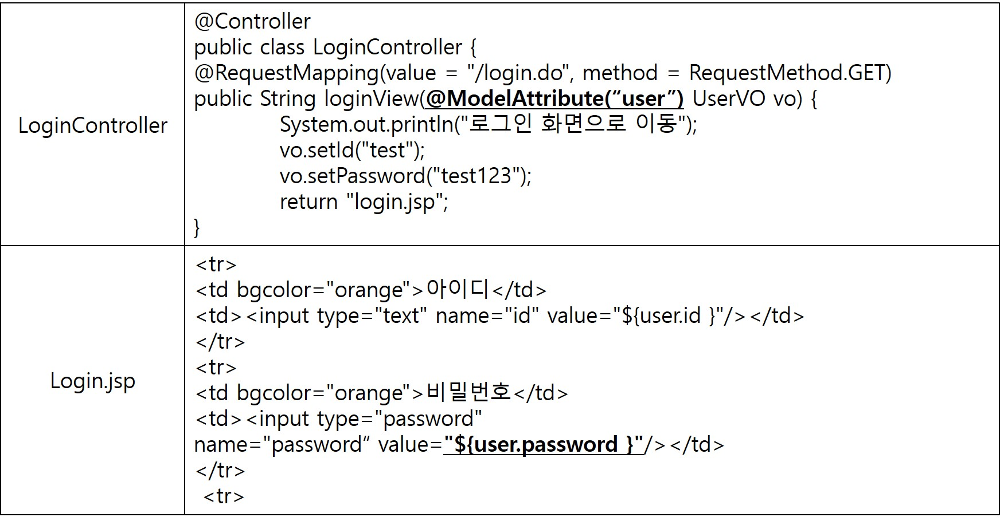
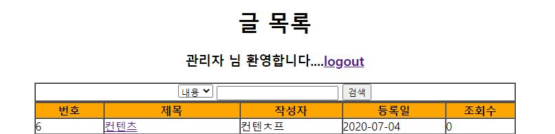
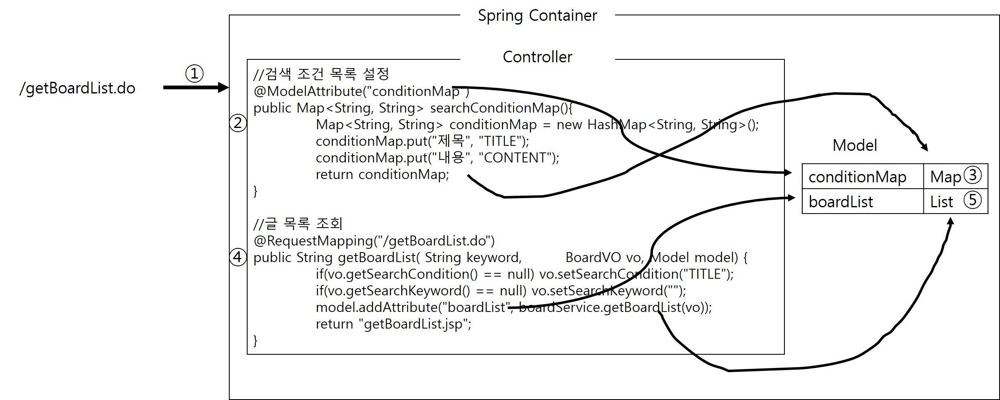
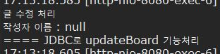
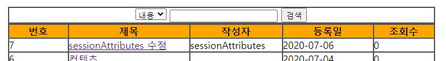
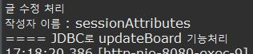

## 요청방식에 따른 처리
### method속성
- @RequestMapping을 이용하면 마치 Servlet처럼 클라이언트의 요청 방식에 따라 수행될 메소드를 다르게 설정할 수 있다.
- LoginController 클래스를 다음과 같이 수정한다.
```java
@Controller
public class LoginController {
	@RequestMapping(value = "/login.do", method = RequestMethod.GET)
	public String loginView(UserVO vo) {
		System.out.println("로그인 화면으로 이동");
		vo.setId("test");
		vo.setPassword("test123");
		return "login.jsp";
	}

	@RequestMapping(value = "/login.do", method = RequestMethod.POST)
	public String login(UserVO vo, UserDAO userDAO) {
		System.out.println("로그인 처리");
		if (userDAO.getUser(vo) != null) return "getBoardList.do";
		else return "login.jsp";
	}
}

```

- 위의 코드에서 @RequestMapping에 설정에 method가 추가된것을 확인할 수 있다.
- 클라이언트의 login.do 요청이 GET방식의 요청이라면 loginView 메소드가 실행되고 로그인 화면으로 이동된다.
- POST방식으로 요청이 들어오면 login메소드를 실행하여 실질적인 로그인 인증 작업을 처리한다.
- 여기서 loginVIew 메소드는 로그인 화면으로 이동할때 실행되는 메소드인데 사용자가 입력할 값이 아무것도 없는 상태인데 매개변수로 UserVO 객체를 받아들이도록 설정한 것이다.
- 논리적으로 맞지 않지만 매개변수로 받은 Command 객체에 적절한 데이터를 설정하면 리턴된 JSP파일에서 이 데이터를 사용할 수 있다.

### JSP에서 COmmand 객체 사용

- Command 객체에 저장된 데이터를 JSP에서 사용하려면 ${... }구문을 이용한다.

```html
<form action="login.do" method="post">
	<table border="1" cellpadding="0" cellspacing="0">
	 	<tr>
	 		<td bgcolor="orange">아이디</td>
	 		<td><input type="text" name="id" value="${userVO.id }"/></td>
	 	</tr>
	 	<tr>
	 		<td bgcolor="orange">비밀번호</td>
	 		<td><input type="password" name="password" value="${userVO.password }"/></td>
	 	</tr>
	 	<tr>
	 		<td colspan="2" align="center">
	 			<input type="submit" value="로그인">
	 		</td>
	 	</tr>
	</table>
</form>
```

- 테스트를 위해서 index.jsp파일을 작성한다.

```html
<%@ page language="java" contentType="text/html; charset=UTF-8"
    pageEncoding="UTF-8"%>
<!DOCTYPE html>
<html>
<head>
<meta charset="UTF-8">
<title>Main Page</title>
</head>
<body>
<center>
	<h1>게시판 프로그램</h1>
	<hr>
		<a href="login.do">로그인</a>
		<a href="getBoardList.do">글 목록 바로가기</a>
		<a href="dataTransform.do">글 목록 변환 처리</a>
	<hr>
</center>
</body>
</html>
```
- 클라이언트가 직접 URL을 입력하거나 하이퍼링크를 클릭하면 기본 GET방식으로 여청이 이루워진다.
- index.jsp 화면에서 로그인 링크를 클릭하면 서버에 login.do 요청이 전달되고 이 때 GET방식의 요청이 전달되므로 loginVIew메소드가 실행된다.
- login.jsp화면이 브라우저에 출력될때 UserVO객체에 저장된 id, password가 자동으로 설정되어 나타난다.

### @ModelAttribute
- 스프링 컨테이너가 생성하는 Command 객체의 이름은 클래스 이름의 첫글자를 소문자로 변경한 이름으로 설정된다.
- 그래서 login.jsp 화면에서 UserVo객체의 변수에 접근할 때 ${userVO.변수명}을 사용한다.
- Command 객체의 이름을 변경하려면 다음과 같이 @ModelAttribute를 사용한다.


## Servlet API 사용

- 지금까지 Controller메소드에서 사용자가 입력한 정보를 추출하기 위해서 HttpServletRequest 대신 Command 객체를 사용했다.
- 하지만 HttpServletRequest 객체가 사용자 입력값을 추출할 때만 사용되는 것은 아니다.
- HttpServletRequest 객체가 제공하는 다양한 메소드를 이용하여 Controller를 구현해야 할 때는 HttpServletRequest 객체를 매개변수로 받아야 한다.
- HttpSession 객체를 매개변수로 받아서 로그인 성공 시에 사용자 이름을 세션에 저장하고 글 목록 화면에서 출력하도록 한다.

```java
@RequestMapping(value = "/login.do", method = RequestMethod.POST)
	public String login(UserVO vo, UserDAO userDAO, HttpSession session) {
		UserVO user = userDAO.getUser(vo);
		if (userDAO.getUser(vo) != null) {
			session.setAttribute("userName", user.getName());
			return "getBoardList.do";
		} else
			return "login.jsp";
	}
```
```html
<h3>
	${userName} 님 환영합니다....<a href="logout.do">logout</a>
</h3>
```
- 다음과 같이 글 목록화면에 출력되는 것을 볼 수 있다.


## 기타 어노테이션
### @ReuqestParam
- Command 객체를 이용하면 클라이언트에서 넘겨준 용청 파라미터 정보를 알 수 있다.
- 하지만 요청 파라미터와 매필될 Setter메소드가 Command클래스에 선언되어야 한다.
- 하지만 Command 객체에는 없는 파라미터를 Controller 클래스에 사용하려면 어떻게 해야할까?
- 스프링 MVC에서는 HTTP 요청 파라미터 정보를 추출하기 위한 @RequestParam 을 제공한다.
- jsp에서 Command에 없는 변수 searchCondition, searchKeyword를 넘겨주도록 한다.

```html
<!-- 검색시작 -->
<form action="getBoardList.do" method="post">
	<table border="1" cellpadding="0" cellspacing="0" width="700">
		<tr>
			<td align="right">
                <select name="searchCondition">
					<option value="TITLE">제목
                    <option value="CONTENT">내용
				</select> 
                <input name="searchKeyword" type="text" />
                <input type="submit" value="검색" />
            </td>
		</tr>
	</table>
</form>
```

- 이때 @RequestParam을 이용하여 관련된 파라미터 정보를 추출할 수 있다.
```java
//글 목록 조회
@RequestMapping("/getBoardList.do")
public String getBoardList(@RequestParam(value ="searchCondition", defaultValue="TITLE", required=false)String condition,
                           @RequestParam(value ="searchKeyword", defaultValue="", required=false)String keyword,
                           String keyword,	BoardVO vo, Model model) {
    System.out.println("검색 조건" + condition);
    System.out.println("검색 단어" + keyword);
	model.addAttribute("boardList", boardService.getBoardList(vo));
	return "getBoardList.jsp";
}
```
- @RequestParam의 속성은 다음과 같다
	- value : 화면으로부터 전달될 파라미터 이름
	- defaultValue : 화면으로부터 전달될 파라미터 정보가 없을대 설정할 기본값
	- required 파라미터의 생략 여부
- 위 설정은 searchCondition이 필수 파라미터는 아니지만 만약 파라미터 정보가 전달되면 해당 값을 추출하여 condition변수에 할당하고, 파라미터 정보가 전달되지 않느다면 기본값으로 TITLE문자열을 할당한다는 의미이다.
- 물론 @RequestParam대신에 VO클래스에 Getter/Setter 를 추가하여 간단히 처리할 수도 있다.

### @ModelAttribute
- 이전에 ModelAttribute를 Controller메소드의 매개변수로 선언된 Command객체의 이름을 변경할 때 사용하였다.
- 객체 이름을 목적으로 사용할 수도 있지만, View에서 사용할 데이터를 설정하는 용도로도 사용할 수 있다.
- ModelAttribute 가 설정된 메소드는 @RequestMapping어노테이션이 적용된 메소드보다 먼저 호출된다.
- 그리고 @ModelAttribute 메소드 실행 결과로 리턴된 객체는 자동으로 Model에 저장된다.
- 따라서 @ModelAttribute 메소드의 실행 결과로 리턴된 객체를 View페이지에서 사용할 수 있다.

```java
@Controller
public class BoardController {
	
	//검색 조건 목록 설정
	@ModelAttribute("conditionMap")
	public Map<String, String> searchConditionMap(){
		Map<String, String> conditionMap = new HashMap<String, String>();
		conditionMap.put("제목", "TITLE");
		conditionMap.put("내용", "CONTENT");
		return conditionMap;
	}
    //글 목록 조회
	@RequestMapping("/getBoardList.do")
	public String getBoardList( String keyword,	BoardVO vo, Model model) {
		if(vo.getSearchCondition() == null) vo.setSearchCondition("TITLE");
		if(vo.getSearchKeyword() == null) vo.setSearchKeyword("");
		model.addAttribute("boardList", boardService.getBoardList(vo));
		return "getBoardList.jsp";
	}
    .....	
```

- searchConditionMap 메소드 위헤 @ModelAttribute가 선언되었으므로 getBoardList 보다 먼저 실행된다.
- searchConditionMap 메소드는 다양한 검색 조건이 저장된 conditionMap을 리턴하는데 이 리턴 결과를 다음에 실행된 getBoardList 메소드가 리턴한 JSP에 사용할 수 있다.



1. 클라이언트의 요처잉 전송
2. @ModelAttribute가 설정된 searchConditionMap 메소드가 실행
3. @ModelAttribute로 지정한 이름으로 searchConditionMap 메소드가 리턴한 값을 Model객체에 저장
4. 그리고 클라이언트가 호출한 getBoardList 메소드가 실행
5. boardList라는 이름으로 검색 결과를 Model에 저장하면 최종적으로 Model에는 두 개의 컬렉션이 저장된다.

### @SessionAttributes

- @SessionAttributes는 수정작업을 처리할 때 유용하게 사용할수 있는 어노테이션이다.
- 만약 상세화면에서 게시글을 수정한다면 그 수정버튼을 클릭하여 입력한 수정 제목과 내용을 가지고 updateBoard.do 요청을 전송하고 BoardController의 updateBoard 메소드가 사용자가 입력한 정보를 처리할 것이다.
- 하지만 사용자가 입력한 정보가 제목과 내용뿐이고 작성자 정보를 전달되지 않았기 때문에 Command 객체인 BoardVO writer정보가 저장되지 않는다.
- 물론 DAO의 메소드를 수정하면 문제는 해결된다.
- 하지만 작성자 컬럼까지 수정하도록 돼있다면 작성자 파라미터 정보가 전달되지 않으므로 WRITER컬럼은 null로 수정된다.
```java
private final String BOARD_UPDATE = "UPDATE BOARD SET TITLE=?, WRITER=?, CONTENT=? WHERE SEQ=?";
```
- 이런 문제를 방지하기 위해 스프링에서는 @SessionAttributes 어노테이션을 제공한다.
- 먼저 updateBoard()메소드에서 수정할 작성자 이름을 확인해보는 코드를 추가한다.
```java
//글수정
@RequestMapping("/updateBoard.do")
public String updateBoard(@ModelAttribute("board")BoardVO vo ) {
	System.out.println("글 수정 처리");
	System.out.println("작성자 이름 : " + vo.getWriter());
	boardService.updateBoard(vo);
	return "getBoardList.do";
}
```

- 당연히 콘솔에는 writer파라미터 정보가 전달되지 않았으므로 null이 출력된다.

#### null 업데이트 방지
- 이제 @SessionAttributes을 이용하여 writer컬럼값이 null로 업데이트 되지 않도록 다음과 같이 Controller를 수정한다.

```java
@Controller
@SessionAttributes("board")
public class BoardController {

	.....
        
	//글 상세 조회
	@RequestMapping("/getBoard.do")
	public String getBoard(BoardVO vo, Model model) {
		System.out.println("글 상세 조회 처리");
		model.addAttribute("board", boardService.getBoard(vo));
		return "getBoard.jsp";
	}

	//글수정
	@RequestMapping("/updateBoard.do")
	public String updateBoard(@ModelAttribute("board")BoardVO vo ) {
		System.out.println("글 수정 처리");
		System.out.println("작성자 이름 : " + vo.getWriter());
		boardService.updateBoard(vo);
		return "getBoardList.do";
	}
	
    .....
}
```




- 수정 후에도 정상적으로 null 처리한것을 볼 수 있다.
- 먼저 사용자가 상세화면을 요청하면 getBoard 메소드는 검색 결과인 BoardVO 객체를 board라는 이름으로 Model에 저장한다.
- 이때 Controller 클래스에 선언된 @SessionAttributes("board") 설정이 Model에 "board"라는 이름으로 저장된 데이터가 있다면 그 데이터를 tptus에도 자동으로 저장한다는 설정이다.
- 따라서 getBoard() 메소드가 실행되어 상세화면이 출력되면 일차적으로 Model에 board라는 이름으로 BoardVO 객체가 저장되고 세션에도 board라는 이름으로 BoardVO 객체가 저장된다.
- 당연히 BoardVO 객체에는 화면에 출력된 모든 정보가 저장되어 있다.
- 이제 사용자가 수정 버튼을 클릭했을때, updateBoard 메소드가 실행되는데 이 때 매개변수로 선언된 BoardVO 앞에 @ModelAttribute가 추가된 것이다.
- 스프링 컨테이너는 우선 @ModelAttribute설정을 해석하여 세션에 board라는 이름으로 저장된 데이터가 있는지를 확인하여 해당객체를 세션에서 꺼내어 매개변수로 선언된 vo변수에 할당한다.
- 그리고 사용자가 입력한 파라미터값을 vo객체에 할당한다.
- 이때 사용자가 입력한 수 정보 title, content값만 할당되고 나머지 값(writer, seq 등등)은 세션에 저장된 데이터가 유지된다.