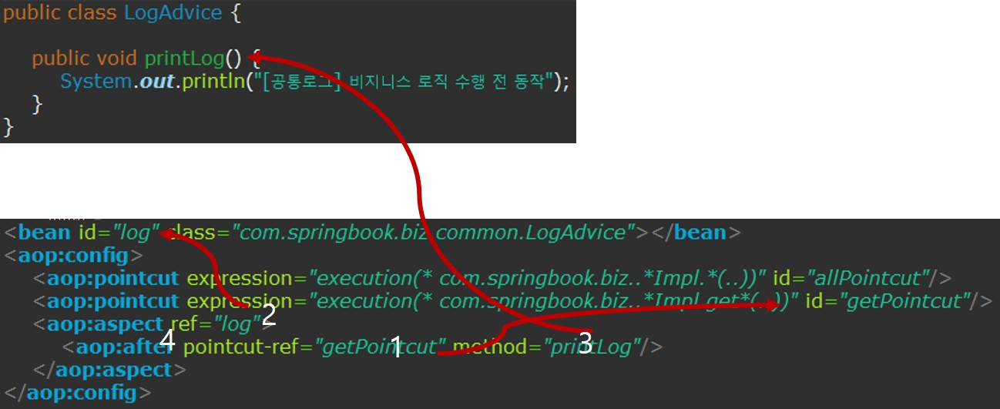

## 트랜잭션 처리
- 스프링과 비교되는 EJB는 모든 비즈니스 메소드에 대한 트랜잭션 관리를 EJB 컨테이너가 자동으로 처리해준다.
- 스프링에서도EJB와 마찬기지로 트랜잭션 처리를 켄터이너가 자동으로 처리하도록 설정할 수 있는데 이를 선언적 트랜잭션 처리라고 한다.
- 스프링의 트랜잭션 설정에서느 AOP가 사용된다.
- XML기반의 AOP설정만 사용할 수 있고, 어노테이션은 사용할 수 없다.
- 애스팩트를 설정하는 것도 aop:aspect엘리먼트를 사용하지 못하고 aop:advisor엘리먼트를 사용해야한다.(이유는 아래 설명하겠음)

### 트랜잭션 네임스페이스 등록
- 추가로 트랜잭션 제어하는 어드바이스를 설정하기 위해 스프링 설정파일에 tx네임스페이스를 추가한다.


### 트랜잭션 관리자 등록
- 트랜잭션 관련 설정에서 가장 먼저 등록하는 것은 트랜잭션 관리자 클래스이다.
- 다양한 관리자가 존재하는데, 어떤 기술을 사용하여 DB연동처리에 따라 트랜잭션 관리자가 달라진다. 
- 모든 트랜잭션 관리자는 PlatformTransactionManager 인터페이스를 구현한 클래스이다.
- 스프링이 제공하는 모든 트랜잭션 관리자는 트랜잭션 관리에 팔요한 commit(), rollback()메소드를 가진다.
- 스프링 설정파일에 DataSourceTransactionManager클래스를 bean 등록한다.
```xml
<bean id="dataSource" class="org.apache.commons.dbcp.BasicDataSource"
	destroy-method="close">
	<property name="driverClassName" value="${jdbc.driver}" />
	<property name="url" value="${jdbc.url}" />
	<property name="username" value="${jdbc.username}" />
	<property name="password" value="${jdbc.password}" />
</bean>

<bean id="txManager" class="org.springframework.jdbc.datasource.DataSourceTransactionManager">
	<property name="dataSource" ref="dataSource"></property>
</bean>
```

- DataSourceTransactionManager를 bean등록했다고 해서 자동적으로 트랜잭션 관리가 되는 것은 아니다.
- DataSourceTransactionManager도 다른 관리자와 마찬가지로 PlatformTransactionManager의commit(), rollback() 메소드를 재정의하여 구현하고 있을 뿐이지 PlatformTransactionManager 객체 스스로 자신이 가진 메소드를 실행할 수 없다.
- 어드바이스는 비즈니스 메소드 실행 전이나 후에 동작하여 비즈니스 메소드와 무관하게 공통기능을 제공하는데 이 공통 기중 중에서 대표적인 것이 예외처리, 트랜잭션처리이다.
- 그리고 이것이 트랜잭션 관리 기능을 제공하는 것이다.
- 그리고 이 트랜잭션 관리자를 이용하여 트랜잭션을 제어하는 어드바이스를 등록하면 된다.
### 트랜잭션 어드바이스 설정
- 트랜잭션 관리 기능의 어드바이스는tx:advice 엘리먼트를 사용하여 설정한다.
```xml
<bean id="txManager" class="org.springframework.jdbc.datasource.DataSourceTransactionManager">
	<property name="dataSource" ref="dataSource"></property>
</bean>

<tx:advice id="txAdvice" transaction-manager="txManager">
	<tx:attributes>
		<tx:method name="get*" read-only="true"/>
		<tx:method name="*"/>
	</tx:attributes>
</tx:advice>
```

- 트랜잭션 관리 기능의 어드바이스는 직접 구현하지 않으며 스프링 컨테이너가 tx:advice 설정을 잠조하여 자동으로 생성한다.
- 즉, 트랜잭션 관리 어드바이스 객체에 클래스 이름이나 메소드를 확인할 수 없다는 의미이다.
- 위 설정은 txAdvice라는 어드바이스가 앞으로 설정한 txManager를 이용하여 트랜잭션을 관리한다는 설정이다.
- tx:attributes의 자식 에릴먼트로 tx:method 엘리먼트를 이용하여 트랜잭션을 젝용할 메소드를 지정할 수 있다.
- get으로 시작하는 모든 메소드는 true, 읽기 전용으로 처리되어 트랜잭션 관리 대상에서 제외하고 나머지 메소드들은 트랜잭션 관리에 포함한 것이다.

### AOP 설정을 통한 트랜잭션 적용
- 비즈니스 메소드 실행 후에 트랜잭션 관리 어드바이스가 동작하도록 AOP설정만 추가하면 된다.
- aop:aspect 엘리먼트를 사용하지 않고 aop:advisor 엘리먼트를 사용하는 점이 기존 AOP설정과 다르다.
- 포인트컷과 어드바이스를 결합할때 aop:aspect를 사용했다.
- 하지만 트랜잭션 관리 어드바이스는 우리가 직접 클래스를 구현하지 않고 tv:advice설정 때문에 스프링 컨테이너가 자동으로 생성하므로 어드바이스 메소드 이름을 알 수 없다.

> 트랜잭션 매니저에서 3에 해당하는 메소드 이름을 모르기 때문에 aspect를 사용할 수 없다.
- 결국 aop:aspect 엘리먼틀 사용할 수 없다.
- txPointcut으로 지정한 메소드가 호출될 때 txAdvice로 등록한 어드바이스가 동작하여 트랜잭션관리하도록 설정한다.
```xml
<tx:advice id="txAdvice" transaction-manager="txManager">
	<tx:attributes>
		<tx:method name="get*" read-only="true"/>
		<tx:method name="*"/>
	</tx:attributes>
</tx:advice>

<aop:config>
	<aop:pointcut id="txPointcut"  expression="execution(* com.springbook.biz..*(..))"/>
	
	<aop:advisor pointcut-ref="txPointcut" advice-ref="txAdvice"/>
</aop:config>
```
> aop:advisor에서 method 관련 속성이 없는 것을 볼 수 있다.

#### 트랜잭션 설정 테스트
- 명시적으로 100번 글을 2번 등록하도록 한다.

```java
@Service("boardService")
public class BoardServiceImpl implements BoardService{
	@Autowired
	private BoardDAOSpring boardDAO;
	
	public void insertBoard(BoardVO vo) {
//		if(vo.getSeq() == 0) {
//			throw new IllegalArgumentException("0번 글은 등록할 수 없습니다");
//		}
		boardDAO.insertBoard(vo);
		boardDAO.insertBoard(vo);
	}
	.....
```
- BoardServiceImpl 클래스의 insertBoard 메소드는 연송으로 두번 호출한다.
- 첫번째 입력은 성공하지만 board테이블에 SEQ가 Primary Key로 지정되 있으며 같은 SEQ로 두번째 입력은 예외가 발생한다.
- 하지만 트랜잭션은 메소드 단위로 관리되므로 발생한 예외로 인해 BoardServiceImpl 클래스의 insertBoard 메소드의 작업결과는 모두 롤백 처리된다.
```java
//기존 SQL문을 변형
//private final String BOARD_INSERT = "INSERT INTO BOARD(SEQ, TITLE, WRITER, CONTENT) VALUES((SELECT NVL(MAX(SEQ), 0)+1 FROM BOARD), ?,?,?)";
private final String BOARD_INSERT = "INSERT INTO BOARD(SEQ, TITLE, 

public void insertBoard(BoardVO vo) {
	System.out.println("==== JDBC로 InsetBoard 기능처리");
	jdbcTemplate.update(BOARD_INSERT, vo.getSeq(), vo.getTitle(), vo.getWriter(), vo.getContent());
	//jdbcTemplate.update(BOARD_INSERT, vo.getTitle(), vo.getWriter(), vo.getContent());
}
```


> 첫 insertBoard가 수행되고 다음 insertBoard가 실행되자 오류가 뜨는 것을 확인할 수 있다.

- 다시 원래의 소스로 실행하고 글목록을 출력해본다.


> 첫번째 글 조차 등록되지 않고 모든 처리들이 롤백된것을 확인할 수 있다.


