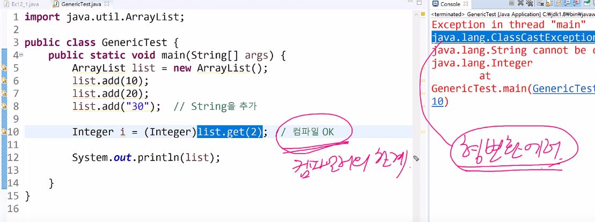

# 면접대비 JAVA

### 오토박싱,언박싱이 무엇인가?

- 오토방식과 언박싱은 기본형을 래퍼클래스로, 래퍼클래스를 기본형으로 컴파일러가 자동으로 변환해주는 기능을 말합니다.
- jdk1.5이전까지는 래퍼클래스에서 메소드를 이용해서 기본형으로 바꾸어줘야 했습니다.
- 하지만 1.5이후에는 오토방식, 언박싱이 추가되어 변환 메소드 없이 컴파일러가 자동적으로 처리하게 됩니다.
- 대표적으로 ArrayList에서 월래는 객체만 들어가야 하는데 `add`, `get`할때 기본형을 사용할 수 있는 이유가 오토박싱 때문입니다.

### 래퍼클래스가 무엇인가?

- 기본형 값을 감싸는 클래스 (8개 존재)
- 자바는 객체지향 언어이기 떄문에 모든 것을 객체로 다뤄야 하는데 기본형들이 객체가 아니기 떄문에 이것들을 객체로 다룰 수 있게 해주는 래퍼클래스가 존재한다.
>  코틀린에서는 기본형이 없고 모두 클래스로 되어있다 (ex: Int)

```java
//int의 래퍼클래스 Integer
public final class Integer extends Number implements Comparable{
    private int value; // 기본형을 감싸고 있음
}
```

- 값은 값을 갖는 래퍼클래스끼리 `==`하면 `false`
- `equals`를 쓰면 `true`

#### Number클래스

- 추상클래스이다.

- 모든 숫자 래퍼 클래스의 조상 (Byte, Short, Integer, Double, ...

### Date, Calendar, Time 클래스

- date 클래스의 메소드들은 대부분 디프리케이트되었음
- Calendar 클래스가 주로 쓰이고 있지만 jdk.18이후에 Time클래스가 새롭게 나옴
- Date, Calendar와 Time의 차이는 날짜와 시간을 따로 할수 있냐, 없냐이다
- Time클래스가 따로따로 지정할 수 있다.

- Calendar은 추상클래스이므로 `getInstance()`메소드를 통해 사용자 컴퓨터 환경에 맞는 객체를 반환해준다 (ex : 그레고리력, 불교력, 일본력)
- 주의사항
  - 두 Canldar객체를 만들고 해당 값에 차이를 구하려고 할때는 반드시 clear, 초기화를 해줘야한다.
  - `Calendar.getInstance()`를 실행 후 다음 객체를 `getInstance`를 사용할때 값이 ms차이가 발생하게 되어 값을 세팅 후 차이를 계산하면 정확한 결과가 산출되지 않음
  - clear하면 내부적으로 ?값이 세팅된다

### 지네릭스

- 컴파일시 타입을 체크해 주는 기능 (jdk1.5)

```java
ArrayList<Tv> tvList = new ArrayList<Tv>();
tvList.add(new Tv());	//가능
tvList.add(new Audio()); //컴파일 에러. 타른 타입 지정불가
```



- 그림과 같이 컴파일에는 문제가 없는데 실행시 오류가 발생
- 객체의 타입 안정성을 높이호 형변환 번거러움을 줄여줌 (기존에는 Object였기때문에 하나하나 해줘야했음)

### 타입변수

- `E` 가 타입변수를 가리킴
- jdk1.5부터 Object타입의 일반클래스에서 지네릭 클래스인 타입변수로 바뀜
- 월래는 형변환을 해줘야 했는데 이제는 안해도됨

```java
public class ArrayList<E> extends AbstacList<E>{
    private transient E[] elementData;
    public boolean add(E o){}
    public E get(int index){}
    ....
}
```

- 참조변수, 객체생성자에 타입변수는 반드시 동일해야한다 (상속관계여도 일치해야함)

  - 와일드카드를 이용해 가능할 수는 있음

  ```java
  ArrayList<? extends Fruit> flist = new ArrayList<Apple>();
  ```

### 열거형 enum

- 관련된 상수들을 같이 묶어 놓은 것
- 자바에서는 타입에 안전한 열거형이다
- 안전하다는 것은 열겨형 값과 타입이 모두 일치해야한다.

```java
// 상수 값이 같더라도
// Card라는 enum에 kind, Value타입이 다르기 떄문에 컴파일에서 에러가 발생한다.
if(Card.kind.ClOVER == Card.Value.TWO){}
```

### 프로세스와 스레드

- 프로세스 : 실행 중인 프로그램, 자원(memory, cpu, ...)과 스레드로 구성
- 스레드 : 프로세스 내에서 실제 작업을 수행하는 작업의 단위, 모든 프로세스는 최소 하나의 스레드를 가진다.

> 프로세스 : 스레드 = 공장 : 일꾼

- 스레드의 장점
  - 시스템 자원을 보다 효율적으로 사용할 수 있다.
  - 응답성 향상
- 단점
  - 동기화 주의
  - 교착상태 발생 가능성이 있음
  - startvation현상 방지해야함

#### 구현

- Thread를 상송받거나 Ruunable인터페이스를 구현한다.

- Thread

  ```java
  Thread t = new Thread();
  t.start();
  ```

- Runnable

  ```java
  Thread t = new Thread(new Runnable());
  t.start;
  ```

- `start()`메소드를 사용하면 새로운 호출 stack이 만들어지고 그곳에 run() 메소드가 들어가서 실행된다.
- main과 run 두 개의 호출스택이 사용된다. (멀티 스레드)

#### sleep, interrupt

- sleep은 static 메소드이므로 자기자신에게만 사용가능 (추가적으로 yield도 존재)

```java
try{
    Thread.sleep(5000) //스레드를 5초간 멈추게 함
} catch(InterruptedException e) {}
```

- sleep 중에 깨어나는 경우는 2가지가 존재
  - time up
  - interrupted : 누군가 interrupt하면 예외가 발생하여 try문을 빠저나온다

#### suspend, resume

- 교착상태를 발생시킬 가능성이 있기 때문에 deprecated됨

#### join

- 지정된 시간동안 특정 스레드가 작업하는 것을 기다린다.

#### yield

- 자신에게 배정된 시간을 다른 스레드에 양보 (busy waiting 상태일때)
- 하지만 반드시 반영되는 것은 아님

#### wait, notify

- 동기화가 필요한 부분을 보다 효율적으로 처리하기 위한 메소드
- 하지만 하나의 객체를 이용하는 두 스레드를  notify할때는 누가 waitPool에서 어떤 작업 스레드가 나올지 모른다
- 이럴땐 lock, condition을 이용한다.

#### lock, condition

- 생상과 소비를 하는 두 개의 처리를 condition을 이용해 다음과 같은 여러 상황에 효율적으로 사용할 수 있다.
  - 창고에 물건이 가득찼을 때에는 생성자는 forMake에 await() 시키고 forConsume에 signal()을 보낸다.
  - 창고에 물건을 소비하면 forMake를 signal() 시켜 물건을 생산하게 한다.
  - 창고에 물건이 없을때 소비자는 forConsume에 awit() 한다.
  - 창고에 물건을 넣으면 forConsume에 signal()을 보낸다.

```java
private ReentrantLock lock = new ReentrantLock();
private Condition forMake = lock.newCondition();
private Condition forConsume = lock.newCondition();
```

- `lock`을 이용해 Synchronized를 대신해 사용하여 lock, unlock하여 임계영역을 구분할 수 있다.

### static

- `static`은 클래스 변수를 선언하는 예약어이다
- 독립적인 공간을 갖는 인스턴스 변수와 달리 클래스 변수는 공통된 저장공간에 값이 저장된다.
- 또한 `static`으로 선언된 메소드는 객체 생성없이 사용할 수 있다.
- 하지만 객체를 생성할 수 없으므로 `static`메소드 내부에는 해당 클래스의 인스턴스 변수, 메소드를 사용할 수 없다
  - 왜냐하면 객체생성은 곧 인스턴스 변수와 메소드를 사용하는 것과 같은데 `static`메소드 객체를 생성하지 않고 사용하기 떄문이다.
  - 즉 지역변수만 사용가능하다.

### 오버로딩과 오버라이딩이 무엇인가?

- 우선 결과적으로 둘은 전혀 관련이 없다.
- 하지만 객체지향 언어의 특징인 다형성을 따르는 개념이다.
- 오버로딩
  - 한 클래스에서 같은 이름의 메소드를 여러개 정의하는 것이다.
  - 조건
    - 메소드 이름이 같아야 하고 매개변수의 갯수 혹은 타입이 달라야 한다.
    - 리턴 타입은 영향이 없음
  - 예시 : System.out.println()
- 오버라이딩
  - 상속받거나 `implement`한 조상의 메소드를 자신에 맞게 변형하는 것
  - 조건
    - 선언부(반환타입, 메소드명, 파라미터)가 조상클래스와 일치해야한다.
    - 접근제어자는 조상보다 좁은 범위로 지정할 수 없다.
    - 예외도 조상보다 많이 선언할 수 없다.
  - 예시 : toString(), equals()

### 다형성

- 조상 타입 참조 변수로 자식 객체를 다루는 것
- 장점
  - 하나의 메소드에 매개변수를 조상 타입으로 설정함으로써 여러 타입의 객체를 다룰 수 있음
    - instanceof로 변환하지 않고 interface로 해결가능
  - 조상타입 참조 배열로 자식 객체를 담을 수 있다.
  - 기존에 관련없는 클래스를 interface를 사용하여 관계를 맺게 해줄 수 있다
    - 마린, 시즈탱크, 드랍쉽을 Unit Interface를 구현하게 되면 Unit으로 모두 참조할 수 있게 된다.

### String 클래스

#### String 클래스에서 일반적인 선언과 new String()의 차이는 무엇인가?

```java
String s1 = "str";
String s2 = "str";
```

- 일반적인 선언으로 위와 같이 하면  `str`이라는 하나에 객체에  참조변수 `s1, s2`가 같은 객체를 가리키게 된다.

```java
String s1 = new String("str");
String s2 = new String("str");
```

- new String으로 객체를 생성하면 `s1, s2`에는 각각에 객체를 할당받게 된다.
- 메모리 관리에서 차이를 가지게 된다.

#### String객체에 + 연산자는 어떻게 사용되어지나?

- String 클래스는 `immutable`클래스이기 떄문에 수정할 수 없습니다.
- 즉 내부적으로 char[]로 선언된 문자열 값을 수정할 수 없게 됩니다.
- `+`연산을 하면 기존char[] 크기와 새롭게 연산할 값의 크기와 합쳐 새로운 String객체를 생성한다.
- 그 후 기존 char[] 배열을 복사하고 새로운 값을 넣어준다.
- 이 과정에서 객채생성, 배열복사, 값 매핑이라는 과정이 들어갔고 오버헤드가 큰 작업이다
- 그래서 `StringBuilder, StringBuffer`클래스를 사용하여 `+`연산을 대체해야한다.

### 접근제어자

- public : 같은 클래스, 같은 패키지, 자손 클래스, 전체
- protected : 같은 클래스, 같은 패키지, 자손 클래스
- (default) : 같은 클래스, 같은 패키지
- private : 같은 클래스

### JAVA Collection

- collections은 크게 list, set으로 구분되어 진다.

<div>
    
</div>

### OOP 객체지향 프로그래밍

- 실세계에 존재하는 물체를 프로그래밍에 필요한 데이터로 추상화하여 상태와 행위를 하는 객체로 만들고, 객체가 상호작용을 통해 로직을 구현하는 방법
- 장점
  - 코드의 재사용성
  - 절차지향보다 유지보수에 유리
  - 모듈화가 가능하여 대형 프로젝트
- 단점
  - 처리속도가 느림
  - 객체가 많으면 용량이 커지고 그에대한 비용이 증가
- 객체지향 키워드 - 클래스, 캡슐화, 추상화, 다형성, 상속, 인슨턴스

### Stream API

- jdk1.8 이후에 추가된 개념입니다.
- java에서의 Collections에서의 연속된 데이터를 반복연산없이 데이터를 처리하게 도와준다
- 스트림을 생성하는 최초연산, 로직을 구성하는 중간연산, 결과를 산출하는 최종연산으로 나뉘어진다.

### 추상클래스와 인터페이스의 차이

- 인터페이스는 인스턴스 변수를 가질 수 없다.
- 인터페이스는 오직 추상메소드만 가질 수 있다.
-  그러나 default 생성자, 상수, static 메소드가 존재하지만 부수적인 것이다. Jdk1.8에 추가된 요소이다.
- 추상클래스는 일반 클래스이고 추상메소드를 가지고 있다
  - 추상클래스는 미완성 클래스이기 때문에 객체를 생성할 수 없다.
  - 그렇지만 추상클래스 내부에서는 미완성 메소드를 사용할 수 있다.

 